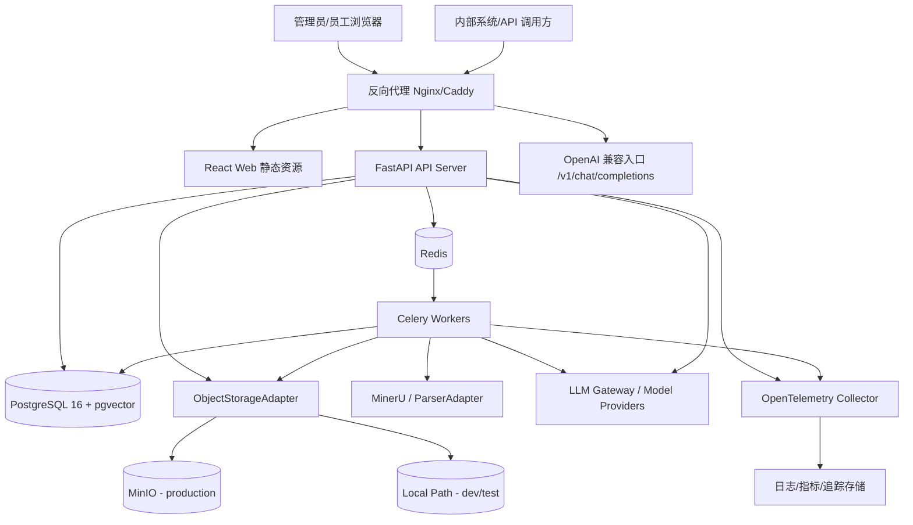
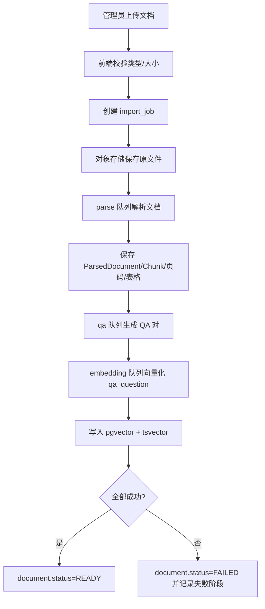
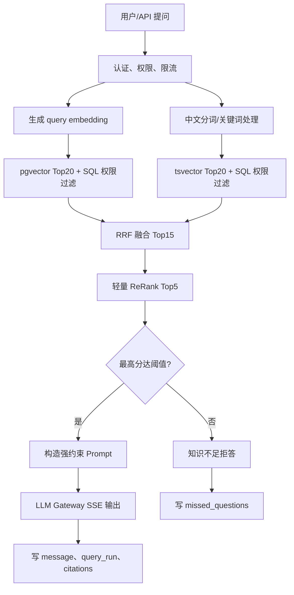

# V1.1 技术架构、程序架构与目录架构设计

版本：V1.1  
日期：2026-07-05  
来源：`docs/design/v1.1/v1.1-product-prd.md`、`docs/design/v1.1/v1.1-technology-selection.md`  
系统：企业级 AI 知识库系统（MVP）

## 1. 设计结论

V1.1 采用“模块化单体 + 异步任务 + PostgreSQL 统一数据层 + Adapter 外部集成”的架构。系统以 Web UI 和 OpenAI 兼容 API 为主要入口，围绕复杂文档入库、QA 拆分、权限前置过滤、混合检索、轻量 ReRank、带引用回答和模型配置形成 MVP 闭环。

核心设计判断：

- V1.1 面向企业私有部署和种子客户验证，优先控制部署、排障、备份和升级复杂度。
- 首版不拆微服务，不引入独立向量数据库，不引入 Elasticsearch/OpenSearch 作为必选依赖。
- PostgreSQL 16+ 同时承担结构化数据、全文检索、向量检索、审计日志和任务状态存储。
- Redis 只承担队列 Broker、限流、短期缓存和短状态，不保存长期业务真相。
- 文档解析、QA 拆分、Embedding、索引写入和失败重试全部异步执行。
- 权限过滤必须在 SQL 查询阶段完成，无权文档不得进入候选集、Prompt、回答或引用。
- 模型供应商、文档解析器、对象存储通过 Adapter 接入，业务层不绑定具体 SDK。
- V1.1 明确不做 GraphRAG、多渠道 IM 深度接入、Widget SDK、客服工单和 SaaS 计费后台。

## 2. 技术架构设计

### 2.1 技术选型

| 层级 | 技术 | 说明 |
| --- | --- | --- |
| 后端语言 | Python 3.12+ | 适配 AI、文档解析、Embedding 和私有部署镜像 |
| Web API | FastAPI | 类型友好，OpenAPI 自动生成，支持异步 I/O 和 SSE |
| 数据校验 | Pydantic v2 | API 请求、响应、配置、第三方响应统一校验 |
| ORM 与迁移 | SQLAlchemy 2 + Alembic | 关系模型、事务、迁移和回滚管理 |
| 主数据库 | PostgreSQL 16+ | 业务数据、JSONB、全文检索、审计和日志 |
| 向量检索 | pgvector | 与权限过滤、引用追溯保持同库一致 |
| 缓存与队列 | Redis | 限流、缓存、短状态、Celery Broker |
| 异步任务 | Celery | 文档解析、QA 拆分、Embedding、日志聚合 |
| 对象存储 | ObjectStorageAdapter | 生产 MinIO，开发测试可使用本地路径 |
| 文档解析 | MinerU + ParserAdapter + 轻量 fallback | 复杂 PDF/Word/扫描件主解析，TXT/Markdown/FAQ 等轻量解析 |
| 中文分词 | jieba 或 pkuseg | 预处理中文关键词，写入 PostgreSQL 全文检索字段 |
| 前端 | React + TypeScript + Vite | 管理后台与 Chat 页面，不依赖 SSR |
| UI 组件 | Ant Design + ProComponents | 企业后台表格、表单、权限页效率高 |
| 前端数据 | TanStack Query | 请求缓存、分页、重试和状态失效 |
| 图表 | ECharts | 总览与运行指标 |
| AI 接入 | Provider Adapter | 屏蔽 OpenAI、Claude、DeepSeek、Qwen、Ollama、本地模型差异 |
| 日志与追踪 | structlog + OpenTelemetry | request_id、run_id 串联 API、Worker 和模型链路 |
| 测试 | pytest、httpx、Vitest、Playwright | 后端、API、前端和浏览器验证 |
| 部署 | Docker Compose，后续 Helm | MVP 私有部署优先单机或小规模集群 |
| 反向代理 | Nginx 或 Caddy | TLS、静态资源、SSE 代理、上传体限制 |

### 2.2 部署拓扑



### 2.3 运行组件职责

| 组件 | 职责 | 扩展方式 |
| --- | --- | --- |
| Web UI | 知识库中心、Chat、模型配置、API Key、日志任务、系统设置 | 静态资源横向扩展 |
| API Server | REST API、SSE、OpenAI 兼容接口、鉴权、权限、OpenAPI | 无状态水平扩展 |
| Celery Worker | 文档解析、QA 拆分、Embedding、索引写入、重试、日志聚合 | 按队列拆分并发 |
| PostgreSQL + pgvector | 业务真相、向量、全文检索、权限、引用、审计、任务记录 | 索引、分区、读副本，必要时迁移向量库 |
| Redis | Broker、限流、缓存、短期任务状态 | Sentinel 或托管 Redis |
| MinIO / Local Path | 原始文件、解析产物、导出文件、备份包 | S3 兼容对象存储 |
| MinerU / ParserAdapter | PDF、Word、扫描件解析为结构化文本、表格、页码 | CPU/GPU 或独立解析服务 |
| Model Providers | Chat、Embedding、QA 拆分模型调用 | Adapter 屏蔽供应商差异 |
| Observability | request_id、run_id、任务错误、模型错误、耗时和用量 | OpenTelemetry 后端可替换 |

### 2.4 数据一致性策略

- PostgreSQL 是长期业务真相；Redis 不保存文档内容、QA 对或业务状态终态。
- 上传文件先进入对象存储，数据库只保存稳定 `object_key`，不保存本地绝对路径。
- 文档、解析产物、Chunk、QA 对、Embedding 通过 `document_id` 和 `import_job_id` 绑定。
- 文档状态为 `READY` 的 QA 对才参与新问题检索。
- 权限变更后新检索立即生效，历史回答引用保留快照。
- 删除文档后不参与新检索，历史引用保留快照但打开原文详情仍需权限校验。
- Worker 任务必须幂等，重试不能产生重复 Chunk、QA 对、Embedding 或引用。

## 3. 程序架构设计

### 3.1 逻辑分层

```text
表现层
  React Web UI
  内部系统 OpenAI 兼容 API 调用方

API 边界层
  REST API
  SSE Streaming
  OpenAI Compatible Chat Completions
  OpenAPI Schema

应用服务层
  AuthService
  UserAccessService
  DocumentService
  ImportService
  QaSplitService
  RetrievalService
  ChatService
  ModelConfigService
  ApiKeyService
  TaskLogService
  AuditService
  SettingsService

领域层
  Tenant
  User
  Role
  Department
  Document
  ImportJob
  DocumentChunk
  QaPair
  QueryRun
  Citation
  ModelProvider
  ModelConfig
  ApiKey
  AuditLog

基础设施层
  PostgreSQL/pgvector/tsvector
  Redis
  Celery
  ObjectStorageAdapter
  ParserAdapter
  ModelProviderAdapter
  Tokenizer/Search Adapter
  OpenTelemetry
```

### 3.2 后端依赖方向

后端按“API -> Service -> Repository -> Model/DB”的方向依赖：

- `api/v1` 只负责协议、鉴权依赖、请求响应 Schema、错误映射和 SSE 输出。
- `services` 承载业务编排、状态流转、权限上下文、任务投递和审计写入。
- `repositories` 封装数据库查询，不直接调用外部服务，不做跨领域编排。
- `models` 只表达数据库结构与关系。
- `schemas` 定义 Pydantic 输入输出契约。
- `integrations` 封装模型、解析器、对象存储、中文分词和外部系统适配器。
- `tasks` 是 Worker 入口，任务体调用 Service 或专用任务服务，不散落 SQL。
- `core` 提供配置、安全、错误、权限、日志、ID、限流等横切能力。

禁止依赖方向：

- Repository 不得调用 Service、API 或第三方 SDK。
- API 路由不得直接调用模型供应商、MinIO、MinerU 或本地文件系统。
- 业务层不得保存供应商原始响应作为主契约。
- Worker 不得绕过权限、审计和状态机直接改业务终态。

### 3.3 后端领域模块

| 模块 | 职责 | 不负责 |
| --- | --- | --- |
| Auth/UserAccess | 登录、Token、用户、部门、角色、权限、访问上下文 | 文档处理状态流转 |
| Documents | 文档元数据、权限标签、状态、软删除、原文访问控制 | 解析和模型调用 |
| Import | 上传任务、解析、OCR、QA 拆分、Embedding、索引写入、失败重试 | Chat 生成 |
| Retrieval | Query Embedding、BM25/tsvector 检索、pgvector 检索、RRF、轻量 ReRank、权限过滤 | 最终自然语言生成 |
| Chat | 会话、消息、流式回答、引用落库、知识不足拒答、反馈 | 文档解析 |
| Model Config | 供应商、模型实例、默认模型、连接测试、限流参数 | 用户权限 |
| API Key | Key 创建、掩码、禁用、轮换、Scope、限流 | 模型密钥管理 |
| Logs/Tasks | task_runs、模型调用日志、API 调用日志、审计日志查询 | 业务状态决策 |
| Settings | 文件限制、检索阈值、日志保留、对象存储策略 | 具体导入任务执行 |

### 3.4 Adapter 架构

| Adapter | 接口能力 | 实现 |
| --- | --- | --- |
| `ChatProvider` | 流式回答、非流式回答、连接测试 | OpenAI 兼容、Claude、Ollama、内部模型网关 |
| `EmbeddingProvider` | 批量文本向量化、维度声明 | OpenAI 兼容、本地模型、内部网关 |
| `ParserAdapter` | 文档解析为 `ParsedDocument` | MinerU、轻量 Markdown/TXT/FAQ/HTML 解析 |
| `ObjectStorageAdapter` | 上传、下载、元数据、预签名 URL、删除 | MinIO、本地路径 |
| `TokenizerAdapter` | 中文分词、关键词抽取、搜索文本生成 | jieba、pkuseg 或规则 fallback |
| `RateLimiter` | 用户/API Key/全局限流 | Redis 实现 |

V1.1 的 ReRank 不调用外部模型，采用应用层纯代码特征加权：

- RRF 基础分。
- Query 关键词精确命中。
- 标题相似度。
- 片段位置加权。
- 文档状态与权限硬过滤。

第三方返回数据一律视为不可信输入，必须在 Adapter 内完成结构校验、错误归一化、超时、日志脱敏和重试策略。

### 3.5 异步任务架构

队列按资源消耗和重试策略拆分：

| 队列 | 任务类型 | 说明 |
| --- | --- | --- |
| `parse` | 文档解析、OCR、表格抽取、解析产物保存 | CPU/GPU 或外部解析服务消耗高 |
| `qa` | QA 拆分、QA 质量检查、重新拆分 | 依赖 Chat 模型，需限流 |
| `embedding` | QA question 向量化、重新向量化、索引刷新 | 批处理，必须幂等 |
| `maintenance` | 日志聚合、未命中聚合、过期日志清理 | 定时任务，不阻塞主链路 |

任务通用规则：

- 每个任务写入 `task_runs`，记录 `task_type`、`resource_type`、`resource_id`、状态、错误和耗时。
- 任务参数只传资源 ID 和必要选项，不传大文本和文件内容。
- 任务重试基于文件 hash、文档 ID、阶段和内容版本幂等。
- 解析失败、QA 拆分失败、Embedding 失败必须可在前端查看失败阶段、错误码、错误摘要和重试入口。

### 3.6 知识导入链路



关键约束：

- 原文件必须保留，便于重新解析。
- QA 对必须保留原文片段、页码、Chunk ID 和文档 ID。
- QA 拆分结果可重新生成，重跑时应生成新版本或替换同一导入批次的 QA 对。
- Embedding 模型维度变化时必须提示重新向量化风险。

### 3.7 AI 问答链路



可信规则：

- 有答案回答至少绑定 1 条引用。
- Prompt 只能使用当前用户有权限访问且文档状态为 `READY` 的 QA/Chunk。
- 低置信度、检索无结果或仅有无权结果时必须回答“当前知识库中暂无相关信息”。
- 模型输出完成后写入消息、检索快照、引用快照、Token 用量和耗时。

## 4. 程序目录架构设计

### 4.1 后端目录

```text
server/
├── app/
│   ├── main.py
│   ├── api/
│   │   └── v1/
│   │       ├── auth.py
│   │       ├── dashboard.py
│   │       ├── documents.py
│   │       ├── import_jobs.py
│   │       ├── qa_pairs.py
│   │       ├── chat.py
│   │       ├── retrieval.py
│   │       ├── model_config.py
│   │       ├── api_keys.py
│   │       ├── logs.py
│   │       ├── users.py
│   │       └── settings.py
│   ├── openai_compat/
│   │   ├── routes.py
│   │   ├── schemas.py
│   │   └── streaming.py
│   ├── core/
│   │   ├── config.py
│   │   ├── security.py
│   │   ├── errors.py
│   │   ├── permissions.py
│   │   ├── rate_limit.py
│   │   ├── logging.py
│   │   └── ids.py
│   ├── db/
│   │   ├── session.py
│   │   ├── base.py
│   │   └── migrations/
│   ├── models/
│   ├── schemas/
│   ├── services/
│   ├── repositories/
│   ├── integrations/
│   │   ├── model_providers/
│   │   ├── storage/
│   │   ├── parsers/
│   │   └── tokenizers/
│   ├── tasks/
│   │   ├── parse_tasks.py
│   │   ├── qa_tasks.py
│   │   ├── embedding_tasks.py
│   │   └── maintenance_tasks.py
│   └── tests/
```

### 4.2 前端目录

```text
web/
└── admin/
    ├── src/
    │   ├── app/
    │   ├── routes/
    │   ├── features/
    │   │   ├── dashboard/
    │   │   ├── knowledge/
    │   │   ├── chat/
    │   │   ├── model-config/
    │   │   ├── api-keys/
    │   │   ├── logs/
    │   │   ├── access-control/
    │   │   └── settings/
    │   ├── components/
    │   ├── api/
    │   ├── auth/
    │   └── styles/
    └── tests/
```

### 4.3 部署与文档目录

```text
deploy/
├── docker-compose.yml
├── nginx/
├── postgres/
├── redis/
├── minio/
└── worker/

docs/
├── design/
│   └── v1.1/
└── operations/

scripts/
├── dev/
├── migrate/
├── seed/
└── diagnostics/
```

### 4.4 目录边界规则

- `server/app/api/v1` 与 `server/app/schemas` 共同定义管理 API 公共契约。
- `server/app/openai_compat` 只处理 OpenAI 兼容协议映射，业务逻辑仍调用 Chat/Retrieval Service。
- `server/app/services` 不出现 FastAPI `Request`、`Response` 或前端分页状态。
- `server/app/integrations` 是唯一允许直接调用第三方 SDK 的后端目录。
- `server/app/tasks` 只放任务入口和队列注册，复杂业务逻辑回到 Service。
- `web/admin/src/features` 按业务模块组织，组件不直接拼接完整 API URL。
- `docs/design/v1.1` 是 V1.1 后续实现基准，API、数据库、状态枚举变更必须同步。

## 5. 安全、性能与观测约束

### 5.1 安全

- 后台账号密码使用 Argon2id 或同等级安全哈希。
- Access Token 短有效期，Refresh Token 可撤销。
- API Key 只保存哈希和前缀，明文只展示一次。
- 模型 API Key 加密存储，保存后不回显。
- 文件上传校验扩展名、MIME、大小、哈希和权限范围。
- Markdown/HTML/解析产物渲染前必须做 XSS 清理。
- 文档下载和引用原文查看必须校验权限。
- Prompt 注入防护必须隔离系统指令、用户问题和知识上下文。
- 日志不得记录密钥、Authorization header、完整 Token 或敏感文档全文。

### 5.2 性能

| 场景 | V1.1 目标 |
| --- | --- |
| 文档列表查询 | P95 < 1s |
| 混合检索 + 轻量 ReRank | P95 < 300ms，不含模型生成 |
| AI 首字响应 | P95 < 1.5s |
| 普通问题完整回答 | P95 < 15s |
| MVP 并发问答 | 50 并发 |
| 任务状态刷新 | 2s 内展示最新状态 |

优化策略：

- 文档、任务、日志列表必须分页。
- QA 向量索引使用 pgvector HNSW。
- 全文检索字段由中文分词后的搜索文本生成。
- Dashboard 和日志统计优先使用聚合或短缓存，不实时扫大表。
- 模型供应商限流导致超时时必须给出明确依赖异常。

### 5.3 观测

- 每次 API 请求生成 `request_id`。
- 每次问答生成 `run_id`，串联 embedding、检索、RRF、ReRank、Prompt、模型流式输出、引用和反馈。
- Worker 任务记录 `task_run_id`、队列、阶段、耗时、重试次数、错误码。
- 核心指标包括 API QPS、P95/P99、错误率、队列长度、任务失败率、模型错误率、Token 用量、引用覆盖率、拒答率、未命中率。
- 前端错误提示显示可复制的 `requestId`。

## 6. 演进边界

V1.1 暂不采用微服务、独立向量数据库、GraphRAG、Next.js SSR、LangChain/LlamaIndex 核心运行时、多渠道 IM 深度接入、Widget SDK 和客服工单系统。

后续触发架构调整的条件：

- 单企业 QA/Chunk 超过 200 万且 pgvector 无法满足 P95 目标，评估 Qdrant/Milvus/OpenSearch。
- Worker 解析或模型任务持续影响 API 稳定性，按任务类型拆独立 Worker 服务或计算节点。
- 种子客户要求复杂组织权限或段落级 ABAC，再扩展权限模型。
- 客户要求企业微信、飞书、钉钉深度问答入口，再新增 ChannelProvider 和渠道 API。
- 客户要求完整 Widget SDK，再独立设计 Web Component bundle，不混入 V1.1 管理端。
