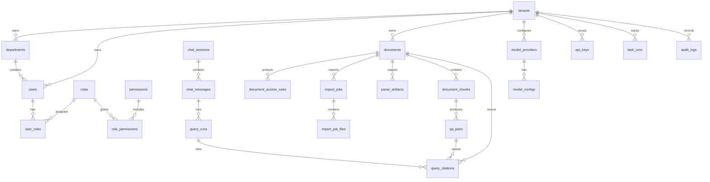

# V1.1 数据库表设计与 SQL 建表语句

版本：V1.1  
日期：2026-07-05  
来源：`docs/design/v1.1/v1.1-product-prd.md`、`docs/design/v1.1/v1.1-technology-selection.md`  
数据库：PostgreSQL 16+、pgvector

## 1. 设计原则

- PostgreSQL 是 V1.1 的长期业务真相，Redis 不保存长期业务数据。
- 业务数据、全文检索、向量检索、权限过滤、引用追溯和审计日志优先同库完成。
- 所有核心业务表预留 `tenant_id`，即使 V1.1 私有部署以单租户为主，也避免后续 SaaS 化重构。
- 核心表保留 `created_at`、`updated_at`、`created_by`、`updated_by`、`deleted_at`。
- 删除策略默认软删除；上传、删除、权限变更、模型配置、API Key 操作必须写入 `audit_logs`。
- 文档权限采用文档级 RBAC，检索 SQL 必须前置过滤，不允许先召回后过滤。
- V1.1 以 `qa_pairs.question_embedding` 作为向量检索主字段，以 `qa_pairs.search_vector` 作为全文检索主字段。
- 对象存储只保存 `object_key`，不保存本地绝对路径、bucket 细节或临时访问 URL。
- API Key 和模型密钥不保存明文；API Key 保存 hash 和前缀，模型密钥保存加密密文。
- 第三方原始响应不直接成为业务契约，必要原始信息进入 JSONB 元数据、模型调用日志或任务错误摘要。

## 2. 核心 ER 图



## 3. 表分组设计

### 3.1 用户、部门与权限

| 表 | 用途 | 关键字段 |
| --- | --- | --- |
| `tenants` | 企业租户/私有部署主体 | `name`、`deployment_mode`、`status` |
| `departments` | 部门树 | `tenant_id`、`name`、`parent_id` |
| `users` | 后台用户与员工账号 | `department_id`、`email`、`password_hash`、`status` |
| `roles` | 租户内角色 | `code`、`name`、`scope` |
| `permissions` | 权限码 | `code`、`module`、`action` |
| `user_roles` | 用户角色关系 | `user_id`、`role_id` |
| `role_permissions` | 角色权限关系 | `role_id`、`permission_id` |

V1.1 基础角色：

- `SYSTEM_ADMIN`：系统设置、模型配置、API Key、日志审计。
- `KNOWLEDGE_ADMIN`：文档上传、权限设置、失败重试、QA 查看。
- `EMPLOYEE`：Web Chat 提问、查看有权限的引用。
- `API_CLIENT`：通过 API Key 调用 OpenAI 兼容接口。

### 3.2 文档、权限、解析与 QA

| 表 | 用途 | 关键字段 |
| --- | --- | --- |
| `documents` | 文档主对象 | `title`、`file_type`、`status`、`object_key`、`checksum` |
| `document_access_rules` | 文档级访问规则 | `document_id`、`subject_type`、`subject_id` |
| `import_jobs` | 导入任务 | `document_id`、`stage`、`status`、`progress`、`error_code` |
| `import_job_files` | 导入文件 | `job_id`、`object_key`、`file_name`、`checksum` |
| `parse_artifacts` | 解析产物 | `document_id`、`artifact_type`、`object_key` |
| `document_chunks` | 原文片段 | `content`、`page_no`、`title_path`、`source_locator` |
| `qa_pairs` | QA 对与检索单元 | `question`、`answer`、`question_embedding`、`search_vector` |

文档状态：

```text
UPLOADED -> PARSING -> QA_SPLITTING -> EMBEDDING -> READY
UPLOADED/PARSING/QA_SPLITTING/EMBEDDING -> FAILED
READY -> DELETED
```

任务阶段：

```text
CREATED
UPLOADING
PARSING
QA_SPLITTING
EMBEDDING
INDEXING
COMPLETED
FAILED
```

### 3.3 Chat、检索、引用与未命中

| 表 | 用途 | 关键字段 |
| --- | --- | --- |
| `chat_sessions` | Web Chat 会话 | `user_id`、`title`、`status` |
| `chat_messages` | 会话消息 | `session_id`、`role`、`content`、`status` |
| `query_runs` | 单次问答运行 | `run_id`、`question`、`retrieval_snapshot`、`token_usage` |
| `query_citations` | 回答引用 | `qa_pair_id`、`document_id`、`page_no`、`quote`、`score` |
| `missed_questions` | 未命中问题聚合 | `question_hash`、`question_text`、`count` |
| `feedback` | 回答反馈 | `message_id`、`feedback_type`、`reason` |

### 3.4 模型、API Key、日志与设置

| 表 | 用途 | 关键字段 |
| --- | --- | --- |
| `model_providers` | 模型供应商 | `provider_type`、`base_url`、`encrypted_api_key`、`status` |
| `model_configs` | 模型实例 | `capability`、`model_name`、`embedding_dimension`、`is_default` |
| `api_keys` | OpenAI 兼容 API 调用密钥 | `key_prefix`、`key_hash`、`scopes`、`rate_limit_per_minute` |
| `api_call_logs` | API 调用日志 | `api_key_id`、`request_id`、`status_code`、`latency_ms` |
| `model_call_logs` | 模型调用日志 | `provider_id`、`model_config_id`、`latency_ms`、`error_code` |
| `task_runs` | Worker 任务记录 | `task_type`、`stage`、`status`、`error` |
| `audit_logs` | 关键操作审计 | `actor_id`、`action`、`resource_type`、`request_id` |
| `system_settings` | 系统设置 | `key`、`value` |

## 4. 权限前置过滤规则

文档访问规则按 `document_access_rules` 记录：

- `subject_type = 'DEPARTMENT'`：指定部门可访问。
- `subject_type = 'ROLE'`：指定角色可访问。
- `subject_type = 'USER'`：指定用户可访问。
- `subject_type = 'ALL_AUTHENTICATED'`：租户内登录用户可访问。

检索必须在 SQL 中完成权限过滤，示例：

```sql
WITH user_role_ids AS (
    SELECT role_id
    FROM user_roles
    WHERE user_id = :user_id
),
authorized_documents AS (
    SELECT d.id
    FROM documents d
    WHERE d.tenant_id = :tenant_id
      AND d.status = 'READY'
      AND d.deleted_at IS NULL
      AND EXISTS (
          SELECT 1
          FROM document_access_rules ar
          WHERE ar.document_id = d.id
            AND ar.tenant_id = d.tenant_id
            AND (
                ar.subject_type = 'ALL_AUTHENTICATED'
                OR (ar.subject_type = 'USER' AND ar.subject_id = :user_id)
                OR (ar.subject_type = 'DEPARTMENT' AND ar.subject_id = :department_id)
                OR (ar.subject_type = 'ROLE' AND ar.subject_id IN (SELECT role_id FROM user_role_ids))
            )
      )
)
SELECT q.*
FROM qa_pairs q
JOIN authorized_documents ad ON ad.id = q.document_id
WHERE q.tenant_id = :tenant_id
  AND q.status = 'ACTIVE'
  AND q.deleted_at IS NULL;
```

## 5. SQL 建表语句

说明：

- `vector(1536)` 是默认示例维度，真实维度必须与默认 Embedding 模型一致。
- 如切换 Embedding 维度，必须新建迁移并重建向量列和索引，不能在同一列混用不同维度。
- 中文全文检索建议先用 jieba/pkuseg 生成空格分词后的 `search_text`，再写入 `to_tsvector('simple', search_text)`。
- 生产迁移必须由 Alembic 管理，下面 SQL 作为 V1.1 基线结构。

```sql
CREATE EXTENSION IF NOT EXISTS pgcrypto;
CREATE EXTENSION IF NOT EXISTS vector;

CREATE OR REPLACE FUNCTION touch_updated_at()
RETURNS trigger AS $$
BEGIN
    NEW.updated_at = now();
    RETURN NEW;
END;
$$ LANGUAGE plpgsql;

CREATE TABLE tenants (
    id uuid PRIMARY KEY DEFAULT gen_random_uuid(),
    name varchar(200) NOT NULL,
    deployment_mode varchar(32) NOT NULL DEFAULT 'PRIVATE',
    status varchar(32) NOT NULL DEFAULT 'ACTIVE',
    quota_config jsonb NOT NULL DEFAULT '{}'::jsonb,
    created_at timestamptz NOT NULL DEFAULT now(),
    updated_at timestamptz NOT NULL DEFAULT now(),
    deleted_at timestamptz
);

CREATE TABLE departments (
    id uuid PRIMARY KEY DEFAULT gen_random_uuid(),
    tenant_id uuid NOT NULL REFERENCES tenants(id) ON DELETE CASCADE,
    name varchar(120) NOT NULL,
    parent_id uuid REFERENCES departments(id) ON DELETE SET NULL,
    sort_order integer NOT NULL DEFAULT 0,
    created_at timestamptz NOT NULL DEFAULT now(),
    updated_at timestamptz NOT NULL DEFAULT now(),
    deleted_at timestamptz
);

CREATE TABLE users (
    id uuid PRIMARY KEY DEFAULT gen_random_uuid(),
    tenant_id uuid NOT NULL REFERENCES tenants(id) ON DELETE CASCADE,
    department_id uuid REFERENCES departments(id) ON DELETE SET NULL,
    name varchar(120) NOT NULL,
    email varchar(320) NOT NULL,
    password_hash text NOT NULL,
    status varchar(32) NOT NULL DEFAULT 'ACTIVE',
    last_login_at timestamptz,
    created_by uuid,
    updated_by uuid,
    created_at timestamptz NOT NULL DEFAULT now(),
    updated_at timestamptz NOT NULL DEFAULT now(),
    deleted_at timestamptz
);

CREATE TABLE roles (
    id uuid PRIMARY KEY DEFAULT gen_random_uuid(),
    tenant_id uuid NOT NULL REFERENCES tenants(id) ON DELETE CASCADE,
    code varchar(80) NOT NULL,
    name varchar(120) NOT NULL,
    scope varchar(32) NOT NULL DEFAULT 'TENANT',
    created_by uuid,
    updated_by uuid,
    created_at timestamptz NOT NULL DEFAULT now(),
    updated_at timestamptz NOT NULL DEFAULT now(),
    deleted_at timestamptz,
    UNIQUE (tenant_id, code)
);

CREATE TABLE permissions (
    id uuid PRIMARY KEY DEFAULT gen_random_uuid(),
    code varchar(120) NOT NULL UNIQUE,
    module varchar(80) NOT NULL,
    action varchar(80) NOT NULL,
    description text,
    created_at timestamptz NOT NULL DEFAULT now()
);

CREATE TABLE user_roles (
    user_id uuid NOT NULL REFERENCES users(id) ON DELETE CASCADE,
    role_id uuid NOT NULL REFERENCES roles(id) ON DELETE CASCADE,
    created_at timestamptz NOT NULL DEFAULT now(),
    PRIMARY KEY (user_id, role_id)
);

CREATE TABLE role_permissions (
    role_id uuid NOT NULL REFERENCES roles(id) ON DELETE CASCADE,
    permission_id uuid NOT NULL REFERENCES permissions(id) ON DELETE CASCADE,
    created_at timestamptz NOT NULL DEFAULT now(),
    PRIMARY KEY (role_id, permission_id)
);

CREATE TABLE documents (
    id uuid PRIMARY KEY DEFAULT gen_random_uuid(),
    tenant_id uuid NOT NULL REFERENCES tenants(id) ON DELETE CASCADE,
    title varchar(300) NOT NULL,
    file_name varchar(300) NOT NULL,
    file_type varchar(40) NOT NULL,
    mime_type varchar(160) NOT NULL,
    file_size bigint NOT NULL,
    object_key text NOT NULL,
    checksum varchar(128) NOT NULL,
    status varchar(40) NOT NULL DEFAULT 'UPLOADED',
    parser_name varchar(80),
    parser_version varchar(80),
    page_count integer,
    qa_pair_count integer NOT NULL DEFAULT 0,
    chunk_count integer NOT NULL DEFAULT 0,
    last_error_code varchar(120),
    last_error_message text,
    metadata jsonb NOT NULL DEFAULT '{}'::jsonb,
    created_by uuid REFERENCES users(id) ON DELETE SET NULL,
    updated_by uuid REFERENCES users(id) ON DELETE SET NULL,
    created_at timestamptz NOT NULL DEFAULT now(),
    updated_at timestamptz NOT NULL DEFAULT now(),
    deleted_at timestamptz,
    CHECK (file_size >= 0),
    CHECK (object_key !~ '(^/|^[A-Za-z]:|\\.\\.)'),
    CHECK (status IN ('UPLOADED', 'PARSING', 'QA_SPLITTING', 'EMBEDDING', 'READY', 'FAILED', 'DELETED'))
);

CREATE TABLE document_access_rules (
    id uuid PRIMARY KEY DEFAULT gen_random_uuid(),
    tenant_id uuid NOT NULL REFERENCES tenants(id) ON DELETE CASCADE,
    document_id uuid NOT NULL REFERENCES documents(id) ON DELETE CASCADE,
    subject_type varchar(40) NOT NULL,
    subject_id uuid,
    created_by uuid REFERENCES users(id) ON DELETE SET NULL,
    created_at timestamptz NOT NULL DEFAULT now(),
    CHECK (subject_type IN ('ALL_AUTHENTICATED', 'DEPARTMENT', 'ROLE', 'USER')),
    CHECK (
        (subject_type = 'ALL_AUTHENTICATED' AND subject_id IS NULL)
        OR (subject_type <> 'ALL_AUTHENTICATED' AND subject_id IS NOT NULL)
    )
);

CREATE TABLE import_jobs (
    id uuid PRIMARY KEY DEFAULT gen_random_uuid(),
    tenant_id uuid NOT NULL REFERENCES tenants(id) ON DELETE CASCADE,
    document_id uuid REFERENCES documents(id) ON DELETE SET NULL,
    status varchar(40) NOT NULL DEFAULT 'PENDING',
    stage varchar(40) NOT NULL DEFAULT 'CREATED',
    progress integer NOT NULL DEFAULT 0,
    retry_count integer NOT NULL DEFAULT 0,
    max_retries integer NOT NULL DEFAULT 3,
    error_code varchar(120),
    error_message text,
    options jsonb NOT NULL DEFAULT '{}'::jsonb,
    created_by uuid REFERENCES users(id) ON DELETE SET NULL,
    updated_by uuid REFERENCES users(id) ON DELETE SET NULL,
    created_at timestamptz NOT NULL DEFAULT now(),
    updated_at timestamptz NOT NULL DEFAULT now(),
    deleted_at timestamptz,
    CHECK (progress BETWEEN 0 AND 100),
    CHECK (retry_count >= 0),
    CHECK (status IN ('PENDING', 'RUNNING', 'COMPLETED', 'FAILED', 'CANCELLED'))
);

CREATE TABLE import_job_files (
    id uuid PRIMARY KEY DEFAULT gen_random_uuid(),
    tenant_id uuid NOT NULL REFERENCES tenants(id) ON DELETE CASCADE,
    job_id uuid NOT NULL REFERENCES import_jobs(id) ON DELETE CASCADE,
    object_key text NOT NULL,
    file_name varchar(300) NOT NULL,
    mime_type varchar(160) NOT NULL,
    file_size bigint NOT NULL,
    checksum varchar(128) NOT NULL,
    created_at timestamptz NOT NULL DEFAULT now(),
    CHECK (file_size >= 0),
    CHECK (object_key !~ '(^/|^[A-Za-z]:|\\.\\.)')
);

CREATE TABLE parse_artifacts (
    id uuid PRIMARY KEY DEFAULT gen_random_uuid(),
    tenant_id uuid NOT NULL REFERENCES tenants(id) ON DELETE CASCADE,
    document_id uuid NOT NULL REFERENCES documents(id) ON DELETE CASCADE,
    job_id uuid REFERENCES import_jobs(id) ON DELETE SET NULL,
    artifact_type varchar(60) NOT NULL,
    object_key text NOT NULL,
    content_hash varchar(128),
    metadata jsonb NOT NULL DEFAULT '{}'::jsonb,
    created_at timestamptz NOT NULL DEFAULT now(),
    CHECK (artifact_type IN ('PARSED_MARKDOWN', 'PARSED_JSON', 'TABLE_JSON', 'OCR_TEXT', 'ASSET')),
    CHECK (object_key !~ '(^/|^[A-Za-z]:|\\.\\.)')
);

CREATE TABLE document_chunks (
    id uuid PRIMARY KEY DEFAULT gen_random_uuid(),
    tenant_id uuid NOT NULL REFERENCES tenants(id) ON DELETE CASCADE,
    document_id uuid NOT NULL REFERENCES documents(id) ON DELETE CASCADE,
    job_id uuid REFERENCES import_jobs(id) ON DELETE SET NULL,
    chunk_index integer NOT NULL,
    title_path text[] NOT NULL DEFAULT ARRAY[]::text[],
    content text NOT NULL,
    page_no integer,
    token_count integer NOT NULL DEFAULT 0,
    source_locator jsonb NOT NULL DEFAULT '{}'::jsonb,
    status varchar(40) NOT NULL DEFAULT 'ACTIVE',
    created_at timestamptz NOT NULL DEFAULT now(),
    updated_at timestamptz NOT NULL DEFAULT now(),
    deleted_at timestamptz,
    UNIQUE (document_id, chunk_index),
    CHECK (chunk_index >= 0),
    CHECK (token_count >= 0),
    CHECK (status IN ('ACTIVE', 'REPLACED', 'DELETED'))
);

CREATE TABLE qa_pairs (
    id uuid PRIMARY KEY DEFAULT gen_random_uuid(),
    tenant_id uuid NOT NULL REFERENCES tenants(id) ON DELETE CASCADE,
    document_id uuid NOT NULL REFERENCES documents(id) ON DELETE CASCADE,
    chunk_id uuid REFERENCES document_chunks(id) ON DELETE SET NULL,
    job_id uuid REFERENCES import_jobs(id) ON DELETE SET NULL,
    pair_index integer NOT NULL,
    question text NOT NULL,
    answer text NOT NULL,
    quote text,
    page_no integer,
    question_embedding vector(1536),
    search_text text NOT NULL DEFAULT '',
    search_vector tsvector GENERATED ALWAYS AS (to_tsvector('simple', coalesce(search_text, ''))) STORED,
    token_count integer NOT NULL DEFAULT 0,
    status varchar(40) NOT NULL DEFAULT 'ACTIVE',
    metadata jsonb NOT NULL DEFAULT '{}'::jsonb,
    created_at timestamptz NOT NULL DEFAULT now(),
    updated_at timestamptz NOT NULL DEFAULT now(),
    deleted_at timestamptz,
    UNIQUE (document_id, pair_index),
    CHECK (pair_index >= 0),
    CHECK (token_count >= 0),
    CHECK (status IN ('ACTIVE', 'REPLACED', 'DELETED', 'EMBEDDING_FAILED'))
);

CREATE TABLE chat_sessions (
    id uuid PRIMARY KEY DEFAULT gen_random_uuid(),
    tenant_id uuid NOT NULL REFERENCES tenants(id) ON DELETE CASCADE,
    user_id uuid REFERENCES users(id) ON DELETE SET NULL,
    title varchar(300),
    status varchar(40) NOT NULL DEFAULT 'ACTIVE',
    last_message_at timestamptz,
    metadata jsonb NOT NULL DEFAULT '{}'::jsonb,
    created_at timestamptz NOT NULL DEFAULT now(),
    updated_at timestamptz NOT NULL DEFAULT now(),
    deleted_at timestamptz,
    CHECK (status IN ('ACTIVE', 'ARCHIVED', 'DELETED'))
);

CREATE TABLE chat_messages (
    id uuid PRIMARY KEY DEFAULT gen_random_uuid(),
    tenant_id uuid NOT NULL REFERENCES tenants(id) ON DELETE CASCADE,
    session_id uuid NOT NULL REFERENCES chat_sessions(id) ON DELETE CASCADE,
    role varchar(40) NOT NULL,
    content text NOT NULL,
    status varchar(40) NOT NULL DEFAULT 'CREATED',
    request_id varchar(120),
    created_at timestamptz NOT NULL DEFAULT now(),
    updated_at timestamptz NOT NULL DEFAULT now(),
    deleted_at timestamptz,
    CHECK (role IN ('USER', 'ASSISTANT', 'SYSTEM')),
    CHECK (status IN ('CREATED', 'STREAMING', 'COMPLETED', 'FAILED'))
);

CREATE TABLE query_runs (
    id uuid PRIMARY KEY DEFAULT gen_random_uuid(),
    tenant_id uuid NOT NULL REFERENCES tenants(id) ON DELETE CASCADE,
    run_id varchar(120) NOT NULL,
    session_id uuid REFERENCES chat_sessions(id) ON DELETE SET NULL,
    user_message_id uuid REFERENCES chat_messages(id) ON DELETE SET NULL,
    assistant_message_id uuid REFERENCES chat_messages(id) ON DELETE SET NULL,
    actor_user_id uuid REFERENCES users(id) ON DELETE SET NULL,
    api_key_id uuid,
    question text NOT NULL,
    status varchar(40) NOT NULL DEFAULT 'RUNNING',
    retrieval_snapshot jsonb NOT NULL DEFAULT '{}'::jsonb,
    generation_params jsonb NOT NULL DEFAULT '{}'::jsonb,
    token_usage jsonb NOT NULL DEFAULT '{}'::jsonb,
    latency_ms integer,
    error jsonb,
    request_id varchar(120),
    started_at timestamptz NOT NULL DEFAULT now(),
    finished_at timestamptz,
    UNIQUE (tenant_id, run_id),
    CHECK (status IN ('RUNNING', 'COMPLETED', 'KNOWLEDGE_MISSED', 'FAILED'))
);

CREATE TABLE query_citations (
    id uuid PRIMARY KEY DEFAULT gen_random_uuid(),
    tenant_id uuid NOT NULL REFERENCES tenants(id) ON DELETE CASCADE,
    run_id uuid NOT NULL REFERENCES query_runs(id) ON DELETE CASCADE,
    message_id uuid REFERENCES chat_messages(id) ON DELETE SET NULL,
    document_id uuid REFERENCES documents(id) ON DELETE SET NULL,
    qa_pair_id uuid REFERENCES qa_pairs(id) ON DELETE SET NULL,
    chunk_id uuid REFERENCES document_chunks(id) ON DELETE SET NULL,
    page_no integer,
    quote text NOT NULL,
    score numeric(8, 6),
    rank integer NOT NULL,
    snapshot jsonb NOT NULL DEFAULT '{}'::jsonb,
    created_at timestamptz NOT NULL DEFAULT now(),
    CHECK (rank > 0)
);

CREATE TABLE missed_questions (
    id uuid PRIMARY KEY DEFAULT gen_random_uuid(),
    tenant_id uuid NOT NULL REFERENCES tenants(id) ON DELETE CASCADE,
    question_hash varchar(128) NOT NULL,
    question_text text NOT NULL,
    count integer NOT NULL DEFAULT 1,
    first_seen_at timestamptz NOT NULL DEFAULT now(),
    last_seen_at timestamptz NOT NULL DEFAULT now(),
    status varchar(40) NOT NULL DEFAULT 'OPEN',
    metadata jsonb NOT NULL DEFAULT '{}'::jsonb,
    created_at timestamptz NOT NULL DEFAULT now(),
    updated_at timestamptz NOT NULL DEFAULT now(),
    UNIQUE (tenant_id, question_hash),
    CHECK (count > 0),
    CHECK (status IN ('OPEN', 'IGNORED', 'RESOLVED'))
);

CREATE TABLE feedback (
    id uuid PRIMARY KEY DEFAULT gen_random_uuid(),
    tenant_id uuid NOT NULL REFERENCES tenants(id) ON DELETE CASCADE,
    message_id uuid NOT NULL REFERENCES chat_messages(id) ON DELETE CASCADE,
    user_id uuid REFERENCES users(id) ON DELETE SET NULL,
    feedback_type varchar(40) NOT NULL,
    reason varchar(120),
    comment text,
    created_at timestamptz NOT NULL DEFAULT now(),
    CHECK (feedback_type IN ('LIKE', 'DISLIKE'))
);

CREATE TABLE model_providers (
    id uuid PRIMARY KEY DEFAULT gen_random_uuid(),
    tenant_id uuid NOT NULL REFERENCES tenants(id) ON DELETE CASCADE,
    provider_type varchar(80) NOT NULL,
    name varchar(160) NOT NULL,
    base_url text,
    encrypted_api_key text,
    status varchar(40) NOT NULL DEFAULT 'DISABLED',
    config jsonb NOT NULL DEFAULT '{}'::jsonb,
    created_by uuid REFERENCES users(id) ON DELETE SET NULL,
    updated_by uuid REFERENCES users(id) ON DELETE SET NULL,
    created_at timestamptz NOT NULL DEFAULT now(),
    updated_at timestamptz NOT NULL DEFAULT now(),
    deleted_at timestamptz,
    UNIQUE (tenant_id, name),
    CHECK (provider_type IN ('OPENAI_COMPATIBLE', 'CLAUDE', 'OLLAMA', 'INTERNAL_GATEWAY')),
    CHECK (status IN ('ACTIVE', 'DISABLED', 'ERROR'))
);

CREATE TABLE model_configs (
    id uuid PRIMARY KEY DEFAULT gen_random_uuid(),
    tenant_id uuid NOT NULL REFERENCES tenants(id) ON DELETE CASCADE,
    provider_id uuid NOT NULL REFERENCES model_providers(id) ON DELETE CASCADE,
    capability varchar(40) NOT NULL,
    model_name varchar(160) NOT NULL,
    embedding_dimension integer,
    max_tokens integer,
    timeout_ms integer NOT NULL DEFAULT 30000,
    is_default boolean NOT NULL DEFAULT false,
    status varchar(40) NOT NULL DEFAULT 'ACTIVE',
    config jsonb NOT NULL DEFAULT '{}'::jsonb,
    created_by uuid REFERENCES users(id) ON DELETE SET NULL,
    updated_by uuid REFERENCES users(id) ON DELETE SET NULL,
    created_at timestamptz NOT NULL DEFAULT now(),
    updated_at timestamptz NOT NULL DEFAULT now(),
    deleted_at timestamptz,
    CHECK (capability IN ('CHAT', 'EMBEDDING', 'QA_SPLIT')),
    CHECK (status IN ('ACTIVE', 'DISABLED', 'ERROR'))
);

CREATE TABLE api_keys (
    id uuid PRIMARY KEY DEFAULT gen_random_uuid(),
    tenant_id uuid NOT NULL REFERENCES tenants(id) ON DELETE CASCADE,
    name varchar(160) NOT NULL,
    key_prefix varchar(32) NOT NULL,
    key_hash text NOT NULL,
    scopes text[] NOT NULL DEFAULT ARRAY[]::text[],
    allowed_department_ids uuid[] NOT NULL DEFAULT ARRAY[]::uuid[],
    allowed_role_ids uuid[] NOT NULL DEFAULT ARRAY[]::uuid[],
    rate_limit_per_minute integer NOT NULL DEFAULT 60,
    status varchar(40) NOT NULL DEFAULT 'ACTIVE',
    last_used_at timestamptz,
    expires_at timestamptz,
    created_by uuid REFERENCES users(id) ON DELETE SET NULL,
    updated_by uuid REFERENCES users(id) ON DELETE SET NULL,
    created_at timestamptz NOT NULL DEFAULT now(),
    updated_at timestamptz NOT NULL DEFAULT now(),
    deleted_at timestamptz,
    UNIQUE (tenant_id, key_prefix),
    CHECK (rate_limit_per_minute > 0),
    CHECK (status IN ('ACTIVE', 'DISABLED', 'EXPIRED'))
);

CREATE TABLE api_call_logs (
    id uuid PRIMARY KEY DEFAULT gen_random_uuid(),
    tenant_id uuid NOT NULL REFERENCES tenants(id) ON DELETE CASCADE,
    api_key_id uuid REFERENCES api_keys(id) ON DELETE SET NULL,
    request_id varchar(120) NOT NULL,
    path text NOT NULL,
    method varchar(16) NOT NULL,
    status_code integer NOT NULL,
    latency_ms integer,
    error_code varchar(120),
    created_at timestamptz NOT NULL DEFAULT now()
);

CREATE TABLE model_call_logs (
    id uuid PRIMARY KEY DEFAULT gen_random_uuid(),
    tenant_id uuid NOT NULL REFERENCES tenants(id) ON DELETE CASCADE,
    provider_id uuid REFERENCES model_providers(id) ON DELETE SET NULL,
    model_config_id uuid REFERENCES model_configs(id) ON DELETE SET NULL,
    run_id varchar(120),
    capability varchar(40) NOT NULL,
    status varchar(40) NOT NULL,
    latency_ms integer,
    token_usage jsonb NOT NULL DEFAULT '{}'::jsonb,
    error_code varchar(120),
    error_message text,
    request_id varchar(120),
    created_at timestamptz NOT NULL DEFAULT now(),
    CHECK (status IN ('SUCCESS', 'FAILED', 'TIMEOUT'))
);

CREATE TABLE task_runs (
    id uuid PRIMARY KEY DEFAULT gen_random_uuid(),
    tenant_id uuid NOT NULL REFERENCES tenants(id) ON DELETE CASCADE,
    task_type varchar(80) NOT NULL,
    queue_name varchar(80) NOT NULL,
    resource_type varchar(80) NOT NULL,
    resource_id uuid NOT NULL,
    stage varchar(80),
    status varchar(40) NOT NULL DEFAULT 'PENDING',
    attempt integer NOT NULL DEFAULT 0,
    error jsonb,
    request_id varchar(120),
    started_at timestamptz,
    finished_at timestamptz,
    created_at timestamptz NOT NULL DEFAULT now(),
    CHECK (attempt >= 0),
    CHECK (status IN ('PENDING', 'RUNNING', 'SUCCESS', 'FAILED', 'RETRYING', 'CANCELLED'))
);

CREATE TABLE audit_logs (
    id uuid PRIMARY KEY DEFAULT gen_random_uuid(),
    tenant_id uuid NOT NULL REFERENCES tenants(id) ON DELETE CASCADE,
    actor_id uuid REFERENCES users(id) ON DELETE SET NULL,
    action varchar(160) NOT NULL,
    resource_type varchar(120) NOT NULL,
    resource_id uuid,
    before_snapshot jsonb,
    after_snapshot jsonb,
    ip_address inet,
    user_agent text,
    request_id varchar(120),
    created_at timestamptz NOT NULL DEFAULT now()
);

CREATE TABLE system_settings (
    id uuid PRIMARY KEY DEFAULT gen_random_uuid(),
    tenant_id uuid NOT NULL REFERENCES tenants(id) ON DELETE CASCADE,
    key varchar(120) NOT NULL,
    value jsonb NOT NULL DEFAULT '{}'::jsonb,
    updated_by uuid REFERENCES users(id) ON DELETE SET NULL,
    created_at timestamptz NOT NULL DEFAULT now(),
    updated_at timestamptz NOT NULL DEFAULT now(),
    UNIQUE (tenant_id, key)
);
```

## 6. 索引策略

```sql
CREATE UNIQUE INDEX uq_users_tenant_email_lower
ON users (tenant_id, lower(email))
WHERE deleted_at IS NULL;

CREATE INDEX idx_departments_tenant_parent
ON departments (tenant_id, parent_id, sort_order);

CREATE INDEX idx_roles_tenant_code
ON roles (tenant_id, code);

CREATE INDEX idx_documents_tenant_status_updated
ON documents (tenant_id, status, updated_at DESC)
WHERE deleted_at IS NULL;

CREATE INDEX idx_documents_checksum
ON documents (tenant_id, checksum)
WHERE deleted_at IS NULL;

CREATE INDEX idx_document_access_rules_document
ON document_access_rules (tenant_id, document_id);

CREATE INDEX idx_document_access_rules_subject
ON document_access_rules (tenant_id, subject_type, subject_id);

CREATE INDEX idx_import_jobs_document
ON import_jobs (tenant_id, document_id, created_at DESC)
WHERE deleted_at IS NULL;

CREATE INDEX idx_import_jobs_status_updated
ON import_jobs (tenant_id, status, updated_at DESC)
WHERE deleted_at IS NULL;

CREATE INDEX idx_chunks_document_index
ON document_chunks (tenant_id, document_id, chunk_index)
WHERE deleted_at IS NULL;

CREATE INDEX idx_qa_pairs_document
ON qa_pairs (tenant_id, document_id, pair_index)
WHERE deleted_at IS NULL;

CREATE INDEX idx_qa_pairs_status
ON qa_pairs (tenant_id, status, updated_at DESC)
WHERE deleted_at IS NULL;

CREATE INDEX idx_qa_pairs_embedding_hnsw
ON qa_pairs USING hnsw (question_embedding vector_cosine_ops)
WHERE question_embedding IS NOT NULL AND status = 'ACTIVE' AND deleted_at IS NULL;

CREATE INDEX idx_qa_pairs_search_vector
ON qa_pairs USING gin (search_vector)
WHERE status = 'ACTIVE' AND deleted_at IS NULL;

CREATE INDEX idx_chat_sessions_user_last
ON chat_sessions (tenant_id, user_id, last_message_at DESC)
WHERE deleted_at IS NULL;

CREATE INDEX idx_chat_messages_session_created
ON chat_messages (tenant_id, session_id, created_at)
WHERE deleted_at IS NULL;

CREATE INDEX idx_query_runs_run_id
ON query_runs (tenant_id, run_id);

CREATE INDEX idx_query_runs_request
ON query_runs (request_id);

CREATE INDEX idx_query_citations_run_rank
ON query_citations (tenant_id, run_id, rank);

CREATE INDEX idx_missed_questions_tenant_status
ON missed_questions (tenant_id, status, last_seen_at DESC);

CREATE INDEX idx_model_configs_provider_capability
ON model_configs (tenant_id, provider_id, capability)
WHERE deleted_at IS NULL;

CREATE INDEX idx_api_keys_prefix
ON api_keys (tenant_id, key_prefix)
WHERE deleted_at IS NULL;

CREATE INDEX idx_api_call_logs_request
ON api_call_logs (request_id);

CREATE INDEX idx_api_call_logs_key_created
ON api_call_logs (tenant_id, api_key_id, created_at DESC);

CREATE INDEX idx_model_call_logs_run
ON model_call_logs (tenant_id, run_id, created_at DESC);

CREATE INDEX idx_task_runs_resource
ON task_runs (tenant_id, resource_type, resource_id, created_at DESC);

CREATE INDEX idx_task_runs_status
ON task_runs (tenant_id, status, created_at DESC);

CREATE INDEX idx_audit_logs_resource
ON audit_logs (tenant_id, resource_type, resource_id, created_at DESC);

CREATE INDEX idx_audit_logs_request
ON audit_logs (request_id);
```

## 7. 数据保留与分区建议

- `audit_logs`、`api_call_logs`、`model_call_logs`、`chat_messages`、`query_runs` 会持续增长，建议按月分区或按保留策略归档。
- `task_runs` 成功记录可按周期清理，失败记录保留更长时间用于排障。
- `qa_pairs` 单租户超过 200 万后，需要评估 HNSW 索引重建窗口、分区和向量库拆分。
- `missed_questions` 采用聚合表，不保存每次未命中的完整上下文，只保留必要统计和 request_id。
- 原始文档对象存储保留策略可配置；删除文档后数据库软删除，文件是否物理删除由保留策略决定。
- 历史回答引用保留快照，避免文档修改或删除后历史回答不可解释。

## 8. 迁移与约束说明

- 所有 DDL 必须通过 Alembic migration 提交，不允许生产环境手工改表。
- 新增字段优先使用可空或默认值，避免阻塞大表迁移。
- 修改状态枚举前必须同步 API 文档、前端状态映射和测试用例。
- API 输出字段使用 `camelCase`，数据库字段使用 `snake_case`，由 Schema 层转换。
- 软删除数据默认不出现在列表查询中；引用和审计查询可显式包含已删除数据。
- `object_key` 的最终安全校验必须在 ObjectStorageAdapter 中完成，SQL CHECK 只做基础防线。
- 模型密钥、API Key、Authorization header 不得进入 `audit_logs`、`api_call_logs` 或 `model_call_logs`。
