# V1.1 前端界面设计与交互文档

版本：V1.1  
日期：2026-07-05  
来源：`docs/design/v1.1/v1.1-product-prd.md`、`docs/design/v1.1/v1.1-technology-selection.md`  
前端技术：React + TypeScript + Vite + Ant Design + ProComponents + TanStack Query + ECharts

## 1. 设计目标

企业级 AI 知识库系统是企业内部工作台，不是营销站点。V1.1 前端应服务知识库管理员、普通员工、系统管理员和内部 API 调用方，让他们高效完成文档入库、权限管理、可信问答、模型配置和日志排障。

设计重点：

- 白色、灰色为主，蓝色用于主按钮、选中态、链接和关键信息。
- 信息密度适中，适合后台重复使用和快速扫描。
- 一级导航稳定，围绕 MVP 核心闭环组织，不暴露 V1.1 不交付的 IM、Widget、工单、计费等入口。
- 文档导入、解析、QA 拆分、Embedding、索引状态必须可追踪。
- Chat 回答必须突出引用、拒答和检索解释，避免用户只看到生成文本。
- 模型密钥、API Key、权限变更等高风险操作必须清晰、脱敏、可审计。
- 前端展示权限只是体验优化，安全边界以后端校验为准。

## 2. 信息架构

```mermaid
flowchart TD
    Root[企业级 AI 知识库系统 V1.1]
    Root --> Login[登录]
    Root --> Dashboard[1. 总览蓝图]
    Root --> Knowledge[2. 知识库中心]
    Root --> Chat[3. Chat 问答]
    Root --> ModelConfig[4. 模型配置]
    Root --> ApiKeys[5. API Key]
    Root --> Logs[6. 日志与任务]
    Root --> Settings[7. 系统设置]

    Knowledge --> K1[文档列表]
    Knowledge --> K2[上传文档]
    Knowledge --> K3[文档详情]
    Knowledge --> K4[QA 对查看]
    Knowledge --> K5[权限管理]
    Knowledge --> K6[失败重试]

    Chat --> C1[会话列表]
    Chat --> C2[消息流]
    Chat --> C3[引用来源]
    Chat --> C4[原文片段]
    Chat --> C5[检索解释]

    ModelConfig --> M1[供应商列表]
    ModelConfig --> M2[模型实例]
    ModelConfig --> M3[默认模型]
    ModelConfig --> M4[连接测试]
    ModelConfig --> M5[限流配置]

    ApiKeys --> A1[Key 列表]
    ApiKeys --> A2[创建 Key]
    ApiKeys --> A3[禁用/轮换]
    ApiKeys --> A4[调用示例]
    ApiKeys --> A5[调用日志]

    Logs --> L1[任务日志]
    Logs --> L2[模型调用日志]
    Logs --> L3[API 调用日志]
    Logs --> L4[审计日志]

    Settings --> S1[用户与角色]
    Settings --> S2[文件限制]
    Settings --> S3[检索参数]
    Settings --> S4[数据保留]
    Settings --> S5[部署与存储]
```



## 3. 全局布局

### 3.1 页面框架

后台采用固定左侧导航 + 顶部栏 + 内容区结构。

| 区域 | 内容 |
| --- | --- |
| 左侧导航 | 总览蓝图、知识库中心、Chat 问答、模型配置、API Key、日志与任务、系统设置 |
| 顶部栏 | 当前租户、性能摘要、引用覆盖率、帮助入口、当前用户 |
| 内容区 | 页面标题、关键操作、筛选区、主内容、分页或详情操作 |

内容区标准结构：

```text
页面标题 / 副标题
关键操作区
筛选区
主内容区
分页 / 详情页底部操作
```

### 3.2 视觉规范

| 类型 | 规范 |
| --- | --- |
| 背景 | 页面背景使用浅灰，内容面板使用白色 |
| 主色 | 蓝色用于主按钮、导航选中态、链接、进度 |
| 状态色 | 成功绿、警告黄、失败红、处理中蓝/灰 |
| 圆角 | 卡片、按钮、输入框保持 8px 左右，不使用过度圆角 |
| 阴影 | 仅弹窗、抽屉、悬浮提示使用轻阴影 |
| 字体 | 使用系统字体和中文无衬线字体，不随视口宽度缩放 |
| 信息密度 | 表格、筛选、任务状态优先可扫描，不使用营销式大留白 |

### 3.3 全局状态

| 状态 | 交互要求 |
| --- | --- |
| 加载中 | 使用骨架屏或局部 loading，不阻塞全页导航 |
| 空状态 | 说明当前无数据，并提供下一步动作 |
| 错误状态 | 展示可理解原因、重试入口和 `requestId` |
| 成功状态 | 保存、上传、重试、连接测试后展示明确反馈 |
| 长任务 | 展示阶段、进度、失败原因、重试入口 |
| 无权限 | 隐藏无权限入口或展示无权限占位，最终以后端 403 为准 |
| 密钥字段 | 创建或轮换时明文只展示一次，之后只展示前缀和状态 |

### 3.4 表格与筛选

- 表格默认支持关键词搜索、列排序、状态筛选、刷新、分页。
- 筛选条件保存在 URL query，刷新后保持当前筛选。
- 状态字段使用颜色 + 文案 + 图标/标签，不能只靠颜色表达状态。
- 操作列按权限和对象状态动态展示。
- 表格默认分页大小 20，最大 100。
- 移动宽度下表格使用横向滚动或卡片式信息折叠，不能文字重叠。

### 3.5 表单与确认

- 必填字段在保存前校验，并在字段旁展示错误信息。
- 保存失败保留用户输入，不清空表单。
- 删除文档、修改权限、禁用 API Key、轮换 Key、停用默认模型必须二次确认。
- Secret 字段保存后不回显明文，只展示“已配置”、前缀、更新时间和操作人。
- 配置保存后展示最后更新时间、操作人和审计 request_id。

## 4. 页面设计

### 4.1 登录与权限初始化

页面内容：

- 产品名称。
- 私有部署环境标识。
- 账号、密码输入框。
- 登录按钮。
- 登录失败提示。

交互规则：

- 登录失败展示统一错误，不暴露用户是否存在。
- 登录成功后拉取当前用户、部门、角色和权限码。
- 根据权限显示导航和按钮。
- 访问无权限路由时展示无权限页。
- Token 过期时尝试刷新，刷新失败回到登录页。

异常处理：

- 用户被禁用后刷新 Token 或新请求失败，前端清理登录态。
- `403` 后刷新当前用户权限缓存，避免权限变更后界面滞后。

### 4.2 总览蓝图

目标：让管理员快速判断文档入库、问答可信度、权限隔离和种子客户验证状态。

页面内容：

- 已入库文档数。
- QA 对数量。
- 权限隔离风险数。
- 种子客户接入数。
- 文档入库成功率。
- 拒答准确率。
- QA 拆分成功率。
- API 调用次数。
- 最近任务和风险事件。

交互规则：

- 指标卡点击后跳转对应列表，并自动带入筛选条件。
- 风险监控项点击进入日志或任务详情。
- 时间范围切换后刷新指标和趋势。

异常处理：

- 无数据时指标显示 `0`，并给出“上传第一份文档”入口。
- 统计接口失败时展示“统计暂不可用”和最近一次成功更新时间。

### 4.3 知识库中心

知识库中心是 V1.1 的核心页面，包含文档列表、上传文档、文档详情、QA 结果、权限管理和任务处理。

#### 4.3.1 文档列表

列表字段：

| 字段 | 说明 |
| --- | --- |
| 文档标题 | 文件名或管理员编辑标题，点击进入详情 |
| 类型 | PDF、DOCX、扫描件、图片 |
| 权限范围 | 部门、角色、用户或全部登录用户 |
| 处理状态 | 上传中、解析中、QA 拆分中、向量化中、可问答、失败 |
| QA 数量 | 成功生成的问题-答案对数量 |
| Chunk 数量 | 原文片段数量 |
| 更新时间 | 最近状态更新时间 |
| 操作 | 查看、重试、编辑权限、删除 |

交互规则：

- 点击文档标题进入详情。
- 点击失败状态展开失败阶段、错误码、错误摘要。
- 重试可选择重试解析、QA 拆分或 Embedding。
- 删除文档前提示“该文档将不再参与新检索”。
- 搜索无结果时展示空状态和“清空筛选”。

边界条件：

- 文档处理中时不允许直接删除，或删除后取消后续任务。
- 文档权限变更后，新问题检索立即按新权限生效。
- 文档被历史回答引用时，历史引用保留快照，新问题不再使用已删除文档。

#### 4.3.2 上传文档

页面内容：

- 拖拽上传区和文件选择按钮。
- 支持格式和大小限制。
- 部门、角色、用户权限选择。
- 解析器选择：自动、MinerU、轻量解析。
- 处理策略：OCR、表格结构、QA 拆分、fallback。
- 任务进度视图。

流程：

```text
选择文件
-> 前端校验类型/大小/数量
-> 设置权限和解析策略
-> 创建导入任务
-> 上传文件或绑定对象存储文件
-> 前端轮询任务状态
-> 展示解析、QA 拆分、Embedding、索引结果
```

交互规则：

- 上传前必须选择权限范围，默认使用上传人部门。
- 上传后立即展示任务卡片，用户可离开页面。
- 返回列表后仍可看到处理进度。
- Embedding 失败时保留解析和 QA 结果，允许单独重试向量化。

异常处理：

- 文件过大：上传前阻止，并提示最大值。
- 文件类型不支持：上传前阻止或任务失败后明确原因。
- OCR 不可用：扫描件提示启用 OCR 或切换解析器。
- 重复文档：提示相似文件已存在，可继续上传为新文档或取消。

#### 4.3.3 文档详情与 QA 对查看

页面结构：

| 区域 | 内容 |
| --- | --- |
| 顶部 | 文档标题、状态、权限范围、更新时间、关键操作 |
| 左侧 | 文档目录、页码、章节 |
| 主区 | 原文预览、表格 Markdown、页码定位 |
| 右侧/底部 | QA 对列表、Embedding 状态、来源片段 |
| 日志区 | 解析、QA、Embedding、索引任务记录 |

交互规则：

- 点击 QA 对定位原文片段。
- 点击原文片段查看对应 QA。
- 管理员可重新生成 QA。
- 管理员可重新向量化。
- 原文无法预览时提供下载入口，但下载需后端权限校验。

边界条件：

- QA 为空时提示重新处理或检查解析结果。
- QA 生成结果过多时分页展示。
- QA 与原文定位失败时仍展示 QA 内容、文档标题和页码。

#### 4.3.4 文档权限管理

页面内容：

- 部门权限。
- 角色权限。
- 用户例外授权。
- 全部登录用户开关。
- 权限变更审计信息。

交互规则：

- 修改权限需二次确认。
- 取消所有访问范围时，文档变为仅系统管理员可见。
- 删除部门或角色后，权限页提示失效项。
- 保存后展示“新检索立即生效”。

### 4.4 Chat 问答

目标：员工使用自然语言提问，获得有权限控制、可追溯引用、不会胡编的答案。

页面结构：

| 区域 | 内容 |
| --- | --- |
| 左侧 | 历史会话、最近问题、搜索 |
| 中间 | 消息流、流式回答、输入框 |
| 右侧 | 引用来源、原文片段、检索解释 |

交互规则：

- Enter 发送，Shift+Enter 换行。
- 发送后展示流式生成状态。
- 生成过程中输入框禁用或提示排队。
- 回答中的 `[1]`、`[2]` 引用标记可点击。
- 点击引用后右侧展示文档标题、页码、原文片段和分数。
- 用户可以复制回答。
- 管理员可以查看检索解释，普通员工只看到有权限的候选解释。

回答规则：

```text
必须且仅能根据提供的参考资料回答。
如果参考资料中找不到答案，必须回答：“当前知识库中暂无相关信息”。
回答时在对应句末标注引用编号，如 [1]、[2]。
```

异常处理：

- 模型超时：停止生成并提示重试。
- 模型返回空内容：提示生成失败，保留问题。
- 检索无结果：返回知识不足回答。
- 引用解析失败：展示答案，同时提示引用生成异常并记录日志。
- 用户无权限：不召回无权内容，不展示无权引用。
- 多次快速提交：限制并发或排队。

### 4.5 检索解释

页面内容：

- 向量召回 Top 20。
- 全文召回 Top 20。
- RRF 融合 Top 15。
- 轻量 ReRank Top 5。
- 每个候选的基础分、关键词命中、标题相似度、位置加权、最终分。
- 权限过滤说明。

交互规则：

- 点击候选可打开对应文档片段。
- 无权限候选不展示给普通员工。
- 管理员可按 `runId` 从日志页进入检索解释。

### 4.6 模型配置

页面内容：

- 供应商列表。
- 模型实例列表。
- 默认模型设置。
- API Key 配置。
- Base URL 配置。
- 连接测试。
- 限流配置。

支持供应商：

| 类型 | 范围 |
| --- | --- |
| OpenAI 兼容 | OpenAI、DeepSeek、Qwen、GLM 等 |
| Claude | Anthropic API |
| Ollama | 本地 Qwen/Llama 等模型 |
| 内部模型网关 | 企业自建兼容接口 |

交互规则：

- 供应商可启用、停用。
- 不同场景可配置不同模型：QA 拆分、对话回答、Embedding。
- 连接测试显示成功、失败原因和耗时。
- API Key 保存后只展示掩码。
- 停用默认模型前必须先选择替代模型。
- Embedding 模型维度变化时提示需要重新向量化。

### 4.7 API Key

页面内容：

- API Key 列表。
- 创建 API Key。
- 禁用/轮换 API Key。
- Scope 和限流配置。
- 调用示例。
- 调用日志。

交互规则：

- API Key 创建后只展示一次明文。
- 列表只展示名称、前缀、Scope、状态、创建人、最近使用时间。
- 禁用 API Key 需二次确认，并立即失效。
- 轮换后旧 Key 可立即失效或设置短暂宽限期，V1.1 默认立即失效。
- 示例代码隐藏真实 Key，使用占位符。

异常处理：

- API Key 错误返回 401。
- 无权限资源返回 403。
- 限流返回 429。
- 模型不可用返回 503。

### 4.8 日志与任务

页面内容：

- 上传任务日志。
- 解析任务日志。
- QA 拆分任务日志。
- Embedding 任务日志。
- 模型调用日志。
- API 调用日志。
- 审计日志。

交互规则：

- 支持按时间、状态、任务类型、文档、用户、request_id、run_id 筛选。
- 失败日志可复制错误码和 request_id。
- 任务可重试时展示重试按钮。
- 敏感字段脱敏，不展示 API Key、模型密钥、Authorization header。

边界条件：

- 日志量大时分页加载。
- 删除文档后保留审计日志。
- 模型错误只展示供应商、模型名、错误码和耗时，不展示密钥。

### 4.9 系统设置

页面内容：

- 用户与角色。
- 文件上传限制。
- 默认解析策略。
- 混合检索参数。
- 低置信阈值。
- 并发和限流策略。
- 对象存储设置。
- 数据保留策略。

交互规则：

- 高风险参数变更二次确认。
- 配置保存后只对新任务或新会话生效，需在 UI 标明。
- 数据保留策略变更写入审计日志。
- 文件限制变更后上传页立即读取新配置。

## 5. 响应式与可访问性

- 后台管理端优先桌面，但 Chat 页面需要在移动宽度可正常提问和查看引用。
- 移动端左侧导航折叠为抽屉，右侧引用面板折叠为底部或全屏抽屉。
- 表格在窄屏使用横向滚动或卡片折叠。
- 输入框、按钮、分页、菜单、Tabs、弹窗需要键盘可访问。
- 图表必须提供数值摘要或表格明细入口。
- 文本不能依赖颜色单独传达状态。
- 按钮文字不能被挤压溢出，必要时转为图标 + tooltip 或更多菜单。

## 6. 前端验收清单

- [ ] 7 个一级模块导航完整，按权限显示。
- [ ] 文档列表具备搜索、筛选、刷新、分页、空状态和错误态。
- [ ] 知识导入长任务能展示上传、解析、QA 拆分、Embedding、索引状态。
- [ ] 解析失败、QA 拆分失败、Embedding 失败有原因和重试入口。
- [ ] 文档详情可查看原文、页码、QA 对和处理日志。
- [ ] Chat 支持流式输出、知识不足拒答、引用展示、原文片段和检索解释。
- [ ] 模型配置支持连接测试，Secret 不明文回显。
- [ ] API Key 创建后明文只展示一次，禁用和轮换有二次确认。
- [ ] 日志页可按 request_id 和 run_id 排查。
- [ ] 关键页面完成桌面和移动宽度浏览器验证。
