# V1.1 前后端交互流程文档

版本：V1.1  
日期：2026-07-05  
来源：`docs/design/v1.1/v1.1-product-prd.md`、`docs/design/v1.1/v1.1-technology-selection.md`  
适用范围：React Web UI、FastAPI API Server、OpenAI 兼容 API、Celery Worker、PostgreSQL、Redis、对象存储、模型供应商

## 1. 交互总原则

- 前后端公共契约以 FastAPI OpenAPI Schema 为准。
- 管理 API 使用 `/api/v1`，OpenAI 兼容 API 使用 `/v1`。
- 前端请求字段和响应字段使用 `camelCase`，后端数据库字段使用 `snake_case`。
- 列表接口必须分页；筛选条件保存在 URL query。
- 前端通过 TanStack Query 管理请求缓存、重试、分页和失效刷新。
- 长任务不阻塞页面，前端展示任务状态并轮询。
- Chat 回答使用 SSE；不支持 SSE 的调用方可使用 `stream=false`。
- 所有错误响应遵循统一结构，并带 `requestId`。
- 后端是权限、安全、状态流转和审计的唯一可信边界。
- 文档检索必须在 SQL 阶段完成权限过滤，前端不参与安全判断。

## 2. 通用请求链路

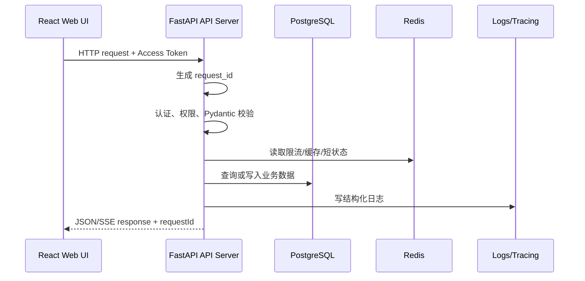

前端错误处理规则：

| 状态 | 前端处理 |
| --- | --- |
| `401` | 尝试 refresh token，失败后跳转登录 |
| `403` | 展示无权限状态，不重复请求，并刷新当前用户权限缓存 |
| `404` | 详情页展示资源不存在、已删除或无权访问 |
| `409` | 提示状态已变化，提供刷新入口 |
| `413` | 展示文件过大提示 |
| `415` | 展示文件类型不支持 |
| `422` | 映射字段级错误到表单项 |
| `429` | 展示限流提示和可重试时间 |
| `5xx` | 展示全局错误、重试入口和 `requestId` |

## 3. 登录与权限初始化

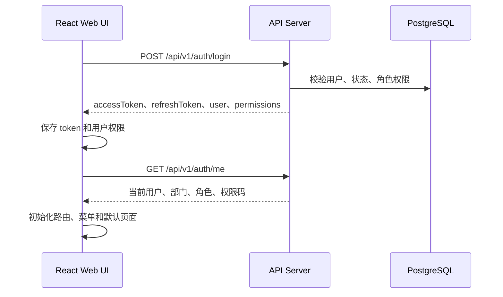

交互规则：

- 登录成功后前端初始化用户、角色、部门、权限和默认路由。
- 权限不足的菜单不展示；直接访问无权限路由时展示无权限页。
- 用户权限变更后，新请求以后端权限为准。
- 前端收到 `403` 后刷新 `auth/me` 缓存，避免权限状态滞后。

## 4. 文档上传与导入流程

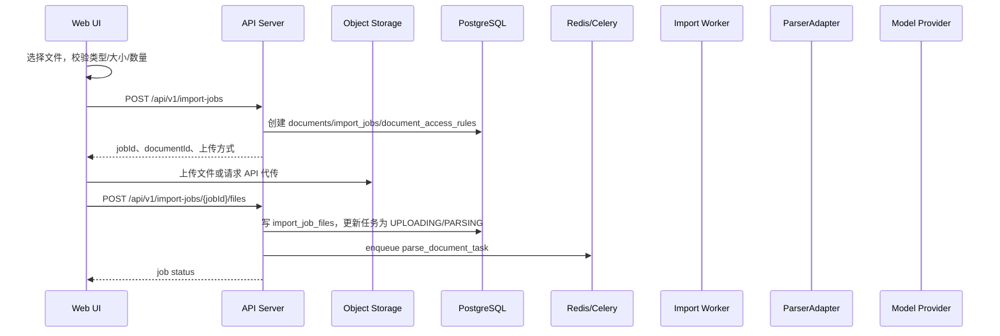

前端状态展示：

| 阶段 | 前端展示 |
| --- | --- |
| `CREATED` | 已创建任务 |
| `UPLOADING` | 上传中 |
| `PARSING` | 正在解析文档 |
| `QA_SPLITTING` | 正在生成 QA 对 |
| `EMBEDDING` | 正在向量化 |
| `INDEXING` | 正在写入全文和向量索引 |
| `COMPLETED` | 可问答 |
| `FAILED` | 失败原因、重试、下载原文件、删除 |

轮询规则：

- 前端每 2 秒请求 `GET /api/v1/import-jobs/{jobId}`。
- 任务进入 `COMPLETED`、`FAILED`、`CANCELLED` 后停止轮询。
- 页面离开后不取消后端任务；重新进入列表继续显示最新状态。
- 任务失败时展示 `failedStage`、`errorCode`、`errorMessage`、`retryable`。

## 5. Worker 文档处理流程

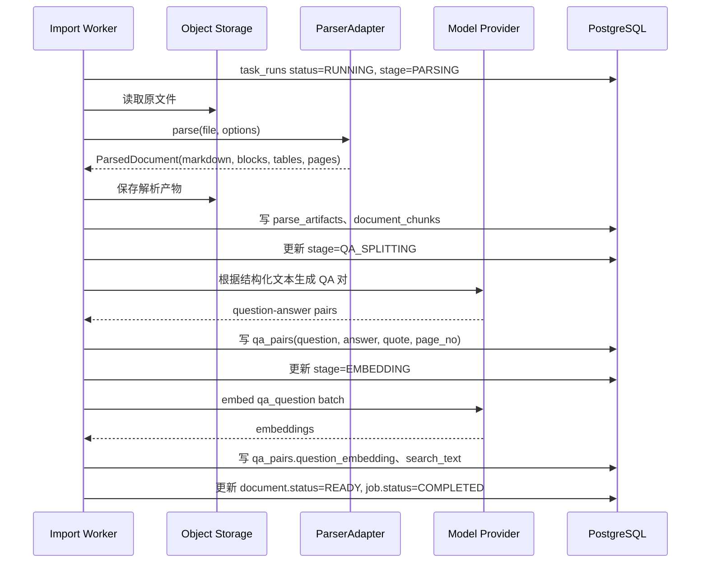

失败处理：

- 解析失败：文档状态 `FAILED`，保留原文件，允许重试解析。
- QA 拆分失败：保留解析产物和 Chunk，允许重试 QA。
- Embedding 失败：保留 QA 对，允许单独重试向量化。
- 任务重试必须基于资源 ID 和内容 hash 幂等。

## 6. 文档权限变更流程

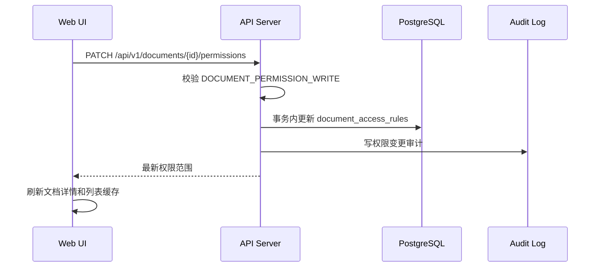

规则：

- 修改权限需二次确认。
- 新检索立即按新权限过滤。
- 历史回答引用保留快照；打开原文详情仍按当前权限校验。
- 如果权限范围为空，文档仅系统管理员可见。

## 7. Web Chat 问答与 SSE 流式输出

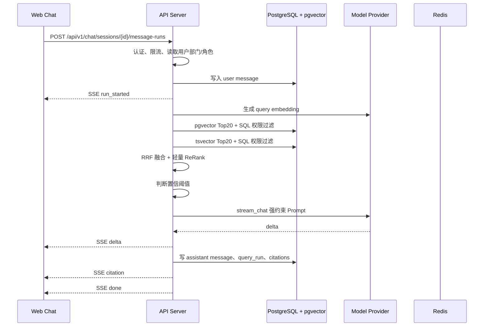

SSE 事件：

| 事件 | 用途 |
| --- | --- |
| `run_started` | 返回 `runId`、`messageId`、`requestId` |
| `delta` | 增量文本 |
| `citation` | 引用来源 |
| `done` | 完成，返回用量和耗时 |
| `error` | 失败，返回标准错误结构 |

前端处理：

- 用户提交后立即追加用户消息。
- `run_started` 到达后建立当前生成消息占位。
- `delta` 持续追加到当前回答。
- `citation` 到达后更新右侧引用区域。
- `done` 后释放输入框、失效会话消息查询缓存。
- `error` 后保留用户问题和已生成片段，允许重试。

## 8. 知识不足拒答流程

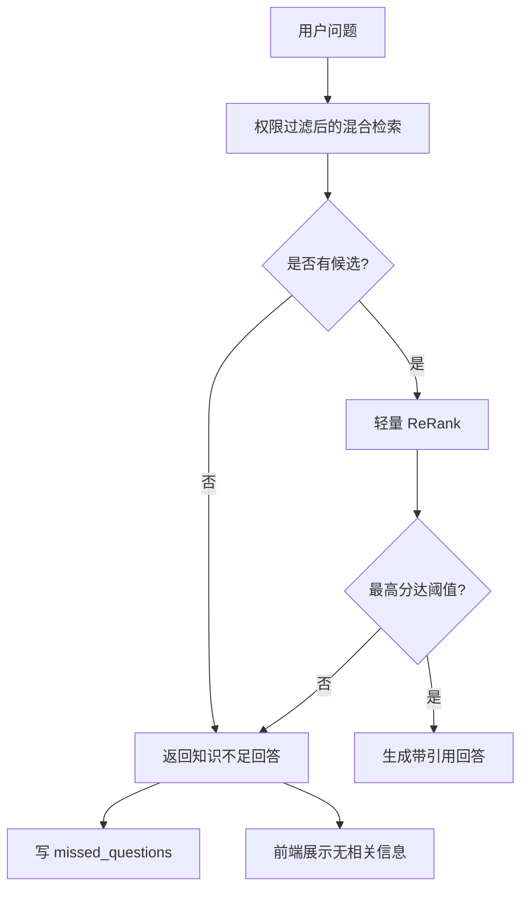

规则：

- 知识不足回答固定为“当前知识库中暂无相关信息”或同义业务文案。
- 知识不足回答不展示虚假引用。
- 系统记录未命中问题、检索快照和 request_id。
- 高风险问题低置信度必须拒答或建议联系管理员。

## 9. 引用查看与原文片段流程

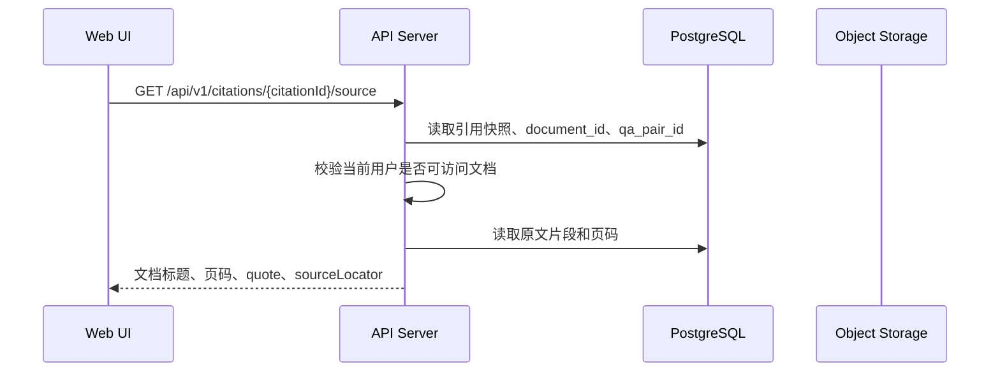

规则：

- 引用列表展示历史快照。
- 打开原文片段需按当前文档权限校验。
- 无权限时返回 `403`，前端展示“当前无权查看原文详情”。
- 文档已删除时仍可展示快照，但不允许下载原文件。

## 10. 检索解释流程

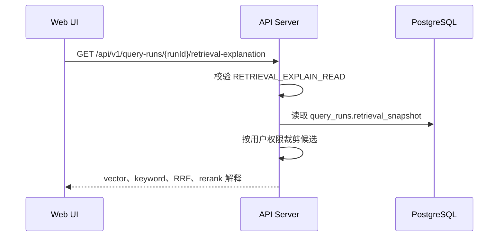

展示内容：

- 向量召回、全文召回、RRF、ReRank 四阶段。
- 候选文档标题、页码、QA 问题、最终分。
- 特征分：精确命中、标题相似、位置加权、RRF 基础分。
- 普通员工不展示无权限候选，管理员仅在授权范围内排障。

## 11. OpenAI 兼容 API 调用流程

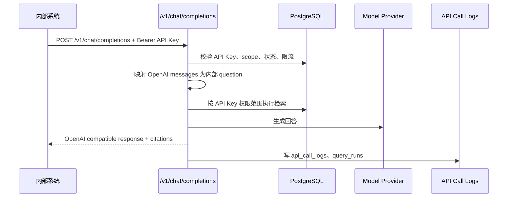

规则：

- API Key 错误返回 `401`。
- Scope 不足返回 `403`。
- 限流返回 `429`。
- 模型不可用返回 `503`。
- OpenAI 兼容响应可扩展 `citations` 和 `request_id`，但不得破坏标准客户端解析。

## 12. 模型配置与连接测试

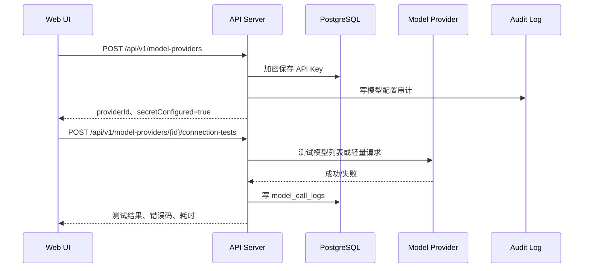

规则：

- Secret 保存后不回显明文。
- 连接测试不能把 API Key、Authorization header 写入日志。
- 默认模型变更只对新任务和新会话生效。
- Embedding 模型维度变化时，前端必须提示重新向量化风险。

## 13. API Key 管理流程

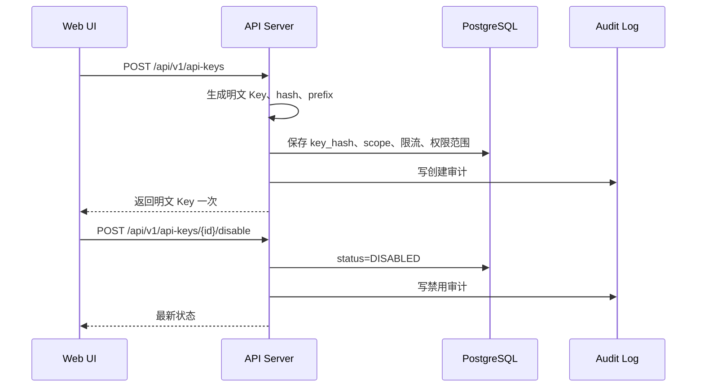

前端规则：

- 明文 Key 只在创建或轮换成功时展示一次。
- 离开弹窗后无法再次查看明文。
- 禁用和轮换均需二次确认。
- API 调用日志只展示 key 前缀，不展示明文。

## 14. 日志与任务排障流程

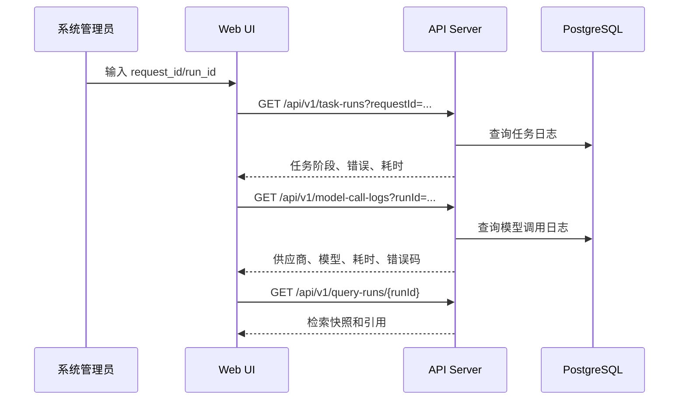

规则：

- 日志页支持 request_id、run_id、任务类型、状态、时间范围筛选。
- 错误摘要必须可复制。
- 敏感字段脱敏。
- 可重试任务展示重试按钮，不可重试任务展示原因。

## 15. 缓存与数据失效

TanStack Query key 建议：

| 数据 | Query Key | 失效策略 |
| --- | --- | --- |
| 当前用户权限 | `['auth', 'me']` | 登录、刷新 Token、收到 403 后刷新 |
| Dashboard 指标 | `['dashboard', filters]` | 时间范围或筛选变化后刷新 |
| 文档列表 | `['documents', filters]` | 上传、编辑、权限变更、删除、任务完成后失效 |
| 文档详情 | `['document', documentId]` | 文档元数据、权限、任务状态变化后失效 |
| 导入任务 | `['import-job', jobId]` | 任务未完成时轮询；完成或失败后停止 |
| QA 对 | `['qa-pairs', documentId, filters]` | QA 重生成、Embedding 重试后失效 |
| 会话消息 | `['chat-messages', sessionId]` | SSE 完成后失效并重新拉取 |
| 引用原文 | `['citation-source', citationId]` | 权限变更后失效 |
| 模型配置 | `['model-configs']` | 保存、连接测试、启停供应商后失效 |
| API Key | `['api-keys']` | 创建、禁用、轮换后失效 |
| 日志 | `['logs', filters]` | 筛选变化或手动刷新 |
| 系统设置 | `['settings']` | 保存后失效并重新拉取 |

## 16. 观测链路

```text
request_id:
  Web request -> API route -> Service -> Repository/Adapter -> response

run_id:
  question -> embedding -> vector search -> keyword search -> RRF -> rerank -> prompt -> model stream -> citations -> feedback

task_run_id:
  import job -> parse task -> qa task -> embedding task -> indexing -> final status
```

要求：

- 前端错误提示中展示 `requestId`。
- Chat 回答详情展示 `runId`，方便管理员排障。
- Worker 任务记录 `task_runs`，导入任务页面可查看失败阶段和错误。
- 模型调用错误必须可在日志页筛选。
- API 调用日志保留状态码、耗时、key 前缀、错误码，不记录密钥。

## 17. 前后端联调验收

- [ ] 登录、刷新 Token、退出流程完整。
- [ ] 403、404、409、413、415、422、429、5xx 都有前端状态处理。
- [ ] 文档上传长任务可离开页面后继续查看。
- [ ] 解析失败、QA 拆分失败、Embedding 失败可查询且可重试。
- [ ] 文档权限变更后新检索立即生效。
- [ ] Chat SSE 支持开始、增量、引用、完成和错误事件。
- [ ] 知识不足拒答不返回虚假引用。
- [ ] 引用原文查看按当前权限校验。
- [ ] OpenAI 兼容 API 支持 API Key、流式响应和引用扩展。
- [ ] 模型连接测试不泄露 Secret。
- [ ] request_id、run_id、task_run_id 能贯穿前端提示、后端日志和数据库记录。
