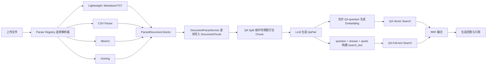
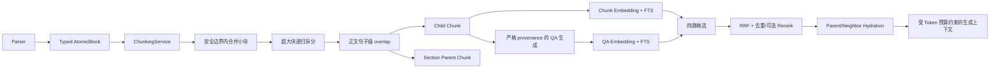

# 灵犀（Lingxi）分块策略现状与搜索效果改进分析

> 版本：V1.1 分块专项分析
> 日期：2026-07-30
> 范围：文档解析、检索分块、QA 拆分、向量化、全文检索与上下文组装
> 代码基线：当前工作区实现；本文件只记录分析与建议，不代表相关改造已经落地

---

## 一、执行摘要

灵犀目前并不是“统一固定长度切块”，也没有实现通用的 Recursive、Semantic、Parent-Child 或 Agentic Chunking。当前真正占主导的是**解析器驱动的结构感知分块**：Markdown/TXT 按标题和空行分块，CSV 按行并重复表头，MinerU/Docling 直接把解析器识别出的文本、表格、图片说明、公式等块转换为 `DocumentChunk`。

当前策略的优点是确定性强、可追溯、成本低、适合 Celery 重试和幂等处理；主要问题则是不同解析器产出的块粒度差异很大，而且缺少统一的 Token 预算、过小块合并、过大块递归拆分和父子上下文机制。以本地开发数据库中一个 READY 文档样本为例，47 个有效块中有 25 个低于约 30 Token，显示 Docling 解析结果被近乎逐项落库，存在明显的过度碎片化。

更关键的是：灵犀当前检索的主要对象不是原始 `DocumentChunk`，而是由 LLM 根据若干 Chunk 生成的 `QaPair`。向量仅写入 `QaPair.question_embedding`，全文检索文本由 question、answer、quote 组成。因此，分块策略即使得到改进，也不能单独解决“某些原文事实没有生成 QA、因而无法被直接召回”的覆盖缺口。本地开发样本中 47 个 Chunk 只有 7 个被 11 条 QA 直接引用，40 个 Chunk 没有直接 QA 映射。该数据只说明本地样本现象，不应外推为生产总体比例，但足以暴露架构风险。

推荐的目标不是用单一策略取代现状，而是形成**结构优先、Token 受控、类型感知、层级检索、QA 与原文双路召回**的组合方案：

1. 解析器只负责产出带类型和定位信息的原子块 `AtomicBlock`；
2. 统一 `ChunkingService` 在安全结构边界内合并小块，对超大块递归拆分；
3. 普通正文使用有限的句子级 overlap，表格、代码、公式和图片采用专门规则；
4. 同时持久化可检索的 Child Chunk 和可回填上下文的 Parent Chunk；
5. QA 生成必须建立严格的 Chunk provenance，不再把无效 `chunkIndex` 静默绑定到第一块；
6. 同时索引 QA 和原始 Chunk，通过 RRF 融合、证据去重、Parent/Neighbor Hydration 提供最终上下文；
7. Semantic Chunking 仅用于超长正文段的二级边界优化；Agentic Chunking 仅作为高价值离线模式，不作为默认摄取路径。

---

## 二、分析边界与术语

### 2.1 本文所说的“分块”

本文区分三个容易混淆的阶段：

- **解析分块**：把原始文件转为 `ParsedBlock` / `DocumentChunk`；
- **QA Prompt 批处理**：把已经存在的 Chunk 按字符预算组合后调用 LLM；
- **检索上下文组装**：查询时把多个候选证据排序、去重并组织给生成模型。

`qa_split_service._group_chunks()` 只是第二类“Prompt 批处理”，不会改变数据库中的检索 Chunk 边界，因此不能视为检索分块算法。

### 2.2 常见策略定义

| 策略 | 核心思想 | 典型优势 | 典型风险 |
|---|---|---|---|
| 固定长度 + overlap | 按字符或 Token 上限切分，相邻块重复一部分内容 | 简单、稳定、不会无限大 | 可能切断语义；全量 overlap 增加索引与噪声 |
| Recursive Chunking | 按段落、句子、标点、Token 等多级分隔符递归降级 | 在尺寸约束下尽量保留自然边界 | 仍需处理表格、代码等非正文内容 |
| Semantic Chunking | 根据 Embedding 相似度或语义突变决定边界 | 对主题切换更敏感 | 成本、参数和模型版本会影响确定性 |
| Structure-aware | 利用标题、段落、列表、表格、页码、文档树等结构 | 可解释、可追溯、适合文档型知识库 | 解析器块常过细或过粗，仍需归一化 |
| Parent-Child / Hierarchical | 小块负责精确召回，大块负责上下文补全 | 兼顾检索精度与生成完整性 | 数据模型、去重和 Token 预算更复杂 |
| Agentic Chunking | 由 LLM 判断边界、主题和块摘要 | 可处理复杂隐含结构 | 成本高、不可完全复现、失败面大 |

---

## 三、当前端到端数据流



当前链路中的两个关键事实：

1. `DocumentParseService` 基本按解析器返回的每个 `ParsedBlock` 一对一写入 `DocumentChunk`，没有统一归一化层；
2. 检索入口以 `QaPair` 为中心，不直接搜索 `DocumentChunk`。

---

## 四、灵犀当前使用了哪些分块策略

### 4.1 总体策略矩阵

| 分块策略 | 当前状态 | 实现位置或说明 |
|---|---|---|
| 通用固定长度分块 | 部分实现 | CSV 有约 4000 字符预算；其他解析器没有统一长度约束 |
| 固定长度 + overlap | 未实现 | 没有通用相邻正文重叠逻辑 |
| Recursive Chunking | 未实现 | 超大段落、超长单行或超大 Parser Block 不会递归降级拆分 |
| Semantic Chunking | 未实现 | 没有基于 Embedding/主题突变的边界判断 |
| Structure-aware | **主要实现** | Markdown 标题、CSV 行、MinerU 内容块、Docling 文档树 |
| Table-aware | 部分实现 | CSV 重复表头；MinerU/Docling 可保留表格，但无统一大型表格分片协议 |
| Image-aware | 部分实现 | 有 Caption 才产生文本块；无描述图片通常跳过 |
| Code-aware | 部分实现 | Docling 能识别 code item，但后续仍按普通单块处理 |
| Parent-Child / Hierarchical | 未实现 | `title_path` 只是元数据，不是可检索 Parent 节点 |
| Agentic Chunking | 未实现 | LLM 在边界确定后生成 QA，不决定 Chunk 边界 |

### 4.2 Markdown / TXT：标题与空行驱动的结构分块

实现：`server/app/integrations/parsers/markdown_blocks.py:13-57`。

行为：

- ATX 标题（`#`、`##` 等）更新 `title_path`，标题本身不作为内容块；
- 空行结束当前块；
- 保存 `lineStart`、`lineEnd`；
- `page_no` 固定为 1；
- 返回的块不做 Token 上限检查，也不做 overlap。

这属于轻量的 Structure-aware Chunking。其问题包括：

- 长段落可能远超模型或 Embedding 输入预算；
- 连续短段会形成大量微小块；
- 标题只存在于 `title_path`，当前 QA 全文检索文本没有自动包含 `title_path`；
- 代码围栏、列表、引用块没有专门边界保护；
- 使用 `stripped.startswith("#")` 判断标题，可能把非标准 Markdown 中以 `#` 开头的正文误判为标题。

### 4.3 CSV：行感知、重复表头、近似固定字符预算

实现：`server/app/integrations/parsers/csv_parser.py:13-79`。

行为：

- 以 CSV 行为不可拆原子单位；
- 每个分片重复表头；
- 使用约 4000 字符上限聚合数据行；
- 保存 `rowStart`、`rowEnd`；
- 没有相邻块 overlap。

这是“Structure-aware + 近似固定长度”的混合策略。它优于盲目字符切分，但仍存在：

- 单个超长行可直接超过上限；
- 字符数不能稳定代表 Token 数，中文、英文、数字和转义文本差异明显；
- 表头重复属于表格语境恢复，不应再叠加普通正文 overlap；
- 超宽表格和超长单元格没有列投影、单元格拆分或摘要策略。

### 4.4 MinerU：解析器原生内容块

实现：`server/app/integrations/parsers/mineru.py:224-329`。

行为：

- 使用 MinerU 的 content list 产出文本、表格、图片、公式等单元；
- 标题更新 `title_path`；
- 保留页码和 `blockIndex`；
- 有 Caption 的图片可转换为文本块；无 Caption 图片通常被跳过；
- 解析失败或缺少结构化内容时，可退回 Markdown 标题/空行分块。

优点是版面与内容类型信息较丰富。问题是 Parser Block 被视为最终 Chunk：多个连续短文本块不会合并，单个超大表格或文本块不会继续拆分，图片 OCR/Caption/邻近上下文没有统一组合规则。

### 4.5 Docling：文档树与类型感知分块

实现：`server/app/integrations/parsers/docling.py:227-401`。

行为：

- 遍历 Docling 文档树；
- title、section header 更新 `title_path`；
- text、list item、code、formula、table、picture 等项目可形成块；
- 保存页码、`blockIndex`、`selfRef`；
- 表格转换为 Markdown；图片仅在存在 Caption 时形成文本；
- 每个可输出的 Docling item 基本直接成为一个最终 Chunk。

这是当前结构感知能力最强的一条路径，也最容易产生过度碎片化。标题、单句、列表项、公式、代码片段被逐项落库后，检索模型看到的单块可能缺少上下文；而把多个微小块一次送入 QA Prompt 又不能弥补检索层缺乏直接映射的问题。

### 4.6 Parser fallback

MinerU/Docling 无结构化块或走降级路径时，会回退到共享的 Markdown 标题 + 空行切分器。降级后会失去真实页码、内容类型、表格树或图片位置等信息，因此应通过 warning/metric 明确记录，不能把 fallback 结果与原生结构结果视为同等质量。

---

## 五、QA 批处理不是 Agentic Chunking

实现：

- `server/app/services/qa_split_service.py:262-310`
- `server/app/services/qa_prompt_builder.py:5-19`

当前逻辑把已存在 Chunk 按 `qa_split_max_batch_chars`（当前默认约 6000 字符）贪心装入多个 Prompt Batch。单个 Chunk 如果已经超过预算，会独占一组，而不会被进一步拆分。预算只统计 `len(chunk.content)`，未计入系统指令、文档标题、`title_path`、JSON 格式、模型输出预留等开销。

LLM 的任务是根据这些 Chunk 生成 QA，并返回可选的 `chunkIndex`。Chunk 边界在调用 LLM 前已固定，所以该流程不属于 Agentic Chunking。

### 5.1 当前 provenance 风险

`server/app/services/qa_split_service.py:325-357` 当前存在以下行为：

- `chunkIndex` 可以缺失；
- 未知 `chunkIndex` 查不到时，最终回退到本批/文档的第一个 Chunk；
- 没有强制验证 quote 确实属于被引用 Chunk；
- Prompt 没有要求每一个输入 Chunk 都必须被覆盖或明确标记 skipped。

其后果是引用可能“形式上有 chunk_id，语义上却绑定错误”，从而影响引用页码、检索解释和后续评估。

---

## 六、当前检索对象与分块改造的真实边界

### 6.1 数据模型事实

- `DocumentChunk` 当前字段主要是 content、title_path、page_no、token_count、source_locator、status，没有 Embedding 或全文检索字段：`server/app/models/qa_pair.py:9-21`；
- `QaPair` 才具有 `question_embedding` 和 `search_text`：`server/app/models/qa_pair.py:24-44`；
- Embedding 阶段只对 QA question 生成向量：`server/app/services/embedding_service.py:91-117`；
- 检索仓储以 `QaPair` 为查询实体：`server/app/repositories/retrieval_repo.py`；
- `search_text` 由 question、answer、quote 构成，没有稳定纳入文档标题和 Chunk `title_path`：`server/app/services/embedding_service.py:36-45`。

### 6.2 搜索效果影响

这意味着：

1. 若某个 Chunk 没有生成 QA，它没有直接向量或 FTS 召回路径；
2. 若用户措辞与生成的问题差异很大，向量仅表示 question 可能丢失原文实体或细节；
3. 分块过细会使 QA 缺上下文，分块过粗会使 QA 覆盖不完整；
4. 只调整 Chunk 大小，不能消除 LLM QA 生成的不确定覆盖；
5. 更稳妥的架构应保留 QA 的“问题改写优势”，同时增加 Chunk 原文检索兜底。

---

## 七、本地开发样本证据

以下数据来自当前本地 PostgreSQL 的一个 READY 文档样本，只用于验证风险是否真实存在，不代表生产总体分布。

### 7.1 QA 覆盖

- 有效 Chunk：47；
- 有效 QA Pair：11；
- 被 QA 直接引用的不同 Chunk：7；
- 没有直接 QA 映射的 Chunk：40。

### 7.2 Chunk 尺寸

| 类型 | Chunk 数 | 字符 P50 | 字符 P95 | 最大字符数 | 低于约 30 Token |
|---|---:|---:|---:|---:|---:|
| Docling PDF | 43 | 47 | 291 | 514 | 22 |
| Docling Word | 4 | 15 | 133 | 133 | 3 |

合计 25/47 个块低于约 30 Token。该样本说明“解析器 item 直接等于最终检索 Chunk”会产生大量上下文不足的小块，应在持久化前增加统一归一化层。

---

## 八、主要搜索质量风险

### 8.1 过度碎片化

短句、列表项、公式和 Caption 被拆成独立块，导致语义不完整、Embedding 表示不稳定、QA 生成需要跨多块推断。多个微小命中还会挤占 Top-K。

### 8.2 超大块无兜底

Markdown 长段、CSV 超长行、MinerU/Docling 超大块都可能突破预算。Embedding Provider 可能截断或报错，QA Prompt 也可能超上下文。

### 8.3 跨边界事实丢失

没有正文 overlap；段落末尾定义与下一段解释、跨页连续句、列表引导句与列表项可能被分开，降低召回完整性。

### 8.4 类型信息没有贯穿

解析器能识别表格、代码、图片、公式，但 `ParsedBlock` 与 `DocumentChunk` 缺少标准 `block_type`，下游难以执行不同的拆分、索引和上下文策略。

### 8.5 标题语境利用不足

`title_path` 有保存但不是 Parent Chunk，也没有稳定进入 Chunk Embedding/FTS。仅检索正文时，同名概念可能缺少章节限定。

### 8.6 QA coverage 与引用绑定不可靠

QA 数量远少于 Chunk，且 `chunkIndex` 缺失/错误时回退第一块，会造成不可见内容与错误 provenance。

### 8.7 字符预算不是模型预算

CSV 和 QA Batch 使用字符数近似 Token，无法保证 Provider 输入不超限，也不能利用不同模型真实 Context Window。

### 8.8 缺乏可量化评估

若只比较“看起来更自然的 Chunk”，无法证明搜索变好。必须建立固定查询集并测量 Recall@K、MRR、nDCG、证据覆盖、引用正确率、空召回率、延迟和成本。

---

## 九、PRD 与当前实现的差距

产品 PRD 在 `docs/product-prd.md:593-607` 中列出了固定大小、语义、标题、表格、图片、代码等分块能力。当前实现与其对应关系如下：

- 标题/结构分块：已部分实现；
- 表格、图片、代码：解析层部分识别，但没有统一的最终 Chunk 策略；
- 固定大小：仅 CSV 局部实现，且是字符预算；
- 语义分块：未实现；
- overlap、递归拆分、Parent-Child：PRD 未充分细化，当前也未实现；
- 原文 Chunk 检索：当前不存在，PRD 应补充为搜索完整性要求。

因此，不能把 PRD 中“列出策略”理解为代码已经具备对应能力。

---

## 十、推荐目标策略

### 10.1 总体原则

推荐采用 **Adaptive Hierarchical Chunking（自适应层级分块）**：

> 结构优先决定安全边界，Token 预算控制尺寸，内容类型决定专用策略，Child Chunk 负责精确检索，Parent/Neighbor 负责上下文恢复，QA 与原文 Chunk 共同参与召回。

### 10.2 建议数据流



### 10.3 初始尺寸策略

以下数值应被视为评估起点，而不是永久常量：

```text
min_tokens     = 80–120
目标 target     = 350–500
max_tokens     = 700–900
overlap_tokens = 50–80（仅普通正文）
```

具体值应按 Embedding 模型、生成模型、语言和评估数据集配置。建议第一版默认：`min=100`、`target=450`、`max=800`、`overlap=64`。

### 10.4 合并规则

仅在以下条件全部满足时合并相邻小块：

- 同一文档、同一结构 Section/Parent；
- 内容类型兼容；
- 合并后不超过 `target_tokens`，必要时允许接近 `max_tokens`；
- 不跨明显标题边界、表格边界、代码 Fence、图片边界；
- 页码变化可记录为 page range，而不是简单丢弃来源信息。

### 10.5 递归拆分层级

普通正文建议按以下优先级递归拆分：

1. 子标题或已知结构节点；
2. Markdown 块/段落；
3. 句子边界；
4. 标点或空白；
5. Token 硬切兜底。

每次拆分必须保证前进，禁止空块；任何最终 Child Chunk 都必须满足 `token_count <= max_tokens`，除非属于显式记录的不可拆原子并触发专用降级策略。

### 10.6 overlap 规则

- 仅对因尺寸拆分的连续普通正文应用；
- 优先复制完整句子，不从句中间机械截取；
- 不对原本独立的章节、表格块、图片块或代码块做通用 overlap；
- overlap 文本需在 metadata 中标记，便于检索结果去重和引用定位。

### 10.7 内容类型策略

- **Table**：重复表头；按行分片；超宽表按列组或 Key Column 投影；单元格超长时单独降级；
- **Code**：优先按 symbol/class/function/Fence；保留签名与必要 import/context；不在字符串或语法单元中硬切；
- **Image**：组合 Caption、OCR、图片附近标题/正文；没有任何文本表示时记录 skipped reason，而非静默丢失；
- **Formula**：公式与其前后解释合并；独立大公式保留 LaTeX/文本和来源；
- **List**：引导句与列表项尽量同块；大型列表按连续项拆分并重复引导语；
- **CSV**：保留表头与行定位，改用 Token 预算并处理超长单行。

### 10.8 Parent-Child

- Child：约 100–800 Token，建立 Embedding/FTS，负责召回；
- Parent：通常是完整 Section 或一组相邻 Child，默认不直接参与第一阶段向量召回；
- 命中 Child 后，根据 `parent_chunk_id` 回填 Parent 摘要/内容，并可获取前后邻居；
- 上下文组装时以证据预算裁剪，避免一个 Parent 吃掉全部 Prompt。

### 10.9 QA 与 Chunk 双路检索

建议四路候选：

1. QA Vector；
2. QA FTS；
3. Chunk Vector；
4. Chunk FTS。

用 RRF 合并不同评分尺度，以 `(document_id, chunk_id, normalized evidence span)` 去重。QA 命中应回到其来源 Chunk；Chunk 命中可直接作为证据。可选 Reranker 只处理融合后的有限候选。

### 10.10 为什么不优先 Agentic Chunking

默认摄取链路要求：确定性、可重试、可版本化、可批量回填、成本可控。LLM 决定边界会引入模型漂移、温度/Provider 差异、不可预测延迟和更复杂的幂等语义。建议仅在下列条件下试验：

- 高价值、低频文档；
- 离线处理；
- 固定模型和 Prompt 版本；
- 输出必须通过 Token、边界、来源和覆盖校验；
- 与确定性 Chunker 做 A/B 评估，低于门槛自动回退。

---

## 十一、改进优先级

### P0：先建立可测量基线

- 固定查询—证据数据集；
- 记录 Chunk 尺寸、类型、合并/拆分原因、fallback 比例；
- 建立 Recall@K、MRR、nDCG、引用正确率、QA coverage、延迟与成本仪表。

### P0：统一确定性 Chunk 归一化

- Parser 输出 Typed AtomicBlock；
- 小块合并；
- 超大块递归拆分；
- Tokenizer 感知预算；
- 正文句子级 overlap；
- 保持 locator 合并与拆分可追溯。

### P0：修复 QA provenance

- `chunkIndex` 必填且必须属于当前 Batch；
- quote 必须可在引用 Chunk 中规范化匹配；
- 删除回退第一块逻辑；
- 输出 covered/skipped chunk 列表；
- 失败应明确分类为可重试模型格式错误或不可重试契约错误。

### P0/P1：增加原始 Chunk 索引

- 给 Child Chunk 增加 Embedding、search_text/search_vector；
- 文档标题、`title_path`、正文进入索引文本；
- 在既有 QA Vector/FTS 旁增加 Chunk Vector/FTS；
- 保持租户、文档权限和知识分类过滤完全一致。

### P1：Parent-Child / Small-to-Big

- 建立 parent relation；
- 命中后回填 Parent 与邻居；
- 做证据级去重和 Prompt Token 预算控制。

### P1：类型专用策略

优先完善 Table、Code、Image、Formula、List，尤其是超大表格和无 Caption 图片的可观测降级。

### P2：局部 Semantic Chunking

仅对仍然超大的普通正文 Section 使用语义突变点优化，且必须设置确定性兜底和版本化参数。

### P3：可选 Agentic Chunking

作为实验性、离线、高价值模式，不阻塞默认导入流程。

---

## 十二、建议评估指标与门槛

### 12.1 分块健康度

- `chunk_token_p50/p95/p99`；
- `tiny_chunk_ratio(< min_tokens)`；
- `oversized_chunk_ratio(> max_tokens)`；
- `merge_count`、`split_count`、`overlap_token_ratio`；
- 各 `block_type` 分布；
- parser fallback 和 skipped image 比例；
- chunker version/config hash 分布。

### 12.2 检索质量

- Chunk/QA 各路 Recall@5、Recall@10、MRR@10、nDCG@10；
- 融合后的 Evidence Recall；
- QA coverage：有有效 QA 的 Child Chunk 比例；
- 空召回率、错误文档召回率；
- 引用来源正确率和 quote containment rate；
- Top-K 重复证据比例。

### 12.3 运行指标

- 每页/每 MB 的切块时长；
- 每文档 Chunk/Parent/Embedding 数量；
- QA 和 Chunk 索引存储增长；
- 导入总延迟、重试率、Provider 错误率；
- 查询 P50/P95 延迟和 Rerank 成本。

建议首期验收至少满足：评估集 Recall@10 不低于基线且目标提升 10%；错误 provenance 为 0；`oversized_chunk_ratio=0`（专门豁免需有原因码）；微小块比例显著下降；RBAC 结果与旧路径一致。

---

## 十三、现有验证基线

已对当前解析与批处理相关测试执行：

```powershell
.\.venv\Scripts\python.exe -m pytest `
  server/tests/test_parse_document_task.py `
  server/tests/test_csv_parser.py `
  server/tests/test_mineru_parser.py `
  server/tests/test_docling_parser.py `
  server/tests/test_batching_pipeline.py -q
```

基线结果：

```text
39 passed in 9.14s
```

该结果证明当前行为有回归测试保护，但不证明现有 Chunk 搜索质量理想。改造时应先保留这组测试，再新增 ChunkingService、provenance、Chunk retrieval、hierarchy 和评估测试。

---

## 十四、最终结论

灵犀当前已经具备较好的结构解析基础，但“解析器原子项直接作为最终检索块”与“仅检索 LLM 生成 QA”共同限制了搜索覆盖和上下文质量。最优先的工作不是直接引入成本最高的 Semantic 或 Agentic Chunking，而是补齐统一确定性归一化、严格来源绑定和原文 Chunk 双路检索。

推荐路线可概括为：

> **Parser 负责识别结构，Chunker 负责稳定尺寸和类型策略，QA 提供问题语义入口，原文 Chunk 提供覆盖兜底，Hierarchy 提供生成上下文，Evaluation 决定参数而不是凭经验拍值。**
