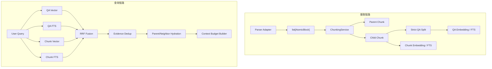

# 灵犀（Lingxi）自适应层级分块与双路检索技术 Spec

> Spec ID：LINGXI-CHUNK-V1.1
> 状态：Draft for Implementation
> 版本：1.0
> 日期：2026-07-30
> 依赖分析：[01-chunking-current-state-and-improvement-analysis.md](./01-chunking-current-state-and-improvement-analysis.md)
> 适用范围：`server/app/integrations/parsers/`、解析持久化、QA Split、Embedding、Retrieval、Prompt Context、数据库迁移与回填

---

## 1. 背景

灵犀当前由 Markdown、CSV、MinerU、Docling 等解析器直接产出 `ParsedBlock`，`DocumentParseService` 将每个 Block 一对一保存为 `DocumentChunk`。不同解析器的 Block 粒度不一致：Docling/MinerU 可能生成大量短 item，Markdown 可能形成超长段落，CSV 仅采用近似字符上限。系统缺少统一 Token 预算、相邻小块合并、超大块递归拆分、类型专用策略和 Parent-Child 关系。

检索侧以 `QaPair` 为中心：仅 QA question 有 Embedding，全文检索文本也只基于 QA 内容。若某个 Chunk 没生成 QA，原文没有直接召回路径。此外，QA 输出的 `chunkIndex` 当前可选且无效时会回退至第一块，存在错误引用风险。

本 Spec 定义一套向后兼容的 Adaptive Hierarchical Chunking 与 QA/Chunk Hybrid Retrieval 架构。

---

## 2. 目标与非目标

### 2.1 目标

- **G-01**：所有 Parser 通过统一 Typed Atomic Block 契约输出结构、类型和来源信息。
- **G-02**：通过统一 `ChunkingService` 生成尺寸稳定、可追溯、确定性的 Child Chunk。
- **G-03**：在安全结构边界内合并过小块，对超大块递归拆分，并仅对普通正文应用句子级 overlap。
- **G-04**：为表格、代码、图片、公式、列表提供独立策略。
- **G-05**：持久化 Parent-Child 层级与 Chunker 版本/config hash，支持幂等重建和历史审计。
- **G-06**：强化 QA-to-Chunk provenance，禁止缺失或错误来源静默落库。
- **G-07**：同时对 QaPair 与原始 Child Chunk 建立 Vector/FTS 索引并使用 RRF 融合。
- **G-08**：命中 Child 后按预算回填 Parent/Neighbor 上下文，提高回答完整性。
- **G-09**：保持租户隔离、文档权限、知识分类过滤和删除状态语义不变。
- **G-10**：支持 feature flag、灰度、回填、回滚、指标与离线质量评估。

### 2.2 非目标

- **NG-01**：首版不让 LLM 决定默认 Chunk 边界；Agentic Chunking 不进入同步/默认导入链路。
- **NG-02**：首版不替换 MinerU、Docling 或现有 Parser Registry。
- **NG-03**：首版不要求重写聊天 API 或前端交互协议；仅允许向内部快照增加兼容字段。
- **NG-04**：首版不以自动摘要替代原文证据。
- **NG-05**：首版不承诺一组固定参数适合所有模型；参数必须配置化并通过评估选择。
- **NG-06**：首版 Semantic Chunking 只保留扩展接口，不作为 P0 必需功能。

---

## 3. 设计原则

1. **结构优先**：标题、Section、表格、代码 Fence、图片和公式是强边界。
2. **预算约束**：所有最终 Child Chunk 必须用 Token 预算校验，字符数只允许作监控指标。
3. **确定性**：同一 parser output、policy、tokenizer version 必须产生相同内容、顺序与 config hash。
4. **来源可逆**：合并或拆分后仍能追踪到原始 block 和 locator 范围。
5. **类型感知**：不对所有内容套同一种 overlap 或分隔符。
6. **召回与上下文分离**：Child 用于精准召回，Parent/Neighbor 用于补全上下文。
7. **双路覆盖**：QA 提供查询表达泛化，Chunk 原文提供事实覆盖兜底。
8. **安全过滤先行**：任何检索路径在排序前都必须执行相同的 RBAC/tenant/category filters。
9. **可渐进迁移**：旧数据、旧 QaPair、旧 API 在灰度期间可继续工作。
10. **可评估**：每次策略版本变化必须能对固定数据集进行可重复对比。

---

## 4. 需求清单

### 4.1 功能需求

| ID | 需求 |
|---|---|
| FR-001 | Parser 输出必须包含 `block_type`，未知类型归一为 `TEXT` |
| FR-002 | ChunkingService 必须接受 ordered atomic blocks 与 `ChunkPolicy`，返回 ordered parent/child chunks |
| FR-003 | 小块只在同一安全结构域内合并，禁止跨 Section、Table、Code、Image 强边界 |
| FR-004 | 超过 `max_tokens` 的普通正文必须递归拆分，最终不得超限 |
| FR-005 | overlap 仅用于由尺寸拆分产生的连续 prose child，且不得超过策略上限 |
| FR-006 | Table 分片必须重复表头并保存行范围；Code 分片必须优先保持 symbol/fence；Formula/Image 必须附带解释上下文 |
| FR-007 | 每个 Child 必须有稳定顺序、token_count、source locator、content hash 和 chunker metadata |
| FR-008 | Parent 必须包含 child id/order 信息；Child 必须可反查 Parent |
| FR-009 | QA 输出的 `chunkIndex` 必填、属于当前 batch，quote 必须匹配来源 Chunk |
| FR-010 | QA 生成必须返回 covered/skipped chunk index，未覆盖原因可审计 |
| FR-011 | Child Chunk 必须支持 Embedding 与 FTS，索引文本包含文档标题、title_path 与 content |
| FR-012 | 检索必须支持 QA Vector、QA FTS、Chunk Vector、Chunk FTS 四路候选 |
| FR-013 | 四路候选必须经 RRF 融合，并按来源证据去重 |
| FR-014 | 命中 Child 后可按配置获取 Parent 和前后邻居，并受上下文 Token 预算限制 |
| FR-015 | 回填必须可按 document、tenant、chunker version 分批运行，可恢复、可重试 |
| FR-016 | 新旧链路必须可通过 feature flag 独立启停和回滚 |
| FR-017 | 所有新路径必须复用现有 tenant/document/classification 权限过滤 |

### 4.2 非功能需求

| ID | 需求 |
|---|---|
| NFR-001 | 同输入与同配置重复运行，Chunk content/hash/order 必须完全一致 |
| NFR-002 | 解析任务重试不能留下混合版本 Active Chunk |
| NFR-003 | P95 Chunking CPU 时间不超过基线解析持久化新增预算的 20%，不含外部 Parser 时间 |
| NFR-004 | Chunk 双路开启后检索 P95 延迟增幅目标不超过 30%，可通过候选数控制 |
| NFR-005 | 任一新检索路径故障可降级到旧 QA-only 路径，不影响 API 可用性 |
| NFR-006 | 数据迁移 upgrade/downgrade 可执行；索引创建应避免不可控长事务 |
| NFR-007 | 日志不得记录完整敏感文档内容、Embedding 或 Prompt；只记录 id、hash、长度和原因码 |

---

## 5. 目标架构



### 5.1 分层职责

- Parser：识别内容、结构与来源，不负责最终检索尺寸；
- Chunker：纯确定性转换，不访问数据库、不调用外部 LLM；
- Persistence：事务性替换指定版本的 Parent/Child；
- QA Split：生成语义问答入口，并执行严格 provenance 校验；
- Embedding/Index：对 QA 与 Child Chunk 建索引；
- Retrieval：权限过滤、四路召回、融合、去重；
- Hydration：只为已授权命中项加载 Parent/Neighbor；
- Prompt Builder：在 Token 预算内输出证据与引用 metadata。

---

## 6. 模块与接口设计

建议新增目录：

```text
server/app/services/chunking/
├── __init__.py
├── contracts.py
├── policy.py
├── tokenizer.py
├── merge.py
├── recursive_splitter.py
├── overlap.py
├── type_handlers.py
└── service.py
```

也可在首个小版本使用 `server/app/services/chunking_service.py` 单文件起步，但对外接口必须保持以下语义，以便后续拆包。

### 6.1 `AtomicBlock`

在 `server/app/integrations/parsers/base.py` 扩展当前 `ParsedBlock`，或新增 `AtomicBlock` 并在兼容期提供转换器。

```python
@dataclass(frozen=True)
class AtomicBlock:
    index: int
    content: str
    block_type: BlockType
    page_no: int | None
    title_path: tuple[str, ...]
    source_locator: dict
    structural_id: str | None
    parent_structural_id: str | None
    metadata: dict
```

`BlockType` 至少包含：

```text
TITLE, HEADING, TEXT, LIST, TABLE, CODE, FORMULA, IMAGE, QUOTE, UNKNOWN
```

约束：

- `index` 在单文档内从 0 递增且唯一；
- `content` trim 后为空的块不得进入 Chunker；
- `title_path` 内部使用不可变 tuple，落库转换为 JSON list；
- `source_locator` 必须保留 Parser 原始定位；
- `metadata` 仅允许 JSON-safe 值；
- Parser 不确定类型时使用 `UNKNOWN`，Chunker 按 TEXT 保守处理并记录 metric。

### 6.2 `ChunkPolicy`

```python
@dataclass(frozen=True)
class ChunkPolicy:
    name: str = "adaptive_hierarchical"
    version: str = "1.0"
    tokenizer_name: str = "configured-embedding-tokenizer"
    min_tokens: int = 100
    target_tokens: int = 450
    max_tokens: int = 800
    overlap_tokens: int = 64
    parent_max_tokens: int = 1800
    allow_cross_page_merge: bool = True
    semantic_split_enabled: bool = False
```

校验：

```text
0 < min_tokens <= target_tokens <= max_tokens
0 <= overlap_tokens < min_tokens
max_tokens <= embedding_provider_input_limit
parent_max_tokens >= max_tokens
```

`config_hash` 必须由规范化 JSON（排序 key、稳定编码）经 SHA-256 计算，至少覆盖所有影响边界/内容的参数、tokenizer name/version 和 type handler version。

### 6.3 Token Budget Estimator

接口：

```python
class TokenCounter(Protocol):
    name: str
    version: str
    def count(self, text: str) -> int: ...
    def split_by_token_limit(self, text: str, limit: int) -> list[str]: ...
```

要求：

- 优先使用当前 Embedding 模型对应 tokenizer；
- Provider 未提供 tokenizer 时使用版本化本地估算器；
- 估算器必须保守，测试语料中不得低估 Provider 实际 Token 超过 5%；
- Tokenizer 不可用时抛 `CHUNK_TOKENIZER_UNAVAILABLE`，不得静默退回 `len(text)`。

### 6.4 `ChunkingService`

```python
class ChunkingService:
    def chunk(
        self,
        blocks: Sequence[AtomicBlock],
        policy: ChunkPolicy,
        *,
        document_title: str,
    ) -> ChunkingResult: ...
```

```python
@dataclass(frozen=True)
class ChunkingResult:
    parents: tuple[NormalizedChunk, ...]
    children: tuple[NormalizedChunk, ...]
    stats: ChunkingStats
    warnings: tuple[ChunkingWarning, ...]
```

`NormalizedChunk` 至少包含：

```text
local_id, level, parent_local_id, chunk_index, block_type,
content, title_path, token_count, page_start, page_end,
source_locators, atomic_block_indexes, overlap_prefix_tokens,
content_hash, metadata
```

---

## 7. 确定性分块算法

### 7.1 预处理

1. 按 AtomicBlock.index 稳定排序；
2. trim 外围空白但不改变代码/表格内部格式；
3. 删除空块并记录 `EMPTY_ATOMIC_BLOCK_SKIPPED`；
4. 规范化 `UNKNOWN -> TEXT` 的处理策略，但保留原始类型 metadata；
5. 根据 `title_path`、structural id、强类型边界构建 Section Group。

### 7.2 安全结构边界

以下任一变化都会结束当前普通正文合并窗口：

- `title_path` 改变；
- Parent structural id 改变；
- TABLE/CODE/IMAGE/FORMULA 与其他类型切换；
- Parser 明确标记 `hard_boundary=true`；
- 文档结束。

跨页不是默认强边界。若 `allow_cross_page_merge=true`，可合并同一 Section 的跨页连续正文，同时保存 `page_start/page_end` 和全部 locator。

### 7.3 小块合并

对同一 Section 内兼容的连续 TEXT/LIST/QUOTE：

1. 当前 buffer 小于 `min_tokens` 时尝试吸收下一块；
2. 合并后不超过 `target_tokens` 则合并；
3. 若当前仍小于 `min_tokens` 且合并后位于 `(target, max]`，允许合并；
4. 若不能向后合并，可在不跨安全边界且不超过 `max_tokens` 时与前一 Chunk 合并；
5. 无法合并的微小块保留，并记录 `TINY_CHUNK_UNMERGEABLE`；
6. 合并连接符由类型决定：正文 `\n\n`，列表 `\n`，不得破坏 Markdown 表格/代码格式。

### 7.4 超大正文递归拆分

若 token_count > max_tokens，按以下层级尝试：

```text
结构子块 → 双换行 → 单换行 → 句子边界 → 标点/空白 → Token 硬切
```

约束：

- 每层仅在上层不能得到合格块时下降；
- 使用稳定的 separator 优先级，不依赖随机性；
- 产生的空段删除；
- 每次递归必须使最大片段缩小，否则进入下一层；
- 最终硬切严格保证 `<= max_tokens`；
- source locator 必须保留原始 locator，并添加相对字符/Token 范围；
- 切分后小尾块可与前块重平衡，但结果不得超过 max。

### 7.5 正文 overlap

仅对同一原始 oversized prose unit 拆出的相邻 Child 应用：

- 从前一块末尾选取不超过 `overlap_tokens` 的完整句子；
- 若单句已超过上限，使用 Token 边界截取；
- overlap 内容作为下一块 prefix，并记录 `overlap_prefix_tokens`；
- overlap 不计入唯一证据范围，去重时根据原始 locator/span 合并；
- 如果 overlap 使块超过 max，缩短 overlap；
- 不给独立自然段之间人为添加 overlap。

### 7.6 表格策略

- 表格是强类型边界；
- 小表保持完整；
- 大表按数据行拆分，每块重复 Caption 与 Header；
- 每块保存 rowStart/rowEnd、header hash；
- 单行超限时依次尝试：按列组拆分、按单元格文本递归拆分、生成显式降级块；
- 禁止普通正文 overlap；
- Header 重复 Token 记录在 metadata，用于成本分析与结果去重。

### 7.7 代码策略

- 优先按 Parser symbol metadata、class/function 或 Markdown Fence 拆分；
- 每块保留语言、文件/Section、symbol signature；
- import/context 可作为可标记前缀重复；
- 禁止在语法字符串、注释块或多字节字符中硬切；
- 无语法信息且超限时，先按空行/行，再按 Token 硬切，并产生 `CODE_FALLBACK_SPLIT` warning。

### 7.8 图片策略

最终文本表示按以下顺序组合：

```text
章节路径 + Caption + OCR + 图片前后说明文本
```

- Caption/OCR 去重；
- 仅允许吸收同页、同 Section 的有限邻近正文；
- 没有 Caption/OCR/Alt/邻文时不创建空 Chunk，记录 `IMAGE_WITHOUT_TEXT_SKIPPED`；
- `source_locator` 保留图片 selfRef/页码/bbox（若 Parser 提供）。

### 7.9 公式策略

- 短公式优先与前后解释性正文合并；
- 独立公式块应包含 LaTeX/文本和 Section path；
- 不与无关正文跨 Section 合并；
- 超长推导按公式行或环境拆分，不应用正文 overlap。

### 7.10 Parent 构建

Parent 默认按 Section Group 构建：

- Parent 内容由有序 Child 的“非 overlap 唯一内容”拼接；
- 若 Section 超过 `parent_max_tokens`，建立多个 Section Segment Parent；
- Parent 不复制到 Child content，只通过 id 关联；
- Parent 保存 child local ids、页码范围、title_path、source locators；
- Parent 默认不生成 QA、不参加第一阶段向量检索，可配置 FTS/summary 作为后续扩展。

---

## 8. Parser 适配要求

### 8.1 Base contract

修改 `server/app/integrations/parsers/base.py`：

- 给 `ParsedBlock` 增加 `block_type`、`structural_id`、`parent_structural_id`、`metadata`；
- 为兼容旧测试提供默认值；
- 不改变 `ParserAdapter.supports()/parse()`、`ParserError.retryable` 语义。

### 8.2 Markdown/TXT

修改 `markdown_blocks.py`：

- 标题应形成结构节点或 metadata，而不只是 breadcrumb；
- 正文、列表、代码 Fence、引用、表格尽量标注类型；
- 保留 line locator；
- 不再在 Parser 内承担最终 Token 分块。

### 8.3 CSV

修改 `csv_parser.py`：

- 推荐 Parser 输出表格原子行/表格对象，由 Table handler 决定最终 Chunk；
- 兼容期可继续输出已有块，但必须标记 TABLE 和 header/row metadata；
- 逐步移除 Parser 内固定 4000 字符作为最终边界的职责。

### 8.4 MinerU / Docling

- 将原生 label 映射到标准 `BlockType`；
- 保留原始 label、selfRef、bbox、page、block index；
- Heading 更新 title_path/structural id；
- 无 Caption 图片继续 warning，但统一 reason code；
- fallback 必须设置 `parser_fallback=true` 与 fallback 原因。

---

## 9. 持久化与迁移

### 9.1 `document_chunks` 建议新增字段

| 字段 | 类型建议 | 空值 | 说明 |
|---|---|---|---|
| `block_type` | varchar(32) | 否，默认 TEXT | 标准内容类型 |
| `chunk_level` | varchar(16) | 否，默认 CHILD | PARENT / CHILD |
| `parent_chunk_id` | varchar(36) FK self | 是 | Child 指向 Parent |
| `page_start` | integer | 是 | 来源页范围 |
| `page_end` | integer | 是 | 来源页范围 |
| `source_locators` | json/jsonb | 否 | 多原子块 locator 列表 |
| `atomic_block_indexes` | json/jsonb | 否 | 原子块索引 |
| `content_hash` | varchar(64) | 否 | 规范化内容 SHA-256 |
| `chunker_name` | varchar(64) | 否 | 策略名 |
| `chunker_version` | varchar(32) | 否 | 算法版本 |
| `chunker_config_hash` | varchar(64) | 否 | 参数/tokenizer hash |
| `embedding` | vector(N) | 是 | Child 原文向量 |
| `search_text` | text | 否，默认空 | 标题路径 + 原文 |
| `chunk_metadata` | json/jsonb | 否 | overlap、split reason 等 |

保留现有 `page_no` 与 `source_locator` 作为兼容字段；新写入同时填充 `page_no=page_start`、`source_locator=source_locators[0]`。稳定后另行 Spec 决定是否弃用。

### 9.2 约束与索引

- self FK：`parent_chunk_id -> document_chunks.id`；
- Parent 的 `parent_chunk_id IS NULL`；Child 可为空以兼容旧数据；
- 推荐唯一约束：`(document_id, chunker_config_hash, chunk_level, chunk_index, status)` 需结合软删除语义设计为 PostgreSQL partial unique index；
- B-tree：`tenant_id, document_id, status, chunk_level`；
- B-tree：`parent_chunk_id, chunk_index`；
- GIN：对 PostgreSQL `to_tsvector(...)` 的 Chunk FTS 表达式；
- pgvector：按现有规模与运维规范选择 HNSW/IVFFlat；创建前确认维度一致；
- SQLite 测试中继续由 Python fallback 执行向量/文本匹配。

### 9.3 迁移文件

新建：

```text
server/app/db/migrations/versions/0005_adaptive_hierarchical_chunks.py
```

迁移步骤：

1. 添加 nullable 字段和默认值；
2. 回填旧 Chunk 为 `CHILD`、`TEXT`、`chunker_name=legacy_parser`；
3. 生成旧内容 hash；
4. 建普通索引；
5. 对大表向量/GIN 索引采用部署时受控步骤；
6. 完成回填后再收紧非空约束。

Downgrade 必须先删除新索引/FK，再删字段；不得删除现有 Chunk/QaPair 内容。

### 9.4 原子替换与幂等

- 每次解析得到 `run_config_hash`；
- 在单事务中插入 Parent、flush 获得 id、插入 Child；
- 仅在全部写入成功后将新版本标记 ACTIVE，并把旧 Active 版本软删除/标记 SUPERSEDED；
- 重试时若相同 `(document_id, config_hash, content_hash set)` 已完成，可直接复用；
- 不允许同一文档同时出现两套被检索路径都视为 ACTIVE 的同版本 Chunk；
- QA/Embedding 任务必须绑定 chunker config hash，防止读到正在切换的数据。

---

## 10. QA provenance 契约

### 10.1 Prompt 输出协议

`server/app/services/qa_prompt_builder.py` 应要求严格 JSON：

```json
{
  "items": [
    {
      "chunkIndex": 12,
      "question": "...",
      "answer": "...",
      "quote": "...",
      "pageNo": 3
    }
  ],
  "coveredChunkIndexes": [12],
  "skippedChunks": [
    {"chunkIndex": 13, "reason": "NO_ANSWERABLE_FACT"}
  ]
}
```

### 10.2 校验规则

- `chunkIndex` 必填且为 int；
- 必须属于当前 Prompt Batch，不仅属于整个文档；
- question、answer、quote trim 后非空；
- quote 经 Unicode、空白和换行规范化后必须是引用 Child content 的子串；
- pageNo 若提供，必须落在 Chunk 页范围内；
- `covered ∪ skipped` 必须等于本 Batch 所有 Chunk index；
- covered 与 skipped 不得重复；
- 每个 item 的 chunkIndex 必须在 covered 中；
- 无效输出整个 Batch 不落库，按错误类型重试或失败；
- 删除 fallback-to-first-chunk 行为。

### 10.3 错误处理

| 错误码 | retryable | 场景 |
|---|---:|---|
| `QA_PROVENANCE_MISSING_CHUNK_INDEX` | 是 | 模型漏字段，可按现有 Provider 重试策略重试 |
| `QA_PROVENANCE_UNKNOWN_CHUNK_INDEX` | 是 | 引用了当前 Batch 外 Chunk |
| `QA_PROVENANCE_QUOTE_MISMATCH` | 是 | quote 不在来源 Chunk |
| `QA_PROVENANCE_COVERAGE_MISMATCH` | 是 | covered/skipped 不完整 |
| `QA_PROVENANCE_CONTRACT_INVALID` | 否 | 本地契约/配置自身无效 |

超过任务重试上限后，文档按现有失败语义处理，并保留 Batch id、chunk indexes 和 hash；日志不得写完整 quote/content。

---

## 11. Embedding 与全文索引

### 11.1 Chunk Embedding 文本

默认输入模板：

```text
文档：{document_title}
章节：{title_path_joined}
类型：{block_type}
正文：{content}
```

- 缺失字段整行省略；
- 用于 Embedding 的规范化文本与 content 分开保存或可稳定重建；
- 如果模板超 Provider 限制，这是 Chunker/配置错误，不允许静默截断；
- Parent 默认不 Embedding。

### 11.2 Chunk FTS 文本

`search_text` 应包含：

```text
document.title + title_path + content
```

中文 Tokenizer/`to_tsvector` 行为复用现有 QA FTS 的规范化链路。QA `search_text` 同步补入 document.title 与来源 Chunk `title_path`，但需通过评估确认权重。

### 11.3 Embedding service

修改 `server/app/services/embedding_service.py`：

- 将 QA 与 Chunk 建模为明确的 embedding targets；
- 可按 target type 批处理；
- 只对 ACTIVE Child、embedding 为空或版本过期的记录处理；
- 保存 embedding model/provider/dimension/version metadata；
- 任一 target 失败不得误标其他 target 完成；
- 任务完成条件应明确：QA required targets 与 Chunk required targets 均成功，或 feature flag 关闭对应路径。

---

## 12. Hybrid Retrieval 设计

### 12.1 统一证据类型

扩展 `server/app/schemas/retrieval.py`：

```python
@dataclass(frozen=True)
class RetrievalEvidence:
    evidence_type: Literal["QA", "CHUNK"]
    evidence_id: str
    document_id: str
    chunk_id: str
    parent_chunk_id: str | None
    content: str
    quote: str | None
    title_path: tuple[str, ...]
    page_start: int | None
    page_end: int | None
    source_locator: dict | list[dict]
    channel_scores: dict[str, float]
    fused_score: float
```

旧 `RetrievalCandidate` 在兼容期保留，或通过 adapter 转为该类型。

### 12.2 四路候选

`retrieval_repo.py` 新增：

- `search_qa_vector(...)`
- `search_qa_text(...)`
- `search_chunk_vector(...)`
- `search_chunk_text(...)`

四个方法必须接受同一 `RetrievalAccessScope`，并执行完全相同的：

- tenant filter；
- document ACL filter；
- classification filter；
- document/chunk deleted/status filter。

### 12.3 RRF

对每一路独立排名后使用：

```text
RRF(e) = Σ_channel weight(channel) / (k + rank_channel(e))
```

默认：`k=60`，四路初始权重均为 1.0。所有参数配置化并进入检索快照。RRF 使用 rank 而非原始向量/FTS score，避免尺度不一致。

QA candidate 在融合前映射到其 `chunk_id` 证据，同时保留 QA question/answer 作为 query expansion metadata。Chunk candidate 直接映射到自身。若同一 Chunk 同时由多路命中，合并 channel scores，而不是占用多个 Top-K 名额。

### 12.4 去重

去重 key 依次使用：

1. 相同 `chunk_id`；
2. 相同 document + source span；
3. content hash 相同；
4. overlap 区域高度重叠。

去重保留最高 fused score，并合并来源通道。不得跨 tenant 去重或缓存。

### 12.5 Rerank

若现有 Rerank 开启，只对 RRF 后 Top-N 唯一证据执行。输入必须包含 query、title path、evidence content；输出不得改变访问范围。Rerank 故障按现有策略回退 RRF 顺序。

### 12.6 Parent/Neighbor Hydration

配置建议：

```text
retrieval_child_top_k = 20
retrieval_fused_top_k = 10
retrieval_neighbor_window = 1
retrieval_context_max_tokens = 6000
retrieval_parent_max_tokens_per_hit = 1200
```

Hydration 规则：

- 先选高分 Child 证据；
- 若 Child 内容不足或上下文模式开启，加载 Parent；
- 可加载同 Parent 下前后各 1 个 Child；
- 先去重，再按 fused score 与增量信息量加入上下文；
- Parent 过长时优先保留命中 Child 周边窗口，不从开头机械截取；
- 每段上下文必须保留精确 citation 到 Child/source locator。

---

## 13. 配置与 Feature Flags

在 `server/app/core/config.py` 和 `.env.example` 增加：

```text
CHUNKING_MODE=legacy|adaptive
CHUNK_MIN_TOKENS=100
CHUNK_TARGET_TOKENS=450
CHUNK_MAX_TOKENS=800
CHUNK_OVERLAP_TOKENS=64
CHUNK_PARENT_MAX_TOKENS=1800
CHUNK_TOKENIZER_NAME=<resolved>
CHUNK_SEMANTIC_SPLIT_ENABLED=false
QA_STRICT_PROVENANCE_ENABLED=false
CHUNK_INDEXING_ENABLED=false
HYBRID_CHUNK_RETRIEVAL_ENABLED=false
PARENT_CONTEXT_ENABLED=false
RETRIEVAL_RRF_K=60
RETRIEVAL_CHUNK_VECTOR_WEIGHT=1.0
RETRIEVAL_CHUNK_TEXT_WEIGHT=1.0
RETRIEVAL_QA_VECTOR_WEIGHT=1.0
RETRIEVAL_QA_TEXT_WEIGHT=1.0
```

启动时校验配置关系。无效值应抛 `ConfigurationError`，不能自动修正后继续运行。

推荐启用顺序：

1. adaptive chunking shadow 计算但不写 Active；
2. adaptive 写入但检索仍 QA-only；
3. strict QA provenance；
4. Chunk indexing；
5. hybrid retrieval shadow 比较；
6. hybrid retrieval 灰度；
7. Parent hydration 灰度。

---

## 14. Backfill / Reindex

### 14.1 能力

新增维护服务与 Celery maintenance task，支持：

```text
--tenant-id
--document-id
--from-chunker-version
--to-chunker-version
--batch-size
--resume-after
--dry-run
--rebuild-qa
--rebuild-embedding
```

### 14.2 状态机

```text
PENDING -> CHUNKING -> QA(optional) -> EMBEDDING -> VERIFYING -> READY
                                  \-> FAILED_RETRYABLE / FAILED_FINAL
```

- 每批提交，保存 cursor；
- 重启后从 cursor 恢复；
- dry-run 只输出统计，不修改 Active 数据；
- 新版本验证通过前旧版本继续提供检索；
- 切换 Active 必须原子完成；
- 回滚只切回旧版本，不需要重新解析源文件。

---

## 15. 可观测性

### 15.1 结构化日志字段

```text
tenantId, documentId, jobId, parserName, parserVersion,
chunkerName, chunkerVersion, configHash, tokenizerName,
atomicBlockCount, childCount, parentCount, mergeCount, splitCount,
tinyChunkCount, oversizedChunkCount, skippedImageCount,
qaCoveredChunkCount, qaSkippedChunkCount, qaCoverageRatio,
embeddingTargetType, retrievalChannels, featureFlags
```

### 15.2 Metrics

- `chunking_duration_seconds`；
- `chunk_tokens` histogram（按 block type）；
- `chunk_tiny_total`、`chunk_oversized_total`；
- `chunk_merge_total`、`chunk_split_total`；
- `qa_provenance_validation_failure_total{reason}`；
- `qa_chunk_coverage_ratio`；
- `embedding_targets_total{type,status}`；
- `retrieval_candidates_total{channel}`；
- `retrieval_channel_hit_ratio{channel}`；
- `retrieval_dedup_ratio`；
- `retrieval_hydration_tokens`；
- `retrieval_latency_seconds{stage}`。

### 15.3 审计

检索快照应记录 feature flag、RRF 参数、每路 rank、融合分数、evidence id、chunker config hash，但不得记录完整敏感正文。

---

## 16. 失败行为与错误码

| 错误码 | 阶段 | retryable | 行为 |
|---|---|---:|---|
| `CHUNK_POLICY_INVALID` | startup/chunking | 否 | 启动失败或任务失败，不写新 Chunk |
| `CHUNK_TOKENIZER_UNAVAILABLE` | chunking | 是/依配置 | 保留旧 Active 数据，按任务策略重试 |
| `CHUNK_SPLIT_NO_PROGRESS` | chunking | 否 | 算法保护触发，记录 block hash |
| `CHUNK_MAX_TOKENS_EXCEEDED` | verification | 否 | 禁止切换 Active |
| `CHUNK_SOURCE_LOCATOR_INVALID` | chunking | 否 | 禁止落库错误来源 |
| `CHUNK_PERSISTENCE_CONFLICT` | persistence | 是 | 回滚事务并重试 |
| `CHUNK_EMBEDDING_FAILED` | embedding | 是 | 单 target 标记失败，任务可恢复 |
| `CHUNK_RETRIEVAL_DEGRADED` | retrieval | 否 | 查询级降级 QA-only 并计数 |
| `PARENT_HYDRATION_FAILED` | retrieval | 否 | 使用 Child 证据继续回答 |
| `QA_PROVENANCE_*` | QA | 见 §10.3 | 当前 Batch 不落库 |

所有失败必须满足“旧 Active 数据可继续服务”或“导入任务保持明确失败状态”，禁止半成品被查询。

---

## 17. 安全与权限

- 所有 Chunk 写入必须携带与 Document 相同的 `tenant_id`；
- Parent、Child、QA 的 tenant/document 关系在应用层校验，必要时增加数据库约束；
- 四路检索必须共享同一 AccessScope builder，禁止先全局 Top-K 再做权限过滤；
- Parent/Neighbor Hydration 必须重新带权限条件查询，不可信任前一步传入 id；
- Backfill 只能由 maintenance worker/管理员触发，并记录操作者或任务来源；
- 日志、指标标签不得包含正文、问题、答案、quote、Embedding；
- 对 Prompt injection 不在 Chunking 阶段执行或解释文档指令；文档内容始终作为不可信数据；
- 删除/软删除文档后，QA、Child、Parent 均不得继续出现在任一检索路径或缓存中。

---

## 18. 兼容性

### 18.1 数据兼容

- 旧 Chunk 标记为 `legacy_parser` + `CHILD`；
- `parent_chunk_id` 可为空；
- Chunk embedding 可为空；
- Hybrid flag 关闭时完全沿用 QA-only；
- 新 RetrievalEvidence 可转回旧 `RetrievalCandidate`/snapshot 字段。

### 18.2 API 兼容

现有外部响应字段不删除、不改语义。新增证据类型、page range、title path 等字段若暴露，应设为可选并更新 OpenAPI/测试。首期优先只在服务内部使用统一证据类型。

### 18.3 任务兼容

解析、QA、Embedding Celery queue 名称保持不变。可以新增 maintenance task，但不得要求部署新 queue 才能维持旧功能。

---

## 19. 测试策略

### 19.1 单元测试

- Policy validation/config hash；
- tokenizer 计数和严格上限；
- 小块合并及所有强边界；
- recursive split 的降级层级、终止性和 locator；
- overlap 完整句、上限与去重 metadata；
- Table/Code/Image/Formula/List handler；
- Parent 构建；
- QA provenance 全部错误码；
- RRF、证据映射和去重；
- context budget/hydration。

### 19.2 Parser contract 测试

扩展：

- `server/tests/test_csv_parser.py`
- `server/tests/test_mineru_parser.py`
- `server/tests/test_docling_parser.py`
- `server/tests/test_parse_document_task.py`

保证原定位信息不丢失、block type 映射稳定、fallback 有明确 metadata。

### 19.3 数据库与迁移测试

- Alembic upgrade `0004 -> 0005`；
- 旧数据默认回填；
- self FK 与索引；
- downgrade 不丢现有字段数据；
- PostgreSQL pgvector + FTS；
- SQLite fallback。

### 19.4 检索与权限测试

扩展：

- `server/tests/test_embedding_task.py`
- `server/tests/test_retrieval_repo.py`
- `server/tests/test_retrieval_service.py`
- `server/tests/test_document_permissions.py`
- `server/tests/test_knowledge_classification.py`
- `server/tests/test_citations_and_explanation.py`

验证四路召回、相同 AccessScope、RRF、去重、Parent hydration 和 citation 来源。

### 19.5 性能与质量评估

新增 `server/scripts/evaluate_chunking_retrieval.py` 与版本化 fixture：

```text
server/tests/fixtures/chunking_eval/
├── corpus/
├── queries.jsonl
└── expected_evidence.jsonl
```

输出：Chunk 分布、Recall@K、MRR、nDCG、QA coverage、citation accuracy、索引大小、导入/查询延迟。结果应包含 baseline 与 candidate config hash。

---

## 20. 验收标准

### 20.1 功能验收

- **AC-001**：所有 Parser 输出的非空块具有标准 `block_type` 和有效 locator。
- **AC-002**：同输入、同策略连续执行两次，Parent/Child content、order、hash 完全一致。
- **AC-003**：普通 Child 全部 `<= max_tokens`；专用类型若降级必须有明确 reason code。
- **AC-004**：评估语料 tiny chunk ratio 相对旧策略下降至少 50%。
- **AC-005**：严格 QA provenance 下，缺失/未知 chunkIndex、quote mismatch 均不得落库。
- **AC-006**：QA covered/skipped 对每个 Batch 完整，数据库中不存在 fallback-first 新记录。
- **AC-007**：Chunk Embedding/FTS 可召回没有 QA 的原文事实。
- **AC-008**：四路 RRF 对同一 Chunk 只返回一条统一 Evidence，并保留 channel score。
- **AC-009**：Parent/Neighbor hydration 不超 context budget，citation 仍指向 Child 精确来源。
- **AC-010**：tenant、文档权限、分类过滤在四路和 hydration 中结果一致，无越权。
- **AC-011**：任一 Chunk 路径故障可降级 QA-only，并有 metric/log。
- **AC-012**：旧解析与检索测试全部通过。

### 20.2 质量验收

在冻结评估集上：

- Hybrid Recall@10 不低于 QA-only 基线，目标相对提升至少 10%；
- MRR@10 不低于基线；
- citation provenance accuracy = 100%；
- oversized prose chunk ratio = 0；
- 空召回率下降或不劣化；
- Top-K 重复证据比例低于 10%；
- P95 查询延迟增幅不超过 30%，若超过必须调整每路 candidate K 或延后 Rerank。

### 20.3 回归基线

当前以下命令基线为 `39 passed`：

```powershell
.\.venv\Scripts\python.exe -m pytest `
  server/tests/test_parse_document_task.py `
  server/tests/test_csv_parser.py `
  server/tests/test_mineru_parser.py `
  server/tests/test_docling_parser.py `
  server/tests/test_batching_pipeline.py -q
```

最终还必须运行完整 `server/tests` 套件与 PostgreSQL 集成测试。

---

## 21. 发布与回滚

### 21.1 发布阶段

1. 发布兼容数据库字段，所有新 flag 默认关闭；
2. 发布 AtomicBlock/Chunker，shadow 统计不替换旧数据；
3. 小规模文档启用 adaptive 写入，检索保持 QA-only；
4. 启用 strict provenance，观察失败率并修正 Prompt；
5. 回填 Chunk embedding/FTS；
6. Hybrid shadow 记录新旧 Top-K 差异；
7. 按 tenant 5% → 25% → 50% → 100% 启用 Hybrid；
8. 最后启用 Parent hydration；
9. 稳定窗口后再决定是否停止生成 legacy Chunk。

### 21.2 自动停止条件

任一条件触发暂停扩量：

- 权限过滤差异或越权；
- provenance accuracy < 100%；
- 任务失败率相对基线上升 2 个百分点以上；
- P95 查询延迟上升超过 30%；
- Recall@10 明显低于基线；
- Active Chunk 版本混合或回填不可恢复。

### 21.3 回滚

- 关闭 `PARENT_CONTEXT_ENABLED`；
- 关闭 `HYBRID_CHUNK_RETRIEVAL_ENABLED`，立即回到 QA-only；
- 关闭 `CHUNK_INDEXING_ENABLED` 停止新 Chunk Embedding；
- 将 `CHUNKING_MODE=legacy`，新导入恢复旧分块；
- 对已回填数据切换 Active version，不物理删除，以便调查；
- 数据库字段直到稳定期结束后都不回滚，除非迁移本身造成问题。

---

## 22. 风险与缓解

| 风险 | 影响 | 缓解 |
|---|---|---|
| Tokenizer 与 Provider 不一致 | 仍可能超限 | 保守估算、Provider fixture、启动校验 |
| Chunk 数量/索引体积增加 | 成本与延迟上升 | 小块合并、Parent 不默认 Embedding、候选 K 限制 |
| overlap 导致重复命中 | Top-K 浪费 | 仅 oversized prose 使用、span/hash 去重 |
| 表格/代码专用逻辑复杂 | 边界 bug | 独立 handler + Golden fixtures + reason code |
| 严格 provenance 增加 QA 失败 | 导入失败率上升 | Prompt 版本化、Batch 重试、covered/skipped 协议、先灰度 |
| 四路查询延迟上升 | 用户体验下降 | 并行查询、候选数控制、按 flag 降级 |
| 回填造成 DB/Provider 压力 | 线上抖动 | 分批、速率限制、cursor、低峰运行 |
| Parent 注入过多上下文 | Prompt 成本和噪声 | 增量信息预算、每命中 Parent 上限 |
| 配置变化导致版本爆炸 | 运维复杂 | config hash、保留窗口、Active 指针和清理策略 |

---

## 23. 未决但不阻塞 P0 的决策

以下事项应通过评估确认，不得阻塞确定性基础设施：

1. 首个生产默认值使用 `350/700` 还是 `450/800`；
2. 中文 Tokenizer 选型与 Provider-specific adapter；
3. Chunk FTS 中 document title/title_path 的权重；
4. 四路 RRF 权重是否按文档类型区分；
5. Parent 是否需要摘要及是否建立独立索引；
6. Semantic split 的相似度模型、阈值与启用文档类型；
7. Agentic Chunking 的离线实验范围。

这些决策必须以冻结评估集和 config hash 对比结果为依据。

---

## 24. 预期代码影响面

### 新增

- `server/app/services/chunking/__init__.py`
- `server/app/services/chunking/contracts.py`
- `server/app/services/chunking/policy.py`
- `server/app/services/chunking/tokenizer.py`
- `server/app/services/chunking/merge.py`
- `server/app/services/chunking/recursive_splitter.py`
- `server/app/services/chunking/overlap.py`
- `server/app/services/chunking/type_handlers.py`
- `server/app/services/chunking/service.py`
- `server/app/services/chunk_backfill_service.py`
- `server/app/db/migrations/versions/0005_adaptive_hierarchical_chunks.py`
- `server/scripts/evaluate_chunking_retrieval.py`
- 对应单元、集成和 fixture 文件。

### 修改

- `server/app/integrations/parsers/base.py`
- `server/app/integrations/parsers/markdown_blocks.py`
- `server/app/integrations/parsers/csv_parser.py`
- `server/app/integrations/parsers/mineru.py`
- `server/app/integrations/parsers/docling.py`
- `server/app/services/document_parse_service.py`
- `server/app/services/qa_prompt_builder.py`
- `server/app/services/qa_split_service.py`
- `server/app/models/qa_pair.py`
- `server/app/services/embedding_service.py`
- `server/app/repositories/retrieval_repo.py`
- `server/app/services/retrieval_service.py`
- `server/app/schemas/retrieval.py`
- `server/app/services/prompt_service.py`
- `server/app/core/config.py`
- `.env.example`
- `server/app/tasks/maintenance_tasks.py`
- 相关测试。

本 Spec 的可执行任务顺序、精确测试命令和提交拆分见 [03-adaptive-hierarchical-chunking-implementation-plan.md](./03-adaptive-hierarchical-chunking-implementation-plan.md)。
