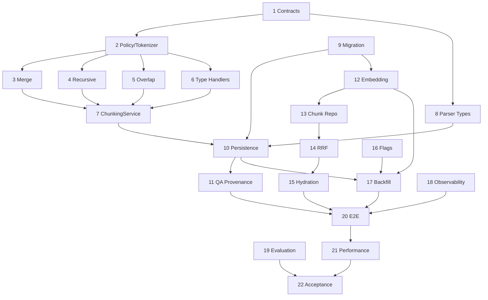

# Adaptive Hierarchical Chunking Implementation Plan

> 版本：1.0  
> 日期：2026-07-30  
> 状态：Ready for Execution

> **For agentic workers:** REQUIRED SUB-SKILL: Use superpowers:subagent-driven-development (recommended) or superpowers:executing-plans to implement this plan task-by-task. Steps use checkbox (`- [ ]`) syntax for tracking.

**Goal:** 为灵犀实现结构优先、Token 受控、类型感知的层级分块，修复 QA provenance，并增加 QA/Chunk 双路混合检索、Parent/Neighbor 上下文恢复、回填与质量评估能力。

**Architecture:** Parser 产出 Typed AtomicBlock；确定性的 `ChunkingService` 生成 Parent/Child；QA Split 严格绑定来源；Embedding 同时处理 QA 与 Child；Retrieval 通过 QA Vector、QA FTS、Chunk Vector、Chunk FTS 四路召回，以 RRF 融合并去重，最后按 Token 预算回填 Parent/Neighbor。

**Tech Stack:** Python 3.13、FastAPI、SQLAlchemy 2、Alembic、PostgreSQL、pgvector、Celery、pytest

**依据：** [技术 Spec](./02-adaptive-hierarchical-chunking-technical-spec.md)

---

## 0. 执行约定与基线

本文路径均相对 `D:\codeproject\python\lingxi`。每个 Task 开始前执行 `git status --short`，不得覆盖已有用户变更，不得使用 `git add .`。

每个 Task 严格执行：**写失败测试 → 运行并确认因功能缺失而失败 → 最小实现 → 运行并确认通过 → 相关回归 → diff 审查 → 独立提交**。若新测试第一次就通过，先修正测试覆盖，不得直接跳过 Red 阶段。

- [ ] 运行解析基线：

```powershell
.\.venv\Scripts\python.exe -m pytest `
  server/tests/test_parse_document_task.py `
  server/tests/test_csv_parser.py `
  server/tests/test_mineru_parser.py `
  server/tests/test_docling_parser.py `
  server/tests/test_batching_pipeline.py -q
```

预期：`39 passed`。

- [ ] 运行 QA/Embedding/检索基线：

```powershell
.\.venv\Scripts\python.exe -m pytest `
  server/tests/test_qa_split_task.py `
  server/tests/test_embedding_task.py `
  server/tests/test_retrieval_repo.py `
  server/tests/test_retrieval_service.py `
  server/tests/test_document_permissions.py `
  server/tests/test_knowledge_classification.py -q
```

预期：全部通过；记录测试数与耗时。

---

## Task 1：Typed AtomicBlock 与 Chunk 输出契约

**Files**
- Modify: `server/app/integrations/parsers/base.py:27-43`
- Create: `server/app/services/chunking/__init__.py`
- Create: `server/app/services/chunking/contracts.py`
- Create: `server/tests/test_chunking_contracts.py`

- [ ] 写失败测试：legacy `ParsedBlock` 默认 TEXT；空 AtomicBlock 被拒绝；NormalizedChunk 必须有 locator；Parent/Child 顺序稳定；BlockType 序列化稳定。
- [ ] 运行 `python -m pytest server/tests/test_chunking_contracts.py -q`，预期因类型不存在失败。
- [ ] 实现 `BlockType`、`ChunkLevel`、frozen dataclass：`AtomicBlock`、`NormalizedChunk`、`ChunkingStats`、`ChunkingWarning`、`ChunkingResult`；内部列表改 tuple，metadata 必须 JSON-safe。
- [ ] 给 `ParsedBlock` 增加带默认值的 `block_type`、`structural_id`、`parent_structural_id`、`metadata`，保持旧构造兼容。
- [ ] 重跑最小测试；再运行 Parser 四组测试，预期全部通过。
- [ ] 提交：

```powershell
git add server/app/integrations/parsers/base.py server/app/services/chunking server/tests/test_chunking_contracts.py
git commit -m "feat(chunking): add typed atomic block contracts"
```

---

## Task 2：ChunkPolicy、配置哈希与 TokenCounter

**Files**
- Create: `server/app/services/chunking/policy.py`
- Create: `server/app/services/chunking/tokenizer.py`
- Create: `server/tests/test_chunk_tokenizer.py`
- Modify: `server/tests/test_chunking_contracts.py`

- [ ] 写失败测试：限制顺序校验、overlap 小于 min、mapping 顺序不影响 hash、Tokenizer 版本改变 hash、Token 切分不超限且不产空段、Tokenizer 不可用抛明确错误。
- [ ] 运行两组测试，预期 Policy/Tokenizer 缺失失败。
- [ ] 实现默认 `min=100,target=450,max=800,overlap=64,parent_max=1800`；canonical JSON + SHA-256 config hash 覆盖算法、参数、Tokenizer 与 handler version。
- [ ] 实现 `TokenCounter` Protocol 和版本化本地计数器；禁止用 `len(text)` 静默替代 Token；硬切必须 `<= limit`。
- [ ] 重跑测试，预期全部通过。
- [ ] 提交 `feat(chunking): add policy and token budgeting`。

---

## Task 3：安全边界与小块合并

**Files**
- Create: `server/app/services/chunking/merge.py`
- Create: `server/tests/test_chunk_merge.py`

- [ ] 写失败测试：同 Section 微小正文合并；不跨 title path；不跨 Table/Code/Image/Formula；配置允许时可跨页；locator/index 全保留；小尾块回并不超 max；无法合并产生 warning。
- [ ] 运行 `python -m pytest server/tests/test_chunk_merge.py -q`，预期失败。
- [ ] 实现 `group_by_safe_boundary()`、`merge_small_blocks()`：TEXT/LIST/QUOTE 仅在兼容且不超预算时合并；保存 page range、全部 locator 与 atomic indexes；reason code 为 `TINY_CHUNK_UNMERGEABLE`。
- [ ] 重跑测试，预期通过。
- [ ] 提交 `feat(chunking): merge small blocks within safe boundaries`。

---

## Task 4：Recursive Oversized Prose Splitter

**Files**
- Create: `server/app/services/chunking/recursive_splitter.py`
- Create: `server/tests/test_recursive_chunk_splitter.py`

- [ ] 写失败测试：优先段落；逐级退到句子和 Token；所有输出不超 max；无分隔长串可终止；无空块；微小尾部再平衡；相对 source span 正确；同输入结果确定。
- [ ] 运行测试，预期 splitter 缺失失败。
- [ ] 实现固定顺序：结构子块 → 双换行 → 单换行 → 中英文句末 → 标点/空白 → Token 硬切；加入 no-progress guard，保存 split reason 与相对范围。
- [ ] 重跑测试，预期全部通过。
- [ ] 提交 `feat(chunking): recursively split oversized prose`。

---

## Task 5：仅连续正文使用句子级 overlap

**Files**
- Create: `server/app/services/chunking/overlap.py`
- Create: `server/tests/test_chunk_overlap.py`

- [ ] 写失败测试：优先完整尾句；不超 overlap limit；缩短 overlap 保证 child 不超 max；自然独立块间无 overlap；非正文类型无 overlap；metadata 含 prefix Token 与来源 span。
- [ ] 运行测试，预期失败。
- [ ] 实现 `apply_prose_overlap()`，只处理同一 oversized prose source 拆出的连续段；overlap 不扩展唯一证据范围。
- [ ] 重跑测试，预期通过。
- [ ] 提交 `feat(chunking): add bounded prose overlap`。

---

## Task 6：Table、Code、Image、Formula、List 策略

**Files**
- Create: `server/app/services/chunking/type_handlers.py`
- Create: `server/tests/test_chunk_type_handlers.py`
- Add: `server/tests/fixtures/chunking/table_*`
- Add: `server/tests/fixtures/chunking/code_*`

- [ ] 写失败测试：大表重复 Caption/Header 且保存 row range/header hash；超长单行降级；Code 优先 symbol/fence 并保留签名；Code 先按行再 Token；图片组合 Caption/OCR/邻文并去重；无文本图片记录 skipped；公式附解释；大型列表重复引导语；非正文无通用 overlap。
- [ ] 运行测试，预期 handler 不存在失败。
- [ ] 实现 handler registry；全部返回统一 Chunk 草稿与 warning，不访问数据库。固定 reason code：`TABLE_OVERSIZED_ROW_FALLBACK`、`CODE_FALLBACK_SPLIT`、`IMAGE_WITHOUT_TEXT_SKIPPED`。
- [ ] 重跑测试与 golden fixture，预期稳定通过。
- [ ] 提交 `feat(chunking): add content type specific handlers`。

---

## Task 7：组装 ChunkingService 与 Parent-Child

**Files**
- Create: `server/app/services/chunking/service.py`
- Modify: `server/app/services/chunking/__init__.py`
- Create: `server/tests/test_chunking_service.py`

- [ ] 写失败测试：normalize→merge→split→overlap 顺序；按 Section 建 Parent；Parent 超限按 Child 边界分段；Parent 排除重复 overlap；Child index/hash/local id 稳定；同输入同策略完全一致；stats 与实际一致。
- [ ] 运行测试，预期 service 不存在失败。
- [ ] 实现 orchestration；集中生成 chunk_index/content_hash/config hash/stats；Parent 只拼 Child 唯一内容且不在 Child 中复制。
- [ ] 运行全部 Chunking 单元测试：

```powershell
.\.venv\Scripts\python.exe -m pytest `
  server/tests/test_chunking_contracts.py `
  server/tests/test_chunk_tokenizer.py `
  server/tests/test_chunk_merge.py `
  server/tests/test_recursive_chunk_splitter.py `
  server/tests/test_chunk_overlap.py `
  server/tests/test_chunk_type_handlers.py `
  server/tests/test_chunking_service.py -q
```

预期：全部通过。
- [ ] 提交 `feat(chunking): build deterministic hierarchical chunking service`。

---

## Task 8：四类 Parser 输出标准类型与结构 metadata

**Files**
- Modify: `server/app/integrations/parsers/markdown_blocks.py:13-57`
- Modify: `server/app/integrations/parsers/csv_parser.py:13-79`
- Modify: `server/app/integrations/parsers/mineru.py:224-329`
- Modify: `server/app/integrations/parsers/docling.py:227-401`
- Modify: `server/tests/test_csv_parser.py`
- Modify: `server/tests/test_mineru_parser.py`
- Modify: `server/tests/test_docling_parser.py`
- Modify: `server/tests/test_parse_document_task.py`

- [ ] 先扩展测试：Markdown 正文/list/code/table/quote 类型；CSV 为 TABLE 且含 header/row metadata；MinerU/Docling 原始 label 映射；fallback 有 `parserFallback` 与原因；原 locator 断言保持。
- [ ] 运行四组测试，预期新类型断言失败而旧行为仍通过。
- [ ] 最小补齐 Parser 类型和结构。暂不删除 CSV 旧 4000 字符逻辑，最终尺寸仍由 ChunkingService 校验。
- [ ] 无 Caption 图片统一 warning reason，日志不得记录图片/OCR 全文。
- [ ] 重跑测试，预期全部通过。
- [ ] 提交 `feat(parsers): emit typed structural blocks`。

---

## Task 9：迁移与 DocumentChunk 模型扩展

**Files**
- Create: `server/app/db/migrations/versions/0005_adaptive_hierarchical_chunks.py`
- Modify: `server/app/models/qa_pair.py:9-21`
- Create: `server/tests/test_chunk_migration.py`

- [ ] 写失败测试：模型有层级/索引字段；legacy row 有兼容默认；self reference 可持久化；downgrade 只移除新 schema；旧行 upgrade 后可读。
- [ ] 运行 `python -m pytest server/tests/test_chunk_migration.py -q`，预期失败。
- [ ] 增加 `block_type,chunk_level,parent_chunk_id,page_start,page_end,source_locators,atomic_block_indexes,content_hash,chunker_name,chunker_version,chunker_config_hash,embedding,search_text,chunk_metadata`。
- [ ] Chunk embedding 使用与 QA 相同维度；self FK 不得递归 eager load。
- [ ] 编写 upgrade/downgrade，旧 row 回填 `TEXT/CHILD/legacy_parser` 与稳定 hash；创建 B-tree/GIN/vector 索引时兼容测试数据库。
- [ ] 运行 migration + embedding 测试，预期通过。
- [ ] 在确认是本地非生产数据库后执行：

```powershell
.\.venv\Scripts\alembic.exe upgrade head
.\.venv\Scripts\alembic.exe current
```

预期 current=`0005`，现有 document_chunks/qa_pairs 行数不减少。
- [ ] 提交 `feat(db): persist hierarchical searchable chunks`。

---

## Task 10：接入解析持久化与原子 Active 切换

**Files**
- Modify: `server/app/services/document_parse_service.py:160-202`
- Modify: `server/tests/test_parse_document_task.py`
- Modify: `server/tests/test_task_reliability.py`

- [ ] 写失败测试：Parent 先 flush 后 Child 关联；写 chunker version/config hash；新集合完整前旧 Active 可查询；同配置重试幂等；中途插入失败无半成品；legacy mode 保持一块一行。
- [ ] 运行两组测试，预期新增断言失败。
- [ ] 将 ParsedBlock 转 AtomicBlock，调用 ChunkingService；单事务写 Parent/Child 并切换 Active；QA/Embedding 后续读取绑定 config hash。
- [ ] 在 Task 16 接 Settings 前，通过 constructor 参数注入 legacy/adaptive，避免业务代码直接读环境变量。
- [ ] 重跑测试与现有 39 项基线，预期全部通过。
- [ ] 提交 `feat(ingestion): persist adaptive parent child chunks`。

---

## Task 11：严格 QA Prompt 与 provenance

**Files**
- Modify: `server/app/services/qa_prompt_builder.py:5-19`
- Modify: `server/app/services/qa_split_service.py:262-357`
- Modify: `server/tests/test_qa_split_task.py:109-211`
- Modify: `server/tests/test_batching_pipeline.py`

- [ ] 写失败测试：Prompt 要求 `chunkIndex` 与 covered/skipped；缺失 index 拒绝；Batch 外 index 拒绝；quote 不属于 Chunk 拒绝；coverage partition 不完整拒绝；绝不 fallback 第一块；多 Batch 保留全局映射；adaptive 下超大 Chunk 在 QA 前已消除。
- [ ] 运行两组测试，预期当前 fallback-first 行为被捕获并失败。
- [ ] Prompt 输出严格 JSON：items、coveredChunkIndexes、skippedChunks；校验函数接收当前 Batch Chunk map。
- [ ] quote 做 Unicode/空白规范化 containment，保存原 quote；pageNo 必须落在 Chunk page range。
- [ ] 删除 `fallback_chunk = chunks[0]` 和全部 fallback-to-first。无效 Batch 不落任何 QA。
- [ ] 兼容 flag 关闭时可接收旧输出，但未知显式 index 仍不得错误绑定；缺失 index 仅在迁移窗口兼容并记录 metric。
- [ ] 重跑测试，预期全部通过。
- [ ] 提交 `fix(qa): enforce chunk provenance and coverage`。

---

## Task 12：Embedding 扩展到 QA + Child Chunk

**Files**
- Modify: `server/app/services/embedding_service.py:36-45,91-117`
- Modify: `server/app/tasks/embedding_tasks.py`
- Modify: `server/tests/test_embedding_task.py:92-138`
- Modify: `server/tests/test_backfill_search_text.py`

- [ ] 写失败测试：Chunk index text 含文档标题/title_path/content；仅 ACTIVE Child Embedding；Parent 默认不 Embedding；QA/Chunk 分批独立；维度错误不部分完成；QA-only flag 兼容；search_text backfill 幂等。
- [ ] 运行测试，预期 Chunk target 相关断言失败。
- [ ] 引入 QA/CHUNK target type，复用 Provider batch/retry，分别保存状态；输入不超限且禁止静默截断。
- [ ] QA search_text 补入文档标题和来源 title_path；Chunk 模板按 Spec §11.1。
- [ ] `CHUNK_INDEXING_ENABLED=false` 时任务完成条件保持旧语义。
- [ ] 重跑测试，预期全部通过。
- [ ] 提交 `feat(embedding): index qa and raw child chunks`。

---

## Task 13：Chunk Vector/FTS 仓储与统一权限过滤

**Files**
- Modify: `server/app/repositories/retrieval_repo.py:29-223`
- Modify: `server/tests/test_retrieval_repo.py`
- Modify: `server/tests/test_document_permissions.py`
- Modify: `server/tests/test_knowledge_classification.py`

- [ ] 写失败测试：Chunk Vector 只返回 ACTIVE Child；Chunk FTS 命中 title_path/content；QA/Chunk tenant、ACL、classification 条件完全一致；deleted document/Parent/Child 不返回；SQLite fallback 先 scope 后排序。
- [ ] 运行三组测试，预期 Chunk 查询 API 缺失失败。
- [ ] 抽取共享 AccessScope SQL 条件，必须在数据库 Top-K 前过滤。
- [ ] 新增 `search_qa_vector/search_qa_text/search_chunk_vector/search_chunk_text` 或等价明确通道；旧方法保留 wrapper。
- [ ] PostgreSQL 使用 pgvector/FTS，SQLite 使用相同 scope 的 Python fallback。
- [ ] 重跑测试，预期全部通过。
- [ ] 提交 `feat(retrieval): search raw chunks with shared access filters`。

---

## Task 14：统一 RetrievalEvidence、四路 RRF 与去重

**Files**
- Modify: `server/app/schemas/retrieval.py:35-68`
- Modify: `server/app/services/retrieval_service.py:29-190`
- Modify: `server/tests/test_retrieval_service.py:168-298`

- [ ] 写失败测试：四路 RRF；QA 映射回 source Chunk；同 Chunk 四路只返回一次；snapshot 保留 channel ranks/scores；content hash/source span 去重 overlap；hybrid off 保持旧响应；Chunk 通道失败降级 QA-only；RRF k/weights 确定生效。
- [ ] 运行测试，预期失败。
- [ ] 增加 `RetrievalEvidence` 和旧 Candidate adapter；不得删除外部既有 snapshot 字段。
- [ ] 泛化 `_rrf()`；QA candidate 在融合前映射 source Chunk；去重顺序为 chunk id → source span → content hash → overlap span。
- [ ] 仅对 Chunk 通道可用性错误降级；权限/配置错误继续失败，不得吞掉。
- [ ] 重跑测试，预期全部通过。
- [ ] 提交 `feat(retrieval): fuse qa and chunk evidence with rrf`。

---

## Task 15：Parent/Neighbor Hydration 与 Prompt Token Budget

**Files**
- Create: `server/app/services/context_hydration_service.py`
- Modify: `server/app/services/prompt_service.py:4-23`
- Modify: `server/app/services/retrieval_service.py`
- Create: `server/tests/test_context_hydration.py`
- Modify: `server/tests/test_citations_and_explanation.py`

- [ ] 写失败测试：授权命中加载 Parent/邻居；Hydration 重新校验 scope；不重复 overlap；Context 永不超 Token；高分证据先于低分 Parent；长 Parent 截命中窗口而非开头；citation 仍指 Child；Hydration 故障回退 Child-only。
- [ ] 运行测试，预期 service 不存在失败。
- [ ] 实现带 scope 的 parent id + child index 查询；禁止不带 tenant/document 条件直接按 id 加载。
- [ ] Context Builder 以 fused score 和增量信息按 TokenCounter 加入；达到预算即停止，不使用字符截断。
- [ ] Prompt 区分 evidence 与 citation metadata，Parent 只补上下文。
- [ ] 重跑测试，预期全部通过。
- [ ] 提交 `feat(retrieval): hydrate parent and neighbor context`。

---

## Task 16：配置、Feature Flags 与启动校验

**Files**
- Modify: `server/app/core/config.py:266-310`
- Modify: `.env.example:123-139`
- Modify: `server/tests/test_config.py`
- Modify: `server/tests/test_service_di.py`

- [ ] 写失败测试：Spec 默认 Token 参数；非法顺序抛 `ConfigurationError`；overlap=min 拒绝；新 flags 默认 false/legacy；RRF weight 非负；DI 选择 legacy/adaptive；Parent context 依赖 Hybrid。
- [ ] 运行 `python -m pytest server/tests/test_config.py server/tests/test_service_di.py -q`，预期新字段缺失失败。
- [ ] 添加 Spec §13 全部配置及关系校验；DI 注入 Policy/Counter/flags，不在业务服务散落读环境变量。
- [ ] `.env.example` 写单位、默认、依赖、发布顺序和 config hash 影响。
- [ ] 重跑测试，预期通过。
- [ ] 提交 `feat(config): add chunking and hybrid retrieval flags`。

---

## Task 17：可恢复 Backfill / Reindex

**Files**
- Create: `server/app/services/chunk_backfill_service.py`
- Modify: `server/app/tasks/maintenance_tasks.py:1-end`
- Create: `server/scripts/backfill_adaptive_chunks.py`
- Create: `server/tests/test_chunk_backfill.py`
- Modify: `server/tests/test_task_reliability.py`

- [ ] 写失败测试：dry-run 不写库；tenant/document 过滤；cursor 恢复；相同 config 复用；验证前旧版本保持 Active；中断重试不重复；可跳过 QA/Embedding；原子回滚旧版本。
- [ ] 运行测试，预期 service/task 缺失失败。
- [ ] 实现 cursor batch 和参数：tenant、document、from/to version、batch-size、resume-after、dry-run、rebuild-qa、rebuild-embedding。
- [ ] Celery task 使用 maintenance queue 与现有 TaskRun error/retry 语义；日志只写 id/hash/count。
- [ ] CLI 执行前打印数据库 host/name、目标数、dry-run；生产非 dry-run 必须显式确认参数。
- [ ] 重跑测试，预期通过。
- [ ] 提交 `feat(maintenance): backfill versioned adaptive chunks`。

---

## Task 18：结构化日志、Metrics 与检索快照

**Files**
- Modify: `server/app/services/document_parse_service.py`
- Modify: `server/app/services/qa_split_service.py`
- Modify: `server/app/services/embedding_service.py`
- Modify: `server/app/services/retrieval_service.py`
- Modify: `server/tests/test_logs_observability.py`
- Modify: `server/tests/test_log_redaction.py`
- Modify: `server/tests/test_observability_infra.py`

- [ ] 写失败测试：Chunking log 有 id/hash/version/count；无正文；provenance metric 只按 reason；snapshot 有 channels/RRF/config hash；不存 Embedding/完整敏感内容；降级有 metric。
- [ ] 运行三组测试，预期新断言失败。
- [ ] 增加 Spec §15 指标；metrics label 保持低基数，document id 只能进日志不能作 label。
- [ ] 快照继续受 `retrieval_snapshot_max_items_per_stage` 限制。
- [ ] 重跑测试，预期通过。
- [ ] 提交 `feat(observability): instrument chunking and hybrid retrieval`。

---

## Task 19：版本化搜索质量评估集与脚本

**Files**
- Create: `server/scripts/evaluate_chunking_retrieval.py`
- Create: `server/tests/fixtures/chunking_eval/corpus/`
- Create: `server/tests/fixtures/chunking_eval/queries.jsonl`
- Create: `server/tests/fixtures/chunking_eval/expected_evidence.jsonl`
- Create: `server/tests/test_chunking_evaluation.py`
- Create: `docs/design/v1.1/chunk/evaluation-runbook.md`

- [ ] 写失败测试：query id 唯一；每条有 expected document/source span；正确计算 Recall/MRR/nDCG/empty rate；报告 Chunk health/QA coverage；固定 ranking 结果确定；baseline/candidate config hash 可比。
- [ ] 运行 `python -m pytest server/tests/test_chunking_evaluation.py -q`，预期脚本/fixture 缺失失败。
- [ ] Fixture 至少覆盖：精确实体、章节限定、跨段事实、表格、代码 symbol、公式解释、图片 Caption、无 QA Chunk 事实、权限不可见文档。
- [ ] 输出 JSON + Markdown：Token 分布、tiny/oversized、QA coverage、Recall@5/10、MRR@10、nDCG@10、citation accuracy、空召回、重复率、P50/P95。
- [ ] 纯函数测试通过后，在配置完整的本地环境运行：

```powershell
.\.venv\Scripts\python.exe server/scripts/evaluate_chunking_retrieval.py `
  --queries server/tests/fixtures/chunking_eval/queries.jsonl `
  --expected server/tests/fixtures/chunking_eval/expected_evidence.jsonl `
  --baseline-mode qa-only `
  --candidate-mode hybrid `
  --output .data/chunking-eval
```

预期：生成带 config hash 的 JSON/Markdown；模型未配置时以明确错误退出，不伪造结果。
- [ ] 提交 `test(eval): add chunking retrieval quality benchmark`。

---

## Task 20：PostgreSQL、Celery、RBAC 与端到端验证

**Files**
- Create: `server/tests/test_hybrid_chunk_retrieval_integration.py`
- Modify: `server/tests/test_batching_pipeline.py`
- Modify: `server/tests/test_chat_sse.py`
- Modify: `server/tests/test_citations_and_explanation.py`
- Modify: `server/tests/test_auth_rbac.py`

- [ ] 新增场景：导入混合短段/长段/表格/代码/图片说明 → Parent/Child → 严格 QA → QA/Chunk Embedding → 查询一个无 QA 覆盖事实 → 由 Chunk 命中 → Parent 补文且 citation 指 Child → 另一 tenant/无权用户不可见 → 删除后四路不可见 → flags off 时旧路径仍成功。
- [ ] 运行：

```powershell
.\.venv\Scripts\python.exe -m pytest `
  server/tests/test_hybrid_chunk_retrieval_integration.py `
  server/tests/test_batching_pipeline.py `
  server/tests/test_chat_sse.py `
  server/tests/test_citations_and_explanation.py `
  server/tests/test_auth_rbac.py -q
```

预期：所有前置 Task 完成后全部通过。
- [ ] PostgreSQL 核对：pgvector 维度；Chunk 查询走数据库路径；FTS 可命中 title_path/content；权限条件在 Top-K 前；生产索引存在并记录 Explain 计划。
- [ ] Celery eager 与本地 worker 各完成一次 parse → QA → embedding → READY；验证 retryability 与幂等。
- [ ] 提交 `test(integration): verify adaptive chunking retrieval pipeline`。

---

## Task 21：性能、容量与故障降级

**Files**
- Create: `server/scripts/benchmark_chunking.py`
- Create: `server/tests/test_chunking_performance.py`
- Modify: `docs/design/v1.1/chunk/evaluation-runbook.md`

- [ ] 添加固定 corpus benchmark：每 MB/页时长、Parent/Child/Embedding 数量、索引估算、查询阶段 P50/P95。
- [ ] 添加故障测试：Tokenizer 不可用、Chunk Embedding 超时、Chunk DB query 超时、Parent 查询失败、Reranker 失败、Backfill 中断恢复。
- [ ] 运行 `python -m pytest server/tests/test_chunking_performance.py -q`，预期确定性阈值与降级通过且不依赖公网。
- [ ] 运行：

```powershell
.\.venv\Scripts\python.exe server/scripts/benchmark_chunking.py `
  --corpus server/tests/fixtures/chunking_eval/corpus `
  --repeat 5 `
  --output .data/chunking-benchmark.json
```

预期：5 次 Child hash 集合一致；Chunking CPU P95 符合 NFR-003，查询 P95 增幅符合 NFR-004。若不满足，不得降低验收门槛，应优化或阻塞发布。
- [ ] 提交 `perf(chunking): benchmark capacity and degradation paths`。

---

## Task 22：完整回归、文档、灰度与最终验收

**Files**
- Modify: `docs/design/v1.1/07-document-parser-architecture.md`
- Modify: `docs/design/v1.1/chunk/02-adaptive-hierarchical-chunking-technical-spec.md`（只记录最终决策/偏差）
- Modify: `docs/design/v1.1/chunk/evaluation-runbook.md`
- Modify: `README.md`（仅仓库约定需要时）

- [ ] 查看 `pyproject.toml` 后运行项目实际配置的 Ruff/Mypy；新增告警必须修复，不得全局禁用规则。
- [ ] 运行全部 Chunking 专项测试：

```powershell
.\.venv\Scripts\python.exe -m pytest `
  server/tests/test_chunking_contracts.py `
  server/tests/test_chunk_tokenizer.py `
  server/tests/test_chunk_merge.py `
  server/tests/test_recursive_chunk_splitter.py `
  server/tests/test_chunk_overlap.py `
  server/tests/test_chunk_type_handlers.py `
  server/tests/test_chunking_service.py `
  server/tests/test_chunk_migration.py `
  server/tests/test_context_hydration.py `
  server/tests/test_chunk_backfill.py `
  server/tests/test_chunking_evaluation.py `
  server/tests/test_hybrid_chunk_retrieval_integration.py -q
```

预期：全部通过。
- [ ] 重跑原有 39 项基线，预期全部通过。
- [ ] 运行完整后端：

```powershell
.\.venv\Scripts\python.exe -m pytest server/tests -q
```

预期：0 failed、0 errors；环境依赖 skip 必须逐项记录，不能把真实失败改成 skip。
- [ ] 仅在临时数据库验证迁移往返：

```powershell
.\.venv\Scripts\alembic.exe downgrade 0004
.\.venv\Scripts\alembic.exe upgrade head
```

预期：核心旧数据仍存在，新字段/索引恢复；禁止在共享/生产库执行 downgrade 验证。
- [ ] 核对 Spec AC-001~AC-012：全部普通 Child 不超 max；tiny ratio 至少下降 50%；provenance 100%；Hybrid Recall@10 不低于基线且目标提升 10%；重复证据 <10%；RBAC 无差异；P95 增幅 ≤30%。
- [ ] 发布记录必须包含 migration、chunker/config hash、Tokenizer、默认 flags、回填命令、Dashboard、停止条件、回滚命令。
- [ ] 灰度顺序：schema+flags off → adaptive shadow → adaptive write/QA-only read → strict provenance → Chunk indexing → Hybrid shadow → tenant 5%/25%/50%/100% → Parent hydration。每阶段至少观察一个完整业务高峰周期。
- [ ] 最终检查：

```powershell
git status --short
git diff --check
git log --oneline --decorate -n 25
```

预期：无 whitespace/冲突标记；无 `.env`、数据库、Embedding、敏感评估原文误提交。
- [ ] 最终文档提交：

```powershell
git add docs/design/v1.1/07-document-parser-architecture.md docs/design/v1.1/chunk README.md
git commit -m "docs(chunking): publish rollout and evaluation runbook"
```

---

## 23. 依赖顺序与可并行范围



可并行：Task 3/4/5/6；Task 8 与 3-6；Task 9 与 7/8；Task 19 的纯函数/fixture 可提前准备。并行实现必须保证写文件集合不重叠。

关键路径：`Contracts → Policy/Tokenizer → ChunkingService → Persistence → Embedding/Repo → RRF → Hydration → E2E → Performance → Acceptance`。

---

## 24. Definition of Done

- [ ] Spec FR-001~FR-017 全有实现与自动化测试；
- [ ] Spec AC-001~AC-012 全有可复查证据；
- [ ] Chunking、Parser、QA、Embedding、Retrieval、RBAC、Citation 测试全部通过；
- [ ] 完整 `server/tests` 无失败；
- [ ] PostgreSQL upgrade/downgrade 在临时库验证；
- [ ] 本地/测试环境完成真实 Celery 端到端导入；
- [ ] strict provenance 新记录错误绑定为 0；
- [ ] 无 QA 覆盖事实可被 Chunk retrieval 召回；
- [ ] 质量不低于基线并达到约定目标；
- [ ] 延迟、容量和成本报告完成；
- [ ] Feature Flags、回填、灰度、停止条件和回滚已演练；
- [ ] 日志/快照通过敏感信息检查；
- [ ] 文档与最终实现一致，所有 Spec 偏差有理由和决策记录。


