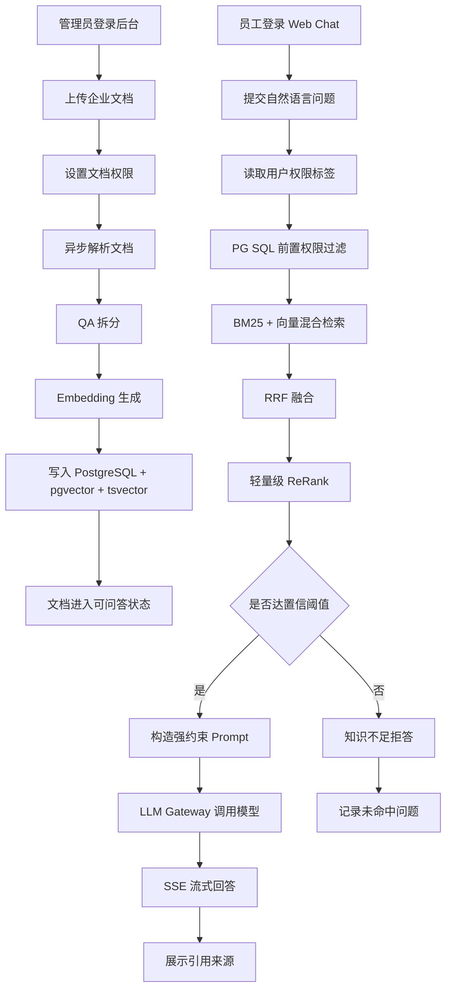
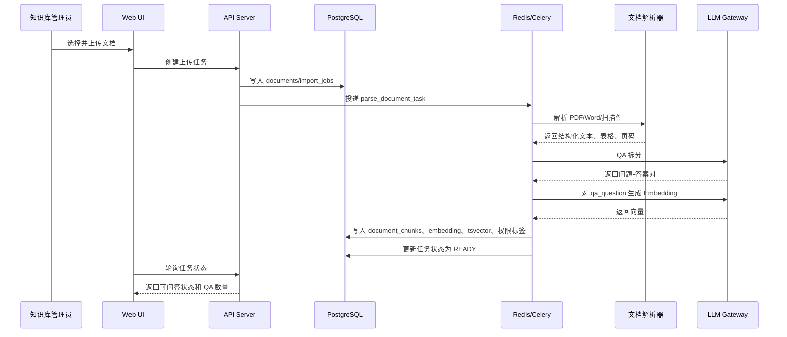
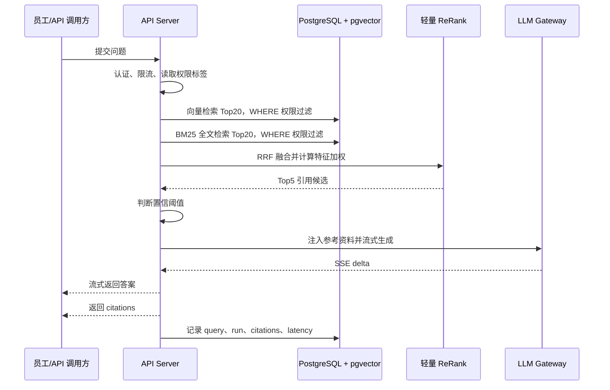

# V1.1 产品 PRD：企业级 AI 知识库系统（MVP）

版本：V1.1  
日期：2026-07-05  
来源：`docs/design/v1.1/v1.1-product-requirement.md`  
状态：产品需求文档  
目标周期：约 2 个月交付 MVP，支持 3-5 个种子客户验证

## 0. 文档说明

### 0.1 产品定位

企业级 AI 知识库系统是面向企业内部知识管理与智能问答的 MVP 产品。它不是通用聊天机器人，也不是完整客服工单平台，而是围绕“复杂文档入库、权限隔离检索、可溯源回答、模型灵活接入”建立一个可交付、可验证、可私有化部署的核心闭环。

V1.1 的产品定位：

- 面向企业内部员工和知识库管理员。
- 以 Web UI 和 API 问答为主要入口。
- 支持复杂文档解析、QA 拆分、混合检索、轻量 ReRank、带引用回答。
- 支持 PostgreSQL + pgvector 统一存储，降低 MVP 部署复杂度。
- 支持多模型供应商配置，包括 OpenAI 兼容 API、Claude、Ollama、本地模型和国产主流模型。
- 优先服务种子客户验证商业价值，而不是一次性覆盖所有企业知识管理场景。

一句话目标：

```text
让企业把内部文档安全地导入知识库，并让员工用自然语言获得有权限控制、可追溯引用、不会胡编的答案。
```

### 0.2 范围原则

V1.1 采用 MVP 优先原则：

- 优先做完整闭环，不做大而全平台。
- 优先确保回答可信，不追求花哨对话能力。
- 优先使用 PostgreSQL 完成结构化数据、全文检索和向量检索，不引入独立向量数据库。
- 优先实现文档级 RBAC，不做段落级 ABAC 或复杂组织策略。
- 优先实现纯代码轻量 ReRank，不依赖外部重排模型。
- 优先支持 Web UI 和 OpenAI 兼容 API，不做多渠道 IM 深度接入。
- 优先支持可解释的检索结果和引用，不把大模型输出当作唯一结果。

### 0.3 V1.1 明确范围

V1.1 必做：

- 管理员上传 PDF、Word、扫描件等文档。
- 系统异步解析文档，保留段落层级、基础表格和页码信息。
- 系统通过大模型执行 QA 拆分，将长文本加工成问题-答案二元组。
- 系统对 `qa_question` 生成 Embedding，并保存 `qa_answer`、原文、页码和权限标签。
- 系统使用 PostgreSQL + pgvector + 全文检索完成混合召回。
- 系统使用 RRF 和纯代码特征加权进行轻量 ReRank。
- 员工在 Web Chat 中提问，获得流式答案和引用来源。
- 员工点击引用后可查看原文片段、页码、文档标题。
- 系统按用户权限过滤无权访问的文档。
- 管理员在后台配置模型供应商、默认对话模型、默认向量模型和限流。
- 提供 OpenAI 兼容 API，便于企业内部系统调用问答能力。

V1.1 不做：

- 不做 GraphRAG、多跳图谱推理。
- 不做复杂可视化工作流编排。
- 不做段落级 ABAC 权限控制。
- 不做企业微信、飞书、钉钉等 IM 深度接入。
- 不做完整客服工单系统。
- 不做 SaaS 商业后台、多租户计费、套餐购买和发票功能。
- 不做富文档在线协同编辑。
- 不做独立向量数据库、Elasticsearch/OpenSearch 必选部署。
- 不做完整 Widget SDK；可在技术上预留，但不作为 V1.1 验收范围。

### 0.4 补充约束与漏洞修补

源需求已明确核心技术路线，但还需要补齐以下产品约束：

- 文档解析失败必须有明确失败原因、重试入口和原文件保留策略。
- QA 拆分可能产生错误或遗漏，系统必须保留原文引用并支持重新处理。
- 模型回答必须遵守“知识库无答案就拒答”的规则。
- 检索与回答必须在 SQL 层完成权限前置过滤，避免无权 Chunk 进入候选集。
- 所有引用必须可追溯到文档、页码、QA 对或原文 Chunk。
- API Key、模型 API Key 和本地模型地址必须支持隐藏和轮换。
- 模型不可用、Embedding 失败、队列积压、数据库慢查询必须可观测。
- Web UI 必须覆盖空状态、加载状态、错误状态、权限不足状态。
- MVP 必须提供基础审计日志，至少记录上传、删除、权限变更、模型配置变更和 API Key 操作。

## 1. 项目背景

### 1.1 核心痛点

#### 痛点一：复杂文档难以被 AI 稳定使用

企业知识通常散落在 PDF、Word、扫描件、合同、手册、SOP 和内部制度中。这些文件经常包含双栏排版、表格、页眉页脚、扫描图片、章节层级和跨页内容。传统文本抽取容易丢失结构，导致后续切块、检索和引用不准确。

#### 痛点二：传统搜索无法理解自然语言问题

企业内部搜索依赖关键词匹配。用户问“发票在哪里下载”，文档里可能写的是“电子票据获取路径”，传统搜索难以召回。单纯向量检索又可能漏掉精确术语、产品名、合同编号等关键词。

#### 痛点三：大模型容易幻觉，企业无法直接信任

企业场景中，价格、合同、退款、合规、财务和售后承诺都不能由模型自由发挥。没有引用来源的回答，即使文字流畅，也无法被业务团队和管理层信任。

#### 痛点四：知识需要权限隔离

不同部门、角色、层级能访问的文档不同。若检索系统先召回所有知识再过滤，会存在数据泄露风险。权限必须在数据库查询阶段前置过滤。

#### 痛点五：企业模型环境不统一

不同客户可能使用公网 OpenAI、Claude、国产模型、私有化 Ollama、本地 Qwen/Llama 或内部模型网关。系统不能把业务能力绑定到单一供应商。

#### 痛点六：重排模型增加成本和不可控性

外部 ReRank 模型会增加调用成本、延迟、供应商依赖和数据出域风险。MVP 阶段更适合采用纯代码、可解释、零额外算力消耗的轻量重排。

### 1.2 业务目标

V1.1 的业务目标：

- 目标 1：验证复杂文档可高质量入库  
  企业管理员可以上传复杂文档，系统能解析、QA 拆分、向量化并建立全文索引。

- 目标 2：验证企业知识问答可信可用  
  员工可以自然语言提问，系统输出带引用、可追溯、不胡编的回答。

- 目标 3：验证权限隔离足够安全  
  不同部门或角色用户只能检索和查看自己有权限访问的文档与引用。

- 目标 4：验证混合检索 + 轻量 ReRank 的效果  
  在不引入外部 ReRank 模型的情况下，达到足够高的召回和回答准确率。

- 目标 5：验证多模型接入能力  
  种子客户能按自身环境配置 OpenAI 兼容模型、Claude 或 Ollama、本地模型。

- 目标 6：验证商业交付可行性  
  使用 Docker Compose 私有部署，在 3-5 个种子客户环境中完成部署和试用。

### 1.3 成功指标

| 指标 | V1.1 目标 | 说明 |
| --- | --- | --- |
| 种子客户验证数 | 3-5 家 | 完成部署、导入和试用反馈 |
| 文档入库成功率 | >= 90% | 上传任务最终成功或给出明确失败原因 |
| QA 拆分成功率 | >= 85% | 成功生成可用 QA 对并保留引用 |
| 有答案问题引用覆盖率 | >= 95% | 除知识不足回答外，答案必须展示引用 |
| 知识不足拒答准确率 | >= 90% | 资料中无答案时不编造 |
| 混合检索 + ReRank 延迟 | P95 < 300ms | 不含大模型生成时间 |
| 首字响应时间 | P95 < 1.5s | SSE 流式输出首字 |
| MVP 并发能力 | 50 并发问答 | 受模型供应商限流影响时需明确提示 |
| 权限隔离缺陷 | 0 个高危 | 无权文档不得出现在召回、回答和引用中 |
| 管理员完成文档上传到可问答 | <= 5 个主要步骤 | 上传、解析、QA、索引、可查询 |
| API 调用可用性 | >= 99% 测试环境内 | 内部试点期间不含外部模型故障 |

## 2. 用户与场景

### 2.1 目标用户画像

#### 2.1.1 知识库管理员

职责：

- 上传和管理企业文档。
- 配置文档所属部门和访问角色。
- 查看解析状态、QA 拆分结果、失败原因。
- 重新处理失败文档或删除无效文档。

关注点：

- 文档能否被准确解析。
- 表格、章节、页码是否保留。
- 生成的 QA 是否可用于问答。
- 权限标签是否正确。

成功体验：

```text
上传一批复杂文档后，可以清楚看到每份文档的解析状态、QA 数量、索引状态和可访问范围。
```

#### 2.1.2 普通企业员工

职责：

- 使用 Web Chat 查询内部制度、产品说明、售后流程、技术手册。
- 查看答案引用并确认来源。
- 在答案不足时知道应该联系管理员补充知识。

关注点：

- 是否能用自然语言提问。
- 回答是否准确、是否有出处。
- 无权限或无答案时提示是否清楚。

成功体验：

```text
像问同事一样提问，系统能快速给出答案，并能看到答案来自哪份文档的哪一页。
```

#### 2.1.3 系统管理员

职责：

- 配置模型供应商。
- 配置默认对话模型、默认向量模型、Token 限流。
- 管理 API Key。
- 查看系统日志和任务失败原因。

关注点：

- 模型配置是否灵活。
- API Key 是否安全。
- 任务和模型调用是否可观测。
- 私有部署是否可控。

成功体验：

```text
可以在不改代码的情况下切换模型供应商，并能定位模型调用失败、队列失败或权限问题。
```

#### 2.1.4 种子客户业务负责人

职责：

- 判断 MVP 是否解决企业内部知识查询痛点。
- 评估准确率、响应速度、部署成本和权限安全。
- 决定是否进入付费采购或扩大试点。

关注点：

- 员工是否愿意用。
- 答案是否可信。
- 部署和维护是否简单。
- 是否能保护内部资料。

成功体验：

```text
试点用户能明显减少查资料和问同事的时间，且系统没有出现严重胡编或越权引用。
```

#### 2.1.5 API 调用方 / 内部开发者

职责：

- 通过 OpenAI 兼容 API 将知识库问答能力接入内部系统。
- 使用 API Key 调用问答接口。
- 处理流式输出和引用结果。

关注点：

- 接口是否稳定。
- 是否兼容常见 OpenAI Chat Completions 调用方式。
- 错误码和限流是否清晰。

成功体验：

```text
可以用最少改造把内部系统的问答请求转发到企业知识库，并获得回答和引用。
```

### 2.2 核心使用路径

#### 路径一：管理员完成知识入库

```text
登录后台
-> 进入知识库中心
-> 上传文档
-> 设置部门/角色权限
-> 系统解析文档
-> 系统生成 QA 对
-> 系统生成 Embedding 和全文索引
-> 管理员查看结果
-> 文档进入可问答状态
```

#### 路径二：员工使用 Web Chat 提问

```text
登录 Web Chat
-> 输入自然语言问题
-> 系统按用户权限过滤知识
-> 系统执行 BM25 + 向量混合检索
-> 系统轻量 ReRank
-> 系统流式生成答案
-> 员工查看引用
-> 点击引用查看原文片段
```

#### 路径三：系统管理员配置模型

```text
登录后台
-> 进入模型配置
-> 新增模型供应商
-> 配置 Base URL、API Key、模型名、能力类型
-> 测试连接
-> 设置默认对话模型和默认向量模型
-> 保存并记录审计日志
```

#### 路径四：内部系统通过 API 调用问答

```text
系统管理员创建 API Key
-> 内部开发者配置 API Key
-> 内部系统调用 OpenAI 兼容问答接口
-> 系统进行权限范围校验
-> 返回流式或非流式答案
-> 返回引用列表和 request_id
```

#### 路径五：管理员处理失败任务

```text
进入任务中心或文档详情
-> 查看失败阶段
-> 阅读失败原因
-> 选择重试、切换解析器或删除任务
-> 系统重新排队执行
-> 成功后进入可问答状态
```

### 2.3 用户故事

#### US-001：上传复杂文档

**描述：** 作为知识库管理员，我希望上传 PDF、Word、扫描件等复杂文档，以便将企业知识导入系统。

**验收标准：**

- [ ] 上传入口支持 PDF、DOCX、扫描 PDF 和常见图片格式。
- [ ] 上传前校验文件大小、类型和权限。
- [ ] 上传后展示任务状态和文件名称。
- [ ] 不支持的格式在上传前或上传后给出明确原因。
- [ ] UI 变更需在浏览器中验证桌面和移动宽度。

#### US-002：查看文档解析状态

**描述：** 作为知识库管理员，我希望查看文档解析、QA 拆分、Embedding 和索引状态，以便知道文档是否可用于问答。

**验收标准：**

- [ ] 文档列表展示上传中、解析中、QA 拆分中、向量化中、可问答、失败状态。
- [ ] 失败状态展示失败阶段、错误码、错误摘要和重试入口。
- [ ] 成功状态展示 QA 对数量、Chunk 数量和最后更新时间。
- [ ] UI 变更需在浏览器中验证桌面和移动宽度。

#### US-003：配置文档访问权限

**描述：** 作为知识库管理员，我希望为文档设置部门或角色权限，以便无权用户不能检索或查看文档。

**验收标准：**

- [ ] 上传或编辑文档时可设置部门和角色访问范围。
- [ ] 普通员工只能检索有权限的文档。
- [ ] 无权文档不出现在答案引用中。
- [ ] 权限变更记录进入审计日志。

#### US-004：查看 QA 拆分结果

**描述：** 作为知识库管理员，我希望查看系统生成的问题-答案对，以便判断文档是否被正确加工。

**验收标准：**

- [ ] 文档详情展示 QA 问题、QA 答案、来源页码和原文片段。
- [ ] QA 结果按章节或页码排序。
- [ ] QA 生成失败时可以重新生成。
- [ ] QA 与原文引用关系可追溯。
- [ ] UI 变更需在浏览器中验证桌面和移动宽度。

#### US-005：使用自然语言提问

**描述：** 作为普通企业员工，我希望在 Chat 界面输入自然语言问题，以便快速查询企业知识。

**验收标准：**

- [ ] Chat 页面提供输入框、发送按钮、会话消息区。
- [ ] 发送问题后展示流式生成状态。
- [ ] 生成过程中输入框防止重复提交或提示排队。
- [ ] 模型失败时展示可重试提示和 request_id。
- [ ] UI 变更需在浏览器中验证桌面和移动宽度。

#### US-006：查看带引用的答案

**描述：** 作为普通企业员工，我希望答案展示引用来源，以便确认回答是否可信。

**验收标准：**

- [ ] 有答案的问题至少展示 1 条引用。
- [ ] 引用展示文档标题、页码、片段编号或 QA 对编号。
- [ ] 点击引用后展示原文片段。
- [ ] 引用内容与回答句子存在可追溯关系。
- [ ] UI 变更需在浏览器中验证桌面和移动宽度。

#### US-007：知识不足时拒答

**描述：** 作为普通企业员工，我希望系统在知识库没有答案时明确说明无相关信息，以便避免误信模型编造。

**验收标准：**

- [ ] 检索结果低于阈值时返回“当前知识库中暂无相关信息”。
- [ ] 知识不足回答不展示虚假引用。
- [ ] 系统记录未命中问题和检索快照。
- [ ] 高风险问题在低置信度下必须拒答或建议联系管理员。

#### US-008：配置模型供应商

**描述：** 作为系统管理员，我希望配置 OpenAI 兼容模型、Claude 和 Ollama，以便适配不同客户环境。

**验收标准：**

- [ ] 模型配置页支持新增、编辑、停用模型供应商。
- [ ] 支持配置 Base URL、API Key、模型名、能力类型。
- [ ] 支持测试连接并展示成功或失败原因。
- [ ] API Key 保存后不再明文展示。
- [ ] UI 变更需在浏览器中验证桌面和移动宽度。

#### US-009：设置默认模型和限流

**描述：** 作为系统管理员，我希望设置默认对话模型、默认向量模型和 Token 限流，以便控制成本和稳定性。

**验收标准：**

- [ ] 可分别设置默认对话模型和默认向量模型。
- [ ] 可设置单用户、单 API Key 或全局调用限流。
- [ ] 超限时返回明确错误。
- [ ] 配置变更进入审计日志。

#### US-010：通过 API 调用问答

**描述：** 作为内部开发者，我希望通过 OpenAI 兼容 API 调用知识库问答，以便接入企业已有系统。

**验收标准：**

- [ ] 支持 API Key 认证。
- [ ] 支持流式和非流式响应。
- [ ] 响应包含 answer、citations、request_id。
- [ ] 错误响应包含 code、message、request_id。
- [ ] API 调用不返回无权限引用。

#### US-011：查看检索解释

**描述：** 作为知识库管理员，我希望查看某次回答的检索结果和重排分数，以便排查回答不准的原因。

**验收标准：**

- [ ] 回答详情展示向量召回、BM25 召回、RRF 融合和轻量 ReRank 的 Top 结果。
- [ ] 每个候选展示基础分、元数据加权、位置加权和最终分。
- [ ] 无权限候选不展示给普通员工。
- [ ] UI 变更需在浏览器中验证桌面和移动宽度。

#### US-012：查看审计与任务日志

**描述：** 作为系统管理员，我希望查看上传、权限、模型配置和 API Key 操作日志，以便满足排障和安全审计需求。

**验收标准：**

- [ ] 审计日志支持按时间、操作人、资源类型、动作筛选。
- [ ] 任务日志支持按文档、任务类型、状态筛选。
- [ ] 日志记录 request_id。
- [ ] 日志不展示 API Key 和模型密钥明文。

## 3. 业务与功能

### 3.1 总体业务流程图



### 3.2 知识导入流程图



### 3.3 AI 回答流程图



### 3.4 信息架构图

```mermaid
flowchart TD
    Root[企业级 AI 知识库系统 V1.1]
    Root --> Login[登录与权限]
    Root --> Knowledge[知识库中心]
    Root --> Chat[Chat 问答]
    Root --> Model[模型配置]
    Root --> API[API Key 与接口]
    Root --> Logs[日志与任务]
    Root --> Settings[系统设置]

    Knowledge --> K1[文档列表]
    Knowledge --> K2[上传文档]
    Knowledge --> K3[解析任务]
    Knowledge --> K4[QA 对查看]
    Knowledge --> K5[文档权限]
    Knowledge --> K6[重新处理/删除]

    Chat --> C1[问题输入]
    Chat --> C2[流式回答]
    Chat --> C3[引用列表]
    Chat --> C4[原文片段预览]
    Chat --> C5[知识不足提示]
    Chat --> C6[检索解释]

    Model --> M1[供应商管理]
    Model --> M2[模型实例]
    Model --> M3[默认模型]
    Model --> M4[Token 限流]
    Model --> M5[连接测试]

    API --> A1[API Key]
    API --> A2[OpenAI 兼容接口]
    API --> A3[调用日志]

    Logs --> L1[任务日志]
    Logs --> L2[审计日志]
    Logs --> L3[模型调用日志]
```



### 3.5 全局功能列表

| 一级模块 | 页面/能力 | 核心功能 | 优先级 |
| --- | --- | --- | --- |
| 登录与权限 | 登录页 | 用户登录、Token、权限初始化 | P0 |
| 知识库中心 | 文档列表 | 搜索、筛选、状态、权限、处理结果 | P0 |
| 知识库中心 | 上传文档 | 文件上传、格式校验、权限标签设置 | P0 |
| 知识库中心 | 解析任务 | 解析、QA 拆分、Embedding、索引状态 | P0 |
| 知识库中心 | 文档详情 | 原文片段、QA 对、页码、权限、失败原因 | P0 |
| 知识库中心 | 重新处理 | 解析重试、QA 重试、Embedding 重试 | P0 |
| Chat 问答 | Web Chat | 自然语言提问、SSE 流式回答 | P0 |
| Chat 问答 | 引用溯源 | 引用列表、原文预览、页码定位 | P0 |
| Chat 问答 | 知识不足 | 拒答、未命中记录、低置信提示 | P0 |
| Chat 问答 | 检索解释 | BM25、向量、RRF、ReRank 分数查看 | P1 |
| 模型配置 | 供应商管理 | OpenAI 兼容、Claude、Ollama、本地模型 | P0 |
| 模型配置 | 默认模型 | 对话模型、向量模型、QA 拆分模型 | P0 |
| 模型配置 | 限流 | Token、并发、API Key 限流 | P1 |
| API | API Key | 创建、禁用、轮换、权限范围 | P0 |
| API | OpenAI 兼容接口 | 流式/非流式问答、引用返回 | P0 |
| 日志与任务 | 任务日志 | 上传、解析、QA、Embedding 状态 | P0 |
| 日志与任务 | 审计日志 | 权限、文档、模型、API Key 操作记录 | P0 |
| 系统设置 | 基础设置 | 文件限制、默认阈值、部署信息 | P1 |

### 3.6 领域实体

| 领域 | 实体 | 说明 |
| --- | --- | --- |
| 用户权限 | User | 企业内部用户 |
| 用户权限 | Department | 部门权限标签 |
| 用户权限 | Role | 角色权限标签 |
| 用户权限 | Permission | 系统功能权限 |
| 知识管理 | Document | 文档元数据 |
| 知识管理 | DocumentChunk | 文档片段、QA 对、向量、全文索引 |
| 知识管理 | ImportJob | 上传和处理任务 |
| 知识管理 | ParseArtifact | 解析产物 |
| 检索问答 | QueryRun | 一次问答运行记录 |
| 检索问答 | RetrievalCandidate | 召回候选 |
| 检索问答 | Citation | 回答引用 |
| 检索问答 | MissedQuestion | 未命中问题 |
| 模型配置 | ModelProvider | 模型供应商 |
| 模型配置 | ModelInstance | 模型实例 |
| 模型配置 | PromptTemplate | Prompt 模板 |
| API | ApiKey | 内部系统访问密钥 |
| 日志 | AuditLog | 审计日志 |
| 日志 | TaskLog | 异步任务日志 |

## 4. 详细功能需求

### 4.1 全局页面与交互要求

#### 页面内容

- 左侧主导航：知识库中心、Chat 问答、模型配置、API Key、日志与任务、系统设置。
- 顶部区域：当前企业、当前用户、全局搜索、通知或任务状态入口。
- 内容区：页面标题、关键操作、筛选区、主内容、分页或详情操作。

#### UI 界面

- 企业后台风格，优先使用表格、筛选器、抽屉、弹窗、状态标签。
- 主色使用稳定蓝色，危险操作使用红色，处理中使用黄色或蓝色。
- 表格行需要清晰展示状态、处理进度、权限范围和更新时间。
- Chat 界面要把“答案内容”和“引用来源”并列呈现。

#### 交互规则

- 列表筛选条件保存在 URL query，刷新后保持。
- 长任务使用轮询或任务状态刷新，不阻塞页面。
- 危险操作二次确认，包括删除文档、禁用 API Key、停用模型。
- 表单保存失败时保留用户输入。
- 所有错误提示显示可复制的 `request_id`。

#### 边界条件与异常处理

- 无数据：展示空状态和下一步操作，如“上传第一份文档”。
- 无权限：显示无权限页或隐藏入口，但以后端校验为准。
- 网络错误：展示重试入口。
- Token 过期：尝试刷新 Token，失败后回到登录。
- 后端任务失败：展示失败阶段、错误码、错误摘要和重试入口。

### 4.2 登录与权限

#### 页面内容

- 登录表单：账号、密码。
- 登录后获取用户信息、部门、角色、权限码。
- 当前版本以本地账号为主。

#### UI 界面

- 简洁登录页，突出产品名称和私有部署环境。
- 后台导航按权限显示。

#### 交互规则

- 登录失败展示明确错误，不暴露用户是否存在。
- 权限变更后，新请求按新权限生效。
- API 级权限由后端校验。

#### 边界条件与异常处理

- 用户被禁用后，刷新 Token 或新请求应失败。
- 无权限访问文档时返回 403，不泄露文档是否存在。

### 4.3 知识库中心

知识库中心是 V1.1 的核心页面，包含文档列表、上传文档、文档详情、QA 结果、权限管理和任务处理。

#### 4.3.1 文档列表

页面内容：

| 字段 | 说明 |
| --- | --- |
| 文档标题 | 文件名或管理员编辑标题 |
| 类型 | PDF、DOCX、扫描件、图片 |
| 权限范围 | 部门、角色 |
| 处理状态 | 上传中、解析中、QA 拆分中、向量化中、可问答、失败 |
| QA 数量 | 成功生成的问题-答案对数量 |
| Chunk 数量 | 原文片段或存储片段数量 |
| 更新时间 | 最近状态更新时间 |
| 操作 | 查看、重试、编辑权限、删除 |

UI 界面：

- 顶部筛选：关键词、文档类型、状态、部门、角色、更新时间。
- 表格主视图。
- 状态使用标签显示。
- 失败文档行突出显示，但不影响其他文档。

交互规则：

- 点击文档标题进入详情。
- 点击失败状态可展开失败原因。
- 重试操作可选择重试解析、QA 拆分或 Embedding。
- 删除文档前提示“该文档将不再参与检索”。

边界条件与异常处理：

- 文档正在处理中时不允许删除，或删除后取消后续任务。
- 文档权限变更后，后续检索立即按新权限生效。
- 文档被 API 调用历史引用时，历史引用保留快照，新问题不再使用删除文档。

#### 4.3.2 上传文档

页面内容：

- 文件选择或拖拽上传。
- 支持格式说明。
- 文件大小限制。
- 部门和角色权限选择。
- 解析器选择：默认自动，支持 MinerU/DeepDoc 等实现。
- 处理策略：是否执行 OCR、是否执行 QA 拆分、是否使用 fallback。

UI 界面：

- 上传区展示支持格式和限制。
- 权限选择放在上传前的配置区域。
- 上传后进入任务进度视图。

交互规则：

- 上传前校验文件类型、大小、数量。
- 上传后立即创建导入任务。
- 文档处理异步执行，用户可离开页面。
- 返回列表后仍可看到处理进度。

边界条件与异常处理：

- 文件过大：上传前阻止，并提示最大值。
- 文件类型不支持：阻止上传或标记失败。
- 解析器不可用：任务失败，提示检查解析服务。
- OCR 不可用：如文档为扫描件，提示需要启用 OCR 或切换解析器。
- 重复文档：提示相似文件已存在，可选择继续上传为新文档或取消。

#### 4.3.3 文档详情与 QA 对查看

页面内容：

- 文档元数据：标题、类型、上传人、权限、状态、更新时间。
- 原文结构：章节、页码、表格 Markdown。
- QA 对列表：问题、答案、来源页码、原文片段、Embedding 状态。
- 处理日志：解析、QA、Embedding、索引。

UI 界面：

- 左侧目录。
- 中间原文预览。
- 右侧或底部 QA 对列表。
- 引用和 QA 对可互相定位。

交互规则：

- 点击 QA 对定位原文。
- 点击原文片段查看对应 QA。
- 管理员可重新生成 QA。
- 管理员可重新向量化。

边界条件与异常处理：

- 原文无法预览时提供下载。
- QA 为空时提示重新处理或检查文档解析结果。
- QA 生成结果过多时分页展示。
- QA 与原文定位失败时仍展示 QA 内容和文档页码。

#### 4.3.4 文档权限管理

页面内容：

- 部门权限。
- 角色权限。
- 权限继承或覆盖说明。
- 权限变更审计信息。

交互规则：

- 文档上传时必须选择权限范围，默认使用上传人部门。
- 修改权限需二次确认。
- 修改权限后后续检索立即生效。
- 已生成历史回答引用保留快照，但无权用户不能查看原文详情。

边界条件与异常处理：

- 管理员取消所有访问范围时，文档变为仅管理员可见。
- 删除部门或角色后，文档权限需提示失效项。

### 4.4 Chat 界面

#### 页面内容

- 会话区域。
- 问题输入框。
- 流式回答区域。
- 引用列表。
- 原文引用预览侧栏。
- 知识不足提示。
- 检索解释入口。

#### UI 界面

Chat 界面建议布局：

```text
左侧：历史会话 / 最近问题
中间：消息流 + 输入框
右侧：引用来源 / 原文片段 / 检索解释
```

移动端可折叠左侧会话和右侧引用。

#### 交互规则

- 用户输入问题后按 Enter 发送，Shift+Enter 换行。
- 问题发送后展示流式回答。
- 回答中的 `[1]`、`[2]` 引用标记可点击。
- 点击引用后右侧展示文档标题、页码、原文片段。
- 用户可以复制回答。
- 用户可以查看检索解释，了解为什么召回该内容。

#### 边界条件与异常处理

- 模型超时：停止生成并提示重试。
- 模型返回空内容：提示生成失败，保留问题。
- 检索无结果：返回知识不足回答。
- 引用解析失败：展示答案，同时提示引用生成异常并记录日志。
- 用户无权限：不召回无权内容，不展示无权引用。
- 多次快速提交：限制并发或排队。

#### 回答规则

系统 Prompt 必须包含以下约束：

```text
你是一个严谨的企业知识库助手。
【规则1】必须且仅能根据提供的【参考资料】回答问题。
【规则2】如果【参考资料】中找不到答案，必须回答：“当前知识库中暂无相关信息”，严禁编造。
【规则3】回答时请在对应句末标注引用编号，如[1]、[2]。
```

#### 引用规则

- 有答案回答至少 1 条引用。
- 引用必须来自当前用户有权限访问的文档。
- 引用需要包含文档 ID、片段 ID、页码、引用文本、排序和分数。
- 历史引用保留快照，避免文档修改后历史回答不可解释。

### 4.5 混合检索与轻量级 ReRank

#### 功能说明

系统必须使用 PostgreSQL 同时完成：

- pgvector 向量检索。
- PostgreSQL 全文检索。
- 权限前置过滤。
- 应用层 RRF 融合。
- 应用层轻量级 ReRank。

#### 检索规则

- 向量检索召回 Top 20。
- BM25/全文检索召回 Top 20。
- RRF 融合后取 Top 15。
- 轻量 ReRank 后取 Top 5 注入 Prompt。

#### 轻量级 ReRank 特征

| 特征 | 说明 |
| --- | --- |
| RRF 基础分 | 保留混合召回排序信号 |
| 精准命中分 | Query 专有名词在 QA 或 Chunk 中出现次数 |
| 标题相似度 | 文档标题与 Query 的相似度 |
| 位置加权 | 命中内容在片段开头部分适度加分 |
| 权限安全 | 无权限候选直接排除，不参与得分 |

#### 边界条件

- BM25 无结果时仍可使用向量检索。
- 向量检索无结果时仍可使用 BM25。
- 两路都无结果或得分低于阈值时拒答。
- ReRank 不得调用外部模型。

### 4.6 模型配置

#### 页面内容

- 供应商列表。
- 模型实例列表。
- 默认模型设置。
- API Key 配置。
- Base URL 配置。
- 连接测试。
- 限流配置。

#### 支持供应商

| 类型 | 范围 |
| --- | --- |
| OpenAI 兼容 | OpenAI、DeepSeek、Qwen、GLM 等 |
| Claude | Anthropic API |
| Ollama | 本地 Qwen/Llama 等模型 |
| 内部模型网关 | 企业自建兼容接口 |

#### 交互规则

- 模型供应商可启用、停用。
- 不同场景可配置不同模型：QA 拆分、对话回答、Embedding。
- 连接测试显示耗时和错误原因。
- API Key 保存后只展示掩码。
- 停用默认模型前必须先选择替代模型。

#### 边界条件与异常处理

- 模型连接失败时不能设为默认。
- Embedding 模型维度变化时必须提示需要重新向量化。
- Ollama 本地地址不可达时展示部署检查建议。
- Token 超限时展示限流提示。

### 4.7 API Key 与 OpenAI 兼容接口

#### 页面内容

- API Key 列表。
- 创建 API Key。
- 禁用/轮换 API Key。
- 调用日志。
- 示例代码。

#### API 能力

- 支持 Chat Completions 类似调用。
- 支持 `stream=true`。
- 支持返回 `citations`。
- 支持返回 `request_id`。

#### 交互规则

- API Key 创建后只展示一次明文。
- 可为 API Key 设置权限范围和限流。
- 禁用 API Key 后立即失效。

#### 边界条件与异常处理

- API Key 错误返回 401。
- 无权限资源返回 403。
- 限流返回 429。
- 模型不可用返回 503。

### 4.8 日志与任务

#### 页面内容

- 上传任务日志。
- 解析任务日志。
- QA 拆分任务日志。
- Embedding 任务日志。
- 模型调用日志。
- 审计日志。

#### 交互规则

- 支持按时间、状态、任务类型、文档、用户筛选。
- 失败日志可复制错误码和 request_id。
- 任务可重试时展示重试按钮。

#### 边界条件与异常处理

- 日志量大时分页加载。
- 敏感字段脱敏。
- 删除文档后保留审计日志。

### 4.9 功能需求编号

- FR-1：系统必须支持管理员上传 PDF、DOCX、扫描 PDF 和图片文档。
- FR-2：系统必须在上传前校验文件类型和大小。
- FR-3：系统必须为每份文档保存部门和角色权限标签。
- FR-4：系统必须异步解析文档并保存解析状态。
- FR-5：系统必须保留文档页码、章节和基础表格结构。
- FR-6：系统必须通过大模型将文档内容拆分为 QA 对。
- FR-7：系统必须对 `qa_question` 生成 Embedding。
- FR-8：系统必须保存 `qa_answer`、原文片段、页码和权限标签。
- FR-9：系统必须使用 PostgreSQL + pgvector 执行向量检索。
- FR-10：系统必须使用 PostgreSQL 全文检索执行关键词召回。
- FR-11：系统必须在检索 SQL 中前置权限过滤。
- FR-12：系统必须使用 RRF 融合向量和全文召回结果。
- FR-13：系统必须使用纯代码轻量 ReRank 进行二次排序。
- FR-14：系统必须在低置信度时返回知识不足回答。
- FR-15：系统必须通过 SSE 流式输出大模型回答。
- FR-16：系统必须为有答案回答返回引用来源。
- FR-17：系统必须支持点击引用查看原文片段。
- FR-18：系统必须支持 OpenAI 兼容 API 调用。
- FR-19：系统必须支持 API Key 创建、禁用和轮换。
- FR-20：系统必须支持 OpenAI 兼容模型、Claude 和 Ollama 配置。
- FR-21：系统必须支持默认对话模型和默认向量模型配置。
- FR-22：系统必须记录文档、权限、模型、API Key 的审计日志。
- FR-23：系统必须展示解析、QA、Embedding 的失败原因和重试入口。

## 5. 非功能需求

### 5.1 性能需求

| 项 | 目标 |
| --- | --- |
| 混合检索 + ReRank | P95 < 300ms |
| 首字响应 | P95 < 1.5s |
| 普通问题完整回答 | P95 < 15s |
| MVP 并发 | 50 并发问答 |
| 文档列表查询 | P95 < 1s |
| 任务状态刷新 | 2s 内展示最新状态 |

说明：

- 检索性能不包含大模型生成时间。
- 若模型供应商限流导致首字超时，系统需明确展示依赖异常。

### 5.2 可靠性需求

- 文档上传、解析、QA 拆分、Embedding 必须异步执行。
- 异步任务必须支持失败记录和手动重试。
- 任务重试不得产生重复 QA 对或重复 Chunk。
- 模型调用失败不能导致文档元数据丢失。
- 系统应保留原文件，便于重新解析。

### 5.3 安全需求

- 文档检索必须在 SQL 层完成权限前置过滤。
- 无权文档不得进入候选集、Prompt、答案或引用。
- API Key 和模型密钥必须加密或安全存储。
- 密钥保存后不明文回显。
- 日志不得记录密钥、Authorization header、完整 Token。
- 文档下载和引用查看必须校验权限。
- Prompt 必须防止用户指令覆盖系统规则。

### 5.4 权限与审计

- 支持文档级 RBAC。
- 支持部门和角色权限标签。
- 上传、删除、权限变更、模型配置、API Key 操作必须记录审计日志。
- 审计日志需包含操作人、时间、动作、资源、request_id。

### 5.5 可用性需求

- Web UI 需要支持主流桌面浏览器。
- Chat 页面需要兼容移动宽度查看和提问。
- 列表、表单、Chat、引用侧栏需要处理加载、空状态、错误、无权限。
- 错误提示需面向业务用户可理解。

### 5.6 可部署性需求

- MVP 默认支持 Docker Compose 私有部署。
- 依赖包括 PostgreSQL 16+、pgvector、Redis、后端服务、Worker、前端静态资源。
- 对象存储可使用本地路径或 MinIO。
- 模型可使用公网 API、内网模型网关或本地 Ollama。

### 5.7 可观测性需求

- 每个请求生成 `request_id`。
- 每次问答生成 `run_id`。
- 记录检索耗时、模型耗时、Token 用量、召回数量、引用数量。
- 记录任务队列长度、任务失败率和模型调用错误率。
- 管理员可在日志页按 request_id 排查问题。

### 5.8 数据保留与隐私

- 原始文档保留策略可配置。
- 删除文档后不再参与新检索。
- 历史回答引用保留快照。
- API 调用日志可配置保留周期。
- 敏感文档内容不应写入普通应用日志。

### 5.9 可扩展性需求

- 检索接口应抽象，未来可迁移到 Milvus/Qdrant。
- 模型供应商通过 Adapter 扩展。
- 文档解析器通过 Parser Adapter 扩展。
- 权限模型预留 tenant_id，但 V1.1 不交付 SaaS 多租户后台。

## 6. 发布里程碑建议

### M0：基础工程与部署骨架（第 1 周）

目标：

- 建立可运行的后端、前端、数据库、队列和部署环境。

范围：

- FastAPI 工程。
- React + TypeScript 前端工程。
- PostgreSQL + pgvector 初始化。
- Redis/Celery 任务队列。
- Docker Compose。
- 登录和基础 RBAC。

验收：

- 本地一键启动。
- 能登录后台。
- 数据库迁移可执行。
- Worker 可消费测试任务。

### M1：知识入库闭环（第 2-3 周）

目标：

- 文档可上传、解析、QA 拆分、向量化。

范围：

- 文档上传。
- 文档列表。
- 异步解析任务。
- QA 拆分任务。
- Embedding 任务。
- 文档详情和 QA 查看。
- 任务失败重试。

验收：

- 上传 PDF/DOCX 后能看到处理状态。
- 成功文档生成 QA 对和向量。
- 失败任务能看到原因并重试。

### M2：检索与问答闭环（第 4-5 周）

目标：

- 员工能提问并获得带引用回答。

范围：

- Web Chat。
- BM25 + pgvector 混合检索。
- RRF 融合。
- 轻量 ReRank。
- 强约束 Prompt。
- SSE 流式输出。
- 引用侧栏。
- 知识不足拒答。

验收：

- 用户提问后 1.5s 内开始流式输出。
- 答案包含引用。
- 无答案问题拒答。
- 无权文档不会出现在引用中。

### M3：模型配置与 API（第 6 周）

目标：

- 支持多模型配置和 API 调用。

范围：

- 模型供应商配置。
- 连接测试。
- 默认模型设置。
- API Key。
- OpenAI 兼容 API。
- 调用日志。

验收：

- 可配置至少 1 个 OpenAI 兼容模型和 1 个 Ollama/Claude 模型。
- API Key 可创建、禁用、轮换。
- API 可返回答案和引用。

### M4：权限、安全、观测与种子客户准备（第 7-8 周）

目标：

- 达到种子客户试点交付标准。

范围：

- 文档级 RBAC 完善。
- 审计日志。
- 任务日志。
- 模型调用日志。
- 基础性能优化。
- 部署文档。
- 种子客户测试集。

验收：

- 权限测试通过。
- 审计日志完整。
- 性能指标达到 MVP 目标。
- 种子客户部署包可交付。

## 7. 验收清单

### 7.1 产品范围验收

- [ ] V1.1 只交付 Web UI 和 OpenAI 兼容 API。
- [ ] 多渠道 IM、GraphRAG、复杂工作流、段落级 ABAC 不进入本期。
- [ ] 系统完成文档入库到问答引用的完整闭环。
- [ ] 3-5 个种子客户可部署试用。

### 7.2 知识库中心验收

- [ ] 支持上传 PDF、DOCX、扫描 PDF 或图片。
- [ ] 上传前校验文件格式和大小。
- [ ] 文档可设置部门和角色权限。
- [ ] 文档处理状态完整展示。
- [ ] 解析失败有失败原因和重试入口。
- [ ] QA 对可查看原文、页码和来源。
- [ ] Embedding 失败可单独重试。
- [ ] 删除文档后不再参与新检索。

### 7.3 Chat 问答验收

- [ ] 用户可在 Web Chat 输入问题。
- [ ] 系统通过 SSE 流式输出。
- [ ] 有答案回答展示至少 1 条引用。
- [ ] 点击引用可查看原文片段。
- [ ] 知识不足时明确拒答。
- [ ] 模型失败时显示重试入口和 request_id。
- [ ] 连续提交时有并发限制或排队处理。

### 7.4 检索与权限验收

- [ ] 向量检索使用 pgvector。
- [ ] 全文检索使用 PostgreSQL tsvector/tsquery 或等价 PG 内方案。
- [ ] 使用 RRF 融合两路召回。
- [ ] 使用纯代码轻量 ReRank。
- [ ] 权限过滤在 SQL 查询阶段完成。
- [ ] 无权文档不进入召回候选、Prompt、答案或引用。
- [ ] 低置信度结果触发知识不足回答。

### 7.5 模型配置验收

- [ ] 支持 OpenAI 兼容供应商配置。
- [ ] 支持 Claude 或 Ollama 至少一种非 OpenAI 兼容适配。
- [ ] 支持配置默认对话模型。
- [ ] 支持配置默认向量模型。
- [ ] 支持连接测试。
- [ ] 模型密钥保存后不明文显示。
- [ ] Embedding 维度变化时提示重新向量化风险。

### 7.6 API 验收

- [ ] 支持 API Key 创建。
- [ ] 支持 API Key 禁用。
- [ ] 支持 OpenAI 兼容 Chat 调用。
- [ ] 支持流式响应。
- [ ] 响应返回引用列表。
- [ ] 错误响应包含 code、message、request_id。
- [ ] API 调用遵守权限过滤。

### 7.7 非功能验收

- [ ] 混合检索 + ReRank P95 < 300ms。
- [ ] 首字响应 P95 < 1.5s。
- [ ] MVP 支持 50 并发问答。
- [ ] 上传、解析、QA、Embedding 任务异步执行。
- [ ] 审计日志覆盖上传、删除、权限、模型、API Key 操作。
- [ ] 日志不记录密钥明文。
- [ ] Docker Compose 可启动核心依赖。
- [ ] request_id 和 run_id 可用于排障。

### 7.8 UI 验收

- [ ] 文档列表、上传页、文档详情、Chat 页面都有加载、空状态、错误和无权限状态。
- [ ] 知识库中心可在桌面浏览器完成核心操作。
- [ ] Chat 页面在移动宽度可正常提问和查看引用。
- [ ] 危险操作有二次确认。
- [ ] 表单错误展示在对应字段附近。
- [ ] UI 变更需使用浏览器验证桌面和移动宽度。

### 7.9 种子客户试点验收

- [ ] 每个种子客户至少导入 20 份企业文档或等价样本。
- [ ] 每个种子客户维护不少于 50 条标准测试问题。
- [ ] 测试问题覆盖有答案、无答案、权限隔离和高风险问题。
- [ ] 试点结束输出准确率、拒答率、引用覆盖率、性能和用户反馈报告。
