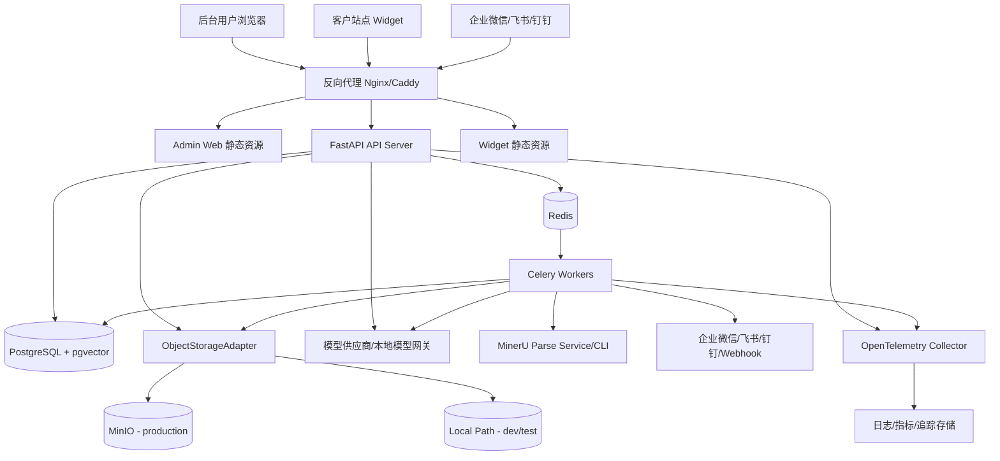
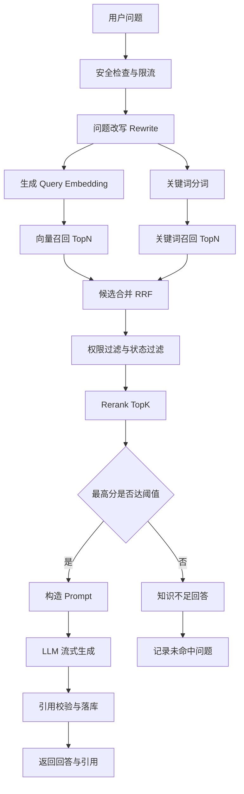

# V1 技术架构、程序架构与目录架构设计

版本：V1.0  
日期：2026-07-04  
来源：`docs/design/v1-technical-design.md`、`docs/design/v1-product-prd.md`  
系统：AI Customer Service Hub

## 1. 设计结论

V1 采用“模块化单体 + 异步任务 + 统一 PostgreSQL 数据层”的架构。后台管理端、客户侧 Widget、API Server、Celery Worker、PostgreSQL、Redis、MinIO、MinerU 和模型供应商通过清晰接口协作。

核心设计判断：

- V1 优先支持企业私有部署，部署、备份、排障和升级复杂度必须可控。
- 业务边界集中在知识、问答、工单、运营和配置，首版不拆微服务。
- RAG 的数据一致性、租户隔离、索引同步和引用追溯优先级高于横向拆分。
- 业务数据、向量、审计、事件优先统一存放在 PostgreSQL + pgvector。
- 文档解析、Embedding、索引更新、通知和统计全部异步化。
- 模型、文档解析、对象存储、企业 IM、Webhook 都通过 Adapter 接入，业务层不直接绑定供应商 SDK。

## 2. 技术架构设计

### 2.1 技术选型

| 层级 | 技术 | 说明 |
| --- | --- | --- |
| 后端语言 | Python 3.12+ | 适配 AI、文档解析、Embedding 生态 |
| Web API | FastAPI | 类型友好，OpenAPI 自动生成，支持异步 I/O 和 SSE |
| 数据校验 | Pydantic v2 | 请求、响应和外部输入统一校验 |
| ORM 与迁移 | SQLAlchemy 2 + Alembic | 关系模型、事务和迁移管理 |
| 主数据库 | PostgreSQL 16+ | 业务数据、JSONB、全文检索、审计和事件 |
| 向量检索 | pgvector | 与业务权限过滤、引用追溯保持同库一致 |
| 缓存与队列 | Redis | 缓存、限流、会话短状态、Celery Broker |
| 异步任务 | Celery | 解析、Embedding、AI、统计、通知任务 |
| 对象存储 | ObjectStorageAdapter | 生产 MinIO，开发和测试可用本地路径 |
| 文档解析 | MinerU + ParserAdapter | 复杂文档主解析，TXT/Markdown/FAQ/简单 HTML 走轻量 fallback |
| 前端 | React + TypeScript + Vite | 管理后台和 Widget 均不依赖 SSR |
| UI 组件 | Ant Design + ProComponents | 适合企业后台表格、表单和权限页面 |
| 前端数据 | TanStack Query | 请求缓存、分页、重试和状态同步 |
| 图表 | ECharts | Dashboard 和知识运营分析 |
| Widget | Vite bundle + Web Component | 客户站点嵌入，隔离样式 |
| 日志追踪 | structlog + OpenTelemetry | request_id、run_id 贯穿 API、Worker 和 AI 链路 |
| 部署 | Docker Compose，后续 Helm | 私有部署首版简单，后续可演进到 Kubernetes |
| 反向代理 | Nginx 或 Caddy | TLS、静态资源、SSE 代理、上传限制 |

### 2.2 部署拓扑



### 2.3 运行组件职责

| 组件 | 职责 | 扩展方式 |
| --- | --- | --- |
| Admin Web | 企业后台管理界面 | 静态资源横向扩展 |
| Customer Widget | 客户侧嵌入问答入口 | 独立 bundle，通过 Widget Token 访问 API |
| API Server | REST API、SSE、Webhook Receiver、鉴权、权限、OpenAPI | 无状态水平扩展 |
| Celery Worker | 文件解析、Embedding、AI、统计、通知、Webhook 派发 | 按队列拆分并发 |
| PostgreSQL + pgvector | 业务真相、向量、审计、事件、聚合数据 | 索引、分区、读副本，必要时拆向量库 |
| Redis | Broker、缓存、限流、短期状态 | Sentinel 或托管 Redis |
| MinIO | 原始文件、解析产物、导出、备份包 | S3 兼容对象存储 |
| MinerU | PDF、Office、图片、复杂网页解析 | 独立服务化，CPU/GPU 两类部署档 |
| Model Providers | Chat、Embedding、Rerank | Provider Adapter 屏蔽供应商差异 |
| Channel Providers | 企业微信、飞书、钉钉通知和回调 | ChannelProvider Adapter 扩展 |

### 2.4 数据一致性策略

- PostgreSQL 是长期业务真相；Redis 不保存长期业务数据。
- 上传文件先进入对象存储，业务表只保存稳定 `object_key`。
- 解析产物、Chunk、Embedding 与知识版本通过 `knowledge_versions` 绑定。
- 已发布知识进入检索，待审核和归档知识不进入客户侧新回答召回。
- 历史回答引用使用引用快照，知识归档后历史引用仍可查看，新回答不再使用。
- Worker 任务必须幂等，重试不能产生重复知识、重复 Chunk 或重复通知。

## 3. 程序架构设计

### 3.1 逻辑分层

```text
表现层
  Admin Web
  Customer Widget

API 边界层
  REST API
  SSE Streaming
  Webhook Receiver
  OpenAPI Schema

应用服务层
  KnowledgeService
  ImportService
  ReviewService
  ChatService
  RetrievalService
  TicketService
  AnalyticsService
  ConfigService
  UserAccessService
  IntegrationService

领域层
  Knowledge
  Document
  Chunk
  Conversation
  Message
  Ticket
  Role
  Permission
  PromptTemplate
  RetrieverConfig

基础设施层
  PostgreSQL/pgvector
  Redis
  ObjectStorageAdapter
  MinIO / Local Path Storage
  Celery
  MinerU Parse Service
  Parser Adapters
  Model Providers
  Channel Providers
  Webhook Dispatcher
```

### 3.2 后端依赖方向

后端按“API -> Service -> Repository -> Model/DB”的方向依赖：

- `api/v1` 只负责协议、鉴权依赖、请求响应 Schema、错误映射。
- `services` 承载业务编排、状态流转、权限上下文、任务投递。
- `repositories` 封装数据库查询，不调用外部服务，不做跨领域编排。
- `models` 只表达数据库结构与关系。
- `schemas` 定义 Pydantic 输入输出契约。
- `integrations` 封装模型、解析器、对象存储、渠道和 Webhook 适配器。
- `tasks` 是 Worker 入口，任务体调用 Service 或专用任务服务，不直接写散乱 SQL。
- `core` 提供配置、安全、错误、权限、日志、ID 等横切能力。

禁止依赖方向：

- Repository 不得调用 Service、API 或第三方 SDK。
- API 路由不得直接调用模型供应商、MinIO、MinerU 或渠道 SDK。
- 业务层不得保存本地绝对路径、MinIO bucket 细节或供应商原始响应作为主契约。
- Worker 不得绕过权限、租户和审计上下文直接修改发布状态。

### 3.3 后端领域模块

| 模块 | 职责 | 不负责 |
| --- | --- | --- |
| Auth/UserAccess | 登录、Token、用户、角色、权限、审计上下文 | 业务对象状态流转 |
| Knowledge | 知识、文档、版本、Chunk、FAQ、分类标签 | 模型调用和回答生成 |
| Import | 上传任务、ParserAdapter 调度、MinerU 解析、轻量 fallback、Embedding、索引任务 | 人工审核决策 |
| Review | 分级审核策略、审核任务、发布决策 | 文档解析 |
| Retrieval | Query Rewrite、混合检索、Rerank、引用候选 | 最终自然语言生成 |
| Chat | 会话、消息、AI 回答、反馈、转人工 | 工单处理流程 |
| Ticket | 工单创建、转派、优先级、通知、关闭 | AI 检索底层算法 |
| Analytics | Dashboard、命中率、未命中、热门知识、健康度 | 原始业务写操作 |
| AI Config | 模型供应商、Prompt、RAG 参数 | 用户权限 |
| Integrations | 企业微信、飞书、钉钉、Webhook 收发 | 业务规则判断 |

### 3.4 Adapter 架构

V1 的外部依赖必须通过 Adapter 接入，业务层只依赖稳定内部接口。

| Adapter | 接口能力 | 实现 |
| --- | --- | --- |
| `ChatProvider` | 流式回答、非流式回答 | OpenAI、Claude、DeepSeek、Qwen、Ollama、Gemini 等 |
| `EmbeddingProvider` | 批量文本向量化 | 在线模型或本地模型网关 |
| `RerankProvider` | 候选文档重排 | 供应商 Rerank 或轻量 cross-encoder |
| `ParserAdapter` | 文档解析为 `ParsedDocument` | MinerU、Markdown、TXT、FAQ、HTML Clean |
| `ObjectStorageAdapter` | 上传、下载、元数据、预签名 URL | MinIO、本地路径 |
| `ChannelProvider` | 通知、回调校验、回调处理 | 企业微信、飞书、钉钉 |
| `WebhookDispatcher` | 签名、投递、重试、记录 | HTTP Webhook |

第三方返回数据一律视为不可信输入，必须在 Adapter 内完成结构校验、错误归一化、超时和日志记录。

### 3.5 异步任务架构

队列按资源消耗和失败重试策略拆分：

| 队列 | 任务类型 | 说明 |
| --- | --- | --- |
| `parse` | 文档解析、OCR、网页解析 | CPU/GPU 或外部服务消耗高，需限流 |
| `embedding` | Chunk Embedding、重新向量化 | 批处理，需幂等 |
| `ai` | RAG 评估、FAQ 草稿生成、摘要标签生成 | 受模型供应商配额影响 |
| `analytics` | Dashboard 聚合、命中率、知识健康 | 定时任务，不阻塞主流程 |
| `notification` | 工单通知、审核通知、Webhook 派发 | 指数退避重试 |

任务通用规则：

- 每个任务写入 `task_runs`，记录 `task_type`、`resource_type`、`resource_id`、状态、错误和耗时。
- 任务重试必须基于资源 ID 和内容 hash 幂等。
- 解析失败、Embedding 失败和通知失败需要可观测且可人工重试。
- 批量导入时可先写数据，再批量创建或重建向量索引。

### 3.6 RAG 程序链路



可信规则：

- AI 回答至少绑定 1 条引用，闲聊和知识不足回答除外。
- Prompt 只能使用授权且已发布的知识上下文。
- 退款、价格、合同、法律承诺等高风险分类低置信度时建议转人工。
- 模型输出完成后写入 `messages`、`message_runs`、`citations` 和必要的 `missed_questions`。

## 4. 程序目录架构设计

### 4.1 后端目录

```text
server/
├── app/
│   ├── main.py
│   ├── api/
│   │   └── v1/
│   │       ├── auth.py
│   │       ├── dashboard.py
│   │       ├── knowledge.py
│   │       ├── imports.py
│   │       ├── faqs.py
│   │       ├── reviews.py
│   │       ├── conversations.py
│   │       ├── tickets.py
│   │       ├── analytics.py
│   │       ├── ai_config.py
│   │       ├── users.py
│   │       ├── settings.py
│   │       ├── integrations.py
│   │       └── webhooks.py
│   ├── core/
│   │   ├── config.py
│   │   ├── security.py
│   │   ├── errors.py
│   │   ├── permissions.py
│   │   ├── logging.py
│   │   └── ids.py
│   ├── db/
│   │   ├── session.py
│   │   ├── base.py
│   │   └── migrations/
│   ├── models/
│   ├── schemas/
│   ├── services/
│   ├── repositories/
│   ├── integrations/
│   │   ├── model_providers/
│   │   ├── channel_providers/
│   │   ├── storage/
│   │   │   ├── base.py
│   │   │   ├── local.py
│   │   │   ├── minio.py
│   │   │   └── registry.py
│   │   └── parsers/
│   │       ├── base.py
│   │       ├── mineru.py
│   │       ├── lightweight.py
│   │       └── registry.py
│   ├── tasks/
│   └── tests/
```

### 4.2 前端目录

```text
web/
├── admin/
│   ├── src/
│   │   ├── app/
│   │   ├── routes/
│   │   ├── features/
│   │   │   ├── dashboard/
│   │   │   ├── knowledge/
│   │   │   ├── chat/
│   │   │   ├── tickets/
│   │   │   ├── analytics/
│   │   │   ├── ai-config/
│   │   │   ├── access-control/
│   │   │   └── settings/
│   │   ├── components/
│   │   ├── api/
│   │   ├── auth/
│   │   └── styles/
│   └── tests/
└── widget/
    ├── src/
    │   ├── widget-entry.tsx
    │   ├── chat-widget.tsx
    │   ├── api.ts
    │   └── styles.css
    └── tests/
```

### 4.3 建议补充目录

```text
deploy/
├── docker-compose.yml
├── nginx/
├── minio/
├── postgres/
└── helm/

docs/
├── design/
│   ├── v1-technical-design.md
│   ├── v1-product-prd.md
│   └── v1/
└── operations/

scripts/
├── dev/
├── migrate/
└── diagnostics/
```

### 4.4 目录边界规则

- `web/admin` 和 `web/widget` 独立构建，Widget 不依赖后台路由和后台全局样式。
- `server/app/api/v1` 与 `server/app/schemas` 共同定义 API 公共契约。
- `server/app/services` 不出现 HTTP 请求对象、Response 对象或前端分页状态。
- `server/app/integrations` 是唯一允许直接调用第三方 SDK 的后端目录。
- `server/app/tasks` 只放任务入口和队列注册，复杂业务逻辑回到 Service。
- `docs/design/v1` 存放本轮拆分后的独立设计文档，作为后续实现基准。

## 5. 安全、性能与观测约束

### 5.1 安全

- 后台账号密码使用 Argon2id 哈希。
- Access Token 短有效期，Refresh Token 可撤销。
- API Key 和 Widget Token 使用独立权限模型。
- 文件上传校验扩展名、MIME、大小、哈希和配额。
- Markdown/HTML 渲染前必须做 XSS 清理。
- CORS 分别配置后台和 Widget 域名。
- Prompt 注入防护必须隔离系统指令、用户问题和知识上下文。

### 5.2 性能

| 场景 | V1 目标 |
| --- | --- |
| 后台首屏 | 3 秒内可交互 |
| 列表查询 | 常规筛选 1 秒内返回 |
| AI 首字响应 | 2 秒内开始输出 |
| AI 完整回答 | 常规问题 15 秒内完成 |
| 混合检索 | 2 秒内完成候选召回和 Rerank |
| 上传任务状态 | 2 秒内可查询最新状态 |
| Dashboard | 使用聚合表或缓存，避免实时全量扫描 |

### 5.3 观测

- 每次请求生成 `request_id`。
- AI 回答链路生成 `run_id`，串联 rewrite、retrieval、rerank、prompt、model stream、citations、feedback。
- API、Worker、Adapter 统一记录结构化日志。
- 核心指标包括 API QPS、P95/P99、错误率、Worker 队列长度、任务失败率、模型错误率、Token 用量、引用覆盖率和未命中率。

## 6. 演进边界

V1 暂不采用微服务、独立向量数据库、Next.js SSR、LangChain/LlamaIndex 核心运行时和 WebSocket 首选流式协议。

后续触发架构调整的条件：

- Chunk 超过 500 万且 pgvector 检索无法达标，评估拆出 Qdrant/Milvus/OpenSearch。
- Worker 计算压力持续影响 API，按领域或任务类型拆独立服务。
- 某个领域由独立团队维护，且部署、数据和接口边界稳定。
- 私有部署客户要求云厂商对象存储，新增 ObjectStorageAdapter，不改业务层。
- 企业 IM 从通知和基础回调升级为深度客服渠道时，扩展 ChannelProvider 和 Conversation 接入层。
