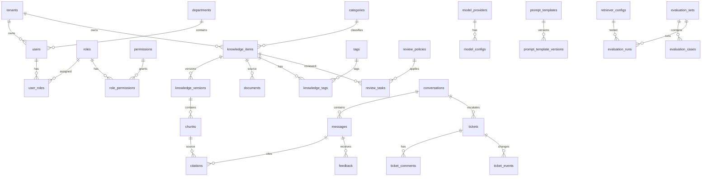

# V1 数据库表设计与 SQL 建表语句

版本：V1.0  
日期：2026-07-04  
来源：`docs/design/v1-technical-design.md`  
数据库：PostgreSQL 16+、pgvector

## 1. 设计原则

- PostgreSQL 是 V1 的长期业务真相，Redis 不保存长期业务数据。
- 所有业务表预留 `tenant_id`，即使 V1 以企业私有单租户为主，也避免后续 SaaS 化重构。
- 核心业务表保留 `created_at`、`updated_at`、`created_by`、`updated_by` 和 `deleted_at`。
- 删除策略默认软删除；关键操作写入 `audit_logs`。
- 长列表必须分页，列表过滤字段必须建索引。
- Chunk 向量与业务数据同库，便于权限过滤、状态过滤和引用追溯。
- 对象存储只在数据库保存 `object_key`，不保存本地绝对路径、bucket 细节或临时访问 URL。
- 第三方原始响应不直接成为业务契约；必要原始信息进入 JSONB 元数据或日志表。

## 2. 核心 ER 图



## 3. 表分组设计

### 3.1 用户与权限

| 表 | 用途 | 关键字段 |
| --- | --- | --- |
| `tenants` | 企业租户 | `name`、`deployment_mode`、`quota_config` |
| `departments` | 部门树 | `tenant_id`、`name`、`parent_id` |
| `users` | 后台用户 | `department_id`、`email`、`password_hash`、`status` |
| `roles` | 租户内角色 | `tenant_id`、`code`、`name`、`scope` |
| `permissions` | 全局权限码 | `code`、`module`、`action` |
| `user_roles` | 用户角色关系 | `user_id`、`role_id` |
| `role_permissions` | 角色权限关系 | `role_id`、`permission_id` |

### 3.2 知识与文档

| 表 | 用途 | 关键字段 |
| --- | --- | --- |
| `knowledge_items` | 知识主对象 | `title`、`type`、`category_id`、`source`、`status`、`current_version_id` |
| `knowledge_versions` | 知识版本 | `version_no`、`content_hash`、`summary`、`keywords`、`metadata` |
| `documents` | 原始文档记录 | `object_key`、`file_name`、`mime_type`、`parser_name`、`parse_status` |
| `parse_artifacts` | 解析产物 | `artifact_type`、`object_key`、`content_hash`、`metadata` |
| `chunks` | 检索切片 | `content`、`embedding`、`search_text`、`title_path`、`status` |
| `categories` | 分类树 | `name`、`parent_id`、`sort_order` |
| `tags` | 标签 | `name`、`color` |
| `knowledge_tags` | 知识标签关系 | `knowledge_id`、`tag_id` |

知识状态：

```text
UPLOADING -> PARSING -> EMBEDDING -> PENDING_REVIEW -> PUBLISHED
UPLOADING/PARSING/EMBEDDING -> FAILED
PUBLISHED -> ARCHIVED
```

Chunk 状态：

```text
DRAFT
ACTIVE
REINDEX_REQUIRED
ARCHIVED
```

### 3.3 上传、任务、FAQ 与审核

| 表 | 用途 | 关键字段 |
| --- | --- | --- |
| `import_jobs` | 导入任务 | `source_type`、`status`、`stage`、`progress`、`retry_count` |
| `import_job_files` | 导入文件 | `object_key`、`file_name`、`mime_type`、`checksum` |
| `task_runs` | Worker 任务运行记录 | `task_type`、`resource_type`、`resource_id`、`status`、`error` |
| `faqs` | FAQ 知识 | `question`、`answer`、`category_id`、`status`、`source` |
| `review_policies` | 分级审核策略 | `resource_type`、`risk_level`、`required_role`、`auto_publish` |
| `review_tasks` | 审核任务 | `resource_type`、`resource_id`、`risk_level`、`decision`、`reason` |

审核策略：

- 低风险 FAQ 或普通知识：知识管理员审核通过后可立即发布。
- 高风险知识，如退款、价格、合同、法律承诺：必须管理员审核。
- 模型生成的 FAQ 草稿默认不能自动发布。

### 3.4 会话、消息、引用与反馈

| 表 | 用途 | 关键字段 |
| --- | --- | --- |
| `conversations` | 会话 | `channel`、`customer_id`、`assignee_id`、`status` |
| `messages` | 会话消息 | `role`、`content`、`model_provider`、`model_name`、`token_usage` |
| `message_runs` | 单次 AI 生成链路 | `rewrite_query`、`retrieval_snapshot`、`generation_params` |
| `citations` | 回答引用 | `knowledge_id`、`chunk_id`、`document_id`、`page_no`、`quote` |
| `feedback` | 点赞点踩 | `feedback_type`、`reason`、`comment` |
| `missed_questions` | 未命中问题聚合 | `question_hash`、`question_text`、`count`、`status` |

### 3.5 工单、通知、配置与评估

| 表 | 用途 | 关键字段 |
| --- | --- | --- |
| `tickets` | 工单 | `ticket_no`、`conversation_id`、`priority`、`status`、`owner_id` |
| `ticket_comments` | 工单备注 | `author_id`、`content`、`visibility` |
| `ticket_events` | 工单事件 | `event_type`、`from_value`、`to_value`、`operator_id` |
| `notifications` | 通知记录 | `recipient_id`、`channel`、`status`、`sent_at` |
| `model_providers` | 模型供应商 | `provider`、`base_url`、`encrypted_api_key`、`status` |
| `model_configs` | 模型配置 | `capability`、`model_name`、`max_tokens`、`is_default` |
| `prompt_templates` | Prompt 模板 | `code`、`scenario`、`status`、`current_version_id` |
| `prompt_template_versions` | Prompt 版本 | `version_no`、`content`、`variables` |
| `retriever_configs` | RAG 参数 | `chunk_size`、`top_k`、`similarity_threshold`、`temperature` |
| `evaluation_sets` | 测试集 | `name`、`description`、`status` |
| `evaluation_cases` | 测试用例 | `question`、`expected_answer`、`expected_citation_ids` |
| `evaluation_runs` | 测试运行 | `retriever_config_id`、`model_config_id`、`metrics` |

### 3.6 系统支撑表

| 表 | 用途 |
| --- | --- |
| `channel_integrations` | 企业微信、飞书、钉钉配置 |
| `api_keys` | 外部系统 API Key |
| `webhooks` | Webhook 订阅端点 |
| `webhook_deliveries` | Webhook 投递记录和重试 |
| `system_settings` | 租户级系统设置 |
| `audit_logs` | 关键操作审计 |
| `event_logs` | 产品埋点和业务事件 |
| `backup_jobs` | 手动与自动备份记录 |

## 4. SQL 建表语句

说明：

- SQL 中的 `embedding vector(1536)` 是默认示例维度，真实维度必须与当前 Embedding 模型一致。
- 如切换 Embedding 模型导致维度变化，需要迁移列和重建向量索引，不能在同一列混用不同维度。
- `created_by`、`updated_by` 仅保存操作者 ID；完整前后快照进入 `audit_logs`。
- 生产迁移应由 Alembic 管理，下面 SQL 作为 V1 基线结构。

```sql
CREATE EXTENSION IF NOT EXISTS pgcrypto;
CREATE EXTENSION IF NOT EXISTS vector;

CREATE OR REPLACE FUNCTION touch_updated_at()
RETURNS trigger AS $$
BEGIN
    NEW.updated_at = now();
    RETURN NEW;
END;
$$ LANGUAGE plpgsql;

CREATE TABLE tenants (
    id uuid PRIMARY KEY DEFAULT gen_random_uuid(),
    name varchar(200) NOT NULL,
    deployment_mode varchar(32) NOT NULL DEFAULT 'PRIVATE',
    quota_config jsonb NOT NULL DEFAULT '{}'::jsonb,
    status varchar(32) NOT NULL DEFAULT 'ACTIVE',
    created_at timestamptz NOT NULL DEFAULT now(),
    updated_at timestamptz NOT NULL DEFAULT now(),
    deleted_at timestamptz
);

CREATE TABLE departments (
    id uuid PRIMARY KEY DEFAULT gen_random_uuid(),
    tenant_id uuid NOT NULL REFERENCES tenants(id) ON DELETE CASCADE,
    name varchar(120) NOT NULL,
    parent_id uuid REFERENCES departments(id) ON DELETE SET NULL,
    sort_order integer NOT NULL DEFAULT 0,
    created_at timestamptz NOT NULL DEFAULT now(),
    updated_at timestamptz NOT NULL DEFAULT now(),
    deleted_at timestamptz
);

CREATE TABLE users (
    id uuid PRIMARY KEY DEFAULT gen_random_uuid(),
    tenant_id uuid NOT NULL REFERENCES tenants(id) ON DELETE CASCADE,
    department_id uuid REFERENCES departments(id) ON DELETE SET NULL,
    name varchar(120) NOT NULL,
    email varchar(320) NOT NULL,
    password_hash text NOT NULL,
    status varchar(32) NOT NULL DEFAULT 'ACTIVE',
    last_login_at timestamptz,
    created_by uuid,
    updated_by uuid,
    created_at timestamptz NOT NULL DEFAULT now(),
    updated_at timestamptz NOT NULL DEFAULT now(),
    deleted_at timestamptz
);

CREATE TABLE roles (
    id uuid PRIMARY KEY DEFAULT gen_random_uuid(),
    tenant_id uuid NOT NULL REFERENCES tenants(id) ON DELETE CASCADE,
    code varchar(80) NOT NULL,
    name varchar(120) NOT NULL,
    scope varchar(32) NOT NULL DEFAULT 'TENANT',
    created_by uuid,
    updated_by uuid,
    created_at timestamptz NOT NULL DEFAULT now(),
    updated_at timestamptz NOT NULL DEFAULT now(),
    deleted_at timestamptz,
    UNIQUE (tenant_id, code)
);

CREATE TABLE permissions (
    id uuid PRIMARY KEY DEFAULT gen_random_uuid(),
    code varchar(120) NOT NULL UNIQUE,
    module varchar(80) NOT NULL,
    action varchar(80) NOT NULL,
    description text,
    created_at timestamptz NOT NULL DEFAULT now()
);

CREATE TABLE user_roles (
    user_id uuid NOT NULL REFERENCES users(id) ON DELETE CASCADE,
    role_id uuid NOT NULL REFERENCES roles(id) ON DELETE CASCADE,
    created_at timestamptz NOT NULL DEFAULT now(),
    PRIMARY KEY (user_id, role_id)
);

CREATE TABLE role_permissions (
    role_id uuid NOT NULL REFERENCES roles(id) ON DELETE CASCADE,
    permission_id uuid NOT NULL REFERENCES permissions(id) ON DELETE CASCADE,
    created_at timestamptz NOT NULL DEFAULT now(),
    PRIMARY KEY (role_id, permission_id)
);

CREATE TABLE categories (
    id uuid PRIMARY KEY DEFAULT gen_random_uuid(),
    tenant_id uuid NOT NULL REFERENCES tenants(id) ON DELETE CASCADE,
    name varchar(120) NOT NULL,
    parent_id uuid REFERENCES categories(id) ON DELETE SET NULL,
    sort_order integer NOT NULL DEFAULT 0,
    created_by uuid,
    updated_by uuid,
    created_at timestamptz NOT NULL DEFAULT now(),
    updated_at timestamptz NOT NULL DEFAULT now(),
    deleted_at timestamptz
);

CREATE TABLE tags (
    id uuid PRIMARY KEY DEFAULT gen_random_uuid(),
    tenant_id uuid NOT NULL REFERENCES tenants(id) ON DELETE CASCADE,
    name varchar(80) NOT NULL,
    color varchar(32),
    created_by uuid,
    updated_by uuid,
    created_at timestamptz NOT NULL DEFAULT now(),
    updated_at timestamptz NOT NULL DEFAULT now(),
    deleted_at timestamptz
);

CREATE TABLE knowledge_items (
    id uuid PRIMARY KEY DEFAULT gen_random_uuid(),
    tenant_id uuid NOT NULL REFERENCES tenants(id) ON DELETE CASCADE,
    title varchar(300) NOT NULL,
    type varchar(40) NOT NULL,
    category_id uuid REFERENCES categories(id) ON DELETE SET NULL,
    source varchar(40) NOT NULL,
    status varchar(40) NOT NULL DEFAULT 'UPLOADING',
    current_version_id uuid,
    published_at timestamptz,
    archived_at timestamptz,
    created_by uuid,
    updated_by uuid,
    created_at timestamptz NOT NULL DEFAULT now(),
    updated_at timestamptz NOT NULL DEFAULT now(),
    deleted_at timestamptz,
    CHECK (status IN ('UPLOADING', 'PARSING', 'EMBEDDING', 'PENDING_REVIEW', 'PUBLISHED', 'ARCHIVED', 'FAILED'))
);

CREATE TABLE knowledge_versions (
    id uuid PRIMARY KEY DEFAULT gen_random_uuid(),
    knowledge_id uuid NOT NULL REFERENCES knowledge_items(id) ON DELETE CASCADE,
    version_no integer NOT NULL,
    content_hash varchar(128) NOT NULL,
    summary text,
    keywords text[] NOT NULL DEFAULT ARRAY[]::text[],
    metadata jsonb NOT NULL DEFAULT '{}'::jsonb,
    status varchar(40) NOT NULL DEFAULT 'DRAFT',
    created_by uuid,
    created_at timestamptz NOT NULL DEFAULT now(),
    UNIQUE (knowledge_id, version_no)
);

ALTER TABLE knowledge_items
ADD CONSTRAINT fk_knowledge_items_current_version
FOREIGN KEY (current_version_id) REFERENCES knowledge_versions(id) ON DELETE SET NULL;

CREATE TABLE documents (
    id uuid PRIMARY KEY DEFAULT gen_random_uuid(),
    tenant_id uuid NOT NULL REFERENCES tenants(id) ON DELETE CASCADE,
    knowledge_id uuid NOT NULL REFERENCES knowledge_items(id) ON DELETE CASCADE,
    object_key text NOT NULL,
    file_name varchar(300) NOT NULL,
    mime_type varchar(160) NOT NULL,
    file_size bigint NOT NULL,
    parser_name varchar(80),
    parser_version varchar(80),
    parse_status varchar(40) NOT NULL DEFAULT 'PENDING',
    parse_metadata jsonb NOT NULL DEFAULT '{}'::jsonb,
    created_by uuid,
    updated_by uuid,
    created_at timestamptz NOT NULL DEFAULT now(),
    updated_at timestamptz NOT NULL DEFAULT now(),
    deleted_at timestamptz,
    CHECK (file_size >= 0),
    CHECK (object_key !~ '(^/|^[A-Za-z]:|\\.\\.)')
);

CREATE TABLE parse_artifacts (
    id uuid PRIMARY KEY DEFAULT gen_random_uuid(),
    tenant_id uuid NOT NULL REFERENCES tenants(id) ON DELETE CASCADE,
    document_id uuid NOT NULL REFERENCES documents(id) ON DELETE CASCADE,
    artifact_type varchar(60) NOT NULL,
    object_key text NOT NULL,
    content_hash varchar(128),
    metadata jsonb NOT NULL DEFAULT '{}'::jsonb,
    created_at timestamptz NOT NULL DEFAULT now(),
    CHECK (object_key !~ '(^/|^[A-Za-z]:|\\.\\.)')
);

CREATE TABLE chunks (
    id uuid PRIMARY KEY DEFAULT gen_random_uuid(),
    tenant_id uuid NOT NULL REFERENCES tenants(id) ON DELETE CASCADE,
    knowledge_id uuid NOT NULL REFERENCES knowledge_items(id) ON DELETE CASCADE,
    version_id uuid NOT NULL REFERENCES knowledge_versions(id) ON DELETE CASCADE,
    document_id uuid REFERENCES documents(id) ON DELETE SET NULL,
    chunk_index integer NOT NULL,
    title_path text[] NOT NULL DEFAULT ARRAY[]::text[],
    content text NOT NULL,
    token_count integer NOT NULL DEFAULT 0,
    embedding vector(1536),
    search_text text NOT NULL DEFAULT '',
    page_no integer,
    source_locator jsonb NOT NULL DEFAULT '{}'::jsonb,
    metadata jsonb NOT NULL DEFAULT '{}'::jsonb,
    status varchar(40) NOT NULL DEFAULT 'DRAFT',
    created_at timestamptz NOT NULL DEFAULT now(),
    updated_at timestamptz NOT NULL DEFAULT now(),
    deleted_at timestamptz,
    CHECK (chunk_index >= 0),
    CHECK (token_count >= 0),
    CHECK (status IN ('DRAFT', 'ACTIVE', 'REINDEX_REQUIRED', 'ARCHIVED'))
);

CREATE TABLE knowledge_tags (
    knowledge_id uuid NOT NULL REFERENCES knowledge_items(id) ON DELETE CASCADE,
    tag_id uuid NOT NULL REFERENCES tags(id) ON DELETE CASCADE,
    created_at timestamptz NOT NULL DEFAULT now(),
    PRIMARY KEY (knowledge_id, tag_id)
);

CREATE TABLE import_jobs (
    id uuid PRIMARY KEY DEFAULT gen_random_uuid(),
    tenant_id uuid NOT NULL REFERENCES tenants(id) ON DELETE CASCADE,
    source_type varchar(40) NOT NULL,
    status varchar(40) NOT NULL DEFAULT 'PENDING',
    stage varchar(40) NOT NULL DEFAULT 'CREATED',
    progress integer NOT NULL DEFAULT 0,
    error_code varchar(120),
    error_message text,
    retry_count integer NOT NULL DEFAULT 0,
    created_by uuid,
    updated_by uuid,
    created_at timestamptz NOT NULL DEFAULT now(),
    updated_at timestamptz NOT NULL DEFAULT now(),
    deleted_at timestamptz,
    CHECK (progress BETWEEN 0 AND 100),
    CHECK (retry_count >= 0)
);

CREATE TABLE import_job_files (
    id uuid PRIMARY KEY DEFAULT gen_random_uuid(),
    tenant_id uuid NOT NULL REFERENCES tenants(id) ON DELETE CASCADE,
    job_id uuid NOT NULL REFERENCES import_jobs(id) ON DELETE CASCADE,
    object_key text NOT NULL,
    file_name varchar(300) NOT NULL,
    mime_type varchar(160) NOT NULL,
    file_size bigint NOT NULL,
    checksum varchar(128) NOT NULL,
    created_at timestamptz NOT NULL DEFAULT now(),
    CHECK (file_size >= 0),
    CHECK (object_key !~ '(^/|^[A-Za-z]:|\\.\\.)')
);

CREATE TABLE task_runs (
    id uuid PRIMARY KEY DEFAULT gen_random_uuid(),
    tenant_id uuid NOT NULL REFERENCES tenants(id) ON DELETE CASCADE,
    task_type varchar(80) NOT NULL,
    resource_type varchar(80) NOT NULL,
    resource_id uuid NOT NULL,
    status varchar(40) NOT NULL DEFAULT 'PENDING',
    started_at timestamptz,
    finished_at timestamptz,
    error jsonb,
    created_at timestamptz NOT NULL DEFAULT now()
);

CREATE TABLE faqs (
    id uuid PRIMARY KEY DEFAULT gen_random_uuid(),
    tenant_id uuid NOT NULL REFERENCES tenants(id) ON DELETE CASCADE,
    question text NOT NULL,
    answer text NOT NULL,
    category_id uuid REFERENCES categories(id) ON DELETE SET NULL,
    status varchar(40) NOT NULL DEFAULT 'DRAFT',
    source varchar(40) NOT NULL DEFAULT 'MANUAL',
    knowledge_id uuid REFERENCES knowledge_items(id) ON DELETE SET NULL,
    created_by uuid,
    updated_by uuid,
    created_at timestamptz NOT NULL DEFAULT now(),
    updated_at timestamptz NOT NULL DEFAULT now(),
    deleted_at timestamptz,
    CHECK (status IN ('DRAFT', 'PENDING_REVIEW', 'PUBLISHED', 'ARCHIVED', 'REJECTED'))
);

CREATE TABLE review_policies (
    id uuid PRIMARY KEY DEFAULT gen_random_uuid(),
    tenant_id uuid NOT NULL REFERENCES tenants(id) ON DELETE CASCADE,
    resource_type varchar(80) NOT NULL,
    risk_level varchar(40) NOT NULL,
    required_role varchar(80) NOT NULL,
    auto_publish boolean NOT NULL DEFAULT false,
    created_by uuid,
    updated_by uuid,
    created_at timestamptz NOT NULL DEFAULT now(),
    updated_at timestamptz NOT NULL DEFAULT now(),
    deleted_at timestamptz,
    UNIQUE (tenant_id, resource_type, risk_level)
);

CREATE TABLE review_tasks (
    id uuid PRIMARY KEY DEFAULT gen_random_uuid(),
    tenant_id uuid NOT NULL REFERENCES tenants(id) ON DELETE CASCADE,
    policy_id uuid REFERENCES review_policies(id) ON DELETE SET NULL,
    resource_type varchar(80) NOT NULL,
    resource_id uuid NOT NULL,
    risk_level varchar(40) NOT NULL,
    status varchar(40) NOT NULL DEFAULT 'PENDING',
    assigned_role varchar(80),
    reviewer_id uuid REFERENCES users(id) ON DELETE SET NULL,
    decision varchar(40),
    reason text,
    created_by uuid,
    updated_by uuid,
    created_at timestamptz NOT NULL DEFAULT now(),
    updated_at timestamptz NOT NULL DEFAULT now(),
    deleted_at timestamptz
);

CREATE TABLE conversations (
    id uuid PRIMARY KEY DEFAULT gen_random_uuid(),
    tenant_id uuid NOT NULL REFERENCES tenants(id) ON DELETE CASCADE,
    channel varchar(40) NOT NULL,
    customer_id varchar(128),
    assignee_id uuid REFERENCES users(id) ON DELETE SET NULL,
    status varchar(40) NOT NULL DEFAULT 'OPEN',
    last_message_at timestamptz,
    metadata jsonb NOT NULL DEFAULT '{}'::jsonb,
    created_at timestamptz NOT NULL DEFAULT now(),
    updated_at timestamptz NOT NULL DEFAULT now(),
    deleted_at timestamptz
);

CREATE TABLE messages (
    id uuid PRIMARY KEY DEFAULT gen_random_uuid(),
    tenant_id uuid NOT NULL REFERENCES tenants(id) ON DELETE CASCADE,
    conversation_id uuid NOT NULL REFERENCES conversations(id) ON DELETE CASCADE,
    role varchar(40) NOT NULL,
    content text NOT NULL,
    status varchar(40) NOT NULL DEFAULT 'CREATED',
    model_provider varchar(80),
    model_name varchar(120),
    latency_ms integer,
    token_usage jsonb NOT NULL DEFAULT '{}'::jsonb,
    created_at timestamptz NOT NULL DEFAULT now(),
    updated_at timestamptz NOT NULL DEFAULT now(),
    deleted_at timestamptz,
    CHECK (role IN ('USER', 'ASSISTANT', 'STAFF', 'SYSTEM'))
);

CREATE TABLE message_runs (
    id uuid PRIMARY KEY DEFAULT gen_random_uuid(),
    tenant_id uuid NOT NULL REFERENCES tenants(id) ON DELETE CASCADE,
    message_id uuid NOT NULL REFERENCES messages(id) ON DELETE CASCADE,
    status varchar(40) NOT NULL DEFAULT 'RUNNING',
    rewrite_query text,
    retrieval_snapshot jsonb NOT NULL DEFAULT '{}'::jsonb,
    generation_params jsonb NOT NULL DEFAULT '{}'::jsonb,
    error jsonb,
    started_at timestamptz NOT NULL DEFAULT now(),
    finished_at timestamptz
);

CREATE TABLE citations (
    id uuid PRIMARY KEY DEFAULT gen_random_uuid(),
    tenant_id uuid NOT NULL REFERENCES tenants(id) ON DELETE CASCADE,
    message_id uuid NOT NULL REFERENCES messages(id) ON DELETE CASCADE,
    knowledge_id uuid REFERENCES knowledge_items(id) ON DELETE SET NULL,
    chunk_id uuid REFERENCES chunks(id) ON DELETE SET NULL,
    document_id uuid REFERENCES documents(id) ON DELETE SET NULL,
    page_no integer,
    quote text NOT NULL,
    score numeric(8, 6),
    rank integer NOT NULL,
    snapshot jsonb NOT NULL DEFAULT '{}'::jsonb,
    created_at timestamptz NOT NULL DEFAULT now(),
    CHECK (rank > 0)
);

CREATE TABLE feedback (
    id uuid PRIMARY KEY DEFAULT gen_random_uuid(),
    tenant_id uuid NOT NULL REFERENCES tenants(id) ON DELETE CASCADE,
    message_id uuid NOT NULL REFERENCES messages(id) ON DELETE CASCADE,
    user_id uuid REFERENCES users(id) ON DELETE SET NULL,
    feedback_type varchar(40) NOT NULL,
    reason varchar(120),
    comment text,
    created_at timestamptz NOT NULL DEFAULT now()
);

CREATE TABLE missed_questions (
    id uuid PRIMARY KEY DEFAULT gen_random_uuid(),
    tenant_id uuid NOT NULL REFERENCES tenants(id) ON DELETE CASCADE,
    question_hash varchar(128) NOT NULL,
    question_text text NOT NULL,
    count integer NOT NULL DEFAULT 1,
    first_seen_at timestamptz NOT NULL DEFAULT now(),
    last_seen_at timestamptz NOT NULL DEFAULT now(),
    status varchar(40) NOT NULL DEFAULT 'OPEN',
    metadata jsonb NOT NULL DEFAULT '{}'::jsonb,
    created_at timestamptz NOT NULL DEFAULT now(),
    updated_at timestamptz NOT NULL DEFAULT now(),
    UNIQUE (tenant_id, question_hash),
    CHECK (count > 0)
);

CREATE TABLE tickets (
    id uuid PRIMARY KEY DEFAULT gen_random_uuid(),
    tenant_id uuid NOT NULL REFERENCES tenants(id) ON DELETE CASCADE,
    ticket_no varchar(60) NOT NULL,
    conversation_id uuid REFERENCES conversations(id) ON DELETE SET NULL,
    customer_name varchar(160),
    title varchar(300) NOT NULL,
    description text,
    priority varchar(40) NOT NULL DEFAULT 'MEDIUM',
    status varchar(40) NOT NULL DEFAULT 'OPEN',
    owner_id uuid REFERENCES users(id) ON DELETE SET NULL,
    due_at timestamptz,
    created_by uuid,
    updated_by uuid,
    created_at timestamptz NOT NULL DEFAULT now(),
    updated_at timestamptz NOT NULL DEFAULT now(),
    deleted_at timestamptz,
    UNIQUE (tenant_id, ticket_no),
    CHECK (priority IN ('LOW', 'MEDIUM', 'HIGH', 'URGENT')),
    CHECK (status IN ('OPEN', 'IN_PROGRESS', 'RESOLVED', 'CLOSED', 'CANCELLED'))
);

CREATE TABLE ticket_comments (
    id uuid PRIMARY KEY DEFAULT gen_random_uuid(),
    tenant_id uuid NOT NULL REFERENCES tenants(id) ON DELETE CASCADE,
    ticket_id uuid NOT NULL REFERENCES tickets(id) ON DELETE CASCADE,
    author_id uuid REFERENCES users(id) ON DELETE SET NULL,
    content text NOT NULL,
    visibility varchar(40) NOT NULL DEFAULT 'INTERNAL',
    created_at timestamptz NOT NULL DEFAULT now(),
    deleted_at timestamptz
);

CREATE TABLE ticket_events (
    id uuid PRIMARY KEY DEFAULT gen_random_uuid(),
    tenant_id uuid NOT NULL REFERENCES tenants(id) ON DELETE CASCADE,
    ticket_id uuid NOT NULL REFERENCES tickets(id) ON DELETE CASCADE,
    event_type varchar(80) NOT NULL,
    from_value text,
    to_value text,
    operator_id uuid REFERENCES users(id) ON DELETE SET NULL,
    created_at timestamptz NOT NULL DEFAULT now()
);

CREATE TABLE notifications (
    id uuid PRIMARY KEY DEFAULT gen_random_uuid(),
    tenant_id uuid NOT NULL REFERENCES tenants(id) ON DELETE CASCADE,
    recipient_id uuid REFERENCES users(id) ON DELETE SET NULL,
    channel varchar(40) NOT NULL,
    title varchar(300) NOT NULL,
    content text NOT NULL,
    status varchar(40) NOT NULL DEFAULT 'PENDING',
    sent_at timestamptz,
    error jsonb,
    created_at timestamptz NOT NULL DEFAULT now(),
    updated_at timestamptz NOT NULL DEFAULT now()
);

CREATE TABLE model_providers (
    id uuid PRIMARY KEY DEFAULT gen_random_uuid(),
    tenant_id uuid NOT NULL REFERENCES tenants(id) ON DELETE CASCADE,
    provider varchar(80) NOT NULL,
    base_url text,
    encrypted_api_key text,
    status varchar(40) NOT NULL DEFAULT 'DISABLED',
    config jsonb NOT NULL DEFAULT '{}'::jsonb,
    created_by uuid,
    updated_by uuid,
    created_at timestamptz NOT NULL DEFAULT now(),
    updated_at timestamptz NOT NULL DEFAULT now(),
    deleted_at timestamptz,
    UNIQUE (tenant_id, provider)
);

CREATE TABLE model_configs (
    id uuid PRIMARY KEY DEFAULT gen_random_uuid(),
    tenant_id uuid NOT NULL REFERENCES tenants(id) ON DELETE CASCADE,
    provider_id uuid NOT NULL REFERENCES model_providers(id) ON DELETE CASCADE,
    capability varchar(40) NOT NULL,
    model_name varchar(160) NOT NULL,
    max_tokens integer,
    timeout_ms integer NOT NULL DEFAULT 30000,
    is_default boolean NOT NULL DEFAULT false,
    config jsonb NOT NULL DEFAULT '{}'::jsonb,
    created_by uuid,
    updated_by uuid,
    created_at timestamptz NOT NULL DEFAULT now(),
    updated_at timestamptz NOT NULL DEFAULT now(),
    deleted_at timestamptz
);

CREATE TABLE prompt_templates (
    id uuid PRIMARY KEY DEFAULT gen_random_uuid(),
    tenant_id uuid NOT NULL REFERENCES tenants(id) ON DELETE CASCADE,
    code varchar(120) NOT NULL,
    name varchar(160) NOT NULL,
    scenario varchar(80) NOT NULL,
    status varchar(40) NOT NULL DEFAULT 'DRAFT',
    current_version_id uuid,
    created_by uuid,
    updated_by uuid,
    created_at timestamptz NOT NULL DEFAULT now(),
    updated_at timestamptz NOT NULL DEFAULT now(),
    deleted_at timestamptz,
    UNIQUE (tenant_id, code)
);

CREATE TABLE prompt_template_versions (
    id uuid PRIMARY KEY DEFAULT gen_random_uuid(),
    tenant_id uuid NOT NULL REFERENCES tenants(id) ON DELETE CASCADE,
    template_id uuid NOT NULL REFERENCES prompt_templates(id) ON DELETE CASCADE,
    version_no integer NOT NULL,
    content text NOT NULL,
    variables jsonb NOT NULL DEFAULT '[]'::jsonb,
    created_by uuid,
    created_at timestamptz NOT NULL DEFAULT now(),
    UNIQUE (template_id, version_no)
);

ALTER TABLE prompt_templates
ADD CONSTRAINT fk_prompt_templates_current_version
FOREIGN KEY (current_version_id) REFERENCES prompt_template_versions(id) ON DELETE SET NULL;

CREATE TABLE retriever_configs (
    id uuid PRIMARY KEY DEFAULT gen_random_uuid(),
    tenant_id uuid NOT NULL REFERENCES tenants(id) ON DELETE CASCADE,
    name varchar(160) NOT NULL,
    chunk_size integer NOT NULL DEFAULT 1000,
    chunk_overlap integer NOT NULL DEFAULT 160,
    top_k integer NOT NULL DEFAULT 30,
    rerank_top_k integer NOT NULL DEFAULT 8,
    similarity_threshold numeric(6, 4) NOT NULL DEFAULT 0.6000,
    temperature numeric(4, 2) NOT NULL DEFAULT 0.20,
    embedding_model_config_id uuid REFERENCES model_configs(id) ON DELETE SET NULL,
    rerank_model_config_id uuid REFERENCES model_configs(id) ON DELETE SET NULL,
    is_active boolean NOT NULL DEFAULT false,
    created_by uuid,
    updated_by uuid,
    created_at timestamptz NOT NULL DEFAULT now(),
    updated_at timestamptz NOT NULL DEFAULT now(),
    deleted_at timestamptz
);

CREATE TABLE evaluation_sets (
    id uuid PRIMARY KEY DEFAULT gen_random_uuid(),
    tenant_id uuid NOT NULL REFERENCES tenants(id) ON DELETE CASCADE,
    name varchar(160) NOT NULL,
    description text,
    status varchar(40) NOT NULL DEFAULT 'DRAFT',
    created_by uuid,
    updated_by uuid,
    created_at timestamptz NOT NULL DEFAULT now(),
    updated_at timestamptz NOT NULL DEFAULT now(),
    deleted_at timestamptz
);

CREATE TABLE evaluation_cases (
    id uuid PRIMARY KEY DEFAULT gen_random_uuid(),
    tenant_id uuid NOT NULL REFERENCES tenants(id) ON DELETE CASCADE,
    set_id uuid NOT NULL REFERENCES evaluation_sets(id) ON DELETE CASCADE,
    question text NOT NULL,
    expected_answer text,
    expected_citation_ids uuid[] NOT NULL DEFAULT ARRAY[]::uuid[],
    tags text[] NOT NULL DEFAULT ARRAY[]::text[],
    created_at timestamptz NOT NULL DEFAULT now(),
    updated_at timestamptz NOT NULL DEFAULT now(),
    deleted_at timestamptz
);

CREATE TABLE evaluation_runs (
    id uuid PRIMARY KEY DEFAULT gen_random_uuid(),
    tenant_id uuid NOT NULL REFERENCES tenants(id) ON DELETE CASCADE,
    set_id uuid NOT NULL REFERENCES evaluation_sets(id) ON DELETE CASCADE,
    retriever_config_id uuid REFERENCES retriever_configs(id) ON DELETE SET NULL,
    model_config_id uuid REFERENCES model_configs(id) ON DELETE SET NULL,
    status varchar(40) NOT NULL DEFAULT 'PENDING',
    metrics jsonb NOT NULL DEFAULT '{}'::jsonb,
    started_at timestamptz,
    finished_at timestamptz,
    created_by uuid,
    created_at timestamptz NOT NULL DEFAULT now()
);

CREATE TABLE channel_integrations (
    id uuid PRIMARY KEY DEFAULT gen_random_uuid(),
    tenant_id uuid NOT NULL REFERENCES tenants(id) ON DELETE CASCADE,
    channel varchar(40) NOT NULL,
    status varchar(40) NOT NULL DEFAULT 'DISABLED',
    config jsonb NOT NULL DEFAULT '{}'::jsonb,
    encrypted_secret text,
    created_by uuid,
    updated_by uuid,
    created_at timestamptz NOT NULL DEFAULT now(),
    updated_at timestamptz NOT NULL DEFAULT now(),
    deleted_at timestamptz,
    UNIQUE (tenant_id, channel)
);

CREATE TABLE api_keys (
    id uuid PRIMARY KEY DEFAULT gen_random_uuid(),
    tenant_id uuid NOT NULL REFERENCES tenants(id) ON DELETE CASCADE,
    name varchar(160) NOT NULL,
    key_prefix varchar(32) NOT NULL,
    key_hash text NOT NULL,
    scopes text[] NOT NULL DEFAULT ARRAY[]::text[],
    status varchar(40) NOT NULL DEFAULT 'ACTIVE',
    last_used_at timestamptz,
    expires_at timestamptz,
    created_by uuid,
    updated_by uuid,
    created_at timestamptz NOT NULL DEFAULT now(),
    updated_at timestamptz NOT NULL DEFAULT now(),
    deleted_at timestamptz,
    UNIQUE (tenant_id, key_prefix)
);

CREATE TABLE webhooks (
    id uuid PRIMARY KEY DEFAULT gen_random_uuid(),
    tenant_id uuid NOT NULL REFERENCES tenants(id) ON DELETE CASCADE,
    name varchar(160) NOT NULL,
    url text NOT NULL,
    encrypted_secret text NOT NULL,
    events text[] NOT NULL DEFAULT ARRAY[]::text[],
    status varchar(40) NOT NULL DEFAULT 'ACTIVE',
    created_by uuid,
    updated_by uuid,
    created_at timestamptz NOT NULL DEFAULT now(),
    updated_at timestamptz NOT NULL DEFAULT now(),
    deleted_at timestamptz
);

CREATE TABLE webhook_deliveries (
    id uuid PRIMARY KEY DEFAULT gen_random_uuid(),
    tenant_id uuid NOT NULL REFERENCES tenants(id) ON DELETE CASCADE,
    webhook_id uuid NOT NULL REFERENCES webhooks(id) ON DELETE CASCADE,
    event_id uuid NOT NULL,
    event_type varchar(120) NOT NULL,
    payload jsonb NOT NULL,
    status varchar(40) NOT NULL DEFAULT 'PENDING',
    attempt_count integer NOT NULL DEFAULT 0,
    response_status integer,
    response_body text,
    next_retry_at timestamptz,
    delivered_at timestamptz,
    created_at timestamptz NOT NULL DEFAULT now(),
    updated_at timestamptz NOT NULL DEFAULT now(),
    UNIQUE (webhook_id, event_id)
);

CREATE TABLE system_settings (
    id uuid PRIMARY KEY DEFAULT gen_random_uuid(),
    tenant_id uuid NOT NULL REFERENCES tenants(id) ON DELETE CASCADE,
    key varchar(120) NOT NULL,
    value jsonb NOT NULL DEFAULT '{}'::jsonb,
    updated_by uuid,
    created_at timestamptz NOT NULL DEFAULT now(),
    updated_at timestamptz NOT NULL DEFAULT now(),
    UNIQUE (tenant_id, key)
);

CREATE TABLE audit_logs (
    id uuid PRIMARY KEY DEFAULT gen_random_uuid(),
    tenant_id uuid NOT NULL REFERENCES tenants(id) ON DELETE CASCADE,
    actor_id uuid REFERENCES users(id) ON DELETE SET NULL,
    action varchar(160) NOT NULL,
    resource_type varchar(120) NOT NULL,
    resource_id uuid,
    before_snapshot jsonb,
    after_snapshot jsonb,
    ip_address inet,
    user_agent text,
    request_id varchar(120),
    created_at timestamptz NOT NULL DEFAULT now()
);

CREATE TABLE event_logs (
    id uuid PRIMARY KEY DEFAULT gen_random_uuid(),
    tenant_id uuid NOT NULL REFERENCES tenants(id) ON DELETE CASCADE,
    event_name varchar(160) NOT NULL,
    actor_id uuid REFERENCES users(id) ON DELETE SET NULL,
    conversation_id uuid REFERENCES conversations(id) ON DELETE SET NULL,
    message_id uuid REFERENCES messages(id) ON DELETE SET NULL,
    run_id uuid,
    properties jsonb NOT NULL DEFAULT '{}'::jsonb,
    request_id varchar(120),
    created_at timestamptz NOT NULL DEFAULT now()
);

CREATE TABLE backup_jobs (
    id uuid PRIMARY KEY DEFAULT gen_random_uuid(),
    tenant_id uuid NOT NULL REFERENCES tenants(id) ON DELETE CASCADE,
    backup_type varchar(40) NOT NULL,
    status varchar(40) NOT NULL DEFAULT 'PENDING',
    object_key text,
    started_at timestamptz,
    finished_at timestamptz,
    error jsonb,
    created_by uuid,
    created_at timestamptz NOT NULL DEFAULT now(),
    CHECK (object_key IS NULL OR object_key !~ '(^/|^[A-Za-z]:|\\.\\.)')
);
```

## 5. 索引策略

```sql
CREATE UNIQUE INDEX uq_users_tenant_email_lower
ON users (tenant_id, lower(email))
WHERE deleted_at IS NULL;

CREATE INDEX idx_departments_tenant_parent
ON departments (tenant_id, parent_id, sort_order);

CREATE INDEX idx_roles_tenant_code
ON roles (tenant_id, code);

CREATE INDEX idx_categories_tenant_parent
ON categories (tenant_id, parent_id, sort_order);

CREATE UNIQUE INDEX uq_tags_tenant_name
ON tags (tenant_id, name)
WHERE deleted_at IS NULL;

CREATE INDEX idx_knowledge_tenant_status_updated
ON knowledge_items (tenant_id, status, updated_at DESC)
WHERE deleted_at IS NULL;

CREATE INDEX idx_knowledge_tenant_category
ON knowledge_items (tenant_id, category_id, updated_at DESC)
WHERE deleted_at IS NULL;

CREATE INDEX idx_documents_knowledge
ON documents (tenant_id, knowledge_id, created_at DESC)
WHERE deleted_at IS NULL;

CREATE INDEX idx_chunks_tenant_knowledge
ON chunks (tenant_id, knowledge_id, status);

CREATE INDEX idx_chunks_version
ON chunks (tenant_id, version_id, chunk_index);

CREATE INDEX idx_chunks_embedding_hnsw
ON chunks USING hnsw (embedding vector_cosine_ops)
WHERE embedding IS NOT NULL AND status = 'ACTIVE';

CREATE INDEX idx_chunks_search_text
ON chunks USING gin (to_tsvector('simple', search_text));

CREATE INDEX idx_import_jobs_tenant_status_updated
ON import_jobs (tenant_id, status, updated_at DESC)
WHERE deleted_at IS NULL;

CREATE INDEX idx_task_runs_resource
ON task_runs (tenant_id, resource_type, resource_id, created_at DESC);

CREATE INDEX idx_faqs_tenant_status_updated
ON faqs (tenant_id, status, updated_at DESC)
WHERE deleted_at IS NULL;

CREATE INDEX idx_review_tasks_tenant_status
ON review_tasks (tenant_id, status, created_at DESC)
WHERE deleted_at IS NULL;

CREATE INDEX idx_conversations_tenant_status_last
ON conversations (tenant_id, status, last_message_at DESC)
WHERE deleted_at IS NULL;

CREATE INDEX idx_messages_conversation_created
ON messages (tenant_id, conversation_id, created_at);

CREATE INDEX idx_message_runs_message
ON message_runs (tenant_id, message_id, started_at DESC);

CREATE INDEX idx_citations_message
ON citations (tenant_id, message_id, rank);

CREATE INDEX idx_missed_questions_tenant_status
ON missed_questions (tenant_id, status, last_seen_at DESC);

CREATE INDEX idx_tickets_tenant_status_priority
ON tickets (tenant_id, status, priority, updated_at DESC)
WHERE deleted_at IS NULL;

CREATE INDEX idx_ticket_events_ticket
ON ticket_events (tenant_id, ticket_id, created_at DESC);

CREATE INDEX idx_notifications_recipient_status
ON notifications (tenant_id, recipient_id, status, created_at DESC);

CREATE INDEX idx_model_configs_provider_capability
ON model_configs (tenant_id, provider_id, capability)
WHERE deleted_at IS NULL;

CREATE INDEX idx_prompt_templates_tenant_status
ON prompt_templates (tenant_id, status, updated_at DESC)
WHERE deleted_at IS NULL;

CREATE INDEX idx_evaluation_runs_set
ON evaluation_runs (tenant_id, set_id, created_at DESC);

CREATE INDEX idx_webhook_deliveries_status_retry
ON webhook_deliveries (tenant_id, status, next_retry_at);

CREATE INDEX idx_audit_logs_tenant_resource
ON audit_logs (tenant_id, resource_type, resource_id, created_at DESC);

CREATE INDEX idx_audit_logs_request
ON audit_logs (request_id);

CREATE INDEX idx_event_logs_tenant_event_created
ON event_logs (tenant_id, event_name, created_at DESC);
```

## 6. 数据保留与分区建议

- `audit_logs`、`event_logs`、`messages`、`webhook_deliveries` 会快速增长，应按月分区或按时间归档。
- `chunks` 在单企业超过 200 万后，需要评估分区和索引重建窗口。
- `event_logs` 可以定期聚合到 Dashboard 指标表，页面查询不直接扫原始事件。
- `webhook_deliveries` 成功记录可按保留策略清理，失败记录保留更长时间用于排障。
- `backup_jobs.object_key` 指向对象存储备份包，数据库只保存元数据。

## 7. 迁移与约束说明

- 所有 DDL 必须通过 Alembic migration 提交，不允许生产环境手工改表。
- 新增字段优先使用可空或默认值，避免阻塞大表迁移。
- 修改枚举类状态前必须同步 API 文档、前端状态映射和测试用例。
- API 输出字段使用 `camelCase`，数据库字段使用 `snake_case`，由 Schema 层转换。
- 软删除数据默认不出现在列表查询中；引用和审计查询可显式包含已删除或已归档数据。
- `object_key` 的最终安全校验必须在 ObjectStorageAdapter 中完成，SQL CHECK 只做基础防线。
