# V1 前端界面设计与交互文档

版本：V1.0  
日期：2026-07-04  
来源：`docs/design/v1-technical-design.md`、`docs/design/v1-product-prd.md`  
前端技术：React + TypeScript + Vite + Ant Design + ProComponents + TanStack Query + ECharts

## 1. 设计目标

AI Customer Service Hub 的前端是企业后台工具，不是营销站点。V1 界面设计目标是让管理层、客服主管、知识管理员、一线客服和系统管理员高效完成日常工作。

设计重点：

- 信息密度适中，适合反复使用和快速扫描。
- 导航稳定，一级模块不超过 8 个。
- 表格、筛选、批量操作、长任务状态和异常恢复必须完整。
- AI 回答必须突出引用和可信状态，避免用户只看到“生成文本”。
- 知识导入、解析、Embedding、审核、发布的每个阶段都可追踪。
- 权限、状态、风险操作在 UI 上明确，但安全边界以后端校验为准。

## 2. 信息架构

```mermaid
flowchart TD
    Root[AI Customer Service Hub]
    Root --> Dashboard[1. 首页 Dashboard]
    Root --> Knowledge[2. 知识中心]
    Root --> Chat[3. AI 客服]
    Root --> Ticket[4. 工单中心]
    Root --> Ops[5. 知识运营]
    Root --> AIConfig[6. AI 配置]
    Root --> Permission[7. 用户权限]
    Root --> Settings[8. 系统设置]

    Knowledge --> K1[知识列表]
    Knowledge --> K2[上传中心]
    Knowledge --> K3[知识详情]
    Knowledge --> K4[FAQ]
    Knowledge --> K5[知识审核]

    Chat --> C1[AI 聊天]
    Chat --> C2[聊天历史]
    Chat --> C3[引用来源]
    Chat --> C4[反馈与转人工]

    Ticket --> T1[工单列表]
    Ticket --> T2[工单详情]
    Ticket --> T3[转派/备注/关闭]

    Ops --> O1[AI 命中分析]
    Ops --> O2[未命中分析]
    Ops --> O3[热门知识]
    Ops --> O4[热门问题]
    Ops --> O5[知识健康]

    AIConfig --> A1[模型管理]
    AIConfig --> A2[Prompt 模板]
    AIConfig --> A3[RAG 参数]

    Permission --> P1[用户]
    Permission --> P2[角色]
    Permission --> P3[权限]

    Settings --> S1[企业信息]
    Settings --> S2[Logo]
    Settings --> S3[API]
    Settings --> S4[Webhook]
    Settings --> S5[日志]
    Settings --> S6[备份]
```



## 3. 全局布局

### 3.1 页面框架

后台采用固定左侧导航 + 顶部栏 + 内容区结构。

| 区域 | 内容 |
| --- | --- |
| 左侧导航 | 首页 Dashboard、知识中心、AI 客服、工单中心、知识运营、AI 配置、用户权限、系统设置 |
| 顶部栏 | 当前企业、全局搜索、通知、当前用户、退出入口 |
| 内容区 | 页面标题、关键操作、筛选区、主内容、分页或详情操作 |

内容区标准结构：

```text
页面标题 / 面包屑
关键操作区
筛选区
主内容区
分页 / 详情页底部操作
```

### 3.2 全局状态

| 状态 | 交互要求 |
| --- | --- |
| 加载中 | 使用骨架屏或局部 loading，不阻塞全页导航 |
| 空状态 | 说明当前无数据，并提供一个可执行下一步 |
| 错误状态 | 展示可理解原因和重试入口 |
| 成功状态 | 保存、发布、上传、配置变更后明确反馈 |
| 长任务 | 展示阶段、进度、失败原因、重试入口 |
| 无权限 | 隐藏无权限入口或展示无权限占位，最终以后端 403 为准 |

### 3.3 表格与筛选

- 表格默认支持关键词搜索、列排序、状态筛选、刷新、分页。
- 筛选条件保存在 URL query，刷新后保持当前筛选。
- 批量操作只对同状态或允许批处理的数据开放。
- 状态字段使用稳定颜色映射，不能只靠颜色表达状态。
- 操作列按权限和对象状态动态展示。
- 表格默认分页大小 20，最大 100。

### 3.4 表单与确认

- 必填字段在保存前校验，并在字段旁展示错误信息。
- 长文本表单需要离开确认或草稿保存，避免 Prompt、FAQ、答案内容丢失。
- 删除、发布、归档、关闭工单、禁用用户、轮换 Secret 必须二次确认。
- Secret 字段保存后不回显明文，只展示“已配置”和更新时间。
- 配置保存后展示最后更新时间和操作人。

## 4. 页面设计

### 4.1 首页 Dashboard

目标：让管理层和客服主管快速判断当日客服运行状态、AI 效果、知识增长和待处理风险。

页面内容：

- 今日咨询量
- 今日 AI 回答
- 今日人工回答
- 今日工单
- 今日新增知识
- AI 回答率
- 命中率
- 准确率
- 满意率
- 人工接管率
- AI 回答/人工回答/工单数量趋势
- 最近热门问题
- 最近未命中问题
- 最近新增知识
- 待审核知识

交互规则：

- 指标卡点击后跳转对应分析或列表页面，并自动带入筛选条件。
- 趋势图支持最近 7 天、30 天、自定义日期范围。
- 最近未命中问题支持“生成 FAQ”快捷操作。
- 待审核知识支持跳转到知识审核页。
- Dashboard 默认展示今日数据，刷新时保持用户选择的时间范围。

异常处理：

- 无数据时指标显示 `0`，趋势图显示空状态。
- 指标计算失败时显示“统计暂不可用”，保留最近一次成功更新时间。
- 趋势接口慢时先展示指标卡，再局部加载图表。

### 4.2 知识中心

知识中心包含知识列表、上传中心、知识详情、FAQ、知识审核五个页面。

#### 4.2.1 知识列表

功能：

- 搜索、分类、标签、来源、更新时间、状态筛选。
- 查看、编辑、复制、审核、发布、归档、删除。
- 支持 PDF、Word、Excel、PPT、Markdown、TXT、HTML、FAQ、网页。

列表字段：

| 字段 | 说明 |
| --- | --- |
| 知识名称 | 文档标题或 FAQ 标题，点击进入详情 |
| 类型 | PDF、Word、FAQ、网页等 |
| 分类 | 业务分类 |
| 标签 | AI 或人工维护标签 |
| 来源 | 上传、网页、手工录入、FAQ 生成 |
| 更新时间 | 最近内容或状态变更时间 |
| 状态 | 上传中、解析中、待审核、已发布、已归档、失败 |
| 操作 | 查看、编辑、复制、审核、发布、归档、删除 |

交互规则：

- 未完成解析的知识只允许查看状态、重试、删除，不允许发布。
- 已发布知识编辑后进入“待审核”或生成新版本。
- 删除已发布知识需要二次确认，并提示 AI 不再引用该知识。
- 知识被工单或历史回答引用时，删除前提示影响范围。
- 搜索无结果时展示空状态和“清空筛选”入口。

#### 4.2.2 上传中心

功能：

- 拖拽上传和文件选择。
- 展示上传进度、解析状态、切片状态、Embedding 状态、失败原因。
- 上传完成后展示 AI 摘要、标签、关键词、分类建议、Chunk 数量。
- 支持失败重试、下载原文件、删除失败记录。

流程：

```text
选择文件或网页 URL
-> 前端校验类型/大小/数量
-> 创建导入任务
-> 上传文件或绑定对象存储文件
-> 后端进入解析、切片、Embedding
-> 前端轮询任务状态
-> 完成后进入待审核
```

交互规则：

- 上传区展示支持格式和大小限制。
- 任务列表按最新上传时间倒序。
- 每个任务展示具体阶段，避免只显示“处理中”。
- 长任务允许离开页面，返回后继续查看进度。
- Embedding 失败时保留解析结果，允许单独重试向量化。

#### 4.2.3 知识详情

页面结构：

| 区域 | 内容 |
| --- | --- |
| 左侧 | 文档目录 |
| 主区 | 正文预览 |
| 右侧或底部 | Chunk 列表 |
| AI 分析区 | 摘要、关键词、标签、引用次数 |
| 操作区 | 编辑、提交审核、发布、归档、复制、删除 |

交互规则：

- 点击目录定位正文段落。
- 点击 Chunk 定位到正文对应片段。
- 编辑 Chunk 后触发重新 Embedding。
- 修改正文时提示可能影响 Chunk 和引用。
- 引用次数点击后跳转到引用记录或相关回答列表。
- 原文无法预览时提供下载入口。

#### 4.2.4 FAQ 管理

字段规则：

| 字段 | 规则 |
| --- | --- |
| 问题 | 必填，建议不超过 200 字 |
| 答案 | 必填，支持富文本或 Markdown |
| 分类 | 必填或默认未分类 |
| 标签 | 可选，多选 |
| 状态 | 草稿、待审核、已发布、已归档 |
| 来源 | 手工创建、未命中生成、文档抽取 |

交互规则：

- 问题重复时提示相似 FAQ。
- 答案为空不能提交审核。
- 已发布 FAQ 删除前二次确认。
- FAQ 审核驳回必须填写原因。
- 从未命中问题生成的 FAQ 默认为草稿或待审核，不自动发布。

#### 4.2.5 知识审核

功能：

- 待审核、已发布、已归档三类视图。
- 审批通过、驳回、发布、归档。
- 查看 AI 摘要、分类、标签、Chunk 预览和原文。

交互规则：

- 审核通过后根据审核策略自动发布或进入待发布状态。
- 驳回后知识回到编辑状态，并记录驳回原因。
- 已发布知识归档后不再参与客户侧检索。
- 审核记录不可删除。
- 审核时发现索引未完成，阻止发布并提示等待索引完成。
- 批量审核存在失败项时展示成功和失败明细。

### 4.3 AI 客服

目标：客服或客户通过自然语言提问，获得基于企业知识的回答，并清晰看到引用来源。

页面结构：

| 区域 | 内容 |
| --- | --- |
| 左侧 | 聊天历史、搜索、会话状态 |
| 右侧 | 聊天窗口、输入框、流式回答 |
| 回答卡片 | AI 回答、引用来源、操作按钮 |
| 操作按钮 | 复制、重新回答、点赞、点踩、转人工 |

交互规则：

- 用户输入问题后，展示流式输出或生成中状态。
- 回答必须展示引用来源，包括知识名称、类型、页码或 Chunk。
- 引用可点击跳转到知识详情对应位置；访客侧只展示公开摘要。
- 重新回答保留原回答，用于对比和反馈。
- 点赞和点踩写入反馈日志。
- 点踩后可选反馈原因：不准确、没有引用、答案不完整、语气不合适、其他。
- 转人工时自动创建工单或进入工单创建确认页。
- 连续发送需要限制并发或排队，避免上下文错乱。

AI 回答规则：

- 有可信知识时，优先基于检索结果回答。
- 没有可信知识时，明确提示知识不足并记录未命中问题。
- 不得编造企业政策、价格、退款、售后承诺。
- 引用不足时，回答降低确定性表达。
- 多轮对话结合当前会话上下文，但不得跨客户泄露上下文。

异常处理：

- 模型调用失败：提示 AI 服务暂不可用，并允许重试。
- 检索无结果：提示暂无相关知识，提供转人工或生成 FAQ 建议。
- 回答超时：终止生成并允许重试。
- 引用知识已归档：历史回答仍展示引用快照，新回答不再使用。

### 4.4 工单中心

目标：承接 AI 无法解决或需要人工处理的问题，并将处理过程沉淀为知识运营输入。

工单列表字段：

- 工单号
- 客户
- 问题
- 状态
- 优先级
- 负责人
- 更新时间

工单详情字段：

- 客户信息
- 原始问题
- 聊天记录
- AI 建议
- 知识引用
- 处理记录
- 备注
- 状态变更记录

交互规则：

- 工单支持创建、转派、备注、关闭。
- 转派必须选择负责人。
- 关闭工单必须填写处理结果。
- 工单详情展示 AI 推荐解决方案和引用知识。
- 工单关闭后可选择沉淀为 FAQ 草稿。
- 无负责人时允许进入未分配状态，但列表中高亮。
- 工单关闭后默认不可编辑处理内容，只允许追加备注。
- 权限不足时不可查看非本人或非本部门工单。

### 4.5 知识运营

目标：通过数据发现 AI 不会回答什么、哪些知识最有价值、哪些知识需要治理。

#### 4.5.1 AI 命中分析

展示：

- 命中率
- 满意率
- AI 回答率
- 人工接管率
- 未命中数量
- 低满意回答数量

交互：

- 支持按日期、分类、渠道、知识类型筛选。
- 指标点击跳转明细列表。
- 指标口径提供说明入口。

#### 4.5.2 未命中分析

展示：

- 未命中问题
- 未命中次数
- 首次出现时间和最近出现时间
- AI 建议补充的 FAQ
- 相似问题聚类

交互：

- 一键生成 FAQ 草稿。
- FAQ 草稿进入审核流程。
- 支持忽略未命中问题，忽略后不再进入待处理列表。

#### 4.5.3 热门知识与热门问题

- 展示热门知识 TOP100 和热门问题 TOP100。
- 展示知识引用次数、问题出现次数、满意度、点踩率。
- 排行榜按所选时间范围重新计算。
- 统计样本不足时展示样本不足提示。

#### 4.5.4 知识健康

健康问题类型：

- 重复知识
- 疑似失效知识
- 长期无人访问知识
- 高点踩引用知识
- 解析失败或索引失败知识

交互：

- 健康问题可跳转知识详情。
- 支持标记为已处理。
- 支持忽略某条健康建议。

### 4.6 AI 配置

#### 4.6.1 模型管理

支持 OpenAI、Claude、DeepSeek、Qwen、Ollama、Gemini。

交互规则：

- 支持启用、停用供应商。
- 支持配置 API Key、Base URL、模型名称。
- 支持测试连接。
- Secret 字段保存后不明文展示。
- 模型调用失败日志展示供应商、模型、错误码和请求时间。

#### 4.6.2 Prompt 模板

模板类型：

- 客服 Prompt
- 售后 Prompt
- 退款 Prompt
- 工单总结 Prompt
- FAQ 生成 Prompt

交互规则：

- 模板支持版本。
- 修改已启用模板前提示影响范围。
- 支持恢复历史版本。
- 模板变量需校验，例如 `{question}`、`{context}`、`{citations}`。

#### 4.6.3 RAG 参数

参数：

- Chunk 策略
- Chunk 大小
- TopK
- Temperature
- Embedding 模型
- Rerank 模型
- 相似度阈值

交互规则：

- 参数保存后对新会话生效。
- 高风险参数变更提示可能影响回答质量。
- 支持恢复默认值。
- 支持测试问答，比较调整前后效果。

### 4.7 用户权限

基础角色：

| 角色 | 说明 |
| --- | --- |
| 管理员 | 拥有系统配置、用户权限、AI 配置和全部业务权限 |
| 知识管理员 | 负责知识上传、编辑、审核、发布和运营治理 |
| 客服 | 使用 AI 聊天、查看授权知识、处理工单 |
| 访客 | 使用客户侧 AI 问答入口，不进入管理后台 |

交互规则：

- 用户列表支持部门、角色、状态筛选。
- 禁用用户需要二次确认。
- 权限变更后新请求按新权限执行，前端需刷新用户权限缓存。
- 角色权限页面使用权限矩阵，按模块分组。
- 删除、发布、归档、配置变更必须可在审计日志中追踪。

### 4.8 系统设置

#### 4.8.1 企业信息与 Logo

- 企业名称
- 企业 Logo
- 默认语言
- 默认时区
- 客服品牌显示名称

#### 4.8.2 API 与 Webhook

- API Key 管理
- Webhook URL
- Webhook Secret
- 回调事件选择
- 连接测试

Secret 只在创建或轮换时展示一次。

#### 4.8.3 日志

日志类型：

- 操作日志
- 系统日志
- AI 调用日志
- 上传解析日志
- 权限变更日志

筛选条件：

- 时间
- 模块
- 操作人
- 日志级别
- 请求 ID

#### 4.8.4 备份

- 手动备份
- 自动备份策略
- 备份状态
- 备份恢复记录
- 失败告警

## 5. Widget 界面

Widget 使用独立 Vite bundle + Web Component，面向客户站点嵌入。

设计规则：

- 不复用后台全局样式，避免污染客户站点。
- 支持桌面和移动端窄宽度。
- 首屏展示客服品牌名称、输入框、欢迎语和会话状态。
- 回答展示正文、公开引用标题、反馈按钮和转人工入口。
- 访客不能打开后台知识详情，只能看到公开摘要。
- 使用 Widget Token 和域名白名单。
- 失败时展示简短提示和重试入口。

## 6. 响应式与可访问性

- 后台管理端优先桌面，但需要在移动宽度可查看关键数据和处理基础操作。
- 表格在窄屏使用横向滚动或卡片式信息折叠，不能挤压到文本重叠。
- 固定宽度操作按钮在移动端转为更多菜单。
- 输入框、按钮、分页、菜单需要键盘可访问。
- 图表必须提供数值摘要或表格明细入口。
- 文本不能依赖颜色单独传达状态。

## 7. 前端验收清单

- [ ] 8 个一级模块导航完整，按权限显示。
- [ ] 列表页具备搜索、筛选、刷新、分页、空状态和错误态。
- [ ] 知识导入长任务能展示上传、解析、切片、Embedding、审核状态。
- [ ] AI 回答支持流式输出、引用展示、复制、重答、点赞、点踩、转人工。
- [ ] 工单详情保留聊天记录、AI 建议、引用和处理记录。
- [ ] 配置类表单保存后展示更新时间和操作人。
- [ ] Secret 不明文回显。
- [ ] Widget 与 Admin Web 样式隔离。
- [ ] 关键页面完成桌面和移动宽度浏览器验证。
