# V1 前后端交互流程文档

版本：V1.0  
日期：2026-07-04  
来源：`docs/design/v1-technical-design.md`、`docs/design/v1-product-prd.md`  
适用范围：Admin Web、Customer Widget、FastAPI API Server、Celery Worker、PostgreSQL、Redis、对象存储、模型供应商、企业 IM、Webhook

## 1. 交互总原则

- 前后端公共契约以 `/api/v1` OpenAPI Schema 为准。
- 前端请求字段和响应字段使用 `camelCase`，后端数据库字段使用 `snake_case`。
- 列表接口必须分页；筛选条件保存在 URL query。
- 前端通过 TanStack Query 管理请求缓存、重试、分页和失效刷新。
- 长任务不阻塞页面，前端展示任务状态并轮询或订阅进度。
- AI 回答使用 SSE；不支持 SSE 的客户端可使用 `stream=false`。
- 所有错误响应遵循统一结构，并带 `requestId`。
- 后端是权限、安全、状态流转和审计的唯一可信边界。

## 2. 通用请求链路

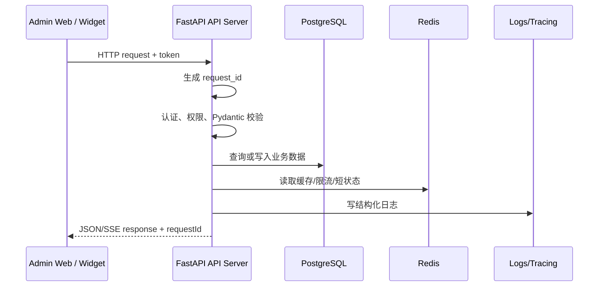

前端处理规则：

- `401`：清理 Access Token，尝试 refresh；refresh 失败跳转登录。
- `403`：展示无权限状态，不重复请求。
- `404`：详情页展示资源不存在或已删除。
- `409`：提示数据已被更新，提供刷新入口。
- `422`：把字段级错误映射到表单项。
- `429`：展示限流提示和可重试时间。
- `5xx`：展示全局错误提示和 `requestId`，便于排查。

## 3. 登录与权限初始化

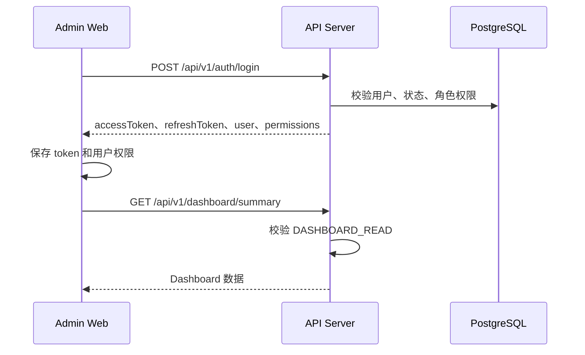

交互规则：

- 登录成功后前端初始化用户、角色、权限和默认路由。
- 权限不足的菜单不展示；直接访问无权限路由时展示无权限页。
- 用户权限变更后，新请求以后端权限为准；前端需要在 `403` 后刷新当前用户权限缓存。

## 4. 知识导入到发布流程

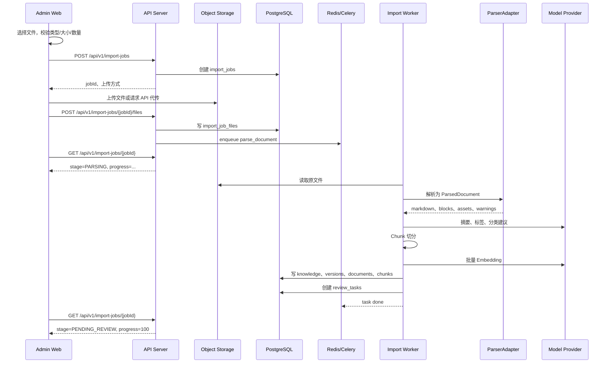

前端状态展示：

| 阶段 | 前端展示 |
| --- | --- |
| `CREATED` | 已创建任务 |
| `UPLOADING` | 上传进度 |
| `PARSING` | 正在解析文档 |
| `CHUNKING` | 正在切片 |
| `EMBEDDING` | 正在向量化 |
| `PENDING_REVIEW` | 待审核 |
| `COMPLETED` | 导入完成 |
| `FAILED` | 失败原因、重试、下载原文件、删除 |

审核发布：

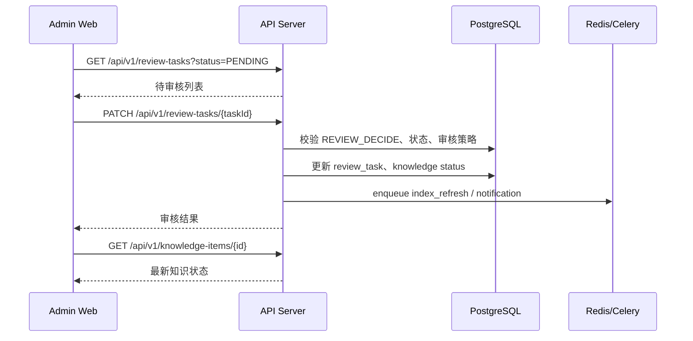

规则：

- 已发布知识编辑后进入新版本或待审核，不直接覆盖线上版本。
- 发布时如果索引未完成，后端返回 `409` 或 `422`，前端提示等待索引完成。
- 批量审核需要展示逐条成功和失败原因。

## 5. AI 问答与 SSE 流式输出

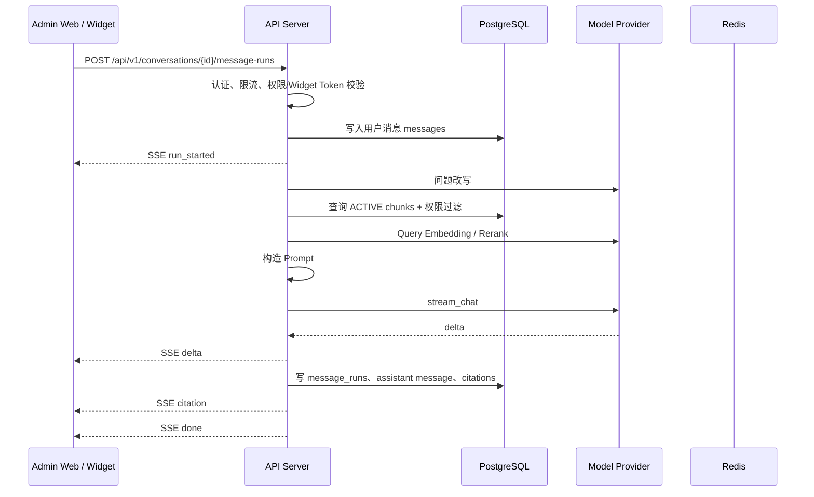

SSE 事件：

| 事件 | 用途 |
| --- | --- |
| `run_started` | 返回 `runId`、`messageId` |
| `delta` | 增量文本 |
| `citation` | 引用来源 |
| `done` | 完成，返回用量和耗时 |
| `error` | 失败，返回标准错误结构 |

知识不足路径：

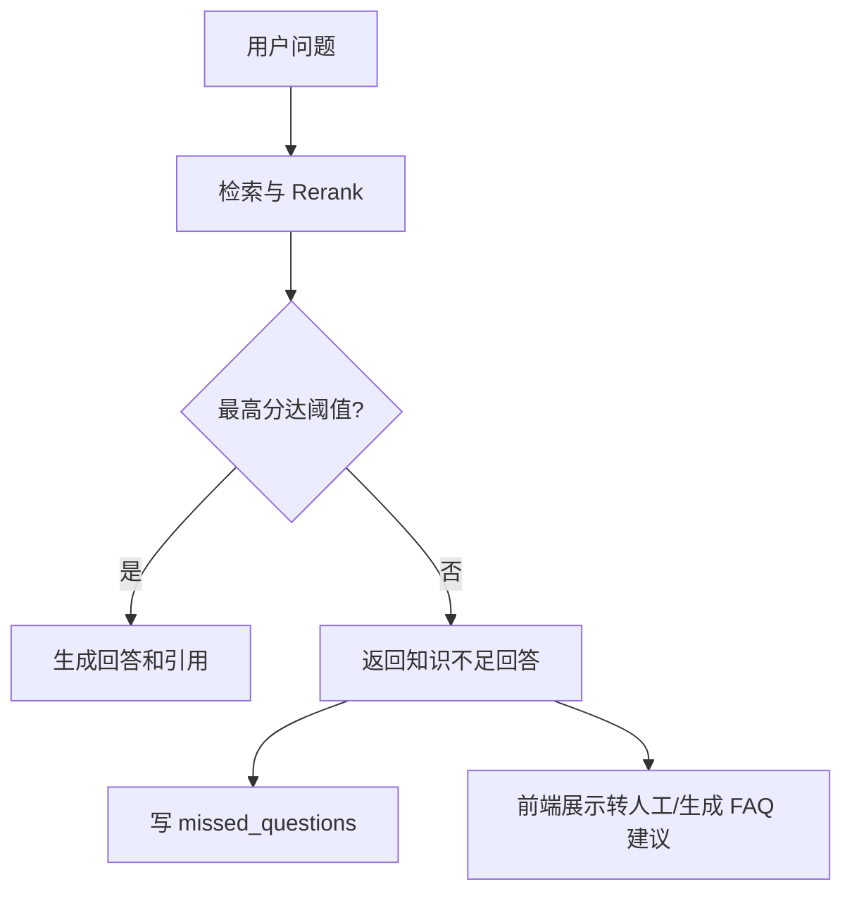

前端处理：

- 输入后禁用当前会话再次发送，或进入排队状态。
- `delta` 持续追加到当前回答。
- `citation` 到达后更新引用区域。
- `done` 后释放输入框、失效会话消息查询缓存。
- `error` 后保留用户问题和已生成片段，允许重试。

## 6. 会话转工单流程

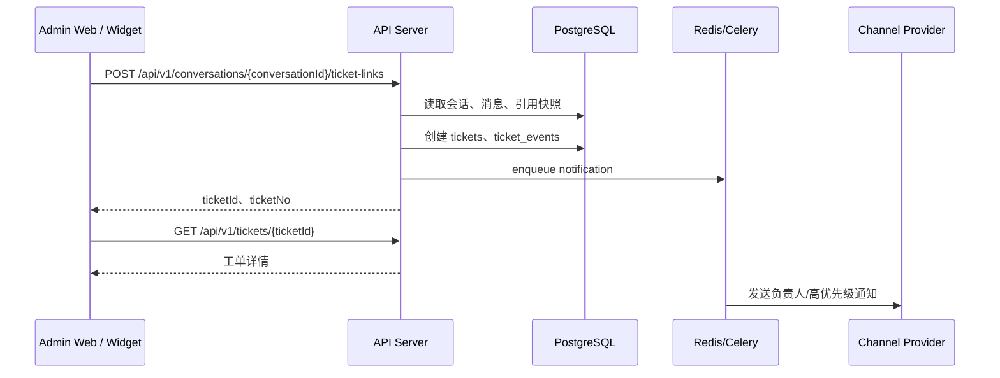

规则：

- 创建工单时自动带入客户问题、聊天记录、AI 回答和引用知识。
- 创建失败时前端保留当前会话内容和表单内容。
- 工单关闭必须填写处理结果。
- 工单关闭后可选择生成 FAQ 草稿进入审核流程。

## 7. 未命中问题生成 FAQ 草稿

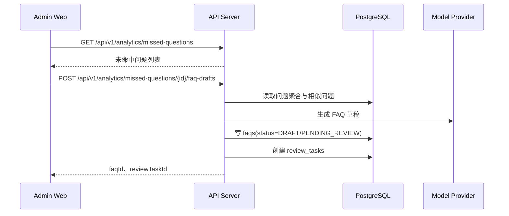

规则：

- AI 生成的 FAQ 草稿不能自动发布。
- 前端跳转 FAQ 编辑页或审核页。
- 如果模型不可用，后端返回 `503`，前端提示稍后重试或手工创建 FAQ。

## 8. AI 配置与连接测试

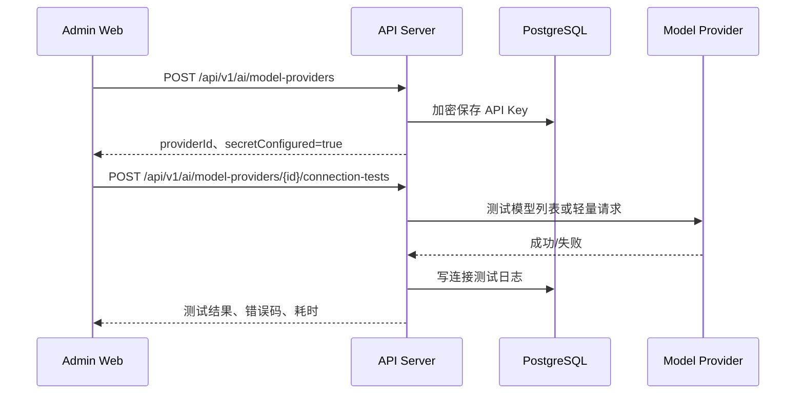

规则：

- Secret 保存后不回显明文。
- 连接测试不能把 API Key、Authorization header 写入日志。
- RAG 参数保存后只对新会话生效。
- 高风险配置变更写入 `audit_logs`。

## 9. Webhook 派发流程

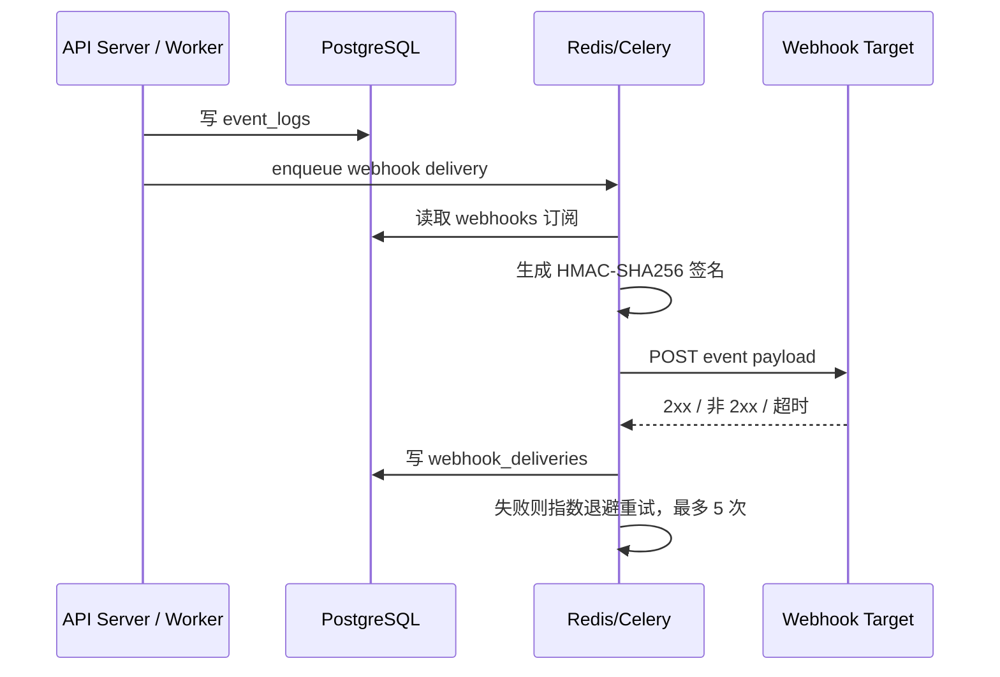

事件类型：

```text
knowledge.published
knowledge.archived
ai.answer.generated
ai.missed_question.detected
ticket.created
ticket.updated
ticket.closed
```

前端交互：

- Webhook 配置页支持事件选择、URL、Secret、连接测试。
- 投递记录页展示状态、响应码、最近错误、下一次重试时间。
- Secret 创建或轮换后只展示一次。

## 10. Widget 交互流程

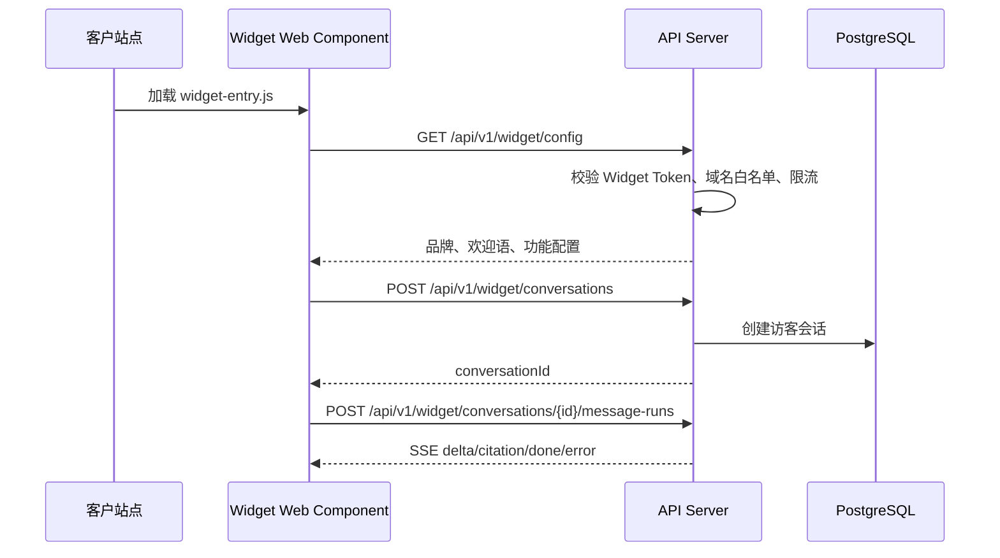

安全限制：

- Widget Token 不等同后台用户 Token。
- Widget API 不返回内部知识详情 URL。
- 引用只展示公开标题、摘要、页码或片段。
- 限流维度包括 IP、Widget Token、域名和会话。
- CORS 与后台管理端分开配置。

## 11. 缓存与数据失效

前端 TanStack Query 缓存建议：

| 数据 | 失效策略 |
| --- | --- |
| 当前用户权限 | 登录、刷新 Token、收到 403 后刷新 |
| Dashboard 指标 | 时间范围或筛选变化后刷新；可短缓存 |
| 知识列表 | 创建、编辑、审核、发布、归档、删除后失效 |
| 导入任务 | 任务未完成时轮询；完成或失败后停止 |
| 会话消息 | SSE 完成后失效并重新拉取 |
| 工单列表 | 创建、转派、状态变更、备注后失效 |
| AI 配置 | 保存、测试连接、启停供应商后失效 |
| 系统设置 | 保存后失效并重新拉取 |

## 12. 观测链路

```text
request_id:
  Web request -> API route -> Service -> Repository/Adapter -> response

run_id:
  question -> rewrite -> retrieval -> rerank -> prompt -> model stream -> citations -> feedback
```

要求：

- 前端错误提示中展示 `requestId`，便于运维定位。
- AI 回答详情页可展示 `runId` 给管理员排障。
- Worker 任务记录 `task_runs`，导入任务页面可查看失败阶段和错误。
- Webhook、通知、模型调用错误必须可在日志页筛选。

## 13. 前后端联调验收

- [ ] 登录、刷新 Token、退出流程完整。
- [ ] 403、404、409、422、429、5xx 都有前端状态处理。
- [ ] 知识上传长任务可离开页面后继续查看。
- [ ] 解析失败、Embedding 失败、通知失败可查询且可重试。
- [ ] AI SSE 支持开始、增量、引用、完成和错误事件。
- [ ] 会话转工单保留聊天记录和引用。
- [ ] 未命中生成 FAQ 草稿进入审核流程。
- [ ] Widget 仅能访问 Widget API，不暴露后台能力。
- [ ] Webhook 投递记录和重试状态可在前端查看。
- [ ] request_id 和 run_id 能贯穿前端提示、后端日志和数据库记录。
