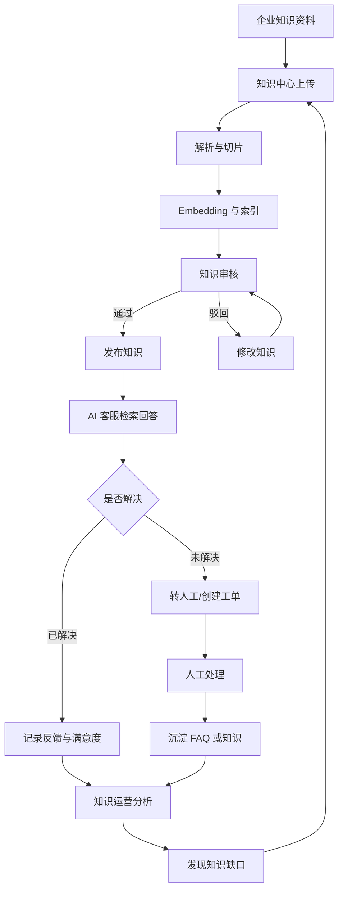
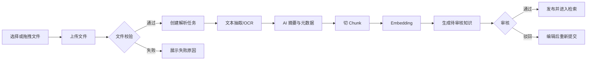
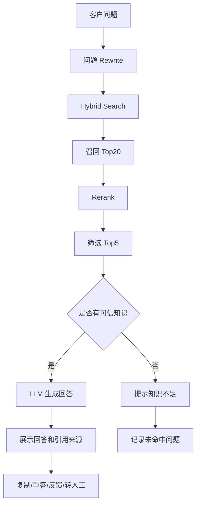

# V1 产品 PRD：AI Customer Service Hub

版本：V1.0  
日期：2026-07-04  
来源：`docs/v1-product-requirement-analysis.md`  
状态：产品需求分析稿

## 0. 文档说明

本文档基于第一版需求列表，面向产品、设计、研发、测试和后续 AI Agent 实施任务，定义 AI 客服知识中心 V1 的产品范围、用户场景、业务流程、功能规则、交互要求、非功能需求和验收标准。

### 0.1 产品定位

AI Customer Service Hub 不是单纯的知识库，而是面向企业客服场景的 AI 知识运营与客服辅助系统。V1 的目标是跑通一个完整闭环：

```text
企业上传知识 -> AI 自动整理 -> 客服和客户可用 -> 企业知道 AI 是否真正解决问题 -> 持续补充知识
```

### 0.2 V1 范围原则

- 做企业可用的闭环，而不是堆叠所有高级能力。
- 一级模块控制在 8 个以内，降低学习成本和实施复杂度。
- 所有 AI 回答必须可追溯引用来源，避免企业无法信任。
- 知识中心是核心资产，AI 客服、工单和运营分析都围绕知识资产运转。
- CRM、ERP、订单中心、自动退款、Agent 工作流、多渠道深度集成等能力不进入 V1 主范围。

### 0.3 关键假设

- [Assumption] V1 主要面向企业内部后台使用，包含一个可供客户访问的 Web AI 问答入口或嵌入入口。
- [Assumption] V1 支持单企业或单租户优先；多租户 SaaS 能力可在技术设计中预留，但不作为第一版复杂运营能力。
- [Assumption] AI 能力通过可配置模型供应商接入，至少支持三种在线大模型和一种 Embedding 能力。
- [Assumption] 文档解析、向量化和 RAG 检索采用异步任务，前端展示任务状态，不要求用户同步等待全部完成。

## 1. 项目背景

### 1.1 核心痛点

企业客服知识通常存在以下问题：

1. 知识分散  
   产品说明、FAQ、售后 SOP、历史工单、聊天记录散落在文档、网盘、企业微信、飞书、Notion、内部系统中，客服无法快速找到准确答案。

2. 知识难以被 AI 直接使用  
   PDF、Word、Excel、网页等资料没有统一解析、切片、标签、版本和审核流程，即使接入大模型，也容易回答不稳定或引用不准确。

3. AI 回答缺少可信来源  
   企业无法接受“看起来对”的回答。客服和主管需要知道答案来自哪份知识、哪一页、哪条 FAQ、哪个 Chunk。

4. 客服经验无法沉淀  
   人工接管、工单处理、未命中问题和高频问题如果不能回流为知识，系统不会持续变聪明。

5. 管理层缺少运营视角  
   企业需要知道 AI 回答率、命中率、满意率、人工接管率、知识缺口和知识健康度，而不是只看到聊天记录。

### 1.2 业务目标

V1 的业务目标是验证企业付费基础能力：

- 目标 1：知识可高质量接入和治理  
  支持企业上传多格式知识，完成解析、切片、Embedding、审核、发布和归档。

- 目标 2：AI 可基于企业知识稳定回答  
  支持 RAG 问答、混合检索、引用来源、多轮上下文和客服反馈。

- 目标 3：客服可把 AI 作为可控工具使用  
  客服能够复制、重答、点赞、点踩、转人工、创建工单和查看引用。

- 目标 4：系统可持续优化知识  
  管理员能够从未命中问题、热门问题、低满意回答和知识健康指标中发现缺口，并补充 FAQ 或文档。

- 目标 5：管理层可量化 AI 客服效果  
  Dashboard 提供咨询量、AI 回答量、命中率、满意率、人工接管率、工单量和知识增长趋势。

### 1.3 成功指标

| 指标 | V1 目标 | 说明 |
| --- | --- | --- |
| 知识接入完成率 | >= 95% | 上传任务最终成功或给出明确失败原因 |
| AI 引用覆盖率 | >= 95% | AI 回答必须展示至少 1 个可点击引用，闲聊和无知识回答除外 |
| AI 命中率 | >= 70% | 有足够知识时，问题可被检索到有效知识 |
| 人工接管率 | 可观测 | V1 不强行降低，但必须可统计 |
| 未命中闭环效率 | <= 3 步 | 未命中问题到生成 FAQ 建议不超过 3 次主要操作 |
| 客服可用性 | <= 2 秒看到首字 | AI 回答支持流式输出时，首字响应满足体验目标 |
| 知识治理可用性 | 100% 状态可追踪 | 上传、解析、切片、向量化、审核、发布均有状态 |

## 2. 用户与场景

### 2.1 目标用户画像

#### 2.1.1 企业老板 / 管理层

- 关注点：客服成本、AI 替代率、客户满意度、投诉风险、知识资产增长。
- 高频动作：查看 Dashboard、查看趋势、查看未命中和热门问题。
- 成功体验：打开首页就知道 AI 是否真的减少人工压力。

#### 2.1.2 客服主管

- 关注点：客服效率、人工接管、工单处理质量、知识缺口、客服绩效。
- 高频动作：查看 AI 命中分析、未命中问题、工单详情、低满意回答。
- 成功体验：能从数据直接定位需要补知识或培训客服的地方。

#### 2.1.3 知识管理员

- 关注点：知识上传、解析质量、分类标签、审核发布、版本、失效治理。
- 高频动作：上传文档、编辑知识、审核 FAQ、修正 Chunk、发布知识。
- 成功体验：不需要手工整理大量文档，AI 自动生成摘要、标签和分类。

#### 2.1.4 一线客服

- 关注点：快速回答客户问题、答案可信、可转人工、可创建工单。
- 高频动作：使用 AI 聊天、复制答案、查看引用、重答、反馈、转工单。
- 成功体验：AI 给出的答案可直接使用或稍作修改即可发送。

#### 2.1.5 系统管理员

- 关注点：模型配置、Prompt、RAG 参数、用户角色、API、Webhook、日志、备份。
- 高频动作：配置模型供应商、维护 Prompt 模板、分配权限、排查日志。
- 成功体验：系统配置清晰可控，出问题能追踪。

#### 2.1.6 访客 / 客户

- 关注点：快速得到准确答案，必要时转人工或提交工单。
- 高频动作：在 Web AI 问答入口提问、查看回答、反馈满意度。
- 成功体验：不用等待人工，也能拿到来源清晰的答案。

### 2.2 核心使用路径

#### 场景一：知识导入

```text
登录 -> 知识中心 -> 上传 PDF/Word/网页/FAQ -> AI 解析 -> 自动摘要
-> 自动分类和标签 -> 自动切片 -> Embedding -> 审核 -> 发布 -> AI 可查询
```

#### 场景二：客服回答

```text
客户提问 -> AI 改写问题 -> 混合检索 -> Rerank -> 生成回答
-> 展示引用来源 -> 客服确认 -> 复制/发送/转人工/生成工单
```

#### 场景三：知识持续优化

```text
AI 未命中 -> 进入知识运营 -> 查看缺失问题 -> 生成 FAQ 建议
-> 知识管理员审核 -> 发布 FAQ -> 重新索引 -> AI 回答率提升
```

#### 场景四：工单处理

```text
AI 无法解决或客户要求人工 -> 创建工单 -> 分配负责人
-> 查看聊天记录和 AI 建议 -> 处理备注 -> 关闭工单 -> 沉淀知识
```

### 2.3 用户故事

#### US-001：查看客服运行总览

**描述：** 作为企业管理层，我希望在首页看到今日咨询、AI 回答、命中率、人工接管率和趋势，以便判断 AI 客服是否有效降低人工压力。

**验收标准：**

- [ ] Dashboard 展示今日咨询量、今日 AI 回答、今日人工回答、今日工单、今日新增知识。
- [ ] Dashboard 展示 AI 回答率、命中率、准确率、满意率。
- [ ] 趋势图至少支持 AI 回答、人工回答、工单数量三条指标。
- [ ] 数据为空时展示空状态，而不是显示错误或异常数值。
- [ ] UI 变更需在浏览器中完成桌面和移动宽度验证。

#### US-002：上传并处理知识文档

**描述：** 作为知识管理员，我希望上传文档后系统自动解析、切片和向量化，以便让 AI 尽快使用企业知识。

**验收标准：**

- [ ] 上传中心支持拖拽和文件选择。
- [ ] 上传任务展示上传进度、解析状态、切片状态、Embedding 状态和失败原因。
- [ ] 上传完成后生成摘要、标签、关键词、分类建议和 Chunk 数量。
- [ ] 解析失败时保留原文件记录，并允许重试或删除。
- [ ] UI 变更需在浏览器中完成桌面和移动宽度验证。

#### US-003：审核并发布知识

**描述：** 作为知识管理员，我希望审核 AI 解析后的知识内容，以便只有可信知识进入 AI 检索范围。

**验收标准：**

- [ ] 知识支持待审核、已发布、已归档状态。
- [ ] 未发布知识默认不进入客户侧 AI 检索。
- [ ] 审核通过后状态变为已发布，并进入索引更新流程。
- [ ] 审核驳回时必须填写原因。
- [ ] 所有审核动作记录操作人和时间。

#### US-004：查看和编辑知识详情

**描述：** 作为知识管理员，我希望查看知识正文、目录、AI 摘要和 Chunk，以便修正解析错误和提升召回质量。

**验收标准：**

- [ ] 知识详情左侧展示目录，右侧展示正文，底部或侧栏展示 Chunk 列表。
- [ ] AI 分析区展示摘要、关键词、标签和引用次数。
- [ ] Chunk 支持查看和编辑。
- [ ] 修改已发布知识后需生成新版本或重新进入审核流程。
- [ ] UI 变更需在浏览器中完成桌面和移动宽度验证。

#### US-005：管理 FAQ

**描述：** 作为知识管理员，我希望维护 FAQ 问答，以便高频问题可以被 AI 准确命中。

**验收标准：**

- [ ] FAQ 列表展示问题、答案、分类、状态和更新时间。
- [ ] FAQ 支持新增、编辑、删除、审核、发布。
- [ ] FAQ 发布后进入检索索引。
- [ ] 删除已发布 FAQ 前展示确认提示。
- [ ] FAQ 问题为空或答案为空时不能保存。

#### US-006：使用 AI 客服回答问题

**描述：** 作为一线客服，我希望输入客户问题后获得 AI 回答和引用来源，以便快速给客户可信答案。

**验收标准：**

- [ ] AI 聊天页左侧展示聊天历史，右侧展示聊天窗口。
- [ ] AI 回答展示引用知识名称、类型、页码或 Chunk 位置。
- [ ] 支持复制、重新回答、点赞、点踩和转人工。
- [ ] 没有命中知识时，AI 必须明确提示知识不足，不得编造答案。
- [ ] UI 变更需在浏览器中完成桌面和移动宽度验证。

#### US-007：转人工并创建工单

**描述：** 作为客服，我希望在 AI 无法解决时把会话转为工单，以便人工继续处理并保留上下文。

**验收标准：**

- [ ] AI 聊天页支持转人工入口。
- [ ] 创建工单时自动带入客户问题、聊天记录、AI 回答、引用知识。
- [ ] 工单支持负责人、状态、备注和关闭。
- [ ] 工单详情展示 AI 推荐解决方案。
- [ ] 创建失败时提示原因，并保留当前会话内容。

#### US-008：分析未命中问题

**描述：** 作为客服主管，我希望看到最近未命中问题和知识缺口，以便安排补充 FAQ 或文档。

**验收标准：**

- [ ] 知识运营页展示未命中问题列表。
- [ ] 未命中问题支持按次数、时间、分类筛选。
- [ ] 未命中问题支持生成 FAQ 草稿。
- [ ] 生成的 FAQ 草稿必须进入审核流程。
- [ ] UI 变更需在浏览器中完成桌面和移动宽度验证。

#### US-009：查看热门知识和知识健康

**描述：** 作为客服主管，我希望查看热门知识、长期无人访问知识、重复知识和疑似失效知识，以便持续治理知识质量。

**验收标准：**

- [ ] 知识运营页展示热门知识 TOP100 和热门问题 TOP100。
- [ ] 系统标记重复、失效、长期无人访问的知识。
- [ ] 健康问题可跳转到对应知识详情。
- [ ] 指标计算失败时展示最近一次成功计算结果和更新时间。

#### US-010：配置模型和 RAG 参数

**描述：** 作为系统管理员，我希望配置模型、Prompt 和 RAG 参数，以便根据企业场景调整 AI 回答质量。

**验收标准：**

- [ ] 模型管理支持 OpenAI、Claude、DeepSeek、Qwen、Ollama、Gemini 的配置入口。
- [ ] Prompt 模板支持客服、售后、退款等场景。
- [ ] RAG 参数支持 Chunk、TopK、Temperature、Embedding、Rerank 配置。
- [ ] 保存配置前进行必填项校验。
- [ ] 配置变更记录操作人、时间和变更摘要。

#### US-011：管理用户角色和权限

**描述：** 作为系统管理员，我希望管理用户、角色和权限，以便不同岗位只访问自己需要的功能和数据。

**验收标准：**

- [ ] 用户列表展示姓名、部门、角色和状态。
- [ ] 支持管理员、知识管理员、客服、访客四类基础角色。
- [ ] 权限至少覆盖知识、上传、审核、删除、AI 聊天、工单。
- [ ] 无权限访问页面时展示 403 状态或无权限提示。
- [ ] 权限变更后用户重新进入页面时生效。

#### US-012：维护系统设置

**描述：** 作为系统管理员，我希望配置企业信息、Logo、API、Webhook、日志和备份，以便系统可被企业正式使用。

**验收标准：**

- [ ] 系统设置包含企业信息、Logo、API、Webhook、日志、备份入口。
- [ ] API Key 和 Webhook Secret 不在前端明文展示。
- [ ] 日志支持按时间、模块、级别筛选。
- [ ] 备份任务展示状态、时间和结果。
- [ ] 配置保存失败时展示明确错误。

## 3. 业务与功能

### 3.1 总体业务流程图



### 3.2 知识导入流程图



### 3.3 AI 回答流程图



### 3.4 信息架构图

```mermaid
flowchart TD
    Root[AI Customer Service Hub]
    Root --> Dashboard[1. 首页 Dashboard]
    Root --> Knowledge[2. 知识中心]
    Root --> Chat[3. AI 客服]
    Root --> Ticket[4. 工单中心]
    Root --> Ops[5. 知识运营]
    Root --> AIConfig[6. AI 配置]
    Root --> Permission[7. 用户权限]
    Root --> Settings[8. 系统设置]

    Knowledge --> K1[知识列表]
    Knowledge --> K2[上传中心]
    Knowledge --> K3[知识详情]
    Knowledge --> K4[FAQ]
    Knowledge --> K5[知识审核]

    Chat --> C1[AI 聊天]
    Chat --> C2[聊天历史]
    Chat --> C3[引用来源]
    Chat --> C4[反馈与转人工]

    Ticket --> T1[工单列表]
    Ticket --> T2[工单详情]
    Ticket --> T3[转派/备注/关闭]

    Ops --> O1[AI 命中分析]
    Ops --> O2[未命中分析]
    Ops --> O3[热门知识]
    Ops --> O4[热门问题]
    Ops --> O5[知识健康]

    AIConfig --> A1[模型管理]
    AIConfig --> A2[Prompt 模板]
    AIConfig --> A3[RAG 参数]

    Permission --> P1[用户]
    Permission --> P2[角色]
    Permission --> P3[权限]

    Settings --> S1[企业信息]
    Settings --> S2[Logo]
    Settings --> S3[API]
    Settings --> S4[Webhook]
    Settings --> S5[日志]
    Settings --> S6[备份]
```



### 3.5 全局功能列表

| 一级模块 | 页面 | 核心功能 | 优先级 |
| --- | --- | --- | --- |
| 首页 Dashboard | Dashboard | 今日数据、AI 数据、趋势图、最近未命中、最近新增知识、待审核知识 | P0 |
| 知识中心 | 知识列表 | 搜索、分类、标签、来源、更新时间、状态、查看、编辑、删除、复制、审核、发布、归档 | P0 |
| 知识中心 | 上传中心 | 拖拽上传、进度、解析状态、Embedding 状态、失败原因、AI 摘要、标签、关键词、分类、Chunk 数 | P0 |
| 知识中心 | 知识详情 | 目录、正文、Chunk、摘要、关键词、标签、引用次数、Chunk 修改 | P0 |
| 知识中心 | FAQ | FAQ 新增、编辑、删除、审核、发布、分类、状态 | P0 |
| 知识中心 | 知识审核 | 待审核、已发布、已归档、审批、驳回、发布 | P0 |
| AI 客服 | AI 聊天 | 聊天历史、回答生成、引用来源、复制、重答、点赞、点踩、转人工 | P0 |
| 工单中心 | 工单列表 | 工单号、客户、问题、状态、负责人、更新时间、筛选、搜索 | P0 |
| 工单中心 | 工单详情 | 客户、聊天记录、AI 建议、知识引用、处理记录、转派、关闭、备注 | P0 |
| 知识运营 | AI 命中分析 | 命中率、满意率、AI 回答率、人工接管率 | P0 |
| 知识运营 | 未命中分析 | 未命中问题、缺失知识建议、生成 FAQ | P0 |
| 知识运营 | 热门知识/问题 | TOP100 排行、筛选、跳转详情 | P1 |
| 知识运营 | 知识健康 | 重复、失效、长期无人访问、治理建议 | P1 |
| AI 配置 | 模型管理 | OpenAI、Claude、DeepSeek、Qwen、Ollama、Gemini 配置 | P0 |
| AI 配置 | Prompt 模板 | 客服、售后、退款等模板维护 | P0 |
| AI 配置 | RAG 参数 | Chunk、TopK、Temperature、Embedding、Rerank 在线调整 | P0 |
| 用户权限 | 用户 | 用户列表、部门、角色、状态、邀请、禁用 | P0 |
| 用户权限 | 角色权限 | 管理员、知识管理员、客服、访客、权限分配 | P0 |
| 系统设置 | 企业信息 | 企业名称、Logo、基础资料 | P1 |
| 系统设置 | API/Webhook | API Key、Webhook 配置、回调测试 | P1 |
| 系统设置 | 日志/备份 | 操作日志、系统日志、备份任务、恢复记录 | P1 |

### 3.6 领域实体

| 领域 | 核心实体 |
| --- | --- |
| 知识管理 | Knowledge、Document、Chunk、Category、Tag、Version |
| AI 检索 | Embedding、RetrieverConfig、Citation、SearchLog |
| 客服会话 | Conversation、Message、Session、Feedback |
| 工单 | Ticket、TicketComment、TicketStatus |
| 用户权限 | User、Role、Permission、Department |
| 运营分析 | MissedQuestion、KnowledgeStats、AnswerStats |
| 系统配置 | ModelProvider、PromptTemplate、SystemConfig、WebhookConfig |

## 4. 详细功能需求

### 4.1 全局交互与 UI/UE 规范

#### 4.1.1 导航与布局

- 采用左侧一级导航，一级菜单固定为：首页 Dashboard、知识中心、AI 客服、工单中心、知识运营、AI 配置、用户权限、系统设置。
- 顶部区域展示当前企业、当前用户、通知、全局搜索入口。
- 内容区采用“页面标题 + 关键操作 + 筛选区 + 主内容”的稳定结构。
- 数据列表页面必须提供搜索、筛选、刷新、分页和空状态。
- 关键写操作必须有二次确认或保存反馈，包括删除、发布、归档、关闭工单、禁用用户。

#### 4.1.2 状态规范

- 加载中：使用骨架屏或行内 loading，不阻塞全页导航。
- 空状态：说明当前没有数据，并提供一个可执行的下一步操作。
- 错误状态：展示用户可理解的原因和重试入口。
- 成功状态：保存、发布、上传、配置变更需给出明确反馈。
- 长任务状态：上传、解析、切片、Embedding、索引更新必须展示阶段状态。

#### 4.1.3 表格与筛选

- 表格默认支持列排序、分页、状态筛选和关键词搜索。
- 列表批量操作只对同状态或允许批处理的数据开放。
- 筛选条件变更后保留在 URL 参数中，便于刷新和分享。
- 敏感操作列根据权限动态显示，不允许仅前端隐藏。

#### 4.1.4 表单规则

- 必填字段在保存前校验，并在字段旁展示错误文案。
- 长文本输入支持自动保存草稿或离开确认，避免内容丢失。
- 配置类表单保存后展示最新更新时间和操作人。
- 文件上传表单必须提前校验文件类型、大小和数量。

### 4.2 首页 Dashboard

#### 4.2.1 功能目标

让管理层和客服主管在一个页面理解当日客服运行状态、AI 效果、知识增长和待处理风险。

#### 4.2.2 页面内容

- 今日咨询量
- 今日 AI 回答
- 今日人工回答
- 今日工单
- 今日新增知识
- AI 回答率
- 命中率
- 准确率
- 满意率
- 人工接管率
- AI 回答/人工回答/工单数量趋势
- 最近热门问题
- 最近未命中问题
- 最近新增知识
- 待审核知识

#### 4.2.3 交互规则

- 指标卡点击后跳转到对应分析或列表页面，并自动带入筛选条件。
- 趋势图支持最近 7 天、30 天、自定义日期范围。
- 最近未命中问题支持“生成 FAQ”快捷操作。
- 待审核知识支持跳转到知识审核页。
- Dashboard 默认展示今日数据，刷新时保持用户选择的时间范围。

#### 4.2.4 边界条件与异常处理

- 无数据时所有指标显示 `0`，趋势图显示空状态。
- 指标计算失败时显示“统计暂不可用”，并保留最近一次成功更新时间。
- 数据权限不足时隐藏对应模块卡片或展示无权限占位。
- 趋势接口响应慢时先展示指标卡，再局部加载图表。

### 4.3 知识中心

知识中心是 V1 的核心模块，包含知识列表、上传中心、知识详情、FAQ、知识审核五个页面。

#### 4.3.1 知识列表

##### 功能范围

- 查看全部知识。
- 按搜索关键词、分类、标签、来源、更新时间、状态筛选。
- 支持新增、编辑、删除、复制、查看、上传、审核、发布、归档。
- 支持文件类型：PDF、Word、Excel、PPT、Markdown、TXT、HTML、FAQ、网页。

##### 列表字段

| 字段 | 说明 |
| --- | --- |
| 知识名称 | 文档标题或 FAQ 标题 |
| 类型 | PDF、Word、FAQ、网页等 |
| 分类 | 知识所属业务分类 |
| 标签 | AI 或人工维护标签 |
| 来源 | 上传、网页、手工录入、FAQ 生成 |
| 更新时间 | 最近内容或状态变更时间 |
| 状态 | 上传中、解析中、待审核、已发布、已归档、失败 |
| 操作 | 查看、编辑、复制、审核、发布、归档、删除 |

##### 交互规则

- 点击知识名称进入知识详情。
- 未完成解析的知识只允许查看状态、重试、删除，不允许发布。
- 已发布知识编辑后应进入“待审核”或产生新版本，避免线上知识被无审核覆盖。
- 删除已发布知识需要二次确认，并提示删除后 AI 不再引用。
- 复制知识时复制正文、分类、标签，不复制引用次数和历史反馈。

##### 边界条件与异常处理

- 搜索无结果时展示空状态和“清空筛选”入口。
- 知识被工单或历史回答引用时，删除前提示影响范围。
- 批量发布时，如果部分知识未通过校验，需展示逐条失败原因。
- 分类或标签被删除后，知识列表展示“未分类”或移除失效标签。

#### 4.3.2 上传中心

##### 功能范围

- 拖拽上传和文件选择。
- 展示上传进度、解析状态、切片状态、Embedding 状态、失败原因。
- 上传完成后自动生成 AI 摘要、标签、关键词、分类建议、Chunk 数量。
- 支持解析失败重试。

##### 上传流程

1. 用户选择文件或输入网页 URL。
2. 系统校验文件类型、大小、重复文件和权限。
3. 上传成功后创建解析任务。
4. 系统执行文本抽取、OCR 或网页抓取。
5. 系统生成摘要、标签、关键词和分类建议。
6. 系统切 Chunk 并生成 Embedding。
7. 任务完成后进入待审核状态。

##### UI/UE 规范

- 上传区需要清晰展示支持格式和大小限制。
- 任务列表需要按最新上传时间倒序。
- 每个任务展示阶段进度，避免只显示一个模糊的“处理中”。
- 失败任务必须展示失败阶段和原因。
- 长任务允许用户离开页面，返回后继续查看进度。

##### 边界条件与异常处理

- 文件类型不支持：上传前阻止并提示支持格式。
- 文件过大：上传前阻止并提示最大大小。
- 重复上传：提示已存在相似文件，可选择继续上传为新版本。
- 解析失败：展示失败原因，允许重试、下载原文件、删除记录。
- Embedding 失败：保留解析结果，允许单独重试向量化。
- 网络中断：上传任务支持断点或失败重试；不支持断点时需提示重新上传。

#### 4.3.3 知识详情

##### 页面结构

- 左侧：目录。
- 右侧：正文。
- 底部或右侧：Chunk 列表。
- AI 分析区：摘要、关键词、标签、引用次数。
- 操作区：编辑、提交审核、发布、归档、复制、删除。

##### 交互规则

- 点击目录定位正文段落。
- 点击 Chunk 定位到正文对应片段。
- 编辑 Chunk 后必须触发重新 Embedding。
- 修改正文后系统提示可能影响 Chunk 和引用。
- 引用次数点击后跳转到引用记录或相关回答列表。

##### 边界条件与异常处理

- 原文无法预览时提供下载入口。
- Chunk 与正文映射失败时展示 Chunk 文本，但不高亮正文。
- 已归档知识不可编辑，需恢复后编辑。
- 无权限用户只能查看已发布知识，不能查看待审核或归档知识。

#### 4.3.4 FAQ 管理

##### 功能范围

- FAQ 列表。
- 新增、编辑、删除、审核、发布。
- 分类、标签、状态管理。
- 从未命中问题生成 FAQ 草稿。

##### 字段规则

| 字段 | 规则 |
| --- | --- |
| 问题 | 必填，建议不超过 200 字 |
| 答案 | 必填，支持富文本或 Markdown |
| 分类 | 必填或默认未分类 |
| 标签 | 可选，多选 |
| 状态 | 草稿、待审核、已发布、已归档 |
| 来源 | 手工创建、未命中生成、文档抽取 |

##### 边界条件与异常处理

- 问题重复时提示相似 FAQ。
- 答案为空不能提交审核。
- 已发布 FAQ 删除前二次确认。
- FAQ 审核驳回必须填写原因。

#### 4.3.5 知识审核

##### 功能范围

- 待审核、已发布、已归档三类视图。
- 审批通过、驳回、发布、归档。
- 查看 AI 摘要、分类、标签、Chunk 预览和原文。

##### 交互规则

- 审核通过后进入发布或待发布状态，具体由权限策略决定。
- 驳回后知识回到编辑状态，并记录驳回原因。
- 已发布知识归档后不再参与客户侧检索。
- 审核记录不可删除。

##### 边界条件与异常处理

- 审核时发现索引未完成，阻止发布并提示等待索引完成。
- 审核对象已被他人更新时提示刷新。
- 批量审核存在失败项时展示成功和失败明细。

### 4.4 AI 客服

#### 4.4.1 功能目标

让客服或客户通过自然语言提问，获得基于企业知识的回答，并清晰看到引用来源。

#### 4.4.2 页面结构

- 左侧：聊天历史。
- 右侧：聊天窗口。
- 回答卡片：AI 回答、引用来源、操作按钮。
- 操作按钮：复制、重新回答、点赞、点踩、转人工。

#### 4.4.3 交互规则

- 用户输入问题后，系统开始生成回答，并展示流式输出或加载状态。
- 回答必须展示引用来源，包括知识名称、类型、页码或 Chunk。
- 引用可点击跳转到知识详情的对应位置。
- 重新回答会保留原回答，用于对比和反馈。
- 点赞和点踩需要记录到反馈日志。
- 点踩后可选反馈原因：不准确、没有引用、答案不完整、语气不合适、其他。
- 转人工时自动创建工单或进入工单创建确认页。

#### 4.4.4 AI 回答规则

- 有可信知识时，优先基于检索结果回答。
- 没有可信知识时，必须提示知识不足，并记录未命中问题。
- 回答中不得编造企业政策、价格、退款、售后承诺。
- 引用来源不足时，回答应降低确定性表达。
- 多轮对话需要结合当前会话上下文，但不得跨客户泄露上下文。

#### 4.4.5 边界条件与异常处理

- 模型调用失败：提示 AI 服务暂不可用，并允许重试。
- 检索无结果：提示暂无相关知识，并提供转人工或生成 FAQ 建议。
- 回答超时：终止生成并允许重试。
- 引用知识已被归档：历史回答仍可展示引用快照，但新回答不再使用。
- 用户连续发送：需要排队或限制并发，避免上下文错乱。

### 4.5 工单中心

#### 4.5.1 功能目标

承接 AI 无法解决或需要人工处理的问题，并将处理过程沉淀为知识运营输入。

#### 4.5.2 工单列表字段

- 工单号
- 客户
- 问题
- 状态
- 负责人
- 更新时间

#### 4.5.3 工单详情字段

- 客户信息
- 原始问题
- 聊天记录
- AI 建议
- 知识引用
- 处理记录
- 备注
- 状态变更记录

#### 4.5.4 交互规则

- 工单支持创建、转派、备注、关闭。
- 转派必须选择负责人。
- 关闭工单必须填写处理结果。
- 工单详情展示 AI 推荐解决方案和引用知识。
- 工单关闭后，可选择沉淀为 FAQ 草稿。

#### 4.5.5 边界条件与异常处理

- 无负责人时允许进入未分配状态，但需在列表中高亮。
- 工单关闭后默认不可编辑处理内容，只允许追加备注。
- 创建工单失败时保留原会话和表单内容。
- 权限不足时不可查看非本人或非本部门工单。

### 4.6 知识运营

#### 4.6.1 功能目标

让企业通过数据发现 AI 不会回答什么、哪些知识最有价值、哪些知识需要治理。

#### 4.6.2 AI 命中分析

展示：

- 命中率
- 满意率
- AI 回答率
- 人工接管率
- 未命中数量
- 低满意回答数量

交互规则：

- 支持按日期、分类、渠道、知识类型筛选。
- 指标点击可跳转到明细列表。
- 指标口径需要在页面上提供说明入口。

#### 4.6.3 未命中分析

展示：

- 最近未命中问题。
- 未命中次数。
- 首次出现时间和最近出现时间。
- AI 建议补充的 FAQ。
- 相关相似问题聚类。

交互规则：

- 支持从未命中问题一键生成 FAQ 草稿。
- 生成 FAQ 草稿后进入 FAQ 审核流程。
- 支持忽略某个未命中问题，忽略后不再进入待处理列表。

#### 4.6.4 热门知识与热门问题

展示：

- 热门知识 TOP100。
- 热门问题 TOP100。
- 知识引用次数。
- 问题出现次数。
- 满意度和点踩率。

边界条件：

- 统计样本不足时展示样本不足提示。
- 排行榜按所选时间范围重新计算。

#### 4.6.5 知识健康

健康问题类型：

- 重复知识。
- 疑似失效知识。
- 长期无人访问知识。
- 高点踩引用知识。
- 解析失败或索引失败知识。

交互规则：

- 健康问题可跳转到知识详情。
- 支持标记为已处理。
- 支持忽略某条健康建议。

### 4.7 AI 配置

#### 4.7.1 模型管理

支持配置入口：

- OpenAI
- Claude
- DeepSeek
- Qwen
- Ollama
- Gemini

配置要求：

- 支持启用/停用供应商。
- 支持配置 API Key、Base URL、模型名称。
- 支持测试连接。
- Secret 字段保存后不再明文展示。
- 模型调用失败需要在日志中记录供应商、模型、错误码和请求时间。

#### 4.7.2 Prompt 模板

模板类型：

- 客服 Prompt。
- 售后 Prompt。
- 退款 Prompt。
- 工单总结 Prompt。
- FAQ 生成 Prompt。

交互规则：

- 模板支持版本。
- 修改已启用模板前提示影响范围。
- 支持恢复历史版本。
- 模板变量需要校验，例如 `{question}`、`{context}`、`{citations}`。

#### 4.7.3 RAG 参数

参数范围：

- Chunk 策略。
- Chunk 大小。
- TopK。
- Temperature。
- Embedding 模型。
- Rerank 模型。
- 相似度阈值。

交互规则：

- 参数保存后对新会话生效。
- 高风险参数变更需提示可能影响回答质量。
- 支持恢复默认值。
- 支持测试问答，比较调整前后效果。

### 4.8 用户权限

#### 4.8.1 基础角色

| 角色 | 说明 |
| --- | --- |
| 管理员 | 拥有系统配置、用户权限、AI 配置和全部业务权限 |
| 知识管理员 | 负责知识上传、编辑、审核、发布和运营治理 |
| 客服 | 使用 AI 聊天、查看授权知识、处理工单 |
| 访客 | 使用客户侧 AI 问答入口，不进入管理后台 |

#### 4.8.2 权限矩阵

| 功能 | 管理员 | 知识管理员 | 客服 | 访客 |
| --- | --- | --- | --- | --- |
| 查看 Dashboard | 是 | 是 | 部分 | 否 |
| 上传知识 | 是 | 是 | 否 | 否 |
| 编辑知识 | 是 | 是 | 否 | 否 |
| 审核知识 | 是 | 是 | 否 | 否 |
| 删除知识 | 是 | 受限 | 否 | 否 |
| 使用 AI 聊天 | 是 | 是 | 是 | 是 |
| 查看引用知识 | 是 | 是 | 授权范围 | 否 |
| 创建工单 | 是 | 是 | 是 | 可选 |
| 处理工单 | 是 | 受限 | 是 | 否 |
| AI 配置 | 是 | 否 | 否 | 否 |
| 用户权限 | 是 | 否 | 否 | 否 |
| 系统设置 | 是 | 否 | 否 | 否 |

#### 4.8.3 权限规则

- 后端必须校验权限，前端隐藏不能作为安全边界。
- 用户权限变更后，新请求必须按新权限执行。
- 访客只能访问客户侧问答入口，不能访问后台导航。
- 删除、发布、归档、配置变更必须记录审计日志。

### 4.9 系统设置

#### 4.9.1 企业信息与 Logo

- 企业名称。
- 企业 Logo。
- 默认语言。
- 默认时区。
- 客服品牌显示名称。

#### 4.9.2 API 与 Webhook

- API Key 管理。
- Webhook URL。
- Webhook Secret。
- 回调事件选择。
- 连接测试。

#### 4.9.3 日志

日志类型：

- 操作日志。
- 系统日志。
- AI 调用日志。
- 上传解析日志。
- 权限变更日志。

筛选条件：

- 时间。
- 模块。
- 操作人。
- 日志级别。
- 请求 ID。

#### 4.9.4 备份

- 手动备份。
- 自动备份策略。
- 备份状态。
- 备份恢复记录。
- 失败告警。

## 5. 非功能需求

### 5.1 性能需求

| 场景 | 目标 |
| --- | --- |
| 后台页面首屏 | 常规网络下 3 秒内可交互 |
| 列表查询 | 10 万级数据分页查询 1 秒内返回基础结果 |
| AI 回答首字 | 支持流式时 2 秒内输出首字 |
| AI 完整回答 | 常规问题 15 秒内完成，超时可中断 |
| 知识搜索 | TopK 检索 2 秒内返回候选结果 |
| 文件上传 | 支持大文件异步处理，不阻塞页面 |
| Dashboard 指标 | 可使用缓存，避免每次实时全量计算 |

### 5.2 可用性与可靠性

- 上传、解析、Embedding、索引更新必须可重试。
- 长任务必须有任务 ID 和状态查询能力。
- 模型供应商不可用时，系统应展示降级提示，不影响后台其他功能。
- 统计任务失败时保留最近一次成功结果。
- 日志需要能定位一次 AI 回答的完整链路：用户问题、检索结果、引用、模型、反馈。

### 5.3 权限与审计

- 采用 RBAC 作为 V1 权限模型。
- 关键对象包括知识、FAQ、工单、配置、用户。
- 关键动作包括创建、编辑、删除、审核、发布、归档、转派、关闭、配置变更。
- 审计日志至少记录操作人、动作、对象、时间、IP、结果。
- 权限不足返回明确错误，不泄露对象详情。

### 5.4 安全需求

- API Key、Webhook Secret、模型密钥必须加密存储。
- 前端不得明文展示完整密钥，只允许展示脱敏值。
- 上传文件需要校验扩展名、MIME、大小和病毒风险。
- 文档解析需要隔离执行，避免恶意文件影响主服务。
- AI Prompt 需要防提示注入，系统指令和知识上下文需要隔离。
- 客户输入需要做基础安全过滤，防止 XSS 和日志注入。
- 客户会话之间必须隔离，不能跨客户泄露上下文。
- 数据导出、备份、删除等高风险操作需要权限校验和审计。

### 5.5 AI 安全与可信要求

- AI 回答必须优先基于企业知识，不得自行编造政策。
- 回答必须展示引用来源，除非明确是寒暄或无法回答。
- 当相似度低于阈值时，应提示知识不足。
- 点踩和转人工数据必须回流知识运营。
- 对退款、合同、价格、法律、医疗等敏感问题，可配置更严格 Prompt 或人工确认。
- 系统应保留回答生成时使用的引用快照，便于追溯。

### 5.6 多端兼容性

- 后台管理端以桌面 Web 为主，支持 1366px 及以上宽度最佳体验。
- 平板宽度下导航可折叠，表格支持横向滚动或列裁剪。
- 手机宽度下至少支持查看 Dashboard、AI 聊天、工单详情和知识详情核心内容。
- 客户侧 AI 问答入口需要适配移动端。
- 支持主流现代浏览器：Chrome、Edge、Safari、Firefox 最近两个大版本。

### 5.7 数据埋点需求

#### 5.7.1 埋点原则

- 只采集产品分析所需事件，不采集无关个人敏感信息。
- AI 相关事件需要能串联一次问答链路。
- 所有事件包含基础字段：user_id、role、tenant_id、session_id、timestamp、page、request_id。

#### 5.7.2 核心事件

| 事件名 | 触发时机 | 关键属性 |
| --- | --- | --- |
| dashboard_viewed | 打开 Dashboard | date_range、role |
| knowledge_uploaded | 文件上传成功 | file_type、file_size、source |
| knowledge_parse_started | 解析开始 | knowledge_id、parser_type |
| knowledge_parse_failed | 解析失败 | knowledge_id、stage、error_code |
| knowledge_published | 知识发布 | knowledge_id、type、category |
| knowledge_archived | 知识归档 | knowledge_id、reason |
| faq_created | FAQ 创建 | source、category |
| ai_question_asked | 用户提交问题 | channel、question_length |
| ai_search_completed | 检索完成 | top_k、hit_count、latency_ms |
| ai_answer_generated | 回答生成完成 | model、latency_ms、citation_count |
| ai_answer_copied | 复制回答 | answer_id |
| ai_answer_feedback | 点赞/点踩 | answer_id、feedback_type、reason |
| ai_handoff_requested | 转人工 | conversation_id、reason |
| ticket_created | 工单创建 | source、priority、owner_id |
| ticket_closed | 工单关闭 | ticket_id、resolution_type |
| missed_question_detected | 记录未命中 | question_hash、category |
| faq_draft_generated | 从未命中生成 FAQ | missed_question_id |
| model_config_updated | 模型配置变更 | provider、model |
| rag_config_updated | RAG 参数变更 | changed_fields |
| permission_changed | 权限变更 | target_user_id、role |

### 5.8 数据保留与隐私

- 聊天记录、工单、反馈和 AI 日志需要支持按企业策略保留。
- 敏感数据导出需要权限控制和审计。
- 日志中应避免保存完整密钥、Token、身份证、银行卡等敏感字段。
- 删除用户或客户数据时，需要明确是否保留匿名统计数据。

## 6. 功能需求编号

- FR-1：系统必须提供固定的 8 个一级模块：首页 Dashboard、知识中心、AI 客服、工单中心、知识运营、AI 配置、用户权限、系统设置。
- FR-2：系统必须在 Dashboard 展示今日咨询量、今日 AI 回答、今日人工回答、今日工单和今日新增知识。
- FR-3：系统必须在 Dashboard 展示 AI 回答率、命中率、准确率、满意率和人工接管率。
- FR-4：系统必须在 Dashboard 展示 AI 回答、人工回答和工单数量趋势。
- FR-5：系统必须支持知识按关键词、分类、标签、来源、更新时间和状态筛选。
- FR-6：系统必须支持 PDF、Word、Excel、PPT、Markdown、TXT、HTML、FAQ、网页类型知识的接入入口。
- FR-7：系统必须在上传中心展示上传进度、解析状态、切片状态、Embedding 状态和失败原因。
- FR-8：系统必须在上传完成后生成摘要、标签、关键词、分类建议和 Chunk 数量。
- FR-9：系统必须支持知识详情查看目录、正文、Chunk、摘要、关键词、标签和引用次数。
- FR-10：系统必须支持 Chunk 查看和编辑。
- FR-11：系统必须支持 FAQ 的新增、编辑、删除、审核和发布。
- FR-12：系统必须支持知识待审核、已发布、已归档状态。
- FR-13：系统必须阻止未发布知识进入客户侧 AI 检索。
- FR-14：系统必须在 AI 聊天中展示聊天历史和聊天窗口。
- FR-15：系统必须对 AI 回答展示引用来源。
- FR-16：系统必须支持 AI 回答复制、重新回答、点赞、点踩和转人工。
- FR-17：系统必须在无可信知识时提示知识不足并记录未命中问题。
- FR-18：系统必须支持从 AI 会话创建工单，并带入聊天记录、AI 建议和引用知识。
- FR-19：系统必须支持工单转派、关闭和备注。
- FR-20：系统必须支持 AI 命中率、满意率、AI 回答率和人工接管率分析。
- FR-21：系统必须支持未命中问题列表和生成 FAQ 草稿。
- FR-22：系统必须支持热门知识 TOP100 和热门问题 TOP100。
- FR-23：系统必须识别重复、失效和长期无人访问知识。
- FR-24：系统必须支持模型供应商配置。
- FR-25：系统必须支持 Prompt 模板管理。
- FR-26：系统必须支持 Chunk、TopK、Temperature、Embedding、Rerank 等 RAG 参数配置。
- FR-27：系统必须支持用户、部门、角色管理。
- FR-28：系统必须支持管理员、知识管理员、客服、访客四类基础角色。
- FR-29：系统必须对知识、上传、审核、删除、AI 聊天和工单执行权限控制。
- FR-30：系统必须支持企业信息、Logo、API、Webhook、日志和备份设置。
- FR-31：系统必须记录关键操作审计日志。
- FR-32：系统必须记录 AI 问答、检索、引用、反馈和未命中埋点。

## 7. 非目标范围

V1 不包含以下能力：

- CRM、ERP、OMS、WMS、支付、物流等业务系统深度集成。
- 自动退款、自动开票、自动改订单等执行型 Agent。
- 拖拽式 Workflow 编排。
- 多 Agent 管理平台。
- 视频、音频知识的完整 ASR/OCR/时间轴能力。
- 客户 360、订单中心、合同中心。
- 多租户商业化计费、套餐、用量账单。
- 复杂 ABAC、字段级权限、Chunk 级权限。
- 跨部门知识中台化能力。

## 8. 发布里程碑建议

### M1：知识闭环

- 知识列表。
- 上传中心。
- 解析、切片、Embedding 状态。
- 知识详情。
- FAQ。
- 审核发布。

### M2：AI 问答闭环

- AI 聊天。
- RAG 检索。
- 引用来源。
- 点赞点踩。
- 无命中记录。

### M3：工单与运营闭环

- 工单列表和详情。
- 转人工。
- 未命中分析。
- 生成 FAQ 草稿。
- Dashboard 基础指标。

### M4：企业配置与权限

- 模型管理。
- Prompt 模板。
- RAG 参数。
- 用户角色权限。
- 日志、API、Webhook、备份基础入口。

## 9. 验收清单

- [ ] 8 个一级模块均可进入，并符合信息架构。
- [ ] 知识上传到发布形成完整可操作闭环。
- [ ] AI 回答必须可展示引用来源。
- [ ] AI 无命中时必须记录未命中问题。
- [ ] 从未命中问题可生成 FAQ 草稿并进入审核。
- [ ] 从 AI 会话可创建工单。
- [ ] Dashboard 展示核心业务指标和趋势。
- [ ] RBAC 权限对页面和接口都生效。
- [ ] 模型、Prompt、RAG 参数可配置并记录日志。
- [ ] 关键操作具备审计日志。
- [ ] 核心埋点事件可被采集和串联。
- [ ] 桌面 Web 体验完整，移动端至少支持客户侧 AI 问答和核心查看页面。

## 10. 待确认问题

1. V1 是单企业私有部署优先，还是 SaaS 多租户优先？答：但企业私有部署
2. 客户侧 AI 问答入口是否需要在 V1 提供可嵌入 Widget，还是只提供后台 AI 聊天？答：可嵌入 Widget
3. V1 文件大小、单次上传数量、总知识容量是否有明确商业限制？答：有限制
4. AI 准确率由人工抽检、点赞点踩、还是标准测试集评估？ 答：标准测试集
5. 工单是否需要 SLA、优先级和通知，还是 V1 只做基础流转？答：做优先级通知
6. API/Webhook 在 V1 是真实可用能力，还是系统设置中的预留入口？答：可用
7. 是否需要企业微信、飞书、钉钉任一渠道作为 V1 必选集成？答：必选
8. 知识审核是“审核即发布”，还是“审核通过后由管理员单独发布”？答：分等级，有的审核后可立即发布。有的必须管理审核
