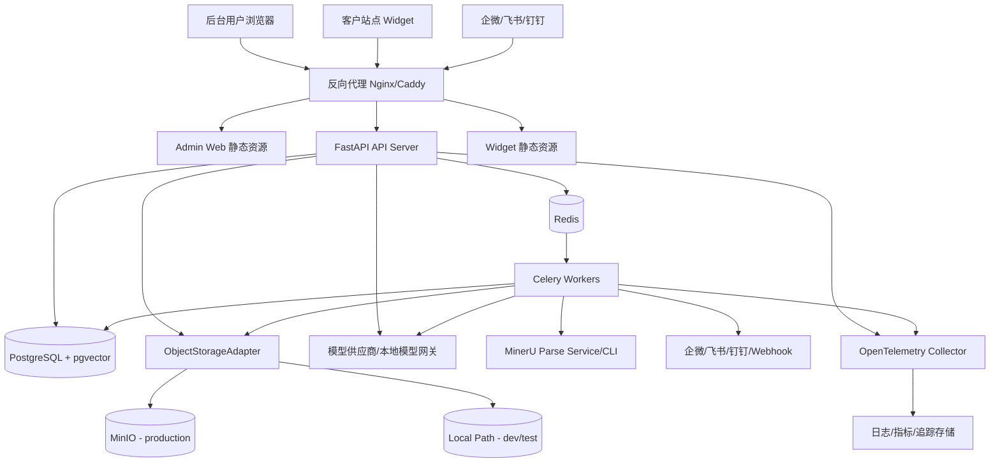
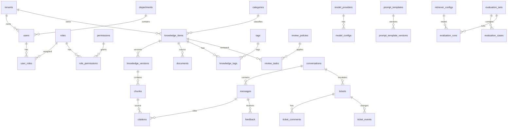
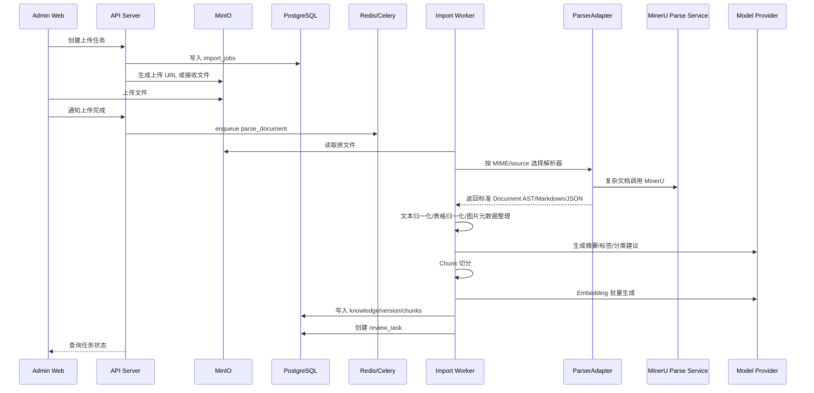
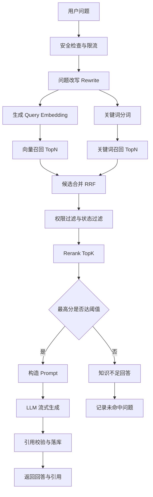

# V1 系统技术方案设计与技术选型：AI Customer Service Hub

版本：V1.0  
日期：2026-07-04  
来源 PRD：`docs/design/v1-product-prd.md`  
目标形态：企业私有部署优先，可演进为 SaaS 多租户  
状态：技术方案设计稿

## 0. 设计结论

V1 推荐采用“模块化单体 + 异步任务 + 统一 PostgreSQL 数据层”的架构。

核心判断：

- V1 功能多，但业务边界仍集中在知识、问答、工单、运营和配置，不适合一开始拆成多个微服务。
- 企业私有部署要求安装、运维、备份和排障尽量简单。
- RAG 系统最容易出问题的是数据一致性、租户隔离、索引同步和引用追溯；V1 使用 PostgreSQL + pgvector 把业务数据、向量、引用、审计统一管理，降低同步复杂度。
- 文档解析以 MinerU 作为主解析引擎，面向 PDF、Office、图片和复杂网页输出结构化 Markdown/JSON；工程上通过 `ParserAdapter` 抽象接入，并保留 TXT、Markdown、FAQ、简单 HTML 的轻量 fallback。
- 对象存储通过 `ObjectStorageAdapter` 抽象接入，生产默认 MinIO，开发和自动化测试默认使用可配置本地路径存储，避免测试环境必须启动 MinIO。
- 文件解析、Embedding、索引更新、统计分析、通知分发必须异步化，避免阻塞 API。
- AI 模型、Embedding、Rerank、文档解析、对象存储、企业微信/飞书/钉钉、Webhook 统一通过适配器接口接入，避免供应商绑定。

## 1. 范围与假设

### 1.1 本方案覆盖范围

覆盖 PRD 中 V1 的 8 个一级模块：

1. 首页 Dashboard
2. 知识中心
3. AI 客服
4. 工单中心
5. 知识运营
6. AI 配置
7. 用户权限
8. 系统设置

### 1.2 PRD 已确认约束

| 问题 | 决策 |
| --- | --- |
| 部署形态 | 企业私有部署优先 |
| 客户侧入口 | V1 提供可嵌入 Widget |
| 容量限制 | V1 需要提供文件、批量上传、知识容量限制 |
| AI 准确率评估 | 采用标准测试集评估 |
| 工单能力 | 支持优先级和通知 |
| API/Webhook | V1 真实可用 |
| 渠道集成 | 企业微信、飞书、钉钉为 V1 必选集成 |
| 审核策略 | 分级审核，部分审核后立即发布，部分必须管理员审核 |

### 1.3 技术假设

- [Assumption] V1 首批部署规模按单企业 50 到 500 内部用户、10 万到 200 万知识 Chunk、日咨询 1 千到 10 万次设计。
- [Assumption] 私有部署环境可使用 Docker Compose；生产环境可升级到 Kubernetes。
- [Assumption] 企业允许部署 PostgreSQL、Redis、MinIO、后端服务、Worker、前端静态服务。
- [Assumption] 大模型可以是公网 API、企业内网模型网关或本地 Ollama，系统只依赖统一模型适配器。
- [Assumption] 企业微信、飞书、钉钉的首版集成以消息通知、入口链接、基础机器人回调为主，不做复杂客服席位系统替代。

## 2. 技术选型总览

### 2.1 推荐选型表

| 层级 | 推荐技术 | 选择理由 | V1 备注 |
| --- | --- | --- | --- |
| 后端语言 | Python 3.12+ | 与 AI、文档解析、Embedding 生态兼容性强 | 私有部署镜像统一运行时 |
| Web API | FastAPI | 类型友好、OpenAPI 自动生成、适合异步 I/O 和流式接口 | API 契约以 OpenAPI 为准 |
| 数据校验 | Pydantic v2 | 与 FastAPI 契合，适合请求/响应 Schema | 边界输入统一校验 |
| ORM/迁移 | SQLAlchemy 2 + Alembic | Python 主流关系模型与迁移组合 | 所有表结构必须迁移管理 |
| 主数据库 | PostgreSQL 16+ | 事务、JSONB、全文检索、分区、生态成熟 | 使用 `tenant_id` 预留多租户 |
| 向量检索 | pgvector | 向量和业务数据同库，降低同步和权限复杂度 | 200 万 Chunk 内优先使用 |
| 缓存/队列 | Redis | 缓存、限流、会话状态、Celery Broker | 不存长期业务真相 |
| 异步任务 | Celery | Python 成熟任务队列，支持重试、调度和多 Worker | 解析、Embedding、通知、统计 |
| 对象存储 | `ObjectStorageAdapter`，生产 MinIO，测试本地路径 | MinIO S3 兼容、适合私有部署；本地路径实现让单元测试和集成测试不依赖外部服务 | 存原始文件、解析产物、导出文件、备份包 |
| 前端 | React + TypeScript + Vite | 后台管理端交互密集，构建轻量 | 不需要 SSR |
| UI 组件 | Ant Design + ProComponents | 企业后台表格、表单、权限页效率高 | 贴合中文企业后台 |
| 前端数据 | TanStack Query | 统一请求缓存、重试、分页状态 | 与 REST API 配合 |
| 图表 | ECharts | 中文企业报表生态成熟 | Dashboard 和运营分析 |
| Widget | 独立 Vite bundle + Web Component | 便于客户站点嵌入且隔离样式 | JS snippet 加载 |
| AI 接入 | Provider Adapter | 屏蔽 OpenAI、Claude、DeepSeek、Qwen、Ollama、Gemini 差异 | 统一 Chat/Embedding/Rerank 接口 |
| 文档解析 | MinerU + ParserAdapter + 轻量 fallback | MinerU 更适合 RAG 文档解析，可输出结构化 Markdown/JSON；Adapter 保持可替换；简单格式避免重推理 | MinerU 作为主解析引擎，TXT/Markdown/FAQ/简单 HTML 走轻量解析 |
| 中文分词 | jieba 或 pkuseg | 支持中文关键词召回和 BM25 近似 | 词元写入搜索字段 |
| 日志/追踪 | structlog + OpenTelemetry | 结构化日志与链路追踪 | 请求 ID 串联 AI 链路 |
| 测试 | pytest、httpx、Playwright、Vitest | 后端、API、前端和浏览器验证 | RAG 增加标准测试集 |
| 部署 | Docker Compose，后续 Helm | 私有部署首版安装简单 | 单机到小集群平滑演进 |
| 反向代理 | Nginx 或 Caddy | TLS、静态资源、SSE 代理、上传限制 | 私有部署统一入口 |

### 2.2 不选方案与原因

| 方案 | 不作为 V1 首选的原因 |
| --- | --- |
| 微服务架构 | V1 团队沟通成本、部署成本和分布式一致性成本过高 |
| 独立向量数据库 Milvus/Qdrant | 召回规模未到必须拆分，业务权限和索引同步复杂度更高 |
| Elasticsearch/OpenSearch 作为必选 | 中文关键词检索更强，但私有部署组件更多；V1 先用 PostgreSQL + 分词字段，规模上来后再引入 |
| Next.js SSR | 后台管理端不依赖 SEO 和 SSR，Vite 更轻 |
| LangChain/LlamaIndex 作为核心框架 | 抽象层变化快，企业级追溯和权限需要更细粒度控制；可借鉴思想，不绑定核心链路 |
| 所有格式都强制走 MinerU | 简单文本、Markdown、FAQ 走 MinerU 会增加延迟和部署负担；V1 采用 MinerU 主解析 + 轻量 fallback |
| 测试环境也强制使用 MinIO | 增加测试启动成本和不稳定因素；V1 用本地路径实现覆盖存储契约，少量 MinIO 集成测试验证兼容性 |
| WebSocket 作为首选流式协议 | AI 回答单向流式为主，SSE 更简单、更容易穿透代理 |

## 3. 总体架构

### 3.1 架构风格

采用模块化单体：

- 一个后端 API 应用，按领域模块拆分包。
- 多个 Worker 队列，按任务类型隔离并发和资源。
- 一个 PostgreSQL 数据库，包含业务表、向量字段、搜索字段、审计和事件。
- 一个 Redis，承担缓存、队列 Broker、限流和短期状态。
- 一个 MinIO，存储原始文件、解析中间产物、导出文件和备份文件。

模块化单体不是把所有代码写在一起，而是在同一部署单元内保持清晰领域边界。后续如果某个模块需要独立扩容，可按边界拆出服务。

### 3.2 部署拓扑



### 3.3 逻辑分层

```text
表现层
  Admin Web
  Customer Widget

API 边界层
  REST API
  SSE Streaming
  Webhook Receiver
  OpenAPI Schema

应用服务层
  KnowledgeService
  ImportService
  ReviewService
  ChatService
  RetrievalService
  TicketService
  AnalyticsService
  ConfigService
  UserAccessService
  IntegrationService

领域层
  Knowledge
  Document
  Chunk
  Conversation
  Message
  Ticket
  Role
  Permission
  PromptTemplate
  RetrieverConfig

基础设施层
  PostgreSQL/pgvector
  Redis
  ObjectStorageAdapter
  MinIO / Local Path Storage
  Celery
  MinerU Parse Service
  Parser Adapters
  Model Providers
  Channel Providers
  Webhook Dispatcher
```

## 4. 模块边界设计

### 4.1 后端模块

推荐目录结构：

```text
server/
├── app/
│   ├── main.py
│   ├── api/
│   │   └── v1/
│   │       ├── auth.py
│   │       ├── dashboard.py
│   │       ├── knowledge.py
│   │       ├── imports.py
│   │       ├── faqs.py
│   │       ├── reviews.py
│   │       ├── conversations.py
│   │       ├── tickets.py
│   │       ├── analytics.py
│   │       ├── ai_config.py
│   │       ├── users.py
│   │       ├── settings.py
│   │       ├── integrations.py
│   │       └── webhooks.py
│   ├── core/
│   │   ├── config.py
│   │   ├── security.py
│   │   ├── errors.py
│   │   ├── permissions.py
│   │   ├── logging.py
│   │   └── ids.py
│   ├── db/
│   │   ├── session.py
│   │   ├── base.py
│   │   └── migrations/
│   ├── models/
│   ├── schemas/
│   ├── services/
│   ├── repositories/
│   ├── integrations/
│   │   ├── model_providers/
│   │   ├── channel_providers/
│   │   ├── storage/
│   │   │   ├── base.py
│   │   │   ├── local.py
│   │   │   ├── minio.py
│   │   │   └── registry.py
│   │   └── parsers/
│   │       ├── base.py
│   │       ├── mineru.py
│   │       ├── lightweight.py
│   │       └── registry.py
│   ├── tasks/
│   └── tests/
```

### 4.2 前端模块

```text
web/
├── admin/
│   ├── src/
│   │   ├── app/
│   │   ├── routes/
│   │   ├── features/
│   │   │   ├── dashboard/
│   │   │   ├── knowledge/
│   │   │   ├── chat/
│   │   │   ├── tickets/
│   │   │   ├── analytics/
│   │   │   ├── ai-config/
│   │   │   ├── access-control/
│   │   │   └── settings/
│   │   ├── components/
│   │   ├── api/
│   │   ├── auth/
│   │   └── styles/
│   └── tests/
└── widget/
    ├── src/
    │   ├── widget-entry.tsx
    │   ├── chat-widget.tsx
    │   ├── api.ts
    │   └── styles.css
    └── tests/
```

### 4.3 模块职责

| 模块 | 职责 | 不负责 |
| --- | --- | --- |
| Auth/UserAccess | 登录、Token、用户、角色、权限、审计上下文 | 业务对象状态流转 |
| Knowledge | 知识、文档、版本、Chunk、FAQ、分类标签 | 模型调用和回答生成 |
| Import | 上传任务、ParserAdapter 调度、MinerU 解析任务、轻量解析 fallback、Embedding 任务、索引任务 | 人工审核决策 |
| Review | 分级审核策略、审核任务、发布决策 | 文档解析 |
| Retrieval | Query Rewrite、混合检索、Rerank、引用候选 | 最终自然语言生成 |
| Chat | 会话、消息、AI 回答、反馈、转人工 | 工单处理流程 |
| Ticket | 工单创建、转派、优先级、通知、关闭 | AI 检索底层算法 |
| Analytics | Dashboard、命中率、未命中、热门知识、健康度 | 原始业务写操作 |
| AI Config | 模型供应商、Prompt、RAG 参数 | 用户权限 |
| Integrations | 企微、飞书、钉钉、Webhook 收发 | 业务规则判断 |

## 5. 数据架构

### 5.1 数据库总体策略

- 所有业务表使用 `id`、`tenant_id`、`created_at`、`updated_at`、`created_by`、`updated_by` 基础字段。
- V1 私有部署仍保留 `tenant_id`，避免后续 SaaS 化重构。
- 删除策略默认软删除，关键对象保留审计日志。
- 列表查询字段必须建索引，长列表必须分页。
- 向量字段与 Chunk 同表或一对一扩展表存储，保证权限过滤和引用追溯。

### 5.2 核心 ER 图



### 5.3 核心表设计

#### 5.3.1 用户与权限

| 表 | 关键字段 |
| --- | --- |
| `tenants` | `id`、`name`、`deployment_mode`、`quota_config`、`created_at` |
| `departments` | `id`、`tenant_id`、`name`、`parent_id` |
| `users` | `id`、`tenant_id`、`department_id`、`name`、`email`、`password_hash`、`status`、`last_login_at` |
| `roles` | `id`、`tenant_id`、`code`、`name`、`scope` |
| `permissions` | `id`、`code`、`module`、`action` |
| `user_roles` | `user_id`、`role_id` |
| `role_permissions` | `role_id`、`permission_id` |

#### 5.3.2 知识与文档

| 表 | 关键字段 |
| --- | --- |
| `knowledge_items` | `id`、`tenant_id`、`title`、`type`、`category_id`、`source`、`status`、`current_version_id`、`published_at`、`archived_at` |
| `knowledge_versions` | `id`、`knowledge_id`、`version_no`、`content_hash`、`summary`、`keywords`、`metadata`、`status` |
| `documents` | `id`、`knowledge_id`、`object_key`、`file_name`、`mime_type`、`file_size`、`parser_name`、`parser_version`、`parse_status`、`parse_metadata` |
| `parse_artifacts` | `id`、`document_id`、`artifact_type`、`object_key`、`content_hash`、`metadata` |
| `chunks` | `id`、`tenant_id`、`knowledge_id`、`version_id`、`document_id`、`chunk_index`、`title_path`、`content`、`token_count`、`embedding`、`search_text`、`metadata`、`status` |
| `categories` | `id`、`tenant_id`、`name`、`parent_id`、`sort_order` |
| `tags` | `id`、`tenant_id`、`name`、`color` |
| `knowledge_tags` | `knowledge_id`、`tag_id` |

状态枚举：

```text
knowledge.status:
  UPLOADING
  PARSING
  EMBEDDING
  PENDING_REVIEW
  PUBLISHED
  ARCHIVED
  FAILED

chunk.status:
  DRAFT
  ACTIVE
  REINDEX_REQUIRED
  ARCHIVED
```

#### 5.3.3 上传与任务

| 表 | 关键字段 |
| --- | --- |
| `import_jobs` | `id`、`tenant_id`、`source_type`、`status`、`stage`、`progress`、`error_code`、`error_message`、`retry_count` |
| `import_job_files` | `id`、`job_id`、`object_key`、`file_name`、`mime_type`、`file_size`、`checksum` |
| `task_runs` | `id`、`tenant_id`、`task_type`、`resource_type`、`resource_id`、`status`、`started_at`、`finished_at`、`error` |

#### 5.3.4 FAQ 与审核

| 表 | 关键字段 |
| --- | --- |
| `faqs` | `id`、`tenant_id`、`question`、`answer`、`category_id`、`status`、`source`、`knowledge_id` |
| `review_policies` | `id`、`tenant_id`、`resource_type`、`risk_level`、`required_role`、`auto_publish` |
| `review_tasks` | `id`、`tenant_id`、`resource_type`、`resource_id`、`risk_level`、`status`、`assigned_role`、`reviewer_id`、`decision`、`reason` |

审核策略：

- 低风险 FAQ 或普通知识：知识管理员审核通过后可立即发布。
- 高风险知识，如退款、价格、合同、法律承诺：必须管理员审核。
- 模型生成的 FAQ 草稿默认不能自动发布。

#### 5.3.5 会话、消息与引用

| 表 | 关键字段 |
| --- | --- |
| `conversations` | `id`、`tenant_id`、`channel`、`customer_id`、`assignee_id`、`status`、`last_message_at` |
| `messages` | `id`、`tenant_id`、`conversation_id`、`role`、`content`、`status`、`model_provider`、`model_name`、`latency_ms`、`token_usage` |
| `message_runs` | `id`、`message_id`、`status`、`rewrite_query`、`retrieval_snapshot`、`generation_params`、`error` |
| `citations` | `id`、`message_id`、`knowledge_id`、`chunk_id`、`document_id`、`page_no`、`quote`、`score`、`rank` |
| `feedback` | `id`、`message_id`、`user_id`、`feedback_type`、`reason`、`comment` |
| `missed_questions` | `id`、`tenant_id`、`question_hash`、`question_text`、`count`、`first_seen_at`、`last_seen_at`、`status` |

#### 5.3.6 工单与通知

| 表 | 关键字段 |
| --- | --- |
| `tickets` | `id`、`tenant_id`、`ticket_no`、`conversation_id`、`customer_name`、`title`、`description`、`priority`、`status`、`owner_id`、`due_at` |
| `ticket_comments` | `id`、`ticket_id`、`author_id`、`content`、`visibility` |
| `ticket_events` | `id`、`ticket_id`、`event_type`、`from_value`、`to_value`、`operator_id` |
| `notifications` | `id`、`tenant_id`、`recipient_id`、`channel`、`title`、`content`、`status`、`sent_at` |

工单状态：

```text
OPEN -> IN_PROGRESS -> RESOLVED -> CLOSED
OPEN -> CANCELLED
IN_PROGRESS -> OPEN
RESOLVED -> IN_PROGRESS
```

优先级：

```text
LOW
MEDIUM
HIGH
URGENT
```

#### 5.3.7 AI 配置与评估

| 表 | 关键字段 |
| --- | --- |
| `model_providers` | `id`、`tenant_id`、`provider`、`base_url`、`encrypted_api_key`、`status` |
| `model_configs` | `id`、`provider_id`、`capability`、`model_name`、`max_tokens`、`timeout_ms`、`is_default` |
| `prompt_templates` | `id`、`tenant_id`、`code`、`name`、`scenario`、`status`、`current_version_id` |
| `prompt_template_versions` | `id`、`template_id`、`version_no`、`content`、`variables` |
| `retriever_configs` | `id`、`tenant_id`、`name`、`chunk_size`、`top_k`、`rerank_top_k`、`similarity_threshold`、`temperature`、`is_active` |
| `evaluation_sets` | `id`、`tenant_id`、`name`、`description`、`status` |
| `evaluation_cases` | `id`、`set_id`、`question`、`expected_answer`、`expected_citation_ids`、`tags` |
| `evaluation_runs` | `id`、`set_id`、`retriever_config_id`、`model_config_id`、`status`、`metrics` |

### 5.4 索引策略

核心索引：

```sql
-- 列表过滤
CREATE INDEX idx_knowledge_tenant_status_updated
ON knowledge_items (tenant_id, status, updated_at DESC);

CREATE INDEX idx_chunks_tenant_knowledge
ON chunks (tenant_id, knowledge_id, status);

-- 向量检索，维度由 Embedding 模型决定
CREATE INDEX idx_chunks_embedding_hnsw
ON chunks USING hnsw (embedding vector_cosine_ops);

-- 中文分词后的关键词搜索
CREATE INDEX idx_chunks_search_text
ON chunks USING gin (to_tsvector('simple', search_text));

-- 会话与工单
CREATE INDEX idx_messages_conversation_created
ON messages (tenant_id, conversation_id, created_at);

CREATE INDEX idx_tickets_tenant_status_priority
ON tickets (tenant_id, status, priority, updated_at DESC);
```

注意：

- `embedding` 维度必须与当前 Embedding 模型一致，模型切换需要新建索引版本或重新向量化。
- HNSW 索引适合读多写少；大批量导入时可先写入，再批量创建或重建索引。
- 对企业私有部署，默认先用一个 active Embedding 模型，避免同表多维度混用。

## 6. 核心业务流程技术设计

### 6.1 知识导入流水线



### 6.2 文件解析策略

V1 采用 MinerU 作为主解析引擎，但不把业务流程直接绑定到 MinerU。所有解析器必须实现 `ParserAdapter`，由 `ParserRegistry` 按文件类型、企业配置、运行环境和失败策略选择。

解析路由：

| 类型 | 默认解析器 | fallback | 说明 |
| --- | --- | --- | --- |
| PDF | MinerU | 轻量 PDF 文本提取 | 主路径处理数字 PDF、扫描件、多栏、表格、图片和公式 |
| DOCX | MinerU | 轻量 DOCX 文本提取 | 主路径保留标题层级、表格和图片引用 |
| PPTX | MinerU | 轻量 PPTX 文本提取 | 按幻灯片输出标题、正文和页码定位 |
| XLSX | MinerU | 轻量 XLSX 表格提取 | 按 Sheet 和表格区域输出 Markdown 表格或结构化表格 |
| 图片/扫描件 | MinerU | OCR 插件或失败提示 | 需要部署支持 OCR/视觉模型的 MinerU 环境 |
| 复杂网页 | MinerU 或网页解析 Adapter | HTML 清洗 Adapter | 复杂版面可走 MinerU，普通文章页走轻量清洗 |
| Markdown | 轻量 Markdown Adapter | 无 | 保留标题层级和代码块，不走 MinerU |
| TXT | 轻量 Text Adapter | 无 | 检测编码后直接生成文本块 |
| FAQ | FAQ Adapter | 无 | 问答对本身已结构化，不走 MinerU |
| 简单 HTML | HTML Clean Adapter | 无 | 去除脚本、样式、导航后生成结构化文本 |

统一输出要求：

```text
ParsedDocument
  sourceType
  parserName
  parserVersion
  title
  markdown
  blocks[]
    blockId
    type: HEADING | PARAGRAPH | TABLE | IMAGE | FORMULA | LIST | CODE | FAQ
    text
    markdown
    pageNo
    sheetName
    slideNo
    bbox
    titlePath[]
    metadata
  assets[]
    assetId
    objectKey
    mimeType
    pageNo
    bbox
  warnings[]
```

关键规则：

- MinerU 输出必须先归一化为系统内部 `ParsedDocument`，再进入 Chunk 和 Embedding。
- 第三方解析输出视为不可信输入，需要校验字段类型、文本长度、路径、HTML/Markdown 安全性。
- 解析失败不直接丢弃文件，写入 `import_jobs.error_code` 和 `task_runs.error`，允许重试、切换 fallback 或人工下载原文件。
- fallback 成功时记录 `parserName` 和 `fallbackReason`，便于后续评估解析质量。
- MinerU 的模型权重、运行镜像、许可证约束和离线安装包需要纳入私有部署交付物。

### 6.3 Chunk 策略

默认采用结构优先的语义切片：

1. 按文档标题、章节、页码、FAQ 问答对划分基础块。
2. 单块超过 `chunk_size` 时按段落和句子继续拆分。
3. 相邻 Chunk 保留 `chunk_overlap`，减少跨段语义断裂。
4. 每个 Chunk 保存 `title_path`、`page_no`、`source_locator`、`metadata`。
5. 表格转为 Markdown 表格或键值对文本。

默认参数：

| 参数 | 默认值 |
| --- | --- |
| `chunk_size` | 800 到 1200 tokens |
| `chunk_overlap` | 120 到 200 tokens |
| `embedding_batch_size` | 32 |
| `max_file_size_mb` | 200，可配置 |
| `max_batch_files` | 20，可配置 |

## 7. RAG 与 AI 回答设计

### 7.1 RAG 主流程



### 7.2 检索策略

V1 使用混合检索：

- 向量召回：pgvector cosine similarity。
- 关键词召回：中文分词后写入 `search_text`，使用 PostgreSQL GIN 检索。
- 合并策略：Reciprocal Rank Fusion，避免单一评分体系不稳定。
- 权限过滤：只检索 `status = ACTIVE` 且用户可访问的知识范围。
- Rerank：优先使用供应商 Rerank 模型；没有 Rerank 能力时使用轻量 cross-encoder 或跳过。
- 阈值：低于 `similarity_threshold` 时进入知识不足路径。

### 7.3 引用生成与可信规则

- 每条 AI 回答至少绑定 1 条 `citation`，闲聊和知识不足回答除外。
- 引用必须记录知识 ID、Chunk ID、文档 ID、页码、排序、检索分数和引用快照。
- 若引用的知识后续归档，历史回答仍展示引用快照，新回答不再使用该知识。
- Prompt 中明确要求模型只能基于 `context` 回答，不得自行补充企业政策。
- 对退款、价格、合同、法律承诺等高风险分类，低置信度时强制建议转人工。

### 7.4 标准测试集评估

标准测试集用于评估 RAG 配置、Prompt 和模型：

指标：

- Citation Hit Rate：是否命中预期引用。
- Answer Correctness：答案是否覆盖标准答案要点。
- Faithfulness：答案是否被引用文本支持。
- Refusal Accuracy：无知识问题是否正确拒答。
- Latency：首字和完整回答耗时。

评估流程：

1. 知识管理员维护 `evaluation_sets`。
2. 系统按当前模型和 RAG 参数运行 `evaluation_runs`。
3. 自动评分加人工抽检。
4. 配置变更前后对比指标。
5. 低于阈值的配置不允许设为默认，或需要管理员确认。

## 8. API 设计

### 8.1 API 规范

- API 前缀：`/api/v1`
- 风格：REST + SSE
- 请求/响应字段：`camelCase`
- 枚举：`UPPER_SNAKE_CASE`
- 列表接口必须分页。
- 错误响应必须统一结构。
- OpenAPI Schema 是前后端和 Widget 的公共契约。

统一分页响应：

```json
{
  "data": [],
  "pagination": {
    "page": 1,
    "pageSize": 20,
    "totalItems": 0,
    "totalPages": 0
  }
}
```

统一错误响应：

```json
{
  "error": {
    "code": "VALIDATION_ERROR",
    "message": "请求参数不合法",
    "details": {}
  },
  "requestId": "req_..."
}
```

### 8.2 核心端点

#### 8.2.1 认证与用户

| Method | Path | 说明 | 权限 |
| --- | --- | --- | --- |
| POST | `/api/v1/auth/login` | 登录 | Public |
| POST | `/api/v1/auth/refresh` | 刷新 Token | Authenticated |
| POST | `/api/v1/auth/logout` | 登出 | Authenticated |
| GET | `/api/v1/users` | 用户列表 | `USER_READ` |
| POST | `/api/v1/users` | 创建用户 | `USER_WRITE` |
| PATCH | `/api/v1/users/{userId}` | 更新用户 | `USER_WRITE` |
| GET | `/api/v1/roles` | 角色列表 | `ROLE_READ` |
| PATCH | `/api/v1/roles/{roleId}/permissions` | 更新角色权限 | `ROLE_WRITE` |

#### 8.2.2 Dashboard

| Method | Path | 说明 | 权限 |
| --- | --- | --- | --- |
| GET | `/api/v1/dashboard/summary` | 今日指标 | `DASHBOARD_READ` |
| GET | `/api/v1/dashboard/trends` | 趋势数据 | `DASHBOARD_READ` |
| GET | `/api/v1/dashboard/recent-missed-questions` | 最近未命中 | `DASHBOARD_READ` |
| GET | `/api/v1/dashboard/pending-reviews` | 待审核知识 | `REVIEW_READ` |

#### 8.2.3 知识中心

| Method | Path | 说明 | 权限 |
| --- | --- | --- | --- |
| GET | `/api/v1/knowledge-items` | 知识列表 | `KNOWLEDGE_READ` |
| POST | `/api/v1/knowledge-items` | 手工创建知识 | `KNOWLEDGE_WRITE` |
| GET | `/api/v1/knowledge-items/{knowledgeId}` | 知识详情 | `KNOWLEDGE_READ` |
| PATCH | `/api/v1/knowledge-items/{knowledgeId}` | 更新知识元数据 | `KNOWLEDGE_WRITE` |
| DELETE | `/api/v1/knowledge-items/{knowledgeId}` | 删除知识 | `KNOWLEDGE_DELETE` |
| POST | `/api/v1/knowledge-items/{knowledgeId}/versions` | 新建版本 | `KNOWLEDGE_WRITE` |
| GET | `/api/v1/knowledge-items/{knowledgeId}/chunks` | Chunk 列表 | `KNOWLEDGE_READ` |
| PATCH | `/api/v1/chunks/{chunkId}` | 编辑 Chunk | `KNOWLEDGE_WRITE` |

#### 8.2.4 上传任务

| Method | Path | 说明 | 权限 |
| --- | --- | --- | --- |
| POST | `/api/v1/import-jobs` | 创建导入任务 | `KNOWLEDGE_UPLOAD` |
| POST | `/api/v1/import-jobs/{jobId}/files` | 绑定上传文件 | `KNOWLEDGE_UPLOAD` |
| GET | `/api/v1/import-jobs/{jobId}` | 查询任务状态 | `KNOWLEDGE_UPLOAD` |
| POST | `/api/v1/import-jobs/{jobId}/retries` | 重试任务 | `KNOWLEDGE_UPLOAD` |
| DELETE | `/api/v1/import-jobs/{jobId}` | 删除失败任务 | `KNOWLEDGE_UPLOAD` |

#### 8.2.5 FAQ 与审核

| Method | Path | 说明 | 权限 |
| --- | --- | --- | --- |
| GET | `/api/v1/faqs` | FAQ 列表 | `FAQ_READ` |
| POST | `/api/v1/faqs` | 新建 FAQ | `FAQ_WRITE` |
| PATCH | `/api/v1/faqs/{faqId}` | 更新 FAQ | `FAQ_WRITE` |
| DELETE | `/api/v1/faqs/{faqId}` | 删除 FAQ | `FAQ_DELETE` |
| GET | `/api/v1/review-tasks` | 审核列表 | `REVIEW_READ` |
| PATCH | `/api/v1/review-tasks/{taskId}` | 审核通过/驳回 | `REVIEW_DECIDE` |

#### 8.2.6 AI 客服

| Method | Path | 说明 | 权限 |
| --- | --- | --- | --- |
| GET | `/api/v1/conversations` | 会话列表 | `CHAT_READ` |
| POST | `/api/v1/conversations` | 创建会话 | `CHAT_WRITE` |
| GET | `/api/v1/conversations/{conversationId}/messages` | 消息列表 | `CHAT_READ` |
| POST | `/api/v1/conversations/{conversationId}/message-runs` | 创建并流式生成回答 | `CHAT_WRITE` |
| POST | `/api/v1/messages/{messageId}/feedback` | 点赞/点踩 | `CHAT_WRITE` |
| POST | `/api/v1/conversations/{conversationId}/ticket-links` | 会话转工单 | `TICKET_WRITE` |

说明：

- `message-runs` 返回 `text/event-stream`，事件包括 `run_started`、`delta`、`citation`、`done`、`error`。
- 如果客户端不支持 SSE，可使用非流式参数 `stream=false`。

#### 8.2.7 工单

| Method | Path | 说明 | 权限 |
| --- | --- | --- | --- |
| GET | `/api/v1/tickets` | 工单列表 | `TICKET_READ` |
| POST | `/api/v1/tickets` | 创建工单 | `TICKET_WRITE` |
| GET | `/api/v1/tickets/{ticketId}` | 工单详情 | `TICKET_READ` |
| PATCH | `/api/v1/tickets/{ticketId}` | 更新状态/负责人/优先级 | `TICKET_WRITE` |
| POST | `/api/v1/tickets/{ticketId}/comments` | 添加备注 | `TICKET_COMMENT` |
| GET | `/api/v1/tickets/{ticketId}/events` | 状态流转记录 | `TICKET_READ` |

#### 8.2.8 知识运营

| Method | Path | 说明 | 权限 |
| --- | --- | --- | --- |
| GET | `/api/v1/analytics/ai-hit-rate` | 命中率分析 | `ANALYTICS_READ` |
| GET | `/api/v1/analytics/missed-questions` | 未命中列表 | `ANALYTICS_READ` |
| POST | `/api/v1/analytics/missed-questions/{id}/faq-drafts` | 生成 FAQ 草稿 | `FAQ_WRITE` |
| GET | `/api/v1/analytics/top-knowledge` | 热门知识 | `ANALYTICS_READ` |
| GET | `/api/v1/analytics/top-questions` | 热门问题 | `ANALYTICS_READ` |
| GET | `/api/v1/analytics/knowledge-health` | 知识健康 | `ANALYTICS_READ` |

#### 8.2.9 AI 配置、系统设置与集成

| Method | Path | 说明 | 权限 |
| --- | --- | --- | --- |
| GET | `/api/v1/ai/model-providers` | 模型供应商列表 | `AI_CONFIG_READ` |
| POST | `/api/v1/ai/model-providers` | 新增供应商 | `AI_CONFIG_WRITE` |
| POST | `/api/v1/ai/model-providers/{id}/connection-tests` | 测试连接 | `AI_CONFIG_WRITE` |
| GET | `/api/v1/ai/prompt-templates` | Prompt 模板 | `AI_CONFIG_READ` |
| POST | `/api/v1/ai/prompt-templates` | 创建模板 | `AI_CONFIG_WRITE` |
| GET | `/api/v1/ai/retriever-configs` | RAG 参数 | `AI_CONFIG_READ` |
| PATCH | `/api/v1/ai/retriever-configs/{id}` | 更新 RAG 参数 | `AI_CONFIG_WRITE` |
| GET | `/api/v1/settings` | 系统设置 | `SETTING_READ` |
| PATCH | `/api/v1/settings` | 更新系统设置 | `SETTING_WRITE` |
| GET | `/api/v1/integrations/channels` | 渠道配置 | `INTEGRATION_READ` |
| PATCH | `/api/v1/integrations/channels/{channelId}` | 配置企微/飞书/钉钉 | `INTEGRATION_WRITE` |
| GET | `/api/v1/webhooks` | Webhook 列表 | `WEBHOOK_READ` |
| POST | `/api/v1/webhooks` | 创建 Webhook | `WEBHOOK_WRITE` |

#### 8.2.10 Widget API

| Method | Path | 说明 | 权限 |
| --- | --- | --- | --- |
| GET | `/api/v1/widget/config` | 获取 Widget 配置 | Widget Token |
| POST | `/api/v1/widget/conversations` | 创建客户会话 | Widget Token |
| POST | `/api/v1/widget/conversations/{id}/message-runs` | 客户提问流式回答 | Widget Token |
| POST | `/api/v1/widget/messages/{id}/feedback` | 客户反馈 | Widget Token |

Widget 安全要求：

- 使用单独 Widget Token，不使用后台用户 Token。
- 允许配置嵌入域名白名单。
- 需要独立限流策略。
- 不向访客暴露内部知识详情页，只展示引用标题和公开摘要。

## 9. 适配器接口设计

### 9.1 模型供应商接口

```python
class ChatProvider:
    async def stream_chat(self, request: ChatRequest) -> AsyncIterator[ChatDelta]:
        ...

    async def complete_chat(self, request: ChatRequest) -> ChatResponse:
        ...

class EmbeddingProvider:
    async def embed_texts(self, texts: list[str]) -> list[list[float]]:
        ...

class RerankProvider:
    async def rerank(self, query: str, documents: list[RerankDocument]) -> list[RerankScore]:
        ...
```

适配器要求：

- 统一超时、重试、错误码和日志字段。
- 第三方响应必须校验结构。
- Token 用量、模型名、延迟、错误必须落库。
- 不允许业务层直接调用供应商 SDK。

### 9.2 渠道集成接口

```python
class ChannelProvider:
    async def send_notification(self, request: ChannelMessage) -> ChannelResult:
        ...

    async def verify_callback(self, request: IncomingRequest) -> VerifiedCallback:
        ...

    async def handle_callback(self, callback: VerifiedCallback) -> ChannelEvent:
        ...
```

V1 渠道：

- 企业微信
- 飞书
- 钉钉

首版能力：

- 工单分配通知。
- 高优先级工单通知。
- AI 服务异常通知。
- 待审核知识通知。
- 基础机器人回调入口。

### 9.3 Webhook 派发接口

Webhook 事件：

- `knowledge.published`
- `knowledge.archived`
- `ai.answer.generated`
- `ai.missed_question.detected`
- `ticket.created`
- `ticket.updated`
- `ticket.closed`

派发要求：

- 签名：HMAC-SHA256。
- 重试：指数退避，最多 5 次。
- 幂等：事件 ID 全局唯一。
- 日志：每次投递写入 `webhook_deliveries`。

### 9.4 文档解析接口

所有文档解析能力通过 `ParserAdapter` 接入。业务层只依赖内部 `ParsedDocument` 契约，不直接依赖 MinerU CLI、MinerU REST API 或轻量解析库。

```python
class ParserAdapter:
    name: str
    version: str

    def supports(self, source: ParseSource) -> bool:
        ...

    async def parse(self, request: ParseRequest) -> ParsedDocument:
        ...


class ParserRegistry:
    def select(self, source: ParseSource, policy: ParsePolicy) -> ParserAdapter:
        ...
```

输入契约：

```text
ParseRequest
  tenant_id
  import_job_id
  document_id
  object_key
  file_name
  mime_type
  file_size
  checksum
  parse_options
    preferred_parser
    enable_ocr
    enable_table_structure
    enable_formula
    fallback_enabled
```

输出契约：

```text
ParsedDocument
  parser_name
  parser_version
  source_type
  title
  markdown
  blocks[]
  assets[]
  warnings[]
  metrics
    page_count
    block_count
    table_count
    image_count
    elapsed_ms
```

解析器实现：

| Adapter | 适用范围 | 说明 |
| --- | --- | --- |
| `MinerUParserAdapter` | PDF、DOCX、PPTX、XLSX、图片、复杂网页 | V1 主解析器，支持 CLI 或 REST API 两种运行模式 |
| `MarkdownParserAdapter` | Markdown | 轻量解析标题、代码块、表格 |
| `TextParserAdapter` | TXT | 编码检测、纯文本分段 |
| `FaqParserAdapter` | FAQ | 问答对转内部 blocks |
| `HtmlCleanParserAdapter` | 简单 HTML | 清理脚本、样式、导航，保留正文结构 |

错误语义：

| 错误码 | 触发条件 | 处理策略 |
| --- | --- | --- |
| `PARSER_UNSUPPORTED_TYPE` | 无解析器支持该类型 | 标记失败，提示不支持格式 |
| `PARSER_TIMEOUT` | 解析超过超时时间 | 允许重试或切换 fallback |
| `PARSER_OUTPUT_INVALID` | MinerU 或其他解析器输出不符合契约 | 标记失败，不进入 Chunk |
| `PARSER_RESOURCE_LIMIT` | 文件页数、大小、图片数量或内存超过限制 | 标记失败，提示调整配额或拆分文件 |
| `PARSER_FALLBACK_USED` | 主解析器失败后 fallback 成功 | 继续流程，但记录 warning |

设计约束：

- `ParserAdapter.parse()` 必须幂等，同一 `document_id + checksum + parser_version` 重试不得产生重复知识。
- Parser 输出不得直接进入前端渲染，Markdown/HTML 必须经过安全清理。
- MinerU 原始输出可以保存为 `parse_artifacts`，但 Chunk 只能消费归一化后的 `ParsedDocument`。
- 解析器选择和 fallback 原因必须写入 `documents.parse_metadata`。

### 9.5 对象存储接口

所有文件读写通过 `ObjectStorageAdapter` 接入。业务层只保存稳定的 `object_key`，不保存本地绝对路径、MinIO bucket 细节或临时访问 URL。

```python
class ObjectStorageAdapter:
    name: str

    async def put_object(self, request: PutObjectRequest) -> StoredObject:
        ...

    async def get_object(self, object_key: str) -> ObjectStream:
        ...

    async def stat_object(self, object_key: str) -> ObjectMetadata:
        ...

    async def delete_object(self, object_key: str) -> None:
        ...

    async def create_presigned_upload(self, request: PresignedUploadRequest) -> PresignedUpload:
        ...

    async def create_presigned_download(self, object_key: str, expires_seconds: int) -> PresignedDownload:
        ...
```

实现策略：

| Adapter | 使用环境 | 说明 |
| --- | --- | --- |
| `LocalFileStorageAdapter` | 开发、单元测试、集成测试默认 | 写入配置项 `LOCAL_STORAGE_ROOT` 指定目录，使用与 MinIO 相同的 `object_key` 命名规则 |
| `MinioStorageAdapter` | 私有部署生产、预生产、少量存储兼容测试 | 通过 S3 兼容 API 访问 MinIO，支持 bucket、presigned URL、对象元数据 |

`object_key` 命名规则：

```text
tenant/{tenant_id}/imports/{import_job_id}/{file_id}/{safe_file_name}
tenant/{tenant_id}/documents/{document_id}/original/{safe_file_name}
tenant/{tenant_id}/documents/{document_id}/artifacts/{artifact_type}/{artifact_id}
tenant/{tenant_id}/exports/{export_id}/{file_name}
tenant/{tenant_id}/backups/{backup_id}/{file_name}
```

设计约束：

- `object_key` 必须相对化，不允许包含绝对路径、盘符、`..`、反斜杠路径穿越。
- 本地路径实现必须把 `object_key` 安全映射到 `LOCAL_STORAGE_ROOT` 下，解析后的真实路径必须仍在该根目录内。
- 测试默认使用临时目录或项目外可配置目录，测试结束可清理，不依赖 MinIO 进程。
- MinIO 与本地实现必须通过同一组契约测试，包括上传、读取、元数据、删除、重复写入、缺失对象和非法 key。
- 生产环境禁用 `LocalFileStorageAdapter`，除非显式开启单机开发模式。

错误语义：

| 错误码 | 触发条件 | 处理策略 |
| --- | --- | --- |
| `STORAGE_OBJECT_NOT_FOUND` | 对象不存在 | 返回 404 或任务失败可重试状态 |
| `STORAGE_INVALID_OBJECT_KEY` | object key 不合法或路径穿越 | 拒绝请求，记录安全日志 |
| `STORAGE_QUOTA_EXCEEDED` | 超出企业容量或单文件限制 | 拒绝上传，提示配额 |
| `STORAGE_BACKEND_UNAVAILABLE` | MinIO 不可用或本地路径不可写 | 任务进入可重试失败 |
| `STORAGE_CHECKSUM_MISMATCH` | 上传后校验失败 | 删除异常对象并要求重传 |

## 10. 权限、安全与审计

### 10.1 认证

- 后台用户使用账号密码登录，密码使用 Argon2id 哈希。
- Access Token 短有效期，Refresh Token 长有效期并可撤销。
- API Key 用于外部系统访问 API。
- Widget Token 仅用于客户侧嵌入入口。

### 10.2 授权

采用 RBAC：

- 页面级权限控制前端导航。
- API 级权限由后端依赖统一检查。
- 对象级权限在 Repository 或 Service 层检查。
- 所有权限不足返回 `403 FORBIDDEN`，不泄露对象是否存在。

关键权限：

```text
DASHBOARD_READ
KNOWLEDGE_READ
KNOWLEDGE_WRITE
KNOWLEDGE_UPLOAD
KNOWLEDGE_DELETE
FAQ_READ
FAQ_WRITE
FAQ_DELETE
REVIEW_READ
REVIEW_DECIDE
CHAT_READ
CHAT_WRITE
TICKET_READ
TICKET_WRITE
TICKET_COMMENT
ANALYTICS_READ
AI_CONFIG_READ
AI_CONFIG_WRITE
USER_READ
USER_WRITE
ROLE_READ
ROLE_WRITE
SETTING_READ
SETTING_WRITE
INTEGRATION_READ
INTEGRATION_WRITE
WEBHOOK_READ
WEBHOOK_WRITE
```

### 10.3 安全控制

- Secret 加密存储，使用部署时注入的主密钥。
- 上传文件校验扩展名、MIME、大小、哈希和配额。
- 文件解析 Worker 与 API 进程隔离。
- 富文本和 Markdown 渲染必须做 XSS 清理。
- Prompt 注入防护：系统指令、用户问题、知识上下文分段输入，不把用户文本拼接进系统指令。
- RAG 上下文只从已发布且授权知识中读取。
- CORS 对后台和 Widget 分别配置。
- 限流维度包括用户、IP、Widget Token、API Key、模型供应商。

### 10.4 审计日志

审计对象：

- 登录、登出、Token 刷新。
- 知识创建、编辑、删除、审核、发布、归档。
- FAQ 创建、审核、发布、删除。
- 工单转派、优先级变更、关闭。
- 模型配置、Prompt、RAG 参数变更。
- 用户、角色、权限变更。
- API Key、Webhook Secret 创建和轮换。

审计字段：

```text
id
tenant_id
actor_id
action
resource_type
resource_id
before_snapshot
after_snapshot
ip_address
user_agent
request_id
created_at
```

## 11. 性能与容量设计

### 11.1 V1 默认容量限制

| 项 | 默认值 | 是否可配置 |
| --- | --- | --- |
| 单文件大小 | 200 MB | 是 |
| 单次上传文件数 | 20 | 是 |
| 单企业知识总容量 | 100 GB | 是 |
| 单企业 Chunk 数 | 200 万 | 是 |
| 单次 AI 问题长度 | 4000 字符 | 是 |
| 单会话消息数 | 200 | 是 |
| Widget 每 IP 每分钟请求 | 30 | 是 |
| 后台列表分页上限 | 100 条/页 | 是 |

### 11.2 性能目标

| 场景 | 目标 |
| --- | --- |
| 后台首屏 | 3 秒内可交互 |
| 列表查询 | 常规筛选 1 秒内返回 |
| AI 首字响应 | 2 秒内开始输出 |
| AI 完整回答 | 常规问题 15 秒内完成 |
| 混合检索 | 2 秒内完成候选召回和 Rerank |
| 上传任务状态 | 2 秒内可查询最新状态 |
| Dashboard | 使用聚合表或缓存，避免实时全量扫描 |

### 11.3 扩展策略

- API Server 水平扩展，无状态运行。
- Celery Worker 按队列拆分：`parse`、`embedding`、`ai`、`analytics`、`notification`。
- PostgreSQL 优先通过索引、分区、读副本优化。
- Chunk 超过 500 万或检索延迟长期超过目标时，评估拆出 Qdrant/Milvus/OpenSearch。
- Dashboard 和知识运营指标使用定时聚合表，不直接扫原始日志。

## 12. 观测、日志与埋点

### 12.1 请求链路

每次请求生成 `request_id`。AI 回答链路额外生成 `run_id`，串联：

```text
question -> rewrite -> retrieval -> rerank -> prompt -> model stream -> citations -> feedback
```

### 12.2 指标

系统指标：

- API QPS、P95、P99。
- 错误率。
- Worker 队列长度。
- 任务失败率。
- PostgreSQL 连接数、慢查询。
- Redis 内存和命中率。

AI 指标：

- 首字延迟。
- 完整回答延迟。
- 模型错误率。
- Token 用量。
- 检索命中数。
- 引用覆盖率。
- 未命中率。

业务指标：

- 今日咨询。
- AI 回答数。
- 人工接管率。
- 工单创建和关闭数。
- 知识增长。
- 待审核数量。

### 12.3 埋点落地

PRD 中的事件进入 `event_logs` 表和可选外部分析系统。

要求：

- 事件写入不阻塞主业务。
- 事件失败进入队列重试。
- AI 问答事件必须包含 `conversation_id`、`message_id`、`run_id`。
- 对敏感字段做脱敏或 Hash。

## 13. 测试策略

### 13.1 后端测试

| 类型 | 覆盖范围 |
| --- | --- |
| Unit | Chunk 切分、权限判断、状态机、RAG 合并排序、Webhook 签名、对象存储 key 校验 |
| Integration | API + DB、上传任务、审核发布、工单流转、模型适配器模拟、本地路径存储 |
| Contract | OpenAPI Schema、错误响应、分页响应 |
| Worker | MinerU 解析、轻量 fallback、解析重试、Embedding 批处理、任务幂等、存储读写幂等 |
| Security | RBAC、对象级权限、API Key、Widget Token、上传校验 |

### 13.2 前端测试

| 类型 | 覆盖范围 |
| --- | --- |
| Unit | 表单校验、状态转换、API hooks |
| Component | 知识列表、上传中心、聊天窗口、工单详情 |
| E2E | 知识上传到发布、AI 问答引用、转工单、生成 FAQ 草稿 |
| Visual | Dashboard、表格、Widget 桌面和移动宽度 |

### 13.3 RAG 标准测试集

必须覆盖：

- 有明确答案和引用的问题。
- 多文档相似问题。
- 知识不足问题。
- 高风险问题。
- 中文同义表达。
- 过期或归档知识不能命中的问题。

验收阈值建议：

| 指标 | 阈值 |
| --- | --- |
| Citation Hit Rate | >= 80% |
| Refusal Accuracy | >= 90% |
| Faithfulness | >= 85% |
| P95 首字延迟 | <= 2 秒 |
| P95 完整回答 | <= 15 秒 |

## 14. 实施路线

### 14.1 M1：基础工程与知识闭环

目标：知识能上传、解析、审核、发布、检索。

任务：

- 初始化后端 FastAPI、数据库迁移、基础 RBAC。
- 初始化前端 Admin Web。
- 建立知识、文档、Chunk、FAQ、审核表。
- 实现 `ObjectStorageAdapter`、`LocalFileStorageAdapter` 和 `MinioStorageAdapter`。
- 实现上传中心、ParserAdapter、MinerU 解析 Worker、轻量 fallback、Embedding Worker。
- 实现知识列表、详情、FAQ、审核发布。
- 建立 MinIO、Redis、PostgreSQL、Celery 本地部署。

### 14.2 M2：AI 问答闭环

目标：AI 可基于知识回答，并展示引用。

任务：

- 实现模型供应商适配器。
- 实现 RAG 检索和 Rerank。
- 实现会话、消息、引用、反馈。
- 实现 SSE 流式回答。
- 实现知识不足与未命中记录。
- 实现 Widget 基础问答入口。

### 14.3 M3：工单与运营闭环

目标：未解决问题进入工单和知识运营。

任务：

- 实现工单列表、详情、优先级、通知、关闭。
- 实现 AI 会话转工单。
- 实现未命中分析和生成 FAQ 草稿。
- 实现热门问题、热门知识、知识健康。
- 实现 Dashboard 指标和聚合任务。

### 14.4 M4：企业配置与集成

目标：系统具备企业部署和管理能力。

任务：

- 实现模型管理、Prompt 模板、RAG 参数。
- 实现标准测试集评估。
- 实现 API Key、Webhook。
- 实现企业微信、飞书、钉钉通知和基础回调。
- 实现日志、备份、配置导入导出。
- 完成私有部署安装文档。

## 15. 风险与应对

| 风险 | 影响 | 应对 |
| --- | --- | --- |
| 文档解析质量不稳定 | AI 回答召回差 | 解析结果可编辑、Chunk 可编辑、失败可重试 |
| MinerU 私有部署资源较重 | 安装复杂、CPU/GPU 环境差异导致解析慢或失败 | MinerU 独立服务化，提供 CPU/GPU 两套部署档，轻量解析 fallback 可用 |
| MinerU 输出契约变化 | Chunk、引用定位和前端预览受影响 | 通过 `ParserAdapter` 归一化输出，解析器适配层做版本兼容和契约测试 |
| MinerU 许可证或商业限制不满足目标客户 | 影响商业交付 | 上线前做合规评审，保留轻量解析器和替代解析器接入点 |
| 本地路径存储与 MinIO 行为不一致 | 测试通过但生产失败 | `ObjectStorageAdapter` 契约测试同时覆盖本地和 MinIO，业务层禁止依赖本地绝对路径 |
| 本地路径配置错误导致越权读写 | 安全风险和测试污染 | object key 严格校验，真实路径必须限制在 `LOCAL_STORAGE_ROOT` 下 |
| 中文关键词召回弱 | 命中率低 | 应用层分词写入 `search_text`，后续可引入 OpenSearch |
| Embedding 模型切换 | 向量维度不兼容 | Embedding 配置版本化，切换模型触发重新索引 |
| 模型供应商不可用 | AI 问答失败 | 多供应商配置、超时降级、错误可观测 |
| Prompt 注入 | 错误回答或泄露 | 上下文隔离、敏感分类强制转人工、输出引用校验 |
| 私有部署环境差异大 | 安装失败 | Docker Compose 标准化，健康检查和一键诊断 |
| Widget 被滥用 | 模型成本和安全风险 | 域名白名单、限流、Widget Token、访客权限隔离 |
| 工单通知失败 | 人工接管延迟 | 通知队列重试、失败告警、后台未读提醒 |

## 16. 技术决策记录

### ADR-001：V1 使用模块化单体

决策：V1 不拆微服务，使用模块化单体和多 Worker 队列。

理由：

- 私有部署更简单。
- 领域边界可通过包和服务接口保持清晰。
- 避免早期分布式事务、服务发现和跨服务调试成本。

后续触发拆分条件：

- Worker 计算压力显著影响 API。
- 某领域需要独立团队维护。
- 单模块需要独立扩容或不同运行时。

### ADR-002：V1 使用 PostgreSQL + pgvector

决策：向量检索首版使用 pgvector，不引入独立向量数据库。

理由：

- 业务数据、权限、向量、引用在同一事务边界内更容易保证一致性。
- 私有部署组件更少。
- V1 目标规模内可通过 HNSW、分区和索引优化支撑。

后续迁移条件：

- Chunk 超过 500 万且检索无法达标。
- 多租户 SaaS 下向量检索需要独立扩容。
- 需要更复杂的向量过滤和混合检索能力。

### ADR-003：V1 用 SSE 做 AI 流式输出

决策：AI 生成回答使用 SSE。

理由：

- AI 回答主要是服务端到客户端单向流。
- SSE 比 WebSocket 更容易被代理和网关支持。
- 后续需要双向实时协作时再引入 WebSocket。

### ADR-004：V1 不绑定 RAG 框架

决策：不把 LangChain/LlamaIndex 作为核心运行时依赖。

理由：

- 企业级权限、引用追溯、审计和评估需要可控链路。
- 供应商适配器和检索链路应是项目自身稳定接口。
- 可在局部解析、评估或工具函数中借鉴第三方库，但不让核心业务依赖外部链式抽象。

### ADR-005：V1 使用 MinerU 作为主文档解析引擎

决策：V1 使用 MinerU 作为 PDF、Office、图片、扫描件和复杂网页的主解析引擎；工程上通过 `ParserAdapter` 抽象接入，并保留 Markdown、TXT、FAQ、简单 HTML 的轻量 fallback。

理由：

- MinerU 面向 RAG 场景输出结构化 Markdown/JSON，适合后续 Chunk、引用定位和知识详情预览。
- 相比维护多个格式解析器，MinerU 对复杂 PDF、表格、版面、图片和扫描件的覆盖更完整。
- 私有部署场景下，解析服务可独立扩容和隔离运行，避免影响 API Server。
- `ParserAdapter` 保证业务层不依赖 MinerU 具体运行方式，后续可以替换版本或增加其他解析器。

替代方案：

- 继续使用 PyMuPDF、python-docx、openpyxl、python-pptx 等轻量组合。优点是部署轻，缺点是复杂版面和扫描件质量不稳定。
- 所有格式都强制走 MinerU。优点是统一，缺点是 TXT、Markdown、FAQ 等简单格式成本过高。

后续触发调整条件：

- MinerU 在目标客户部署环境中无法稳定离线运行。
- 许可证或商业条款不满足交付要求。
- 标准解析测试集显示某类格式长期低于验收阈值。

### ADR-006：对象存储通过 Adapter 接入，测试默认本地路径

决策：V1 对象存储通过 `ObjectStorageAdapter` 抽象接入。生产和预生产默认使用 MinIO；开发、单元测试和常规集成测试默认使用可配置本地路径存储。

理由：

- 测试环境不需要启动 MinIO，降低本地开发和 CI 的依赖成本。
- 业务层只依赖 `object_key` 和存储接口，不依赖具体存储后端。
- 本地路径实现更容易断言文件内容、清理测试数据和构造异常场景。
- MinIO 仍作为生产默认实现，满足私有部署、S3 兼容、备份和对象元数据需求。

约束：

- 本地路径实现只能用于开发和测试，生产默认禁用。
- 本地路径不得泄露到数据库业务字段，数据库只保存 `object_key`。
- 本地和 MinIO 实现必须共享同一套契约测试。
- 所有路径映射必须防止 `..`、绝对路径和跨目录写入。

后续触发调整条件：

- 需要接入云厂商 S3、OSS、COS 等对象存储时，新增 Adapter，不修改业务层。
- 本地路径测试无法覆盖某些 presigned URL 行为时，补充少量 MinIO 集成测试。

## 17. 参考资料

- FastAPI 官方文档：`https://fastapi.tiangolo.com/features/`
- Vite 官方文档：`https://vite.dev/guide/features.html`
- pgvector 官方仓库：`https://github.com/pgvector/pgvector`
- Celery 官方文档：`https://docs.celeryq.dev/en/stable/getting-started/introduction.html`
- MinerU 官方仓库：`https://github.com/opendatalab/MinerU`

## 18. 待确认问题

1. 私有部署是否要求完全离线安装，包括模型也必须本地化？答：不一定，看客户需求。一般推荐企业私有化安装
2. 首版标准测试集由产品团队维护，还是系统内置样例并支持导入？答：系统内置并支持导入
3. 企业微信、飞书、钉钉首版是只做通知，还是需要支持客户从这些渠道直接发起问答？答：支持客户从这些渠道发起问答
4. 是否需要接入企业已有 SSO/OIDC/LDAP，还是 V1 只做本地账号？答：做本地账号
5. OCR 是否为 V1 必选，还是作为私有部署可选插件？答：可选插件
