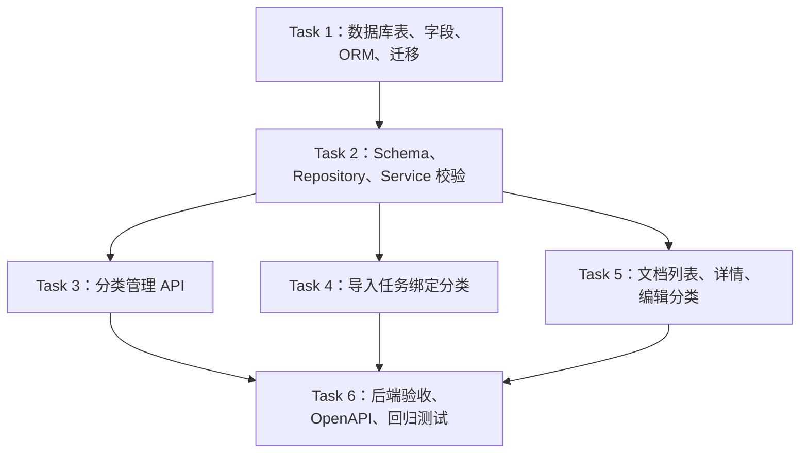

# Task Todo：第一阶段代码落地 —— 知识库分类后端基础能力

> 目标：把“知识库空间 -> 部门 -> 项目或专题 -> 文档”的分类能力落到后端代码、数据库、API 和测试中。本文件拆成可逐个编码实现的 task todo。

---

## Task 1：新增数据库表、文档分类字段和 ORM 模型

### 功能列表

- [ ] 新增知识库空间表 `knowledge_spaces`。
- [ ] 新增知识库项目 / 专题表 `knowledge_categories`。
- [ ] 修改 `documents` 表，增加分类路径字段。
- [ ] 增加必要索引，支撑空间、分类部门、项目 / 专题筛选。
- [ ] 新增 SQLAlchemy ORM 模型。
- [ ] 把新模型注册到 `Base.metadata`。
- [ ] 新增 Alembic 幂等迁移，兼容当前 `0001` 使用 `Base.metadata.create_all()` 的机制。

### 涉及修改或增加的表 SQL

新增表：

```sql
CREATE TABLE knowledge_spaces (
    id varchar(36) PRIMARY KEY,
    tenant_id varchar(36) NOT NULL,
    name varchar(120) NOT NULL,
    code varchar(80) NOT NULL,
    description text,
    status varchar(40) NOT NULL DEFAULT 'ACTIVE',
    sort_order integer NOT NULL DEFAULT 0,
    created_at datetime,
    updated_at datetime,
    deleted_at datetime,
    UNIQUE (tenant_id, code)
);

CREATE TABLE knowledge_categories (
    id varchar(36) PRIMARY KEY,
    tenant_id varchar(36) NOT NULL,
    space_id varchar(36) NOT NULL,
    department_id varchar(36) NOT NULL,
    name varchar(120) NOT NULL,
    code varchar(80) NOT NULL,
    category_type varchar(40) NOT NULL DEFAULT 'TOPIC',
    parent_id varchar(36),
    description text,
    sort_order integer NOT NULL DEFAULT 0,
    status varchar(40) NOT NULL DEFAULT 'ACTIVE',
    created_at datetime,
    updated_at datetime,
    deleted_at datetime,
    UNIQUE (tenant_id, space_id, department_id, code),
    FOREIGN KEY(space_id) REFERENCES knowledge_spaces(id),
    FOREIGN KEY(department_id) REFERENCES departments(id),
    FOREIGN KEY(parent_id) REFERENCES knowledge_categories(id)
);
```

修改表：

```sql
ALTER TABLE documents ADD COLUMN knowledge_space_id varchar(36);
ALTER TABLE documents ADD COLUMN category_department_id varchar(36);
ALTER TABLE documents ADD COLUMN knowledge_category_id varchar(36);
```

新增索引：

```sql
CREATE INDEX idx_documents_tenant_space_updated
ON documents (tenant_id, knowledge_space_id, updated_at);

CREATE INDEX idx_documents_tenant_category_department_updated
ON documents (tenant_id, category_department_id, updated_at);

CREATE INDEX idx_documents_tenant_knowledge_category_updated
ON documents (tenant_id, knowledge_category_id, updated_at);

CREATE INDEX idx_knowledge_categories_tenant_space_department
ON knowledge_categories (tenant_id, space_id, department_id, sort_order);

CREATE INDEX idx_knowledge_spaces_tenant_status
ON knowledge_spaces (tenant_id, status, sort_order);
```

> 迁移实现时使用 SQLAlchemy / Alembic API，并根据 dialect 做幂等检查；PostgreSQL 可额外使用 `WHERE deleted_at IS NULL` 的 partial index，但 SQLite 测试库必须可运行。

### 涉及函数、接口、文件

新增文件：

- `D:\codeproject\python\lingxi\server\app\models\knowledge_category.py`
  - `KnowledgeSpace`
  - `KnowledgeCategory`
  - `KnowledgeCategoryType`
- `D:\codeproject\python\lingxi\server\app\db\migrations\versions\0004_knowledge_classification.py`
  - `upgrade()`
  - `downgrade()`

修改文件：

- `D:\codeproject\python\lingxi\server\app\models\document.py`
  - `Document.knowledge_space_id`
  - `Document.category_department_id`
  - `Document.knowledge_category_id`
- `D:\codeproject\python\lingxi\server\app\db\base.py`
  - 添加 `import server.app.models.knowledge_category`

### 明确不修改的边界

- [ ] 不改 `document_access_rules` 表结构。
- [ ] 不改 `departments` 表结构。
- [ ] 不改 `qa_pairs`、`document_chunks`、`import_jobs` 表结构。
- [ ] 不强制给历史文档补分类。
- [ ] 不把分类字段设置为非空。
- [ ] 不改检索索引和向量字段。

### 测试策略

#### 单元测试

- [ ] 使用 SQLite 内存库 `Base.metadata.create_all()`，确认新模型能建表。
- [ ] 创建 `KnowledgeSpace` 成功。
- [ ] 创建 `KnowledgeCategory` 成功。
- [ ] 创建 `Document` 时分类字段可为空。
- [ ] 创建 `Document` 时分类字段可写入。

#### 集成测试

- [ ] Alembic `upgrade head` 可执行。
- [ ] 在已有库重复执行迁移不会因表 / 列 / 索引已存在失败。

#### 用例测试

- [ ] 新建空间“客服知识库”。
- [ ] 新建专题“退款专题”。
- [ ] 新建文档并绑定空间、部门、专题。
- [ ] 查询 ORM 对象可读出分类字段。

### 验收 Checkpoint 和可验证功能

- [ ] `knowledge_spaces` 表存在。
- [ ] `knowledge_categories` 表存在。
- [ ] `documents` 表存在 3 个分类字段。
- [ ] ORM 能正常 import。
- [ ] `Base.metadata.create_all()` 不报错。
- [ ] `alembic upgrade head` 不报错。

---

## Task 2：新增分类 schema、repository 和 service 校验能力

### 功能列表

- [ ] 新增知识库空间请求 / 响应 schema。
- [ ] 新增项目 / 专题请求 / 响应 schema。
- [ ] 新增文档分类请求 / 响应 schema。
- [ ] 新增空间 repository。
- [ ] 新增项目 / 专题 repository。
- [ ] 新增 service，封装 CRUD、租户校验、分类路径一致性校验。
- [ ] 删除空间 / 分类前检查是否被文档使用。

### 涉及修改或增加的表 SQL

本 task 不新增表，依赖 Task 1 的表结构。会读写以下字段：

```sql
-- knowledge_spaces
SELECT * FROM knowledge_spaces WHERE tenant_id = :tenant_id AND deleted_at IS NULL;
INSERT INTO knowledge_spaces (...);
UPDATE knowledge_spaces SET ... WHERE id = :space_id AND tenant_id = :tenant_id;

-- knowledge_categories
SELECT * FROM knowledge_categories
WHERE tenant_id = :tenant_id
  AND deleted_at IS NULL
  AND (:space_id IS NULL OR space_id = :space_id)
  AND (:department_id IS NULL OR department_id = :department_id);
INSERT INTO knowledge_categories (...);
UPDATE knowledge_categories SET ... WHERE id = :category_id AND tenant_id = :tenant_id;

-- documents usage guard
SELECT count(*) FROM documents
WHERE tenant_id = :tenant_id
  AND deleted_at IS NULL
  AND status != 'DELETED'
  AND (knowledge_space_id = :space_id OR knowledge_category_id = :category_id);
```

### 涉及函数、接口、文件

新增文件：

- `D:\codeproject\python\lingxi\server\app\schemas\knowledge_category.py`
  - `NamedClassificationNodeResponse`
  - `KnowledgeSpaceCreateRequest`
  - `KnowledgeSpaceUpdateRequest`
  - `KnowledgeSpaceResponse`
  - `KnowledgeSpaceListResponse`
  - `KnowledgeCategoryCreateRequest`
  - `KnowledgeCategoryUpdateRequest`
  - `KnowledgeCategoryResponse`
  - `KnowledgeCategoryListResponse`
  - `DocumentClassificationRequest`
  - `DocumentClassificationResponse`
- `D:\codeproject\python\lingxi\server\app\repositories\knowledge_category_repo.py`
  - `KnowledgeSpaceRepository.add()`
  - `KnowledgeSpaceRepository.get_for_tenant()`
  - `KnowledgeSpaceRepository.get_by_code()`
  - `KnowledgeSpaceRepository.list_for_tenant()`
  - `KnowledgeSpaceRepository.count_documents()`
  - `KnowledgeCategoryRepository.add()`
  - `KnowledgeCategoryRepository.get_for_tenant()`
  - `KnowledgeCategoryRepository.get_by_code()`
  - `KnowledgeCategoryRepository.list_for_tenant()`
  - `KnowledgeCategoryRepository.count_documents()`
- `D:\codeproject\python\lingxi\server\app\services\knowledge_category_service.py`
  - `list_spaces(context)`
  - `create_space(context, payload)`
  - `update_space(context, space_id, payload)`
  - `delete_space(context, space_id)`
  - `list_categories(context, space_id=None, department_id=None)`
  - `create_category(context, payload)`
  - `update_category(context, category_id, payload)`
  - `delete_category(context, category_id)`
  - `validate_classification(context, classification)`
  - `classification_to_dict(context_or_tenant_id, document)`

### 明确不修改的边界

- [ ] 不增加 FastAPI router，本 task 只做 service/repository/schema。
- [ ] 不接入导入任务。
- [ ] 不修改文档列表接口。
- [ ] 不修改前端。
- [ ] 不做分类树拖拽排序。
- [ ] 不做批量迁移。

### 测试策略

#### 单元测试

新增或扩展：

- `D:\codeproject\python\lingxi\server\tests\test_knowledge_classification.py`

覆盖：

- [ ] 创建空间成功。
- [ ] 空间 code 在同一租户下重复时报冲突。
- [ ] 创建分类成功。
- [ ] 分类 code 在同一租户 + 空间 + 部门下重复时报冲突。
- [ ] 分类绑定不存在空间时报 404。
- [ ] 分类绑定不存在部门时报 404。
- [ ] `validate_classification()` 对合法路径返回模型对象。
- [ ] `validate_classification()` 对不一致路径返回 400。
- [ ] 空间或分类被文档使用时删除返回冲突。

#### 集成测试

- [ ] 使用真实 Session 创建空间、分类、文档，并执行删除保护。
- [ ] 审计日志按既有模式写入，若本 task 实现审计。

#### 用例测试

- [ ] 创建“客服知识库”。
- [ ] 在 Support 部门下创建“退款专题”。
- [ ] 调用 `validate_classification()` 验证路径正确。
- [ ] 将分类中的 `department_id` 改成另一个部门后，验证原路径被拒绝。

### 验收 Checkpoint 和可验证功能

- [ ] schema 可被 Pydantic 正确序列化为 camelCase。
- [ ] repository CRUD 可用。
- [ ] service 能校验分类路径一致性。
- [ ] service 能阻止删除被文档使用的空间 / 分类。
- [ ] 单元测试覆盖成功和失败分支。

---

## Task 3：新增分类管理 API

### 功能列表

- [ ] 新增知识库空间 API。
- [ ] 新增项目 / 专题 API。
- [ ] 注册 router 到 `/api/v1`。
- [ ] 使用现有权限依赖保护接口。
- [ ] 返回 camelCase 响应。
- [ ] 接口错误沿用现有 `bad_request`、`conflict`、`not_found` 风格。

### 涉及修改或增加的表 SQL

本 task 不新增表。API 通过 Task 2 repository/service 读写：

```sql
SELECT / INSERT / UPDATE knowledge_spaces;
SELECT / INSERT / UPDATE knowledge_categories;
SELECT count(*) FROM documents WHERE knowledge_space_id = :space_id OR knowledge_category_id = :category_id;
```

### 涉及函数、接口、文件

新增文件：

- `D:\codeproject\python\lingxi\server\app\api\v1\knowledge_categories.py`

新增接口：

- `GET /api/v1/knowledge-spaces`
  - 函数：`list_knowledge_spaces()`
- `POST /api/v1/knowledge-spaces`
  - 函数：`create_knowledge_space()`
- `PUT /api/v1/knowledge-spaces/{space_id}`
  - 函数：`update_knowledge_space()`
- `DELETE /api/v1/knowledge-spaces/{space_id}`
  - 函数：`delete_knowledge_space()`
- `GET /api/v1/knowledge-categories?spaceId=&departmentId=`
  - 函数：`list_knowledge_categories()`
- `POST /api/v1/knowledge-categories`
  - 函数：`create_knowledge_category()`
- `PUT /api/v1/knowledge-categories/{category_id}`
  - 函数：`update_knowledge_category()`
- `DELETE /api/v1/knowledge-categories/{category_id}`
  - 函数：`delete_knowledge_category()`

修改文件：

- `D:\codeproject\python\lingxi\server\app\api\v1\__init__.py`
  - import `knowledge_categories`
  - `api_router.include_router(knowledge_categories.router)`
- `D:\codeproject\python\lingxi\server\app\services\seed_service.py`
  - 如果采用细粒度权限：新增 `KNOWLEDGE_CATEGORY_READ`、`KNOWLEDGE_CATEGORY_WRITE`。
  - 如果复用权限：读接口用 `DOCUMENT_READ`，写接口用 `DOCUMENT_WRITE`。

### 明确不修改的边界

- [ ] 不接入文档上传。
- [ ] 不修改文档详情返回。
- [ ] 不修改文档列表筛选。
- [ ] 不新增前端页面。
- [ ] 不新增批量分类接口。

### 测试策略

#### 单元测试

- [ ] service 层测试已在 Task 2 覆盖，本 task 只补必要 API 错误映射测试。

#### 集成测试

新增或扩展：

- `D:\codeproject\python\lingxi\server\tests\test_knowledge_classification.py`

覆盖：

- [ ] 管理员可创建空间。
- [ ] 管理员可查询空间。
- [ ] 管理员可更新空间。
- [ ] 管理员可删除未使用空间。
- [ ] 管理员可创建分类。
- [ ] 管理员可按 `spaceId` 查询分类。
- [ ] 管理员可按 `departmentId` 查询分类。
- [ ] 管理员可更新分类。
- [ ] 管理员可删除未使用分类。
- [ ] 无权限用户访问写接口返回 403。

#### 用例测试

- [ ] 通过 HTTP 创建空间。
- [ ] 通过 HTTP 创建分类。
- [ ] 通过 HTTP 列出指定空间和部门下的分类。
- [ ] 通过 HTTP 删除分类。

### 验收 Checkpoint 和可验证功能

- [ ] OpenAPI 出现知识库空间和分类接口。
- [ ] API 可完整 CRUD。
- [ ] 权限控制生效。
- [ ] 错误响应符合项目现有错误格式。

---

## Task 4：导入任务创建时绑定文档分类

### 功能列表

- [ ] 修改导入任务创建请求，支持 `classification`。
- [ ] 修改导入任务 API，把分类传入 service。
- [ ] 修改 `ImportService.create_job()`，创建 `Document` 时写入分类字段。
- [ ] 使用 `KnowledgeCategoryService.validate_classification()` 做后端校验。
- [ ] 导入任务响应可暂不返回完整分类，但必须保证文档详情 / 列表可查到分类。

### 涉及修改或增加的表 SQL

修改 `documents` 插入字段：

```sql
INSERT INTO documents (
    tenant_id,
    title,
    file_name,
    file_type,
    mime_type,
    file_size,
    object_key,
    checksum,
    status,
    knowledge_space_id,
    category_department_id,
    knowledge_category_id
) VALUES (...);
```

仍保持导入任务原有写入：

```sql
INSERT INTO import_jobs (...);
INSERT INTO document_access_rules (...);
```

### 涉及函数、接口、文件

修改文件：

- `D:\codeproject\python\lingxi\server\app\schemas\import_job.py`
  - 新增 `ImportClassificationRequest` 或复用 `DocumentClassificationRequest`。
  - 修改 `ImportJobCreateRequest.classification`。
- `D:\codeproject\python\lingxi\server\app\api\v1\import_jobs.py`
  - 修改 `create_import_job()`。
- `D:\codeproject\python\lingxi\server\app\services\import_service.py`
  - 修改 `ImportService.create_job()` 签名。
  - 在创建 `Document` 前校验分类。
  - 创建 `Document` 时写入分类字段。
  - 审计 `after_snapshot` 可增加 `classification`。

涉及接口：

- `POST /api/v1/import-jobs`

请求新增字段：

```json
{
  "title": "退款 SOP",
  "classification": {
    "spaceId": "...",
    "departmentId": "...",
    "categoryId": "..."
  },
  "permission": {
    "allAuthenticated": true
  },
  "processingOptions": {
    "enableQaSplit": true,
    "enableEmbedding": true
  }
}
```

### 明确不修改的边界

- [ ] 不修改文件绑定接口 `/api/v1/import-jobs/{job_id}/files`。
- [ ] 不修改解析任务、QA 任务、Embedding 任务。
- [ ] 不改变原有 `permission` 字段语义。
- [ ] 不要求老文档必须有分类。
- [ ] 不在本 task 实现文档分类编辑接口。

### 测试策略

#### 单元测试

- [ ] `ImportService.create_job()` 传合法分类时文档写入 3 个分类字段。
- [ ] 传非法分类路径时返回 400。
- [ ] 不传分类时仍可创建导入任务，文档分类字段为空。
- [ ] 权限规则仍按原逻辑创建。

#### 集成测试

修改：

- `D:\codeproject\python\lingxi\server\tests\test_import_jobs.py`

覆盖：

- [ ] `POST /api/v1/import-jobs` 携带 `classification` 返回 201。
- [ ] 之后查询数据库中文档分类字段正确。
- [ ] 携带不一致 `spaceId` / `categoryId` 返回 400。

#### 用例测试

- [ ] API 创建导入任务，绑定“客服知识库 / Support / 退款专题”。
- [ ] 上传文件并完成原有处理流程。
- [ ] 文档记录仍能进入 PARSING 状态。

### 验收 Checkpoint 和可验证功能

- [ ] 导入任务创建请求支持 `classification`。
- [ ] 创建后的 `documents` 记录保存分类字段。
- [ ] 不传分类不影响原有上传流程。
- [ ] 原有导入任务测试不回归。

---

## Task 5：文档列表、详情和分类编辑接口接入分类

### 功能列表

- [ ] 文档列表接口支持分类筛选。
- [ ] 文档列表响应返回分类路径。
- [ ] 文档详情响应返回分类路径。
- [ ] 新增文档分类编辑接口。
- [ ] 分类编辑写审计日志。
- [ ] 保持原有权限过滤和授权部门筛选语义。

### 涉及修改或增加的表 SQL

查询筛选：

```sql
SELECT * FROM documents
WHERE tenant_id = :tenant_id
  AND deleted_at IS NULL
  AND status != 'DELETED'
  AND (:space_id IS NULL OR knowledge_space_id = :space_id)
  AND (:classification_department_id IS NULL OR category_department_id = :classification_department_id)
  AND (:category_id IS NULL OR knowledge_category_id = :category_id);
```

分类编辑：

```sql
UPDATE documents
SET knowledge_space_id = :space_id,
    category_department_id = :department_id,
    knowledge_category_id = :category_id
WHERE tenant_id = :tenant_id
  AND id = :document_id
  AND deleted_at IS NULL;
```

分类详情拼装：

```sql
SELECT * FROM knowledge_spaces WHERE id = :knowledge_space_id;
SELECT * FROM departments WHERE id = :category_department_id;
SELECT * FROM knowledge_categories WHERE id = :knowledge_category_id;
```

### 涉及函数、接口、文件

修改文件：

- `D:\codeproject\python\lingxi\server\app\schemas\document.py`
  - `DocumentListItemResponse.classification`
  - `DocumentDetailResponse.classification`
  - 可新增 `DocumentClassificationUpdateRequest`
- `D:\codeproject\python\lingxi\server\app\api\v1\documents.py`
  - 修改 `list_documents()` 参数：
    - `spaceId`
    - `classificationDepartmentId`
    - `categoryId`
  - 新增 `update_document_classification()`
- `D:\codeproject\python\lingxi\server\app\repositories\document_repo.py`
  - 修改 `list_documents()` 签名。
  - 修改 `_document_filters()`。
- `D:\codeproject\python\lingxi\server\app\services\document_center_service.py`
  - 修改 `list_documents()`。
  - 修改 `document_to_dict()`。
  - 新增 `update_classification()`。
  - 新增或调用 `classification_to_dict()`。

新增接口：

- `PATCH /api/v1/documents/{document_id}/classification`

请求：

```json
{
  "spaceId": "...",
  "departmentId": "...",
  "categoryId": "..."
}
```

文档列表新增 query：

```text
GET /api/v1/documents?spaceId=...&classificationDepartmentId=...&categoryId=...
```

### 明确不修改的边界

- [ ] 不改变 `departmentId` 原有授权部门筛选语义。
- [ ] 不修改 `PATCH /api/v1/documents/{document_id}/permissions`。
- [ ] 不修改文档删除逻辑。
- [ ] 不修改 QA Pair 列表和 Chunk 列表。
- [ ] 不修改检索召回逻辑。

### 测试策略

#### 单元测试

- [ ] `_document_filters()` 对 `spaceId` 生成正确条件。
- [ ] `_document_filters()` 对 `classificationDepartmentId` 生成正确条件。
- [ ] `_document_filters()` 对 `categoryId` 生成正确条件。
- [ ] `document_to_dict()` 对有分类文档返回完整 path。
- [ ] `document_to_dict()` 对无分类文档返回 `classification = None` 或空 path。

#### 集成测试

修改：

- `D:\codeproject\python\lingxi\server\tests\test_knowledge_documents_api.py`
- `D:\codeproject\python\lingxi\server\tests\test_document_permissions.py`

覆盖：

- [ ] 文档列表返回分类。
- [ ] 文档详情返回分类。
- [ ] 按空间筛选生效。
- [ ] 按分类部门筛选生效。
- [ ] 按项目 / 专题筛选生效。
- [ ] 分类编辑接口可修改文档分类。
- [ ] 非授权用户不能通过分类筛选看到无权限文档。
- [ ] 授权部门筛选和分类部门筛选互不污染。

#### 用例测试

- [ ] 创建两个专题，各上传一份文档。
- [ ] 用 `categoryId` 只筛出目标专题文档。
- [ ] 编辑文档分类到另一个专题。
- [ ] 再次筛选确认文档移动到新专题。

### 验收 Checkpoint 和可验证功能

- [ ] `GET /api/v1/documents` 支持 3 个分类筛选参数。
- [ ] 文档列表和详情响应包含分类路径。
- [ ] `PATCH /api/v1/documents/{document_id}/classification` 可用。
- [ ] 原有文档权限测试通过。
- [ ] API 行为能从测试和手工请求验证。

---

## Task 6：第一阶段后端验收、OpenAPI 和回归测试

### 功能列表

- [ ] 补齐第一阶段所有后端测试。
- [ ] 导出 OpenAPI。
- [ ] 更新前端 OpenAPI JSON 和类型文件，为第二阶段做准备。
- [ ] 执行文档中心、导入、权限相关回归测试。
- [ ] 记录验收证据。

### 涉及修改或增加的表 SQL

本 task 不新增表。验证 Task 1 至 Task 5 涉及的全部 SQL 路径：

- `knowledge_spaces` CRUD。
- `knowledge_categories` CRUD。
- `documents` 分类字段 INSERT / UPDATE / SELECT。
- `document_access_rules` 原有权限查询不回归。

### 涉及函数、接口、文件

修改或生成文件：

- `D:\codeproject\python\lingxi\server\tests\test_knowledge_classification.py`
- `D:\codeproject\python\lingxi\server\tests\test_knowledge_documents_api.py`
- `D:\codeproject\python\lingxi\server\tests\test_import_jobs.py`
- `D:\codeproject\python\lingxi\server\tests\test_document_permissions.py`
- `D:\codeproject\python\lingxi\web\admin\openapi.json`
- `D:\codeproject\python\lingxi\web\admin\src\api\schema.d.ts`

可能使用命令：

```powershell
python -m pytest server/tests/test_knowledge_classification.py
python -m pytest server/tests/test_knowledge_documents_api.py server/tests/test_import_jobs.py server/tests/test_document_permissions.py
python server/scripts/export_openapi.py
```

### 明确不修改的边界

- [ ] 不实现前端 UI。
- [ ] 不修改第三阶段检索范围。
- [ ] 不为了测试跳过权限校验。
- [ ] 不提交未通过或未解释的 OpenAPI 差异。

### 测试策略

#### 单元测试

- [ ] 分类 service 和 repository 单元测试通过。

#### 集成测试

- [ ] 分类 API 集成测试通过。
- [ ] 导入绑定分类集成测试通过。
- [ ] 文档列表 / 详情 / 编辑分类集成测试通过。
- [ ] 权限回归测试通过。

#### 用例测试

完整 API 流程：

1. 登录管理员。
2. 创建空间。
3. 创建分类。
4. 创建导入任务并传分类。
5. 绑定文件。
6. 查询文档列表看到分类。
7. 编辑分类。
8. 再次查询确认分类变化。

### 验收 Checkpoint 和可验证功能

- [ ] 第一阶段所有新增和修改测试通过。
- [ ] OpenAPI 已更新。
- [ ] 后端启动无 import 错误。
- [ ] 文档导入原有主流程不回归。
- [ ] 第二阶段前端可以基于 OpenAPI 和接口合同开始开发。

---

## 任务依赖和可并行实施的任务

### 必须依赖

- Task 1 是第一阶段基础，所有后端分类能力都依赖数据库表、字段、ORM 和迁移。
- Task 2 依赖 Task 1 的 ORM 模型和字段。
- Task 3 依赖 Task 2 的 schema、repository、service 校验能力。
- Task 4 依赖 Task 2 的分类校验能力，并与导入任务现有创建流程耦合。
- Task 5 依赖 Task 2 的分类校验能力和 Task 1 的文档分类字段。
- Task 6 依赖 Task 1-5 功能完成后统一回归和导出 OpenAPI。

### 可并行实施

- Task 3 分类管理 API 与 Task 4 导入绑定分类可在 Task 2 合同稳定后并行。
- Task 5 文档列表 / 详情 / 分类编辑可在 Task 2 完成后与 Task 4 并行。
- Task 6 的测试用例设计和 OpenAPI 差异检查可提前准备，但最终验收必须等待 Task 1-5 完成。

## Mermaid 任务依赖图



## 阶段 Checkpoint 和推荐实施顺序

### 推荐实施顺序

1. 先完成 Task 1，保证数据库、ORM、迁移可用。
2. 完成 Task 2，建立分类数据访问和校验边界。
3. 完成 Task 3，提供空间和项目 / 专题 CRUD API。
4. 完成 Task 4，使新上传文档可绑定分类。
5. 完成 Task 5，使已有文档可查询、筛选、展示、编辑分类。
6. 完成 Task 6，导出 OpenAPI 并执行后端回归，为第二阶段前端接入提供稳定合同。

### 阶段 Checkpoint

- [ ] Checkpoint 1：迁移、模型、字段创建成功且幂等。
- [ ] Checkpoint 2：分类 repository / service 校验通过。
- [ ] Checkpoint 3：分类管理 API 可 CRUD。
- [ ] Checkpoint 4：导入任务可绑定分类，历史未分类兼容。
- [ ] Checkpoint 5：文档列表、详情、编辑分类接口可用且权限不回归。
- [ ] Checkpoint 6：OpenAPI 已更新，后端新增和回归测试通过。
