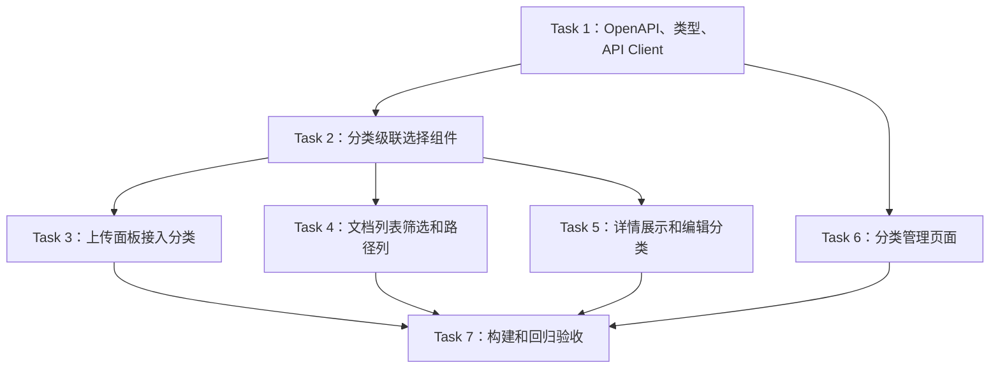

# Task Todo：第二阶段代码落地 —— 知识库分类前端接入

> 目标：基于第一阶段后端 API，把“知识库空间 -> 部门 -> 项目或专题”的分类路径落到管理后台 UI。本文档拆成可直接分配给前端开发的 task todo；本阶段不改数据库、不改后端业务规则，只消费和验证第一阶段 API 合同。

---

## Task 1：更新 OpenAPI、前端类型和分类 API Client

### 功能列表

- [ ] 同步第一阶段导出的 OpenAPI 到前端工程。
- [ ] 新增知识库分类 API client，封装空间与项目 / 专题 CRUD。
- [ ] 扩展文档列表、文档详情、导入任务创建、文档分类编辑的 TypeScript 类型。
- [ ] 统一前端字段名为 camelCase：`spaceId`、`classificationDepartmentId`、`categoryId`、`classification`。
- [ ] 对后端冲突错误、校验错误、权限错误做统一错误透传，供 UI 展示。

### 涉及修改或增加的表 SQL、函数、接口、文件

#### 表 SQL

本 task 不新增、不修改数据库表。前端依赖第一阶段已有 SQL 结构：

```sql
-- 已由第一阶段创建，本阶段只消费接口响应
knowledge_spaces(id, tenant_id, name, code, status, sort_order, ...)
knowledge_categories(id, tenant_id, space_id, department_id, name, code, category_type, ...)
documents(knowledge_space_id, category_department_id, knowledge_category_id, ...)
```

#### 后端接口合同

消费接口：

```text
GET    /api/v1/knowledge-spaces
POST   /api/v1/knowledge-spaces
PATCH  /api/v1/knowledge-spaces/{space_id}
DELETE /api/v1/knowledge-spaces/{space_id}

GET    /api/v1/knowledge-categories?spaceId=...&departmentId=...
POST   /api/v1/knowledge-categories
PATCH  /api/v1/knowledge-categories/{category_id}
DELETE /api/v1/knowledge-categories/{category_id}

GET    /api/v1/documents?spaceId=...&classificationDepartmentId=...&categoryId=...
PATCH  /api/v1/documents/{document_id}/classification
POST   /api/v1/import-jobs
```

关键请求 / 响应类型：

```ts
export interface KnowledgeClassificationPath {
  spaceId: string | null;
  spaceName: string | null;
  departmentId: string | null;
  departmentName: string | null;
  categoryId: string | null;
  categoryName: string | null;
}

export interface UpdateDocumentClassificationPayload {
  spaceId: string | null;
  departmentId: string | null;
  categoryId: string | null;
}
```

#### 函数和文件

新增文件：

- `D:\codeproject\python\lingxi\web\admin\src\features\knowledge\api\classificationApi.ts`
  - `listKnowledgeSpaces(params?)`
  - `createKnowledgeSpace(payload)`
  - `updateKnowledgeSpace(spaceId, payload)`
  - `deleteKnowledgeSpace(spaceId)`
  - `listKnowledgeCategories(filters)`
  - `createKnowledgeCategory(payload)`
  - `updateKnowledgeCategory(categoryId, payload)`
  - `deleteKnowledgeCategory(categoryId)`
- `D:\codeproject\python\lingxi\web\admin\src\features\knowledge\types\classification.ts`
  - `KnowledgeSpace`
  - `KnowledgeCategory`
  - `KnowledgeClassificationPath`
  - `KnowledgeCategoryFilters`
  - `CreateKnowledgeSpacePayload`
  - `UpdateKnowledgeSpacePayload`
  - `CreateKnowledgeCategoryPayload`
  - `UpdateKnowledgeCategoryPayload`

修改文件：

- `D:\codeproject\python\lingxi\web\admin\openapi.json`
- `D:\codeproject\python\lingxi\web\admin\src\api\schema.d.ts`
- `D:\codeproject\python\lingxi\web\admin\src\features\knowledge\api\documentApi.ts`
  - `KnowledgeDocument.classification`
  - `KnowledgeDocumentDetail.classification`
  - `DocumentFilters.spaceId`
  - `DocumentFilters.classificationDepartmentId`
  - `DocumentFilters.categoryId`
  - `listDocuments(filters)`
  - `updateDocumentClassification(documentId, payload)`
- `D:\codeproject\python\lingxi\web\admin\src\features\knowledge\api\importJobApi.ts`
  - `CreateImportJobPayload.classification`
  - `createImportJob(payload)`
- `D:\codeproject\python\lingxi\web\admin\src\features\org\api\orgApi.ts`
  - 复用已有 `listDepartments()`，不重复实现部门 API。

### 明确不修改的边界

- [ ] 不改后端 API 路由、权限、字段语义。
- [ ] 不绕过 OpenAPI 类型，禁止用 `any` 承接核心分类响应。
- [ ] 不新增前端全局状态管理库。
- [ ] 不修改登录、用户、部门维护页面。
- [ ] 不把“分类部门”替换成现有文档授权部门筛选。

### 测试策略

#### 单元测试

- [ ] API client 能正确拼接分类 query 参数。
- [ ] `updateDocumentClassification()` 请求体字段符合后端合同。
- [ ] `createImportJob()` 可提交 `classification`，未分类时不提交或提交 `null` 符合合同。
- [ ] 错误响应能被统一转换为 UI 可展示 message。

#### 集成测试

- [ ] 使用 mock server / MSW 验证分类 API client 请求路径、method、query、body。
- [ ] TypeScript 编译验证 OpenAPI 类型与手写类型没有冲突。

#### 用例测试

- [ ] 调用 `listKnowledgeSpaces()` 返回空间列表。
- [ ] 调用 `listKnowledgeCategories({ spaceId, departmentId })` 返回项目 / 专题。
- [ ] 调用 `listDocuments({ categoryId })` 请求 URL 含 `categoryId`。

### 验收 Checkpoint 和可验证的完成功能

- [ ] 前端可编译通过，没有新增 TypeScript 类型错误。
- [ ] 分类 API client 单测通过。
- [ ] 文档和导入 API client 已具备分类字段能力。
- [ ] 后续 UI 任务可以直接复用这些 client 和类型。

---

## Task 2：实现分类级联选择 Hook 和通用组件

### 功能列表

- [ ] 新增通用分类级联选择组件：空间、部门、项目 / 专题三级联动。
- [ ] 新增 hook 封装分类选项加载、清空、禁用、错误状态。
- [ ] 支持初始值回显，用于文档详情编辑。
- [ ] 支持允许未分类和必填两种模式。
- [ ] 支持空间变化后自动清空部门和项目 / 专题；部门变化后自动清空项目 / 专题。
- [ ] 支持 loading、empty、error 状态展示。

### 涉及修改或增加的表 SQL、函数、接口、文件

#### 表 SQL

本 task 不新增、不修改数据库表。读取的数据来自：

```sql
SELECT * FROM knowledge_spaces WHERE tenant_id = ? AND status = 'ACTIVE' ORDER BY sort_order;
SELECT * FROM departments WHERE tenant_id = ? ORDER BY sort_order;
SELECT * FROM knowledge_categories WHERE tenant_id = ? AND space_id = ? AND department_id = ? AND status = 'ACTIVE' ORDER BY sort_order;
```

以上 SQL 由后端接口实现，前端不直接访问数据库。

#### 使用接口

```text
GET /api/v1/knowledge-spaces
GET /api/v1/org/departments 或现有部门列表接口
GET /api/v1/knowledge-categories?spaceId=...&departmentId=...
```

#### 函数和文件

新增文件：

- `D:\codeproject\python\lingxi\web\admin\src\features\knowledge\hooks\useKnowledgeClassificationOptions.ts`
  - `useKnowledgeClassificationOptions(initialValue?, options?)`
  - `loadSpaces()`
  - `loadDepartments()`
  - `loadCategories(spaceId, departmentId)`
  - `setSpaceId(spaceId)`
  - `setDepartmentId(departmentId)`
  - `setCategoryId(categoryId)`
  - `resetClassification()`
- `D:\codeproject\python\lingxi\web\admin\src\features\knowledge\components\KnowledgeClassificationSelect.tsx`
  - `KnowledgeClassificationSelect(props)`
  - `toClassificationPayload(value)`
  - `formatClassificationPath(value)`

修改文件：

- `D:\codeproject\python\lingxi\web\admin\src\features\knowledge\types\classification.ts`
  - `KnowledgeClassificationValue`
  - `KnowledgeClassificationSelectProps`

### 明确不修改的边界

- [ ] 不在组件内直接处理文档上传、文档列表筛选或编辑保存。
- [ ] 不缓存跨租户、跨用户数据到 localStorage。
- [ ] 不创建新的部门维护能力。
- [ ] 不改变后端“项目 / 专题必须属于所选空间 + 部门”的校验规则。
- [ ] 不在 UI 中伪造不存在的“未分类”分类记录。

### 测试策略

#### 单元测试

- [ ] 初始渲染加载空间和部门。
- [ ] 选择空间后，部门和项目 / 专题被清空。
- [ ] 选择空间 + 部门后，触发项目 / 专题加载。
- [ ] `required=true` 时未选择完整分类显示校验错误。
- [ ] `allowUnclassified=true` 时允许返回空分类 payload。
- [ ] 初始化传入已有分类时能正确回显。

#### 集成测试

- [ ] 在测试页面挂载组件，mock 三个接口，验证联动请求顺序。
- [ ] 模拟接口失败，组件展示错误并允许重试。

#### 用例测试

- [ ] 用户依次选择“客服知识库 -> 售后部 -> 退款专题”，组件输出 `{ spaceId, departmentId, categoryId }`。
- [ ] 用户把空间改为“研发知识库”，部门和项目 / 专题自动清空。

### 验收 Checkpoint 和可验证的完成功能

- [ ] 级联选择组件可被上传、列表筛选、详情编辑复用。
- [ ] 组件 loading / error / empty 状态可见且可测试。
- [ ] 分类路径格式化函数可展示完整路径。
- [ ] 组件不包含具体业务保存逻辑，职责边界清晰。

---

## Task 3：上传文档面板接入分类选择

### 功能列表

- [ ] 上传文档面板新增分类路径选择区域。
- [ ] 复用 `KnowledgeClassificationSelect`。
- [ ] 创建导入任务时把分类参数写入 `createImportJob()` payload。
- [ ] 分类选择状态随上传面板重置。
- [ ] 提交失败时展示后端返回的分类校验错误。
- [ ] 保留第一阶段兼容策略：如后端允许未分类，则前端允许提交未分类；如后端配置为必填，则阻止提交。

### 涉及修改或增加的表 SQL、函数、接口、文件

#### 表 SQL

本 task 不新增、不修改数据库表。上传成功后后端最终会写入：

```sql
UPDATE documents
SET knowledge_space_id = ?, category_department_id = ?, knowledge_category_id = ?
WHERE id = ? AND tenant_id = ?;
```

前端只负责提交导入任务分类参数，不直接操作 SQL。

#### 使用接口

```text
POST /api/v1/import-jobs
```

示例请求：

```json
{
  "sourceType": "UPLOAD",
  "title": "退款政策.pdf",
  "classification": {
    "spaceId": "space-001",
    "departmentId": "dept-after-sales",
    "categoryId": "cat-refund"
  }
}
```

#### 函数和文件

修改文件：

- `D:\codeproject\python\lingxi\web\admin\src\features\knowledge\components\DocumentUploadPanel.tsx`
  - 新增 `classificationValue` state。
  - 新增 `handleClassificationChange(value)`。
  - 修改 `handleCreateImportJob()` 或当前创建导入任务函数。
  - 修改上传成功后的 `resetForm()`。
- `D:\codeproject\python\lingxi\web\admin\src\features\knowledge\api\importJobApi.ts`
  - 确保 `CreateImportJobPayload.classification` 被序列化。
- `D:\codeproject\python\lingxi\web\admin\src\features\knowledge\components\KnowledgeClassificationSelect.tsx`
  - 作为被调用组件，不在本 task 中扩展通用逻辑，除非发现必要 bug。

### 明确不修改的边界

- [ ] 不修改文件解析、分片、向量化、QA 生成流程。
- [ ] 不修改上传文件类型、大小限制。
- [ ] 不修改导入任务轮询机制。
- [ ] 不在前端补写历史文档分类。
- [ ] 不修改文档权限规则。

### 测试策略

#### 单元测试

- [ ] 选择完整分类后提交，`createImportJob()` payload 包含 `classification`。
- [ ] 未分类提交时 payload 与后端合同一致。
- [ ] 空间变化导致分类 payload 清空后，提交不携带陈旧 categoryId。
- [ ] 后端返回 422 / 409 时展示错误提示。

#### 集成测试

- [ ] mock 上传流程：创建导入任务 -> 上传文件 -> 轮询任务，确认分类字段只在创建导入任务阶段提交。
- [ ] 文档上传成功后列表刷新，能看到分类路径列数据。

#### 用例测试

- [ ] 选择“客服知识库 -> 售后部 -> 退款专题”上传文档。
- [ ] 上传完成后打开文档列表，文档分类路径显示正确。
- [ ] 不选择分类上传，文档显示“未分类”或被前端必填校验阻止。

### 验收 Checkpoint 和可验证的完成功能

- [ ] 上传面板可选择分类。
- [ ] 创建导入任务请求体含正确分类字段。
- [ ] 上传成功后分类状态重置。
- [ ] 原有上传主流程不回归。

---

## Task 4：文档列表接入分类筛选和分类路径列

### 功能列表

- [ ] 文档列表筛选区新增分类筛选：知识库空间、分类部门、项目 / 专题。
- [ ] 当前“部门 ID”权限筛选改名为“授权部门 ID”，避免和分类部门混淆。
- [ ] 筛选参数变化时重置分页到第一页。
- [ ] 空间或分类部门变化时清空项目 / 专题筛选。
- [ ] 表格新增“分类路径”列。
- [ ] 无分类文档显示“未分类”。
- [ ] URL query 或页面 state 与筛选条件保持一致（按项目现有页面模式实现）。

### 涉及修改或增加的表 SQL、函数、接口、文件

#### 表 SQL

本 task 不新增、不修改数据库表。前端筛选触发后端执行等价条件：

```sql
SELECT * FROM documents
WHERE tenant_id = ?
  AND (:space_id IS NULL OR knowledge_space_id = :space_id)
  AND (:classification_department_id IS NULL OR category_department_id = :classification_department_id)
  AND (:category_id IS NULL OR knowledge_category_id = :category_id)
ORDER BY updated_at DESC;
```

#### 使用接口

```text
GET /api/v1/documents?spaceId=...&classificationDepartmentId=...&categoryId=...&page=...&pageSize=...
```

#### 函数和文件

修改文件：

- `D:\codeproject\python\lingxi\web\admin\src\features\knowledge\components\DocumentList.tsx`
  - 新增分类筛选 UI。
  - 新增 `renderClassificationPath(document)`。
  - 表格 columns 增加 `classificationPath`。
  - 调整权限部门筛选 label。
- `D:\codeproject\python\lingxi\web\admin\src\features\knowledge\pages\DocumentListPage.tsx`
  - 新增 `spaceId`、`classificationDepartmentId`、`categoryId` 筛选 state。
  - 修改 `loadDocuments()` 或 query hook 参数。
  - 修改分页重置逻辑。
  - 如已有 URL query 同步逻辑，则同步新增参数。
- `D:\codeproject\python\lingxi\web\admin\src\features\knowledge\api\documentApi.ts`
  - `DocumentFilters` 增加三个筛选字段。
  - `listDocuments()` 序列化 query。

### 明确不修改的边界

- [ ] 不改变文档列表原有关键字、状态、权限部门等筛选语义。
- [ ] 不修改排序规则，除非项目已有排序状态需要携带分类筛选。
- [ ] 不修改文档详情和编辑分类弹窗，本 task 只做到列表展示与筛选。
- [ ] 不在前端做权限过滤，权限仍以后端响应为准。
- [ ] 不新增后端未分类筛选；未分类筛选放到第三阶段。

### 测试策略

#### 单元测试

- [ ] 选择空间筛选，`listDocuments()` 收到 `spaceId`。
- [ ] 选择分类部门筛选，`listDocuments()` 收到 `classificationDepartmentId`。
- [ ] 选择项目 / 专题筛选，`listDocuments()` 收到 `categoryId`。
- [ ] 分类筛选变化后页码回到 1。
- [ ] 有分类文档渲染“空间 / 部门 / 专题”。
- [ ] 无分类文档渲染“未分类”。

#### 集成测试

- [ ] mock 文档列表接口，验证页面发送的 query 参数与 UI 选择一致。
- [ ] mock 两个分类返回结果，验证筛选后表格只展示响应中的文档。

#### 用例测试

- [ ] 用“退款专题”筛选，只显示退款专题文档。
- [ ] 切换空间后专题下拉重新加载，旧专题筛选被清空。
- [ ] 授权部门筛选仍可与分类部门筛选同时工作。

### 验收 Checkpoint 和可验证的完成功能

- [ ] 文档列表具备三个分类筛选控件。
- [ ] 文档列表请求包含分类 query。
- [ ] 表格显示分类路径或未分类。
- [ ] 原有文档列表筛选、分页、查看详情不回归。

---

## Task 5：文档详情展示分类并支持编辑分类

### 功能列表

- [ ] 文档详情面板展示分类路径。
- [ ] 无分类时展示“未分类”。
- [ ] 新增“编辑分类”入口。
- [ ] 新增文档分类编辑弹窗。
- [ ] 编辑成功后刷新文档详情和文档列表。
- [ ] 编辑失败时展示后端校验错误或权限错误。

### 涉及修改或增加的表 SQL、函数、接口、文件

#### 表 SQL

本 task 不新增、不修改数据库表。编辑成功后后端更新：

```sql
UPDATE documents
SET knowledge_space_id = :space_id,
    category_department_id = :department_id,
    knowledge_category_id = :category_id,
    updated_at = CURRENT_TIMESTAMP
WHERE id = :document_id AND tenant_id = :tenant_id;
```

#### 使用接口

```text
GET   /api/v1/documents/{document_id}
PATCH /api/v1/documents/{document_id}/classification
```

请求示例：

```json
{
  "spaceId": "space-001",
  "departmentId": "dept-after-sales",
  "categoryId": "cat-refund"
}
```

#### 函数和文件

新增文件：

- `D:\codeproject\python\lingxi\web\admin\src\features\knowledge\components\DocumentClassificationModal.tsx`
  - `DocumentClassificationModal(props)`
  - `handleSubmit()`
  - `normalizeInitialClassification(document)`

修改文件：

- `D:\codeproject\python\lingxi\web\admin\src\features\knowledge\components\DocumentDetailPanel.tsx`
  - `renderClassification(document.classification)`
  - 新增编辑按钮。
- `D:\codeproject\python\lingxi\web\admin\src\features\knowledge\pages\DocumentListPage.tsx`
  - 新增 `classificationModalOpen`。
  - 新增 `handleEditClassification(document)`。
  - 新增 `handleClassificationUpdated()`。
- `D:\codeproject\python\lingxi\web\admin\src\features\knowledge\api\documentApi.ts`
  - `updateDocumentClassification(documentId, payload)`。

### 明确不修改的边界

- [ ] 不修改文档权限编辑弹窗。
- [ ] 不修改文档内容、文件名、状态编辑能力。
- [ ] 不在详情面板直接保存分类，保存逻辑只在弹窗。
- [ ] 不实现批量归类；批量归类放到第三阶段。
- [ ] 不修改检索引用展示。

### 测试策略

#### 单元测试

- [ ] 详情面板有分类时展示完整路径。
- [ ] 详情面板无分类时展示“未分类”。
- [ ] 点击“编辑分类”打开弹窗并回显当前分类。
- [ ] 弹窗提交调用 `updateDocumentClassification()`。
- [ ] 提交成功后触发 `onSuccess`。
- [ ] 提交失败展示错误 message。

#### 集成测试

- [ ] mock 文档详情和分类接口，完成打开详情 -> 编辑分类 -> 保存 -> 刷新详情流程。
- [ ] 验证保存成功后列表中的分类路径同步变化。

#### 用例测试

- [ ] 打开已分类文档，看到“客服知识库 / 售后部 / 退款专题”。
- [ ] 将分类改为“安装专题”，保存成功。
- [ ] 重新打开详情和列表，分类均显示“安装专题”。

### 验收 Checkpoint 和可验证的完成功能

- [ ] 文档详情能展示分类路径。
- [ ] 用户能通过弹窗修改单篇文档分类。
- [ ] 保存后列表和详情一致刷新。
- [ ] 权限不足或分类无效时 UI 有明确错误提示。

---

## Task 6：新增知识库分类管理页面

### 功能列表

- [ ] 新增分类管理入口和页面。
- [ ] 支持空间列表展示、新增、编辑、删除。
- [ ] 支持按空间 + 部门筛选项目 / 专题。
- [ ] 支持项目 / 专题列表展示、新增、编辑、删除。
- [ ] 删除失败时展示后端冲突原因，例如“分类下已有文档，不能删除”。
- [ ] 支持空状态、加载状态、失败重试。
- [ ] 操作成功后刷新对应列表。

### 涉及修改或增加的表 SQL、函数、接口、文件

#### 表 SQL

本 task 不新增、不修改数据库表。页面通过接口间接触发以下 CRUD：

```sql
INSERT INTO knowledge_spaces (...);
UPDATE knowledge_spaces SET ... WHERE id = ?;
UPDATE knowledge_spaces SET deleted_at = CURRENT_TIMESTAMP WHERE id = ?;

INSERT INTO knowledge_categories (...);
UPDATE knowledge_categories SET ... WHERE id = ?;
UPDATE knowledge_categories SET deleted_at = CURRENT_TIMESTAMP WHERE id = ?;
```

#### 使用接口

```text
GET    /api/v1/knowledge-spaces
POST   /api/v1/knowledge-spaces
PATCH  /api/v1/knowledge-spaces/{space_id}
DELETE /api/v1/knowledge-spaces/{space_id}

GET    /api/v1/knowledge-categories?spaceId=...&departmentId=...
POST   /api/v1/knowledge-categories
PATCH  /api/v1/knowledge-categories/{category_id}
DELETE /api/v1/knowledge-categories/{category_id}
```

#### 函数和文件

新增文件：

- `D:\codeproject\python\lingxi\web\admin\src\features\knowledge\pages\KnowledgeClassificationPage.tsx`
  - `loadSpaces()`
  - `loadCategories()`
  - `handleCreateSpace()`
  - `handleUpdateSpace()`
  - `handleDeleteSpace()`
  - `handleCreateCategory()`
  - `handleUpdateCategory()`
  - `handleDeleteCategory()`
- `D:\codeproject\python\lingxi\web\admin\src\features\knowledge\components\KnowledgeSpaceModal.tsx`
  - `KnowledgeSpaceModal(props)`
  - `handleSubmit()`
- `D:\codeproject\python\lingxi\web\admin\src\features\knowledge\components\KnowledgeCategoryModal.tsx`
  - `KnowledgeCategoryModal(props)`
  - `handleSubmit()`

修改文件：

- `D:\codeproject\python\lingxi\web\admin\src\routes\index.tsx`
  - 新增分类管理路由，例如 `/knowledge/classification`。
- `D:\codeproject\python\lingxi\web\admin\src\app\App.tsx`
  - 若导航菜单在此维护，则新增入口；如菜单在其他文件，以实际菜单文件为准。
- `D:\codeproject\python\lingxi\web\admin\src\features\knowledge\api\classificationApi.ts`
  - 复用 Task 1 client，不在此新增重复请求封装。

### 明确不修改的边界

- [ ] 不实现分类统计数字；统计放到第三阶段。
- [ ] 不实现分类迁移流程；迁移放到第三阶段。
- [ ] 不实现树形无限层级管理；本阶段只按“空间 -> 部门 -> 项目或专题”落地。
- [ ] 不修改组织部门管理页。
- [ ] 不做批量创建或导入分类。

### 测试策略

#### 单元测试

- [ ] 空间列表渲染、空状态、loading、error 状态。
- [ ] 新增 / 编辑空间表单校验。
- [ ] 删除空间前弹出确认。
- [ ] 项目 / 专题列表随空间 + 部门变化刷新。
- [ ] 新增 / 编辑项目专题表单校验 `spaceId`、`departmentId`、`name`。
- [ ] 删除失败时展示后端冲突 message。

#### 集成测试

- [ ] mock 全套 CRUD 接口，完成空间新增 -> 编辑 -> 删除流程。
- [ ] mock 项目 / 专题 CRUD，完成按部门创建和删除流程。
- [ ] 路由跳转到分类管理页面成功。

#### 用例测试

- [ ] 管理员进入“知识库分类”。
- [ ] 新增“客服知识库”。
- [ ] 选择“售后部”，新增“退款专题”。
- [ ] 编辑专题名称为“退款政策专题”。
- [ ] 删除无文档专题成功；删除有文档专题时展示后端冲突提示。

### 验收 Checkpoint 和可验证的完成功能

- [ ] 导航可进入分类管理页面。
- [ ] 空间 CRUD 可通过 UI 完成。
- [ ] 项目 / 专题 CRUD 可通过 UI 完成。
- [ ] 删除冲突有清晰提示。
- [ ] 页面刷新后数据来自后端而非本地假数据。

---

## Task 7：第二阶段构建、前端回归和端到端用例验收

### 功能列表

- [ ] 补齐第二阶段前端单元测试和集成测试。
- [ ] 执行前端构建。
- [ ] 执行知识库页面 Playwright / 用例测试。
- [ ] 验证上传、列表、详情、分类管理四条主流程。
- [ ] 固化第二阶段验收证据。

### 涉及修改或增加的表 SQL、函数、接口、文件

#### 表 SQL

本 task 不新增、不修改数据库表。验收覆盖第一阶段分类 SQL 的前端入口：

- `knowledge_spaces`：页面 CRUD 可触发。
- `knowledge_categories`：页面 CRUD 可触发。
- `documents` 分类字段：上传、筛选、详情、编辑可触发。

#### 函数、接口、文件

修改或新增测试文件：

- `D:\codeproject\python\lingxi\web\admin\tests\t09_knowledge_playwright.py`
- `D:\codeproject\python\lingxi\web\admin\src\features\knowledge\components\KnowledgeClassificationSelect.test.tsx`
- `D:\codeproject\python\lingxi\web\admin\src\features\knowledge\components\DocumentUploadPanel.test.tsx`
- `D:\codeproject\python\lingxi\web\admin\src\features\knowledge\components\DocumentList.test.tsx`
- `D:\codeproject\python\lingxi\web\admin\src\features\knowledge\components\DocumentClassificationModal.test.tsx`
- `D:\codeproject\python\lingxi\web\admin\src\features\knowledge\pages\KnowledgeClassificationPage.test.tsx`

可能使用命令：

```powershell
cd D:\codeproject\python\lingxi\web\admin
npm run build
# 按项目现有测试脚本执行，例如 npm test 或 python web/admin/tests/t09_knowledge_playwright.py
```

### 明确不修改的边界

- [ ] 不把测试改成只验证静态文本，必须验证 API 请求参数或关键 UI 状态。
- [ ] 不为通过测试禁用分类必填 / 后端错误显示。
- [ ] 不在第二阶段修改第三阶段检索 UI。
- [ ] 不引入真实生产数据作为测试依赖。

### 测试策略

#### 单元测试

- [ ] 分类选择组件测试通过。
- [ ] 上传面板分类 payload 测试通过。
- [ ] 文档列表分类筛选测试通过。
- [ ] 文档详情编辑分类测试通过。
- [ ] 分类管理页面 CRUD 状态测试通过。

#### 集成测试

- [ ] 前端 mock API 集成测试覆盖分类管理、上传、列表、详情编辑。
- [ ] `npm run build` 通过。
- [ ] OpenAPI 类型与前端使用代码一致。

#### 用例测试

完整 UI 流程：

1. 管理员登录后台。
2. 进入分类管理，创建空间和项目 / 专题。
3. 进入上传页，选择分类并上传文档。
4. 进入文档列表，用分类筛选找到文档。
5. 打开详情，确认分类路径展示正确。
6. 编辑分类为另一个专题。
7. 重新筛选，确认文档出现在新专题下。

### 验收 Checkpoint 和可验证的完成功能

- [ ] 前端构建通过。
- [ ] 分类相关组件和页面测试通过。
- [ ] 上传文档时可以选择分类。
- [ ] 文档列表可以按分类筛选并展示分类路径。
- [ ] 文档详情可以展示和编辑分类。
- [ ] 分类管理页面可维护空间和项目 / 专题。

---

## 任务依赖和可并行实施的任务

### 必须依赖

- Task 2 依赖 Task 1 的类型和 API client。
- Task 3、Task 4、Task 5 依赖 Task 2 的分类选择组件。
- Task 6 依赖 Task 1 的分类 API client，可与 Task 3-5 部分并行。
- Task 7 依赖 Task 3-6 的业务功能完成。

### 可并行实施

- Task 3 上传接入、Task 4 列表接入、Task 5 详情编辑可在 Task 2 完成后并行开发。
- Task 6 分类管理页面可在 Task 1 完成后与 Task 2-5 并行，但表单组件最好独立文件，避免与文档列表任务冲突。
- Task 7 的测试用例设计可提前开始；真实验收必须等 Task 3-6 完成。

## Mermaid 任务依赖图



## 阶段 Checkpoint 和推荐实施顺序

### 推荐实施顺序

1. 先完成 Task 1，稳定接口合同和类型。
2. 再完成 Task 2，沉淀可复用分类级联选择。
3. 并行推进 Task 3、Task 4、Task 5。
4. 同步或稍后推进 Task 6 分类管理页面。
5. 最后执行 Task 7，完成构建、自动化测试和手工用例验收。

### 阶段 Checkpoint

- [ ] Checkpoint 1：前端 API client 和类型可编译。
- [ ] Checkpoint 2：分类级联选择组件独立可用。
- [ ] Checkpoint 3：上传、列表、详情三条文档主流程接入分类。
- [ ] Checkpoint 4：分类管理页面 CRUD 可用。
- [ ] Checkpoint 5：第二阶段构建、自动化测试、手工用例验收通过。
