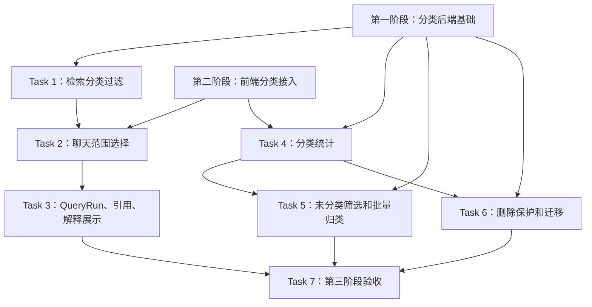

# Task Todo：第三阶段代码落地 —— 分类检索、运营增强和治理能力

> 目标：在第一阶段后端分类基础能力、第二阶段前端分类接入完成后，把分类用于检索范围控制、聊天引用展示、分类统计、未分类治理、批量归类、删除保护和迁移。本文档拆成可直接落地编码的 task todo。

---

## Task 1：扩展 RetrievalAccessScope 并实现后端检索分类过滤

### 功能列表

- [ ] 扩展检索访问范围对象，支持按知识库空间、分类部门、项目 / 专题过滤。
- [ ] 在检索 repository 查询 chunks / documents 时拼接分类过滤条件。
- [ ] 分类过滤必须与已有权限过滤同时生效，不能扩大召回范围。
- [ ] 支持只传 `spaceId`、传 `spaceId + departmentId`、传完整 `spaceId + departmentId + categoryId` 三种粒度。
- [ ] 支持未传分类范围时保持原检索行为不变。
- [ ] 检索日志中记录本次分类范围，便于排查。

### 涉及修改或增加的表 SQL、函数、接口、文件

#### 表 SQL

本 task 不新增表。需要使用第一阶段已有字段进行检索过滤：

```sql
SELECT c.*, d.*
FROM document_chunks c
JOIN documents d ON d.id = c.document_id
WHERE d.tenant_id = :tenant_id
  AND d.deleted_at IS NULL
  AND (:space_id IS NULL OR d.knowledge_space_id = :space_id)
  AND (:classification_department_id IS NULL OR d.category_department_id = :classification_department_id)
  AND (:category_id IS NULL OR d.knowledge_category_id = :category_id)
  -- 下方保留已有文档访问权限条件
  AND (...existing access rule predicates...);
```

如果当前向量检索先取候选再查权限，本 task 要在候选回表过滤时增加上述条件；不调整向量维度和 embedding 表结构。

#### 函数和文件

修改文件：

- `D:\codeproject\python\lingxi\server\app\schemas\retrieval.py`
  - `RetrievalAccessScope.space_id`
  - `RetrievalAccessScope.classification_department_id`
  - `RetrievalAccessScope.category_id`
  - 如项目已有 request schema，新增对应字段别名 `spaceId`、`classificationDepartmentId`、`categoryId`。
- `D:\codeproject\python\lingxi\server\app\repositories\retrieval_repo.py`
  - 修改向量候选查询方法，例如 `search_chunks()` / `hybrid_search()`。
  - 新增或修改 `_build_document_access_filters(scope)`。
  - 新增 `_build_classification_filters(scope)`。
  - 确保分类过滤与权限过滤使用 `AND`。
- `D:\codeproject\python\lingxi\server\app\services\retrieval_service.py`
  - 修改 `retrieve()` 或当前检索入口，透传 scope 分类字段。
  - 新增 `normalize_retrieval_scope(payload)` 或在现有函数中校验分类字段组合。
- `D:\codeproject\python\lingxi\server\tests\test_retrieval_repo.py`
- `D:\codeproject\python\lingxi\server\tests\test_retrieval_service.py`

### 明确不修改的边界

- [ ] 不修改 embedding 模型、向量维度、向量化任务。
- [ ] 不修改文档访问权限表结构。
- [ ] 不降低已有权限过滤强度。
- [ ] 不新增前端聊天 UI；本 task 只做后端检索能力。
- [ ] 不实现未分类筛选；未分类治理放到 Task 5。

### 测试策略

#### 单元测试

- [ ] `_build_classification_filters()` 对空 scope 不生成分类条件。
- [ ] 只传 `spaceId` 时仅按空间过滤。
- [ ] 传 `spaceId + classificationDepartmentId` 时按空间和分类部门过滤。
- [ ] 传完整分类时按空间、分类部门和专题过滤。
- [ ] 分类过滤和权限过滤以 `AND` 组合。

#### 集成测试

- [ ] 构造同权限、不同专题的 chunks，限定专题后只召回目标专题。
- [ ] 构造无权限但分类匹配的文档，确认不会被召回。
- [ ] 不传分类范围时，原检索测试结果不回归。

#### 用例测试

- [ ] 在“退款专题”和“安装专题”中分别放入文档。
- [ ] 限定“退款专题”检索退款问题，只返回退款专题 chunks。
- [ ] 限定“安装专题”后，同一问题不返回退款专题 chunks。

### 验收 Checkpoint 和可验证的完成功能

- [ ] 后端检索 service 支持分类范围参数。
- [ ] 分类过滤不会绕过权限过滤。
- [ ] 旧检索调用不传分类时行为不变。
- [ ] `server/tests/test_retrieval_repo.py` 和 `server/tests/test_retrieval_service.py` 新增用例通过。

---

## Task 2：聊天接口接入分类检索范围

### 功能列表

- [ ] 扩展聊天请求 schema，允许传入 `retrievalScope.classification` 或直接在 `retrievalScope` 中传分类字段。
- [ ] 聊天 API 将分类范围传入检索 service。
- [ ] 前端聊天输入区新增检索范围选择。
- [ ] 用户可以选择空间、分类部门、项目 / 专题后发起提问。
- [ ] SSE / 流式聊天保持原协议兼容，不改变消息事件结构，除非已有 metadata 事件可承载范围信息。
- [ ] 未选择分类时沿用默认全局可见范围。

### 涉及修改或增加的表 SQL、函数、接口、文件

#### 表 SQL

本 task 不新增、不修改数据库表。聊天请求触发 Task 1 中的检索 SQL 过滤：

```sql
-- 由 retrieval_repo 执行，chat_service 只传递 scope
AND (:space_id IS NULL OR documents.knowledge_space_id = :space_id)
AND (:classification_department_id IS NULL OR documents.category_department_id = :classification_department_id)
AND (:category_id IS NULL OR documents.knowledge_category_id = :category_id)
```

#### 后端接口

修改接口：

```text
POST /api/v1/chat/sessions/{session_id}/messages
```

请求示例：

```json
{
  "content": "退款规则是什么？",
  "retrievalScope": {
    "spaceId": "space-001",
    "classificationDepartmentId": "dept-after-sales",
    "categoryId": "cat-refund"
  }
}
```

#### 后端函数和文件

修改文件：

- `D:\codeproject\python\lingxi\server\app\schemas\chat.py`
  - `ChatMessageCreate.retrieval_scope`
  - `ChatRetrievalScope` 或复用 `RetrievalAccessScope`。
- `D:\codeproject\python\lingxi\server\app\api\v1\chat.py`
  - 消息创建 / SSE 入口读取 `retrievalScope`。
- `D:\codeproject\python\lingxi\server\app\services\chat_service.py`
  - `send_message()` / `stream_message()` 传递分类 scope。
  - 调用 `retrieval_service.retrieve(query, scope=scope)`。
- `D:\codeproject\python\lingxi\server\tests\test_chat_sse.py`

#### 前端函数和文件

修改文件：

- `D:\codeproject\python\lingxi\web\admin\src\features\chat\api\chatApi.ts`
  - `sendMessage(payload)` / `streamChat(payload)` 增加 `retrievalScope`。
- `D:\codeproject\python\lingxi\web\admin\src\features\chat\types.ts`
  - `ChatRetrievalScope`
  - `SendMessagePayload.retrievalScope`
- `D:\codeproject\python\lingxi\web\admin\src\features\chat\components\ChatComposer.tsx`
  - 接入 `KnowledgeClassificationSelect`。
  - 新增 `retrievalScope` state。
  - 发消息时带上 scope。
- `D:\codeproject\python\lingxi\web\admin\src\features\chat\pages\ChatPage.tsx`
  - 如消息发送逻辑在页面层，透传 `retrievalScope`。

### 明确不修改的边界

- [ ] 不修改聊天会话表结构，除非项目已有 QueryRun snapshot 需要记录范围；记录放 Task 3。
- [ ] 不修改 LLM prompt 模板。
- [ ] 不修改 SSE 事件名称和客户端解析协议。
- [ ] 不新增知识库分类管理 UI。
- [ ] 不让前端自行过滤引用结果。

### 测试策略

#### 单元测试

- [ ] 后端 schema 能解析 `retrievalScope` camelCase 字段。
- [ ] `chat_service` 调用 retrieval service 时传入分类 scope。
- [ ] 前端 `sendMessage()` 请求体包含 `retrievalScope`。
- [ ] `ChatComposer` 未选择分类时不传或传空 scope，符合合同。

#### 集成测试

- [ ] SSE 聊天接口传入 `categoryId` 后，retrieval mock 收到相同 scope。
- [ ] 前端聊天页选择分类后发消息，请求体包含分类范围。
- [ ] 不传分类范围时旧聊天测试不回归。

#### 用例测试

- [ ] 聊天页选择“退款专题”后提问，后端日志 / 测试 mock 可看到 `categoryId=cat-refund`。
- [ ] 清空范围后再次提问，后端不再收到分类过滤。

### 验收 Checkpoint 和可验证的完成功能

- [ ] 聊天接口支持分类检索范围。
- [ ] 聊天前端可选择分类范围并随消息发送。
- [ ] 流式返回不受分类参数破坏。
- [ ] 旧聊天用例通过。

---

## Task 3：QueryRun、引用和检索解释记录 / 展示分类路径

### 功能列表

- [ ] QueryRun 或 retrieval snapshot 记录本次分类检索范围。
- [ ] 引用结果携带文档分类路径。
- [ ] 检索解释面板展示本次检索范围：空间、部门、项目 / 专题。
- [ ] 引用面板展示每条引用所属分类路径。
- [ ] 无分类文档展示“未分类”。
- [ ] 保持已有 citation id、document id、chunk id 响应字段兼容。

### 涉及修改或增加的表 SQL、函数、接口、文件

#### 表 SQL

优先复用现有 `query_runs` / 日志表 JSON snapshot 字段，不新增表。如果现有 schema 没有可用 JSON 字段，才新增 nullable JSON 字段：

```sql
ALTER TABLE query_runs ADD COLUMN retrieval_scope_json json;
```

> 实施前必须先检查 `D:\codeproject\python\lingxi\server\app\models\chat.py` 或 query run 模型是否已有 `retrieval_snapshot` / `metadata` 字段；有则不得重复加列。

引用分类路径查询：

```sql
SELECT d.knowledge_space_id,
       s.name AS knowledge_space_name,
       d.category_department_id,
       dept.name AS category_department_name,
       d.knowledge_category_id,
       cat.name AS knowledge_category_name
FROM documents d
LEFT JOIN knowledge_spaces s ON s.id = d.knowledge_space_id
LEFT JOIN departments dept ON dept.id = d.category_department_id
LEFT JOIN knowledge_categories cat ON cat.id = d.knowledge_category_id
WHERE d.id = :document_id;
```

#### 后端接口和文件

修改文件：

- `D:\codeproject\python\lingxi\server\app\schemas\query_run.py`
  - `QueryRunRead.retrieval_scope` 或 `retrievalScope`。
- `D:\codeproject\python\lingxi\server\app\repositories\query_run_repo.py`
  - 保存 retrieval scope 到 snapshot / metadata。
- `D:\codeproject\python\lingxi\server\app\services\log_query_service.py`
  - 创建 QueryRun 时传入分类范围。
- `D:\codeproject\python\lingxi\server\app\schemas\citation.py`
  - `CitationRead.classification`。
- `D:\codeproject\python\lingxi\server\app\repositories\citation_repo.py`
  - 引用查询 join 文档分类路径。
- `D:\codeproject\python\lingxi\server\app\services\citation_service.py`
  - 输出分类路径。
- `D:\codeproject\python\lingxi\server\app\api\v1\citations.py`
  - 响应 schema 更新。
- `D:\codeproject\python\lingxi\server\app\api\v1\query_runs.py`
  - 响应 schema 更新。

#### 前端文件

修改文件：

- `D:\codeproject\python\lingxi\web\admin\src\features\chat\types.ts`
  - `Citation.classification`
  - `RetrievalExplanation.retrievalScope`
- `D:\codeproject\python\lingxi\web\admin\src\features\chat\components\CitationPanel.tsx`
  - `renderCitationClassification(citation)`。
- `D:\codeproject\python\lingxi\web\admin\src\features\chat\components\RetrievalExplanationPanel.tsx`
  - 展示本次分类范围。
- `D:\codeproject\python\lingxi\web\admin\src\features\chat\components\CitationSourceDrawer.tsx`
  - 如抽屉展示引用详情，同步展示分类路径。

### 明确不修改的边界

- [ ] 不改变 citation 排序和评分算法。
- [ ] 不改变 QueryRun 创建时机。
- [ ] 不要求历史 QueryRun 补齐分类范围。
- [ ] 不修改聊天消息正文结构。
- [ ] 不做文档列表批量归类。

### 测试策略

#### 单元测试

- [ ] QueryRun snapshot 能序列化分类范围。
- [ ] Citation schema 有分类路径且字段可为空。
- [ ] 引用面板有分类时展示路径。
- [ ] 引用面板无分类时展示“未分类”。
- [ ] 检索解释面板展示本次范围。

#### 集成测试

- [ ] 发送带分类范围的聊天请求后，QueryRun 详情返回该范围。
- [ ] 引用接口返回引用文档的分类路径。
- [ ] 历史无分类引用仍能正常展示。

#### 用例测试

- [ ] 限定“退款专题”提问。
- [ ] 打开检索解释，看到“检索范围：客服知识库 / 售后部 / 退款专题”。
- [ ] 打开引用列表，每条引用显示其所属分类路径。

### 验收 Checkpoint 和可验证的完成功能

- [ ] QueryRun 或 snapshot 可追踪本次分类范围。
- [ ] 引用响应包含分类路径。
- [ ] 前端引用和解释面板能展示分类路径。
- [ ] 旧引用展示和 QueryRun 查看不回归。

---

## Task 4：分类统计 API 和前端展示

### 功能列表

- [ ] 后端新增分类统计查询能力。
- [ ] 统计空间下文档数、项目 / 专题下文档数。
- [ ] 统计不同文档状态数量：总数、解析中、成功、失败、未分类。
- [ ] 分类管理页展示统计数字。
- [ ] 文档上传、编辑分类、批量归类、迁移后可刷新统计。
- [ ] 统计接口继续遵守租户隔离和权限要求。

### 涉及修改或增加的表 SQL、函数、接口、文件

#### 表 SQL

本 task 不新增表。新增统计查询：

```sql
SELECT d.knowledge_space_id AS space_id,
       COUNT(*) AS document_count,
       SUM(CASE WHEN d.status = 'READY' THEN 1 ELSE 0 END) AS ready_count,
       SUM(CASE WHEN d.status = 'FAILED' THEN 1 ELSE 0 END) AS failed_count
FROM documents d
WHERE d.tenant_id = :tenant_id
  AND d.deleted_at IS NULL
GROUP BY d.knowledge_space_id;

SELECT d.knowledge_category_id AS category_id,
       COUNT(*) AS document_count,
       SUM(CASE WHEN d.status = 'READY' THEN 1 ELSE 0 END) AS ready_count,
       SUM(CASE WHEN d.status = 'FAILED' THEN 1 ELSE 0 END) AS failed_count
FROM documents d
WHERE d.tenant_id = :tenant_id
  AND d.deleted_at IS NULL
  AND d.knowledge_space_id = :space_id
GROUP BY d.knowledge_category_id;
```

未分类统计：

```sql
SELECT COUNT(*) AS unclassified_count
FROM documents
WHERE tenant_id = :tenant_id
  AND deleted_at IS NULL
  AND knowledge_category_id IS NULL;
```

#### 后端接口和文件

新增或修改接口：

```text
GET /api/v1/knowledge-spaces/stats
GET /api/v1/knowledge-categories/stats?spaceId=...&departmentId=...
```

修改文件：

- `D:\codeproject\python\lingxi\server\app\schemas\knowledge_category.py`
  - `KnowledgeSpaceStatsRead`
  - `KnowledgeCategoryStatsRead`
  - `KnowledgeClassificationStatsRead`
- `D:\codeproject\python\lingxi\server\app\repositories\knowledge_category_repo.py`
  - `get_space_stats(tenant_id)`
  - `get_category_stats(tenant_id, space_id?, department_id?)`
  - `get_unclassified_stats(tenant_id)`
- `D:\codeproject\python\lingxi\server\app\services\knowledge_category_service.py`
  - `list_space_stats()`
  - `list_category_stats()`
- `D:\codeproject\python\lingxi\server\app\api\v1\knowledge_categories.py`
  - 注册 stats 路由。
- `D:\codeproject\python\lingxi\server\tests\test_knowledge_classification.py`

#### 前端文件

修改文件：

- `D:\codeproject\python\lingxi\web\admin\src\features\knowledge\api\classificationApi.ts`
  - `listKnowledgeSpaceStats()`
  - `listKnowledgeCategoryStats(filters)`
- `D:\codeproject\python\lingxi\web\admin\src\features\knowledge\types\classification.ts`
  - `KnowledgeSpaceStats`
  - `KnowledgeCategoryStats`
- `D:\codeproject\python\lingxi\web\admin\src\features\knowledge\pages\KnowledgeClassificationPage.tsx`
  - 展示统计列。
  - 操作成功后刷新统计。

### 明确不修改的边界

- [ ] 不做复杂 BI 报表。
- [ ] 不引入定时汇总表，先实时查询。
- [ ] 不修改文档状态枚举。
- [ ] 不在第二阶段 UI 已完成的 CRUD 之外重构页面布局。
- [ ] 不实现批量归类；统计只为批量归类和治理提供数据支撑。

### 测试策略

#### 单元测试

- [ ] repository 按空间统计文档数正确。
- [ ] repository 按项目 / 专题统计文档数正确。
- [ ] 未分类数量统计正确。
- [ ] 前端统计数字格式化正确。

#### 集成测试

- [ ] 创建多个空间 / 专题 / 文档后，stats API 返回正确数量。
- [ ] 删除文档或软删除分类后，统计不包含已删除文档。
- [ ] 分类管理页加载时同时展示列表和统计。

#### 用例测试

- [ ] 上传 3 篇退款专题文档、2 篇安装专题文档。
- [ ] 分类管理页显示退款专题 3、安装专题 2。
- [ ] 将一篇退款文档改为安装专题后，统计刷新为 2 和 3。

### 验收 Checkpoint 和可验证的完成功能

- [ ] stats API 返回空间、项目 / 专题、未分类统计。
- [ ] 分类管理页展示统计数量。
- [ ] 上传或编辑分类后统计可刷新。
- [ ] 统计不包含跨租户和已删除文档。

---

## Task 5：未分类筛选和批量归类

### 功能列表

- [ ] 文档列表新增“未分类”筛选。
- [ ] 文档列表支持多选文档。
- [ ] 新增批量归类 API，将多篇文档移动到目标分类或清空分类。
- [ ] 前端新增批量归类弹窗。
- [ ] 批量归类成功后刷新文档列表和分类统计。
- [ ] 批量操作失败时展示失败原因，避免静默部分成功。

### 涉及修改或增加的表 SQL、函数、接口、文件

#### 表 SQL

本 task 不新增表。新增筛选和批量更新 SQL：

```sql
SELECT * FROM documents
WHERE tenant_id = :tenant_id
  AND deleted_at IS NULL
  AND (:is_unclassified IS NULL OR knowledge_category_id IS NULL);
```

批量归类：

```sql
UPDATE documents
SET knowledge_space_id = :space_id,
    category_department_id = :department_id,
    knowledge_category_id = :category_id,
    updated_at = CURRENT_TIMESTAMP
WHERE tenant_id = :tenant_id
  AND id IN (:document_ids)
  AND deleted_at IS NULL;
```

清空分类：

```sql
UPDATE documents
SET knowledge_space_id = NULL,
    category_department_id = NULL,
    knowledge_category_id = NULL,
    updated_at = CURRENT_TIMESTAMP
WHERE tenant_id = :tenant_id
  AND id IN (:document_ids)
  AND deleted_at IS NULL;
```

#### 后端接口和文件

新增接口：

```text
PATCH /api/v1/documents/bulk-classification
```

请求示例：

```json
{
  "documentIds": ["doc-001", "doc-002"],
  "classification": {
    "spaceId": "space-001",
    "departmentId": "dept-after-sales",
    "categoryId": "cat-refund"
  }
}
```

修改文件：

- `D:\codeproject\python\lingxi\server\app\schemas\document.py`
  - `DocumentListQuery.is_unclassified`
  - `BulkUpdateDocumentClassificationRequest`
  - `BulkUpdateDocumentClassificationResponse`
- `D:\codeproject\python\lingxi\server\app\repositories\document_repo.py`
  - `_document_filters(is_unclassified)`。
  - `bulk_update_classification(document_ids, classification)`。
- `D:\codeproject\python\lingxi\server\app\services\document_center_service.py`
  - `bulk_update_classification()`。
  - 校验所有 documentIds 属于当前租户且用户有权限。
- `D:\codeproject\python\lingxi\server\app\api\v1\documents.py`
  - `bulk_update_document_classification()`。
- `D:\codeproject\python\lingxi\server\tests\test_knowledge_documents_api.py`
- `D:\codeproject\python\lingxi\server\tests\test_document_permissions.py`

#### 前端文件

修改或新增文件：

- `D:\codeproject\python\lingxi\web\admin\src\features\knowledge\api\documentApi.ts`
  - `DocumentFilters.isUnclassified`
  - `bulkUpdateDocumentClassification(payload)`。
- `D:\codeproject\python\lingxi\web\admin\src\features\knowledge\components\DocumentList.tsx`
  - 多选列。
  - 未分类筛选。
  - 批量归类入口。
- `D:\codeproject\python\lingxi\web\admin\src\features\knowledge\components\BulkDocumentClassificationModal.tsx`
  - `BulkDocumentClassificationModal(props)`
  - `handleSubmit()`。
- `D:\codeproject\python\lingxi\web\admin\src\features\knowledge\pages\DocumentListPage.tsx`
  - 批量归类成功后刷新列表。

### 明确不修改的边界

- [ ] 不实现批量删除文档。
- [ ] 不修改文档权限批量编辑。
- [ ] 不允许前端绕过后端权限批量移动无权限文档。
- [ ] 不实现后台异步批量任务；本 task 以同步 API 为主，如数量限制由后端校验。
- [ ] 不修改检索流程。

### 测试策略

#### 单元测试

- [ ] `isUnclassified=true` 时请求 query 正确。
- [ ] 批量归类请求体包含 documentIds 和 classification。
- [ ] 批量清空分类请求体符合后端合同。
- [ ] 多选取消后批量按钮禁用。

#### 集成测试

- [ ] API 批量更新多篇文档分类成功。
- [ ] 包含无权限文档时批量更新失败或只按既定策略处理，并返回明确结果。
- [ ] 前端选择未分类筛选后，只展示后端返回的未分类文档。

#### 用例测试

- [ ] 上传多篇未分类文档。
- [ ] 在文档列表筛选“未分类”。
- [ ] 选择多篇文档，批量移动到“退款专题”。
- [ ] 刷新列表后，这些文档不再出现在未分类筛选下，并出现在退款专题筛选下。

### 验收 Checkpoint 和可验证的完成功能

- [ ] 文档列表可筛选未分类文档。
- [ ] 多选文档可批量归类。
- [ ] 批量归类后列表和统计可刷新。
- [ ] 权限和租户隔离测试通过。

---

## Task 6：分类删除保护、文档迁移接口和前端迁移流程

### 功能列表

- [ ] 删除空间或项目 / 专题前检查是否存在关联文档。
- [ ] 有文档时阻止删除并返回 409 冲突，包含关联文档数量。
- [ ] 新增分类迁移接口，把一个空间 / 专题下的文档迁移到目标分类。
- [ ] 前端分类管理页在删除冲突时引导用户迁移。
- [ ] 迁移成功后允许再次删除原分类。
- [ ] 迁移必须校验源和目标分类属于同租户，目标分类合法。

### 涉及修改或增加的表 SQL、函数、接口、文件

#### 表 SQL

本 task 不新增表。删除保护统计：

```sql
SELECT COUNT(*)
FROM documents
WHERE tenant_id = :tenant_id
  AND deleted_at IS NULL
  AND knowledge_category_id = :category_id;
```

空间删除保护：

```sql
SELECT COUNT(*)
FROM documents
WHERE tenant_id = :tenant_id
  AND deleted_at IS NULL
  AND knowledge_space_id = :space_id;
```

迁移文档：

```sql
UPDATE documents
SET knowledge_space_id = :target_space_id,
    category_department_id = :target_department_id,
    knowledge_category_id = :target_category_id,
    updated_at = CURRENT_TIMESTAMP
WHERE tenant_id = :tenant_id
  AND deleted_at IS NULL
  AND knowledge_category_id = :source_category_id;
```

空间级迁移可按产品策略限定：只允许迁移空间下全部文档，或要求先迁移各项目 / 专题。若执行空间级迁移：

```sql
UPDATE documents
SET knowledge_space_id = :target_space_id,
    category_department_id = :target_department_id,
    knowledge_category_id = :target_category_id,
    updated_at = CURRENT_TIMESTAMP
WHERE tenant_id = :tenant_id
  AND deleted_at IS NULL
  AND knowledge_space_id = :source_space_id;
```

#### 后端接口和文件

新增或修改接口：

```text
DELETE /api/v1/knowledge-spaces/{space_id}
DELETE /api/v1/knowledge-categories/{category_id}
POST   /api/v1/knowledge-categories/{category_id}/migrate-documents
POST   /api/v1/knowledge-spaces/{space_id}/migrate-documents
```

迁移请求示例：

```json
{
  "targetSpaceId": "space-002",
  "targetDepartmentId": "dept-after-sales",
  "targetCategoryId": "cat-install"
}
```

修改文件：

- `D:\codeproject\python\lingxi\server\app\schemas\knowledge_category.py`
  - `ClassificationDeleteConflict`
  - `MigrateCategoryDocumentsRequest`
  - `MigrateCategoryDocumentsResponse`
- `D:\codeproject\python\lingxi\server\app\repositories\knowledge_category_repo.py`
  - `count_documents_by_space(space_id)`
  - `count_documents_by_category(category_id)`
  - `migrate_documents_by_space(source_space_id, target)`
  - `migrate_documents_by_category(source_category_id, target)`
- `D:\codeproject\python\lingxi\server\app\services\knowledge_category_service.py`
  - `delete_space()` 增加保护。
  - `delete_category()` 增加保护。
  - `migrate_space_documents()`。
  - `migrate_category_documents()`。
- `D:\codeproject\python\lingxi\server\app\api\v1\knowledge_categories.py`
  - 注册迁移接口和 409 响应。
- `D:\codeproject\python\lingxi\server\tests\test_knowledge_classification.py`

#### 前端文件

修改或新增文件：

- `D:\codeproject\python\lingxi\web\admin\src\features\knowledge\api\classificationApi.ts`
  - `migrateSpaceDocuments(spaceId, payload)`
  - `migrateCategoryDocuments(categoryId, payload)`
- `D:\codeproject\python\lingxi\web\admin\src\features\knowledge\components\ClassificationMigrationModal.tsx`
  - `ClassificationMigrationModal(props)`
  - `handleSubmit()`。
- `D:\codeproject\python\lingxi\web\admin\src\features\knowledge\pages\KnowledgeClassificationPage.tsx`
  - 捕获 409 删除冲突。
  - 打开迁移弹窗。
  - 迁移后刷新统计和列表。

### 明确不修改的边界

- [ ] 不物理删除文档。
- [ ] 不自动迁移到任意默认分类，必须用户明确选择目标。
- [ ] 不允许跨租户迁移。
- [ ] 不修改文档 chunks、QA pairs、embedding 内容。
- [ ] 不强制清理历史 QueryRun 或引用记录中的旧分类展示。

### 测试策略

#### 单元测试

- [ ] 有关联文档时 `delete_category()` 抛出 409 业务错误。
- [ ] 无关联文档时分类可删除。
- [ ] 迁移目标分类不存在时返回校验错误。
- [ ] 迁移成功返回迁移数量。
- [ ] 前端捕获 409 后展示迁移入口。

#### 集成测试

- [ ] 分类下有文档时 DELETE 返回 409 和文档数量。
- [ ] 调用迁移接口后，源分类文档数为 0，目标分类文档数增加。
- [ ] 迁移后再次 DELETE 源分类成功。
- [ ] 跨租户目标分类迁移失败。

#### 用例测试

- [ ] 退款专题下有 3 篇文档。
- [ ] 删除退款专题，系统提示“有 3 篇文档，请先迁移”。
- [ ] 迁移到安装专题。
- [ ] 再次删除退款专题成功。

### 验收 Checkpoint 和可验证的完成功能

- [ ] 分类和空间删除保护生效。
- [ ] 迁移接口可移动关联文档。
- [ ] 前端能引导用户从删除冲突进入迁移流程。
- [ ] 迁移后统计、列表、删除状态一致。

---

## Task 7：第三阶段端到端验收和回归测试

### 功能列表

- [ ] 完成检索范围、聊天范围、引用展示、统计、未分类、批量归类、迁移的自动化测试。
- [ ] 执行后端检索、聊天、文档、分类回归测试。
- [ ] 执行前端构建和知识库 / 聊天 Playwright 用例。
- [ ] 手工验证分类检索不会越权。
- [ ] 固化关键验收证据。

### 涉及修改或增加的表 SQL、函数、接口、文件

#### 表 SQL

本 task 不新增表。验收覆盖以下 SQL 行为：

- `documents.knowledge_space_id`、`documents.category_department_id`、`documents.knowledge_category_id` 过滤。
- `document_chunks JOIN documents` 的分类检索过滤。
- `documents` 分类统计 group by。
- `documents` 批量更新分类。
- 删除保护 count 查询。
- 迁移 update 查询。

#### 测试文件和命令

修改或新增测试文件：

- `D:\codeproject\python\lingxi\server\tests\test_retrieval_repo.py`
- `D:\codeproject\python\lingxi\server\tests\test_retrieval_service.py`
- `D:\codeproject\python\lingxi\server\tests\test_chat_sse.py`
- `D:\codeproject\python\lingxi\server\tests\test_citations_and_explanation.py`
- `D:\codeproject\python\lingxi\server\tests\test_knowledge_classification.py`
- `D:\codeproject\python\lingxi\server\tests\test_knowledge_documents_api.py`
- `D:\codeproject\python\lingxi\server\tests\test_document_permissions.py`
- `D:\codeproject\python\lingxi\web\admin\tests\t09_knowledge_playwright.py`
- `D:\codeproject\python\lingxi\web\admin\tests\t11_chat_playwright.py`
- `D:\codeproject\python\lingxi\web\admin\tests\t12_citation_explanation_playwright.py`

建议执行：

```powershell
cd D:\codeproject\python\lingxi
python -m pytest server/tests/test_retrieval_repo.py server/tests/test_retrieval_service.py
python -m pytest server/tests/test_chat_sse.py server/tests/test_citations_and_explanation.py
python -m pytest server/tests/test_knowledge_classification.py server/tests/test_knowledge_documents_api.py server/tests/test_document_permissions.py

cd D:\codeproject\python\lingxi\web\admin
npm run build
```

### 明确不修改的边界

- [ ] 不为了通过验收放宽权限校验。
- [ ] 不跳过旧测试失败。
- [ ] 不以 mock 替代所有端到端用例，关键链路必须至少有一条真实 API / UI 联调证据。
- [ ] 不在第三阶段重构无关模块。

### 测试策略

#### 单元测试

- [ ] 后端分类过滤、统计、迁移、删除保护函数测试通过。
- [ ] 前端聊天检索范围、引用展示、批量归类、迁移弹窗组件测试通过。

#### 集成测试

- [ ] 后端 API 流程：创建分类 -> 上传或准备文档 -> 分类检索 -> 统计 -> 批量归类 -> 迁移 -> 删除。
- [ ] 前端 mock API 流程：聊天范围选择、引用展示、文档批量归类、分类迁移。
- [ ] 权限回归：无权限文档即使分类匹配也不可召回、不可批量移动。

#### 用例测试

完整端到端用例：

1. 创建两个空间：客服知识库、研发知识库。
2. 在同一部门下创建两个专题：退款专题、安装专题。
3. 上传多篇文档分别归入不同专题，另上传若干未分类文档。
4. 聊天页限定“退款专题”后提问，只召回退款专题内容。
5. 切换到“安装专题”后，同一问题不再召回退款专题内容。
6. 引用和检索解释展示本次分类范围与引用分类路径。
7. 文档列表筛选未分类，多选后批量移动到退款专题。
8. 分类管理页统计数字更新。
9. 删除有文档的专题被阻止并提示迁移。
10. 迁移文档到另一个专题后，再删除原专题成功。

### 验收 Checkpoint 和可验证的完成功能

- [ ] 聊天 / 检索可按分类限定范围。
- [ ] 分类过滤不绕过文档访问权限。
- [ ] QueryRun 或 retrieval snapshot 能记录分类范围。
- [ ] 引用和解释面板能展示分类路径。
- [ ] 分类管理页能展示统计。
- [ ] 文档列表支持未分类筛选和批量归类。
- [ ] 分类删除保护和迁移流程可用。
- [ ] 后端与前端主要回归测试通过。

---

## 任务依赖和可并行实施的任务

### 必须依赖

- 第三阶段整体依赖第一阶段：数据库字段、分类模型、分类 API、文档分类字段已完成。
- 第三阶段前端任务依赖第二阶段：分类选择组件、分类管理页面、文档列表分类展示已完成。
- Task 2 依赖 Task 1 的检索过滤能力。
- Task 3 依赖 Task 2 的聊天范围传递。
- Task 5 依赖第一阶段文档分类编辑能力和 Task 4 统计能力。
- Task 6 依赖 Task 4 统计查询，也依赖第一阶段分类删除接口。
- Task 7 依赖 Task 1-6 完成。

### 可并行实施

- Task 4 分类统计可与 Task 1 检索过滤并行开发。
- Task 5 批量归类的前端弹窗可在批量 API 合同确定后与后端并行开发。
- Task 3 引用展示前端可在后端 citation schema 确定后并行开发。
- Task 6 迁移前端流程可与后端迁移接口并行，但必须先冻结 request / response schema。
- Task 7 的自动化用例设计可提前进行，真实验收必须等待 Task 1-6。

## Mermaid 任务依赖图



## 阶段 Checkpoint 和推荐实施顺序

### 推荐实施顺序

1. 先实现 Task 1，确保检索分类过滤和权限组合正确。
2. 实现 Task 2，把分类范围接入聊天请求和前端聊天输入。
3. 实现 Task 3，补齐 QueryRun 追踪、引用分类路径、解释面板展示。
4. 并行或随后实现 Task 4，提供分类统计 API 和页面展示。
5. 实现 Task 5，支持未分类治理和批量归类。
6. 实现 Task 6，完成删除保护和迁移闭环。
7. 执行 Task 7，完成自动化测试、构建和手工端到端验收。

### 阶段 Checkpoint

- [ ] Checkpoint 1：检索 repository / service 分类过滤测试通过，权限不回归。
- [ ] Checkpoint 2：聊天接口和前端能传入分类范围，流式消息不回归。
- [ ] Checkpoint 3：QueryRun、引用、检索解释能展示分类范围和路径。
- [ ] Checkpoint 4：分类统计 API 和管理页统计可用。
- [ ] Checkpoint 5：未分类筛选和批量归类可用。
- [ ] Checkpoint 6：删除保护、迁移流程可用。
- [ ] Checkpoint 7：第三阶段端到端验收证据齐全。
